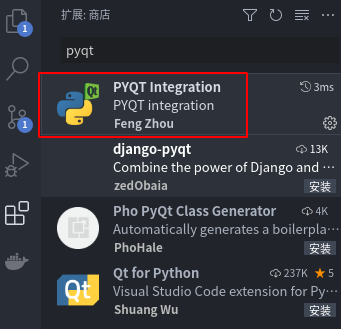
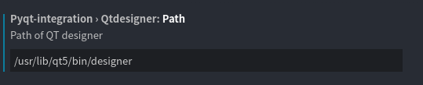
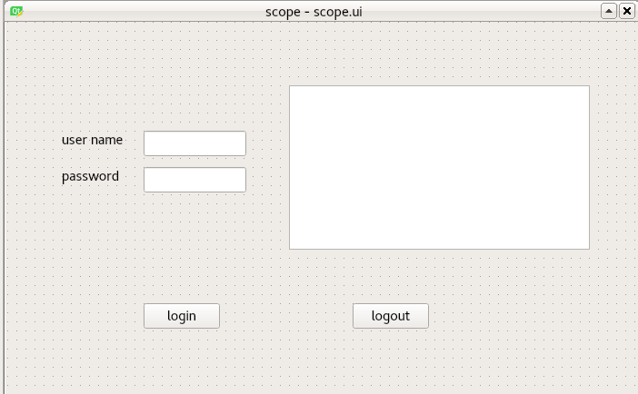
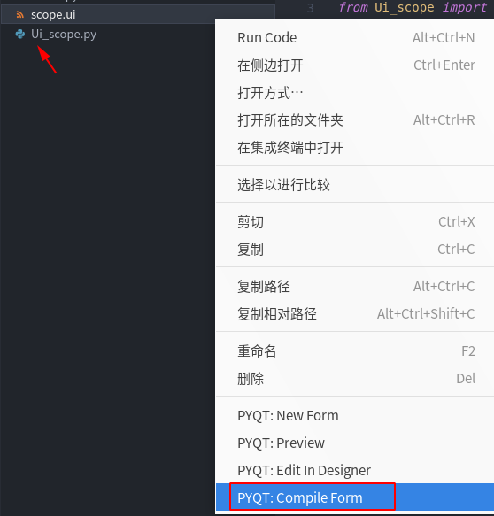
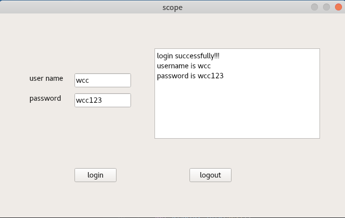

# 前言
晚上回家，不是很想干和工作相关的事情，硬核的事情也干不下去，就像做点简单的，于是就想着学者，写一写界面什么的，于是就网上找了下，发现pyqt还是挺有意思的，那么就弄起来。

# 环境搭建
QT没有太了解过，好像有开源和不开源两种区别，pyqt应该是开源的，那么就照着这个整就行了。

- 实验环境
    - ubuntu 18.04
    - vscode
    - pyqt5 + qtdesigner
    - python3

<!--more-->
## ubuntu上安装pyqt5
在ubuntu环境下安装pyqt5和相应的工具还是挺简单的。
```bash
# 安装pip3
sudo apt install python3-pip 

# 使用pip3 安装pyqt5
sudo pip3 install pyqt5

# 安装qtdesigner
sudo apt install qt5-default qttools5-dev-tools 
```

## vscode安装pyqt插件
在vscode里面搜索pyqt5的插件，安装即可。



安装好之后设置一下该插件，主要是设置一下qtdesigner的路径



# 设计一个界面
## 使用designer设计一个界面
由于只是玩玩性质，因此不想去了解基础的QT怎么写，因此就直接从QT designer开始，做一个小界面。
QT界面如下：


设计完整之后，保存该界面，能够生成一个.ui文件，这个文件保存着这个QT界面的设置，通过这个.ui能够生成对应的python代码。

## 运行界面
使用QT designer设计一个界面之后，还需要编译，然后才能使用python来生成具体的应用程序。
在vscode里面首先需要选择一个python3解释器，这里就选择安装pyqt5的那个python解释器就可以了。
首先需要讲生成的ui文件编译成python文件，vscode之前已经安装好了pyqt的插件，因此可以右键ui文件，然后编译成一个python文件，准确的说，是一个窗口类。

可以看到，点击编译ui文件之后，将会生成一个这个ui对应的python文件。

然后可以使用一小段代码来测试这个界面了。其实参考的是这个博主的[pyqt参考](https://www.cnblogs.com/linyfeng/p/11223707.html)

```py
import sys
from PyQt5.QtWidgets import QApplication, QMainWindow, QPushButton,  QPlainTextEdit
from Ui_scope import *


class MyMainWindow(QMainWindow, Ui_Form):
    def __init__(self, parent=None):
        super(MyMainWindow, self).__init__(parent)
        self.setupUi(self)

        # bonding signal and slot
        self.btn_logout.clicked.connect(self.close)
        self.btn_login.clicked.connect(self.display_info)

    # display the user name and password into the editbox
    def display_info(self):
        # get the username and password from lineEdit
        username = self.lineEdit_username.text()
        password = self.lineEdit_pwd.text()
        # set the information for display
        self.source_text.setPlainText("login successfully!!!\n" + "username is " + username + "\npassword is " + password)


if __name__ == "__main__":
    # create an application
    app = QApplication(sys.argv)
    # initialize the window
    myWin = MyMainWindow()
    # display the window
    myWin.show()
    # exit the program
    sys.exit(app.exec_())
```

然后在vscode里面，按下F5就能够开始调试这个界面了。


# 总结
使用pyqt感觉还是比较简单，主要是感觉这个不需要什么软硬件，一个vscode再加上一些依赖库就够了。
对于PYQT的代码设计，需要考虑的是，界面和功能的分离，我觉得这个思想还是很不错的。就是OOP的设计方法，作为一个FPGAer，还是需要了解一下软件是如何来进行设计。使用OOP的设计方法，还是很不错的。
另外一个PYQT里面使用信号和槽的设计方法，能够响应一些事件还是不错的。
有了这个大体的流程，之后应该就可以学习一点点QT的基本空间的使用方法，然后就可以自己做点小界面了吧，我的想法是做一个简单的示波器界面。gogogo!!!
