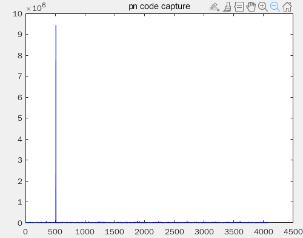
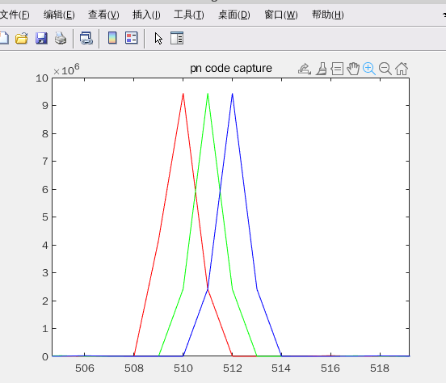

# 前言
在之前的博客当中，学习着如何生成PN码，了解GPS、北斗信息是如何通过调制进行发送的，最近开始学习如何来完成北斗信号的解调，因此有必要记录一下学习的过程。

# 信号的捕获
在CDMA当中，系统都存在信号捕获的问题，因为发送的不同信号在同一个频率上，不同信号之间是通过伪随机码来进行区分的。
对于卫星信号而言，卫星的高速运动会使得卫星和接收机之间的相对距离发生变化，从而导致载波频率的多普勒频移，从而影响信号的质量。
由于伪随机码使得信号的频谱展宽，相应的功率降低，再加上接收机和卫星之间的距离很远，导致信号湮没在噪声中。
<!--more-->
因此在处理CDMA系统的时候，首先应该注意的是对信号进行捕获。
捕获的过程就类似前面介绍过的PRN码的互相关寻找伪随机码的相关峰。

在北斗接收机当中，信号的捕获可以看做是一个三维的搜索过程：

- PRN码搜索： 不同的卫星组合所发出的PRN码是不同的，通过PRN码的搜索能够定位是那几颗卫星发出的信号。
- 频率搜索：接收机内部会产生本地生成的载波，如果本地载波与输入信号的载波的频率相近的话，就能得到一个低频分量和高频分量，由于接收机不知道当前输入信号的载波的确切的频率，因此需要对频率进行搜索。
- 码片搜索：由于接受到的信号其码相位可能是随机的，又由于PRN码的强自相关性，因此只有在码片对上的时候才能产生较大的相关峰，因此还需要对不同相位的码片进行搜索。

下图展示的是一个码片和频率搜索的过程，该过程可以看做是一个二维搜索的过程。


# 码片的搜索
从前面可以知道,信号的捕获有三个层次，在这里首先先完成信号的码片的搜索，也就是找到通过半码偏移的方式，找到相关峰。

## 北斗BPSK信号生成
在进行捕获信号之前，需要先生成一个北斗导航信息的数据，这里不需要具体的数据帧格式，只需要完成NH码调制之后的数据就可以。关于BPSK信号的生成，可以参考[北斗卫星数据码](https://black-pigeon.github.io/2021/06/09/2021.6/%E5%8C%97%E6%96%97%E5%8D%AB%E6%98%9F%E5%AE%9A%E4%BD%8D-2-%E6%95%B0%E6%8D%AE%E7%A0%81/)

## 调制与捕获的matlab代码
```matlab
clc;
close all;
clear all;

%% parameter define
PN_INDEX1   = 8 ;       % choose satellites 
PN_INDEX2   = 10;       % choose satellites 
SAMP_RATE = 8.184e6;    % sample rate
CODE_RATE = 2.046e6;    % standard PN code rate 2.046M 
NH_CODE_LEN = 20;       % the length of NH code is 20bit
SOURCE_DATA_LEN = 300;   % the source data num
PN_CODE_LEN = 2046;     % standard PN cod length 2046
PN_SAMP_LEN = (SAMP_RATE/CODE_RATE) * PN_CODE_LEN * NH_CODE_LEN * SOURCE_DATA_LEN; % total pn sample for data to be send

%% generate bpsk modulation data
% source_data ==> NH mod ==> PN mod ==> BPSK mod
% generate source data
source_data = rand(1, SOURCE_DATA_LEN); % generate test source data
source_data(source_data < 0.5) = -1;
source_data(source_data >= 0.5) = 1;    
source_data = repelem(source_data, 1, NH_CODE_LEN); % upsample D1 signal source data to NH code modulated rate 1Kbps

% NH code
nh_code = [0 0 0 0 0 1 0 0 1 1 0 1 0 1 0 0 1 1 1 0];
nh_code = repmat(nh_code, 1, SOURCE_DATA_LEN);     
nh_code(nh_code == 0) = -1;

% NH code modulation
nh_mod = source_data .* nh_code; % using .* instead of xor

% upsample to sample rata
nh_mod = repelem(nh_mod, 1, (SAMP_RATE/CODE_RATE)*PN_CODE_LEN);

% generate PN code & PN sample
[pn_code, pn_code_sample] = PNCode_Gen(PN_CODE_LEN, PN_SAMP_LEN, CODE_RATE, SAMP_RATE, PN_INDEX1);

% PN code modulation
pn_mod = nh_mod .* pn_code_sample; % using .* instead of xor

% generate carrier wave
AMP = 1;
ROM_DEPTH = 4096;
CARRIER_FREQ = CODE_RATE; % carrier frequency
FREQ_CTRL_WORLD = CARRIER_FREQ * 2^32/ SAMP_RATE;

rom_addr = 0: 1/ROM_DEPTH: 1-1/ROM_DEPTH;
carrier_wave_cos = AMP*cos(2*pi*rom_addr);
carrier_wave_sin = AMP*sin(2*pi*rom_addr);
% bpsk modulation
bpsk_mod = zeros(1,PN_SAMP_LEN);
rom_index = 1;
phase_accumulator = 0;

for i=1:PN_SAMP_LEN
    %bpsk modulation
    if(pn_mod(i) == -1)
        bpsk_mod(i) = -carrier_wave_cos(rom_index);
    else
        bpsk_mod(i) = carrier_wave_cos(rom_index);
    end

    phase_accumulator = phase_accumulator + FREQ_CTRL_WORLD;
    if(phase_accumulator > 2^32)
        phase_accumulator = phase_accumulator - 2^32;
    end

    rom_index = round(phase_accumulator/2^20);
    if(rom_index == 0)
        rom_index = 1;
    end
end

% plot the bpsk result
figure(1);
plot(1:1024, bpsk_mod(1:1024), 'r', 1:1024, pn_mod(1:1024),'b');
axis([0, 1024, -2, 2]);
legend('bpsk mod', 'pn mod');
title("BPSK modulation");

%% PN code capture
DATA_OFFSET = 1020;
data_in = bpsk_mod(DATA_OFFSET: end);   % input bpsk data offset

SAMP_PER_PN = round((SAMP_RATE/CODE_RATE)*PN_CODE_LEN); % for 1 complete PN code sample length
HALF_CODE_WIDTH = round((SAMP_RATE/CODE_RATE)/2);       % half code offset
PN_SEARCH_RANGE = round(SAMP_PER_PN/HALF_CODE_WIDTH);   % the total search range for pn code capture

% generate PN code
[pn_code, pn_code_sample] = PNCode_Gen(PN_CODE_LEN, SAMP_PER_PN, CODE_RATE, SAMP_RATE, PN_INDEX1);
pn_pre = [pn_code_sample(HALF_CODE_WIDTH+1:end), pn_code_sample(1:HALF_CODE_WIDTH)];
pn_middle = pn_code_sample;
pn_post =[pn_code_sample(SAMP_PER_PN-HALF_CODE_WIDTH+1:end), pn_code_sample(1:SAMP_PER_PN-HALF_CODE_WIDTH)];

% generate carrier wave
sin_carrier = zeros(1, SAMP_PER_PN);
cos_carrier = zeros(1, SAMP_PER_PN);
rom_index = 1;
phase_accumulator = 0;

% the power of correlation result
power_pre = zeros(1, PN_SEARCH_RANGE);
power_middle = zeros(1, PN_SEARCH_RANGE);
power_post = zeros(1, PN_SEARCH_RANGE);

for i=1:SAMP_PER_PN
    sin_carrier(i) = carrier_wave_sin(rom_index);
    cos_carrier(i) = carrier_wave_cos(rom_index);
    phase_accumulator = phase_accumulator + FREQ_CTRL_WORLD;
    if(phase_accumulator > 2^32)
        phase_accumulator = phase_accumulator - 2^32;
    end

    rom_index = round(phase_accumulator/2^20);
    if(rom_index == 0)
        rom_index = 1;
    end
end

signal = data_in(1: SAMP_PER_PN);
sample_offset = 0;

% find correlation peak
for code_index = 1: PN_SEARCH_RANGE
    i_data = signal .* cos_carrier;
    q_data = signal .* sin_carrier;
    % do correlation
    temp_pre_i = sum(i_data .* pn_pre);
    temp_middle_i = sum(i_data .* pn_middle);
    temp_post_i = sum(i_data .* pn_post);
    temp_pre_q = sum(q_data .* pn_pre);
    temp_middle_q = sum(q_data .* pn_middle);
    temp_post_q = sum(q_data .* pn_post);

    % calculate the power
    power_pre(code_index) = temp_pre_i^2 + temp_pre_q^2;
    power_middle(code_index) = temp_middle_i^2 + temp_middle_q^2;
    power_post(code_index) = temp_post_i^2 + temp_post_q^2;

    % sample_offset = sample_offset + SAMP_PER_PN + HALF_CODE_WIDTH;
    % signal = data_in(sample_offset+1:sample_offset+SAMP_PER_PN);

    sample_offset = sample_offset + SAMP_PER_PN;
    signal = data_in(sample_offset+1: sample_offset+SAMP_PER_PN);
    pn_pre = [pn_pre(HALF_CODE_WIDTH+1:end), pn_pre(1:HALF_CODE_WIDTH)];
    pn_middle = [pn_middle(HALF_CODE_WIDTH+1:end), pn_middle(1:HALF_CODE_WIDTH)];
    pn_post = [pn_post(HALF_CODE_WIDTH+1:end), pn_post(1:HALF_CODE_WIDTH)];

end
figure(2);
plot(power_pre, 'r');
hold on;
plot(power_middle, 'g');
hold on;
plot(power_post, 'b');
title("pn code capture");
```
运行的结果如下：
可以看到在进行半码偏移的过程之中，出现了相关峰。


仔细观察这个相关峰可以发现，对于早中晚码的都会出现一个相关峰，并且相关峰出现的最高点的对应的码片偏差刚好是半个码片的宽度，也即是两个采样点。



