在前面的一段时间的学习当中，学习了如何对信号进行捕获。在GPS接收机当中，捕获到信号之后，接下来的操作就是对捕获到的信号进行跟踪处理了，在接收机当中，常见的同步方法有PLL，其主要目的是使得本地生成的载波能够跟踪接受到的信号的频率和相位的变化，从而达到相干解调的目的。
<!--more-->
# 锁相环结构 
一个常见的锁相环路的结果如下图所示：


信号经过通过与NCO产生的本地载波进行混频，从而得到基带信号和高频分量，信号经过混频之后，需要经过一个低通滤波器将高频分量滤除。
在上面所示的图中采用的是一个均值滤波器，均值滤波是一种简单的低通滤波器，实现在一段时间内对输入的信号进行求和并求得平均值的操作，从而滤除高频分量。
信号然后再经过PLL完成信号的追踪和锁定。一个常见的PLL的结包含三个部分，分别是鉴相器、环路滤波器和NCO。


# 鉴相器
## 常规鉴相器

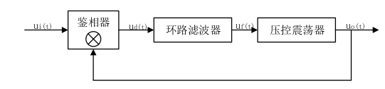

常规的鉴相器可以看做是一个简单的乘法器,假定输入的信号为：

$$u_{i}(t)=U_{i}sin(w_{i}t+\theta_{i})$$

假设经过环路滤波器的输出信号为

$$u_{o}(t)=U_{o}cos(w_{o}t+ \theta_{o})$$

那么经过鉴相器之后的结果为

$$u_{d}(t) = u_{i}(t)u_{o}(t) = U_{i}U_{o}sin⁡(ω_{i}t+θ_{i})cos⁡(⁡(ω_{o}t+θ_{o}))$$

$$=K_{d}{sin[(ω_{i}+ω_{o})t+θ_{i}+ θ_{o}]+sin[(ω_{i}-ω_{o})t+θ_{i}-θ_{o}]}$$

可以看到，两者相乘之后得到高频分量和低频分量，使用滤波器可以滤除高频分量，由于使用PLL信号之后，从NCO中输出的信号的频率和相位应该和输入的信号十分接近，因此经过低通滤波器之后可以得到的低频分量如下：

$$u_{f}(t)= K_{d}sin[(ω_{i}-ω_{o})t+θ_{i}-θ_{o}], K_{d}= \frac{1}{2}U_{i}U_{o}$$

$$u_{f}(t)= K_{d}K_{f}sin(θ_{i}-θ_{o})$$

$$u_{f}(t)\approx K_{d}K_{f}θ_{e}$$

其中 
$$θ_{e}=sin(θ_{i}-θ_{o})$$
这个只有在NCO输出的载波频率和输入信号载波频率很小的时候，才可以使用这种近似。

## IQ解调鉴相器
在最开始看到的对于IQ解调的系统当中，鉴相器的结构也和上面的结构类似。假设输入的信号为
$$u_{i}(t)=D(t)sin(w_{i}t+\theta_{i})$$
由本地产生的载波分别为：
$$u_{oi}(t)=cos(w_{o}t+\theta_{o})$$

$$u_{oq}(t)=sin(w_{o}t+\theta_{o})$$
使用正交解调之后经过低通滤波器得到的信号为：
$$I_{p}(t) = -\frac{1}{2}D(t)sin(ω_{e}t + θ_{e})$$

$$Q_{p}(t) = \frac{1}{2}D(t)cos(ω_{e}t + θ_{e})$$

其中 
$$ω_{e}= ω_{i}-ω_{o}, θ_{e}=θ_{i}-θ_{o}$$

将IQ路信号何在一起写成向量的形式：

$$r_{p}(t) = I_{p}(t) + jQ_{p}(t) = D(t)e^{jω_{e}t+θ_{e}} = A_{p}(t)e^{j \phi _{e}t}$$

可以看到经过低通滤波之后的复数信号当中相位表示当前输入与输出信号的相位差
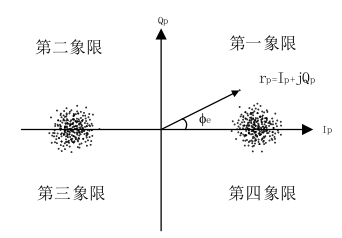

通过IQ路求反正切即可以求得当前的相位差

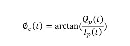

可通过四象限反正切函数鉴相法完成鉴相和判定 Ip(t) 正负号。

四象限反正切 arctan2 所返回的角度值在−π和+π之间。

事实上,四象限反正切函数认定相量 rp(t)的幅值 Ap(t) 必定为一个正数,否则函数将幅值中的负号转换为 180°(或-180°)的相位差异添加进真正的相位差异之上,同时幅值变为正数。
如果四象限反正切计算的相位角位于第一或第四象限,那么D(t)为+1,并且计算出的相位差异值为这一时刻的鉴相结果;

如果相位角位于第二或第三象限,那么D(t)为-1,并且从该 $\phi _{e}(t)$中扣除 180°相位跳变后的值才是这一时刻的鉴相结果。

如果向量的实部为负,虚部为正需要-pi;实部为负虚部为负需要+pi;如果时钟四象限
的鉴相器需要做以上处理得到当前鉴相结果。

## 鉴相器的具体步骤
假如锁频环的相干与正交支路在第n历元分别输出相干积分值𝐼𝑝(𝑛)与𝑄𝑝(𝑛)，相应的四
象限相位差异角为∅𝑒(𝑛)，第 n-1 历元的相位差异角为∅𝑒(𝑛−1)，那么角频率误差𝜔𝑒(𝑛)可
从这两个历元的相位变化中估算出来。

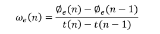

其中，*t(𝑛)−t(𝑛−1)* 为相干积分时间，角频率与频率差异的关系为𝜔=2𝜋𝑓。 在坐标轴上表现这个相位求取的过程如下图所示：

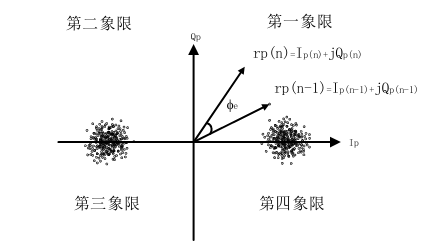

其中有两个向量rp(n), rp(n-1)，分别表示某一鉴别时刻和上一鉴别时刻的向量，两者之间的夹角即为相位的变化。通过求取两个信号的共轭相乘可以得到信号的幅度和相位差的关系：

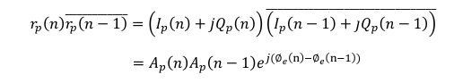

于此同时，还可以得到信号的点积叉积，如下所示

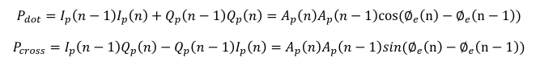

通过比对信号的点积叉积不难发现和共轭相乘的联系，仔细观察即可发现其中关于相位差的计算方法。

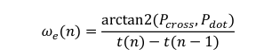

上面的公式，求得出来的是角频率，对于频率只需要和角频率进行一个2*pi的运算即可。

一个鉴相器的机构可以如下图所示：
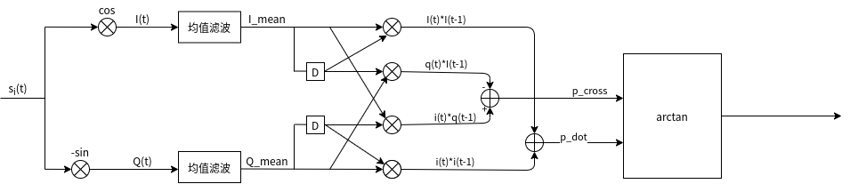

# 环路滤波器
关于环路滤波器，在这里不介绍其中的具体内容，只介绍一下环路的结构即可一个二阶环路滤波器的结构如下图所示：
可以看到首先有一个增益，然后分成两条之路，一条支路对应一次积分，一个支路对于一个增益，两条支路之和构成了PLL的输出。

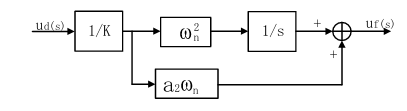

可以看到在二阶PLL当中，有一个积分器，在离散事件当中，这个积分器可以有如下两种表现形式：

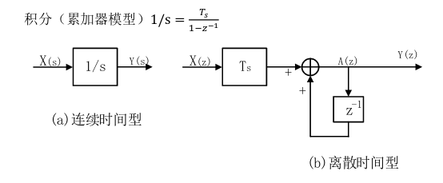

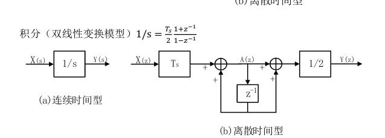
其中Ts是环路更新的周期，就比如上面在进行均值滤波时所需要的累加的周期，就是环路的更新的周期，在PLL的这一之路上，需要乘上这段时间。

在实际使用的时候，可以使用双线性变换的模型。

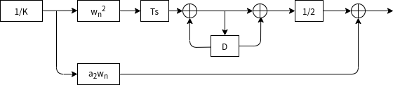
## 环路滤波器参数计算
关于不同阶数的环路滤波器，其对应的关键参数是不一样的，在这里先介绍二阶环路滤波器的参数，在之后的博客当中再介绍三阶环路滤波的参数。
$$ 阻尼系数 \xi=0.707 $$
$$ a2 = 2*\xi $$
$$ 特征频率 w_{n} 与噪声带宽B_{L}的关系： B_{L}= \frac{w_{n}}{2}(\xi+\frac{1}{4\xi})$$

在实际的设计中，只需要知道环路能够忍受的噪声带宽，就能够很容易的求出a2,和特征频率。

# matlab实例

```m
clc;
close all;
clear all;

%% parameter define
SAMP_RATE = 8.184e6;    % sample rate
IF_FREQ   = 2.046e6;    % inner frequency 2.046M 
SOURCE_DATA_LEN = 204800;  % the source data num
DATA_RATE = IF_FREQ/16; % data rate
SAMP_LEN  = SOURCE_DATA_LEN*(SAMP_RATE/DATA_RATE);
MEAN_FILTER_LEN = 32;   % mean filter length

TX_AMP = 1;
ROM_DEPTH = 4096;
TX_CARRIER_FREQ = IF_FREQ; % carrier frequency
TX_FREQ_CTRL_WORD = TX_CARRIER_FREQ * 2^32/ SAMP_RATE; % tx frequency control word

RX_AMP = 2048;
FREQ_OFFSET = 100; % frequency offset 100Hz
RX_FREQ_CTRL_WORD =  (TX_CARRIER_FREQ + FREQ_OFFSET)* 2^32/ SAMP_RATE;

% calculate the order2 loop filter parameter
RATIO = 0.707; % damping ratio
NOISE_BW = 50; % noise band width 
WN = 2*NOISE_BW/(RATIO+(1/(4*RATIO))); %BL=WN*(RATIO+(1/(4*RATIO)))/2
A2 = 2*RATIO;


%% generate bpsk modulation data
% source_data ==> BPSK mod
% generate source data
source_data = rand(1, SOURCE_DATA_LEN); % generate test source data
source_data(source_data < 0.5) = -1;
source_data(source_data >= 0.5) = 1;    
source_data = repelem(source_data, 1, SAMP_RATE/DATA_RATE); % upsample  signal source data to sample rate 

% generate carrier wave


rom_addr = 0: 1/ROM_DEPTH: 1-1/ROM_DEPTH;
carrier_wave_cos = RX_AMP*cos(2*pi*rom_addr);
carrier_wave_sin = RX_AMP*sin(2*pi*rom_addr);
% bpsk modulation
bpsk_mod = zeros(1,SAMP_LEN);
rom_index = 1;
phase_accumulator = 0;

for i=1:SAMP_LEN
    %bpsk modulation
    if(source_data(i) == -1)
        bpsk_mod(i) = -carrier_wave_cos(rom_index);
    else
        bpsk_mod(i) = carrier_wave_cos(rom_index);
    end

    phase_accumulator = phase_accumulator + TX_FREQ_CTRL_WORD;
    if(phase_accumulator > 2^32)
        phase_accumulator = phase_accumulator - 2^32;
    end

    rom_index = round(phase_accumulator/2^20);
    if(rom_index == 0)
        rom_index = 1;
    end
end

% plot the bpsk result
figure(1);
plot(1:1024, bpsk_mod(1:1024), 'r', 1:1024, source_data(1:1024),'b');
axis([0, 1024, -2, 2]);
legend('bpsk mod', 'source data');
title("BPSK modulation");

%% bpsk demodulation using pll
% the demodulation steps
% 1. iq demod, using the iq demodulation to get the iq data, the receiver lo_freq is coming for nco
% 2. low pass the demod signal to filter out high frequency(using mean filter )
% 3. phase detect, calculate the phase error and generate the frequency error
% 4. loop filter parameter calculate
% 5. drive the nco to generate local carrier frequency
rom_index = 1;          % rom index
mean_cal_index = 1;
i_data=0; q_data=0;     % i/q demod data
i_acc =0; q_acc =0;     % i/q accumulate value
i_mean=1; q_mean=1;     % mean value of i/q samples
p_dot =1; p_cross=1;    % dot/cross value of 2 vectors
delta_phi = 0;          % phase error
freq_err = 0;           % freq error
phase_accumulator = 0;  % clear the phase accumulator
freq_err_out = zeros(1,SAMP_LEN);
demod_i = zeros(1,SAMP_LEN);
demod_q = zeros(1,SAMP_LEN);
freq_err_control_word = 0;
freq_k1_acc_t = 0; freq_k1_acc = 0;
freq_k2 =0;
loop_out = 0; loop_out_t=0;

for i=1:SAMP_LEN
    % mixing
    i_data = bpsk_mod(i)*carrier_wave_cos(rom_index);
    q_data = -bpsk_mod(i)*carrier_wave_sin(rom_index);

    %% prepare mean filter(calculate MEAN_FILTER_LEN samples)
    % accumulate the samples
    i_acc = i_acc + i_data;
    q_acc = q_acc + q_data;
    if (mean_cal_index == MEAN_FILTER_LEN)
        i_mean_t = i_mean;
        q_mean_t = q_mean;
        % calculate mean value
        i_mean = i_acc/MEAN_FILTER_LEN;
        q_mean = q_acc/MEAN_FILTER_LEN;
        % clean accumulator
        i_acc = 0;
        q_acc = 0;

        %% phase detector(using vector)
        p_dot = i_mean*i_mean_t + q_mean*q_mean_t;
        p_cross = i_mean_t*q_mean - q_mean_t*i_mean;

        % using atan2 to calculate the phase
        if (p_dot == 0) % x=0
            delta_phi = atan2(p_cross, 1); %avoid divide 0
        else
            delta_phi = atan2(p_cross, p_dot);
        end

        % determine the phase trough quadrant 
        if (p_dot < 0 && p_cross > 0) % second quadrant
            delta_phi = delta_phi - pi;
        elseif (p_dot < 0 && p_cross < 0) % third quadrant 
            delta_phi = delta_phi + pi;
        elseif (p_cross == 0) % x axis
            delta_phi = 0;
        end

        % calculate the frequency error 2*pi*f=delta_phi/delta_t
        freq_err = (delta_phi/(MEAN_FILTER_LEN/SAMP_RATE))/(2*pi);

        %% loop filter
        freq_detector = freq_err/RX_AMP;    % 1/K phase detector gain

        % loop filter path 1
        freq_k1_acc_t = freq_k1_acc;
        freq_k1_acc = freq_detector*(WN^2)*(MEAN_FILTER_LEN/SAMP_RATE) + freq_k1_acc_t;
        freq_k1 = (freq_k1_acc + freq_k1_acc_t)/2;
        % loop filter  path 2
        freq_k2 = freq_detector*WN*A2;      

        % loop filter out
        loop_out = freq_k1 + freq_k2;

        % speed up order2 pll lock
        % loop_out_t = loop_out;
        % loop_out = freq_k1 + freq_k2 + loop_out_t;
        freq_err_control_word = (loop_out*2^32)/SAMP_RATE;

        mean_cal_index = 0;
    end
    mean_cal_index = mean_cal_index + 1;

    %% NCO control using loop filter out value
    phase_accumulator = phase_accumulator + RX_FREQ_CTRL_WORD + freq_err_control_word;
    if(phase_accumulator > 2^32)
        phase_accumulator = phase_accumulator - 2^32;
    end

    rom_index = round(phase_accumulator/2^20);
    if(rom_index == 0)
        rom_index = 1;
    end

    %% watch the output
    freq_err_out(i) = freq_err_control_word;
    demod_i(i) = i_mean;
    demod_q(i) = q_mean;

end

%figure;
subplot(2,1,1);
plot(freq_err_out);
title(['频率平均值=',num2str((sum(freq_err_out(1200:end))/(SAMP_LEN-1200))*SAMP_RATE/2^32),'频率误差',num2str((FREQ_OFFSET-(sum(freq_err_out(1200:end))/(SAMP_LEN-1200))*SAMP_RATE/2^32))]);
subplot(2,1,2);
plot(demod_i,'r');  % 
hold on;
plot(source_data*1e6, 'b');
title('红色是解调数据');
```


