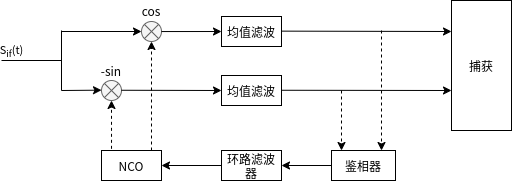
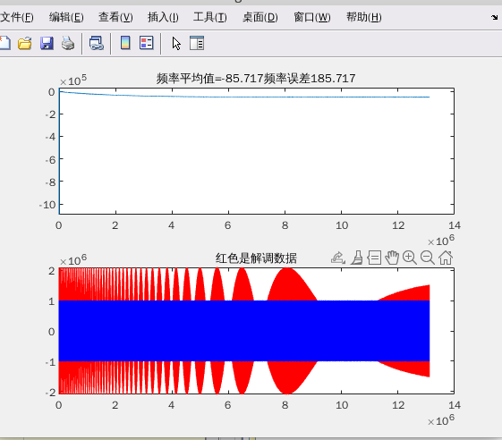
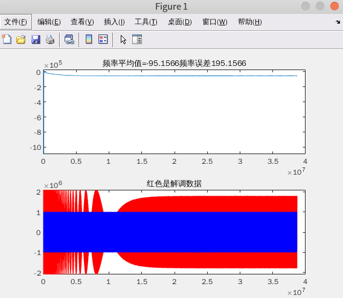
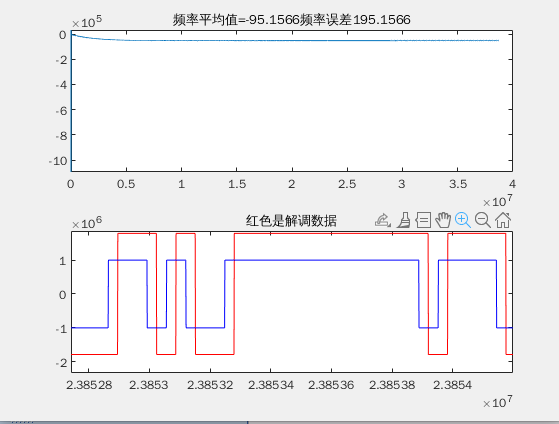

在前面的一段时间的学习当中，学习了如何对信号进行捕获。在GPS接收机当中，捕获到信号之后，接下来的操作就是对捕获到的信号进行跟踪处理了，在接收机当中，常见的同步方法有PLL，其主要目的是使得本地生成的载波能够跟踪接受到的信号的频率和相位的变化，从而达到相干解调的目的。
<!--more-->
# 锁相环结构 
一个常见的锁相环路的结果如下图所示：



信号经过通过与NCO产生的本地载波进行混频，从而得到基带信号和高频分量，信号经过混频之后，需要经过一个低通滤波器将高频分量滤除。
在上面所示的图中采用的是一个均值滤波器，均值滤波是一种简单的低通滤波器，实现在一段时间内对输入的信号进行求和并求得平均值的操作，从而滤除高频分量。
信号然后再经过PLL完成信号的追踪和锁定。一个常见的PLL的结包含三个部分，分别是鉴相器、环路滤波器和NCO。

```m
clc;
close all;
clear all;

%% parameter define
SAMP_RATE = 8.184e6;    % sample rate
IF_FREQ   = 2.046e6;    % inner frequency 2.046M 
SOURCE_DATA_LEN = 204800;  % the source data num
DATA_RATE = IF_FREQ/16; % data rate
SAMP_LEN  = SOURCE_DATA_LEN*(SAMP_RATE/DATA_RATE);
MEAN_FILTER_LEN = 32;   % mean filter length

TX_AMP = 1;
ROM_DEPTH = 4096;
TX_CARRIER_FREQ = IF_FREQ; % carrier frequency
TX_FREQ_CTRL_WORD = TX_CARRIER_FREQ * 2^32/ SAMP_RATE; % tx frequency control word

RX_AMP = 2048;
FREQ_OFFSET = 100; % frequency offset 100Hz
RX_FREQ_CTRL_WORD =  (TX_CARRIER_FREQ + FREQ_OFFSET)* 2^32/ SAMP_RATE;

% calculate the order2 loop filter parameter
RATIO = 0.707; % damping ratio
NOISE_BW = 50; % noise band width 
WN = 2*NOISE_BW/(RATIO+(1/(4*RATIO))); %BL=WN*(RATIO+(1/(4*RATIO)))/2
A2 = 2*RATIO;


%% generate bpsk modulation data
% source_data ==> BPSK mod
% generate source data
source_data = rand(1, SOURCE_DATA_LEN); % generate test source data
source_data(source_data < 0.5) = -1;
source_data(source_data >= 0.5) = 1;    
source_data = repelem(source_data, 1, SAMP_RATE/DATA_RATE); % upsample  signal source data to sample rate 

% generate carrier wave


rom_addr = 0: 1/ROM_DEPTH: 1-1/ROM_DEPTH;
carrier_wave_cos = RX_AMP*cos(2*pi*rom_addr);
carrier_wave_sin = RX_AMP*sin(2*pi*rom_addr);
% bpsk modulation
bpsk_mod = zeros(1,SAMP_LEN);
rom_index = 1;
phase_accumulator = 0;

for i=1:SAMP_LEN
    %bpsk modulation
    if(source_data(i) == -1)
        bpsk_mod(i) = -carrier_wave_cos(rom_index);
    else
        bpsk_mod(i) = carrier_wave_cos(rom_index);
    end

    phase_accumulator = phase_accumulator + TX_FREQ_CTRL_WORD;
    if(phase_accumulator > 2^32)
        phase_accumulator = phase_accumulator - 2^32;
    end

    rom_index = round(phase_accumulator/2^20);
    if(rom_index == 0)
        rom_index = 1;
    end
end

% plot the bpsk result
figure(1);
plot(1:1024, bpsk_mod(1:1024), 'r', 1:1024, source_data(1:1024),'b');
axis([0, 1024, -2, 2]);
legend('bpsk mod', 'source data');
title("BPSK modulation");

%% bpsk demodulation using pll
% the demodulation steps
% 1. iq demod, using the iq demodulation to get the iq data, the receiver lo_freq is coming for nco
% 2. low pass the demod signal to filter out high frequency(using mean filter )
% 3. phase detect, calculate the phase error and generate the frequency error
% 4. loop filter parameter calculate
% 5. drive the nco to generate local carrier frequency
rom_index = 1;          % rom index
mean_cal_index = 1;
i_data=0; q_data=0;     % i/q demod data
i_acc =0; q_acc =0;     % i/q accumulate value
i_mean=1; q_mean=1;     % mean value of i/q samples
p_dot =1; p_cross=1;    % dot/cross value of 2 vectors
delta_phi = 0;          % phase error
freq_err = 0;           % freq error
phase_accumulator = 0;  % clear the phase accumulator
freq_err_out = zeros(1,SAMP_LEN);
demod_i = zeros(1,SAMP_LEN);
demod_q = zeros(1,SAMP_LEN);
freq_err_control_word = 0;
freq_k1_acc_t = 0; freq_k1_acc = 0;
freq_k2 =0;
loop_out = 0; loop_out_t=0;

for i=1:SAMP_LEN
    % mixing
    i_data = bpsk_mod(i)*carrier_wave_cos(rom_index);
    q_data = -bpsk_mod(i)*carrier_wave_sin(rom_index);

    %% prepare mean filter(calculate MEAN_FILTER_LEN samples)
    % accumulate the samples
    i_acc = i_acc + i_data;
    q_acc = q_acc + q_data;
    if (mean_cal_index == MEAN_FILTER_LEN)
        i_mean_t = i_mean;
        q_mean_t = q_mean;
        % calculate mean value
        i_mean = i_acc/MEAN_FILTER_LEN;
        q_mean = q_acc/MEAN_FILTER_LEN;
        % clean accumulator
        i_acc = 0;
        q_acc = 0;

        %% phase detector(using vector)
        p_dot = i_mean*i_mean_t + q_mean*q_mean_t;
        p_cross = i_mean_t*q_mean - q_mean_t*i_mean;

        % using atan2 to calculate the phase
        if (p_dot == 0) % x=0
            delta_phi = atan2(p_cross, 1); %avoid divide 0
        else
            delta_phi = atan2(p_cross, p_dot);
        end

        % determine the phase trough quadrant 
        if (p_dot < 0 && p_cross > 0) % second quadrant
            delta_phi = delta_phi - pi;
        elseif (p_dot < 0 && p_cross < 0) % third quadrant 
            delta_phi = delta_phi + pi;
        elseif (p_cross == 0) % x axis
            delta_phi = 0;
        end

        % calculate the frequency error 2*pi*f=delta_phi/delta_t
        freq_err = (delta_phi/(MEAN_FILTER_LEN/SAMP_RATE))/(2*pi);

        %% loop filter
        freq_detector = freq_err/RX_AMP;    % 1/K phase detector gain

        % loop filter path 1
        freq_k1_acc_t = freq_k1_acc;
        freq_k1_acc = freq_detector*(WN^2)*(MEAN_FILTER_LEN/SAMP_RATE) + freq_k1_acc_t;
        freq_k1 = (freq_k1_acc + freq_k1_acc_t)/2;
        % loop filter  path 2
        freq_k2 = freq_detector*WN*A2;      

        % loop filter out
        loop_out = freq_k1 + freq_k2;

        % speed up order2 pll lock
        % loop_out_t = loop_out;
        % loop_out = freq_k1 + freq_k2 + loop_out_t;
        freq_err_control_word = (loop_out*2^32)/SAMP_RATE;

        mean_cal_index = 0;
    end
    mean_cal_index = mean_cal_index + 1;

    %% NCO control using loop filter out value
    phase_accumulator = phase_accumulator + RX_FREQ_CTRL_WORD + freq_err_control_word;
    if(phase_accumulator > 2^32)
        phase_accumulator = phase_accumulator - 2^32;
    end

    rom_index = round(phase_accumulator/2^20);
    if(rom_index == 0)
        rom_index = 1;
    end

    %% watch the output
    freq_err_out(i) = freq_err_control_word;
    demod_i(i) = i_mean;
    demod_q(i) = q_mean;

end

%figure;
subplot(2,1,1);
plot(freq_err_out);
title(['频率平均值=',num2str((sum(freq_err_out(1200:end))/(SAMP_LEN-1200))*SAMP_RATE/2^32),'频率误差',num2str((FREQ_OFFSET-(sum(freq_err_out(1200:end))/(SAMP_LEN-1200))*SAMP_RATE/2^32))]);
subplot(2,1,2);
plot(demod_i,'r');  % 
hold on;
plot(source_data*1e6, 'b');
title('红色是解调数据');
```





