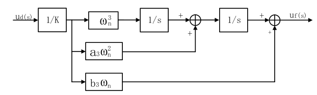

在上一篇博客当中，实现了载波同步中的二阶锁频环，通过锁频环能够实现相位的跟踪，但是在上篇博客的最后，还是可以看到，经过二阶锁频环之后，对于Q路上的数据，依然有较高的能量。然而在实际发送数据的时候，发送的只是一个实数数据，只有只有I路上有数据，因此在这里进一步地对相位同步才能实现最终的同步。
<!--more-->
# 三阶锁相环

## 鉴相器
在上一篇博客当中，有介绍过鉴频器，鉴相器相较于鉴频器更加简单，因为鉴频器是需要计算相位的变换的快慢，因此实现鉴相器可以在鉴频器之前进行。


## 环路滤波器结构
在前面介绍了二阶环路的结构，其实三阶环路和二阶环路的结构基本一致。用于区分对应的锁频/锁相环是几阶段可以整个系统中有几个积分器。


| PLL阶数 | 环路滤波器 | NCO | PLL阶数 |
| -- | -- | -- | -- |
| 一阶PLL | 0 | 1 | 1 |
| 二阶PLL | 1 | 1 | 2 |
| 三阶PLL | 2 | 1 | 3 |


所以在这篇博客中主要关注三阶PLL，其结构如下：


经过双线性变化之后，可以得到在离散域中其结构

这样在实现三阶环路的时候，只需要按照如下的结构去进行处理就可以了。

## 环路滤波器的关键参数
可以看到上面三阶环路滤波器的三条之路中有一些参数这些参数在实际设计PLL的时候十分重要，因此需要正确地计算这些参数，才能设计一个稳定的三阶PLL。
噪声带宽和三阶环路的特征频率关系如下：

其中a3, b3有推荐的参数分别为：
$$ a3 = 1.1, b3 = 2.4 $$
在实际设计的时候，只要制定了一个三阶环路可以容纳的噪声的带宽，那么就能够很容易地计算出三阶环路所需要的特征频率。

# 锁频环路具体实现
在实际的应用的时候，可以使用一个二阶锁频环路来辅助三阶锁相环路实现PLL的收敛，具体的结构如下：


有了上篇博客的经验，实现这个结构还是比较简单的，matlab代码如下：
```m
clc;
close all;
clear all;

%% parameter define
SAMP_RATE = 8.184e6;    % sample rate
IF_FREQ   = 2.046e6;    % inner frequency 2.046M 
SOURCE_DATA_LEN = 30480;  % the source data num
DATA_RATE = IF_FREQ/16; % data rate
SAMP_LEN  = SOURCE_DATA_LEN*(SAMP_RATE/DATA_RATE);
MEAN_FILTER_LEN = 32;   % mean filter length
TS = MEAN_FILTER_LEN/SAMP_RATE; %loop filter update time

TX_AMP = 1;
ROM_DEPTH = 4096;
TX_CARRIER_FREQ = IF_FREQ; % carrier frequency
TX_FREQ_CTRL_WORD = TX_CARRIER_FREQ * 2^32/ SAMP_RATE; % tx frequency control word

RX_AMP = 2048;
FREQ_OFFSET = -100; % frequency offset 100Hz
RX_FREQ_CTRL_WORD =  (TX_CARRIER_FREQ + FREQ_OFFSET)* 2^32/ SAMP_RATE;

% calculate the order2 loop filter parameter
RATIO = 0.707; % damping ratio
NOISE_BW_F = 200; % noise band width 
WN_F = 2*NOISE_BW_F/(RATIO+(1/(4*RATIO))); %BL=WN*(RATIO+(1/(4*RATIO)))/2
A2 = 2*RATIO;

% calculate the order3 loop filter parameter
NOISE_BW_P = 100;
A3 = 1.1;
B3 = 2.4;
WN_P = (4*(A3*B3-1))*NOISE_BW_P/(A3*B3^2 + A3^2 - B3);


%% generate bpsk modulation data
% source_data ==> BPSK mod
% generate source data
source_data = rand(1, SOURCE_DATA_LEN); % generate test source data
source_data(source_data < 0.5) = -1;
source_data(source_data >= 0.5) = 1;    
source_data = repelem(source_data, 1, SAMP_RATE/DATA_RATE); % upsample  signal source data to sample rate 

% generate carrier wave


rom_addr = 0: 1/ROM_DEPTH: 1-1/ROM_DEPTH;
carrier_wave_cos = RX_AMP*cos(2*pi*rom_addr);
carrier_wave_sin = RX_AMP*sin(2*pi*rom_addr);
% bpsk modulation
bpsk_mod = zeros(1,SAMP_LEN);
rom_index = 1;
phase_accumulator = 0;

for i=1:SAMP_LEN
    %bpsk modulation
    if(source_data(i) == -1)
        bpsk_mod(i) = -carrier_wave_cos(rom_index);
    else
        bpsk_mod(i) = carrier_wave_cos(rom_index);
    end

    phase_accumulator = phase_accumulator + TX_FREQ_CTRL_WORD;
    if(phase_accumulator > 2^32)
        phase_accumulator = phase_accumulator - 2^32;
    end

    rom_index = round(phase_accumulator/2^20);
    if(rom_index == 0)
        rom_index = 1;
    end
end

% plot the bpsk result
% figure(1);
% plot(1:1024, bpsk_mod(1:1024), 'r', 1:1024, 1024*source_data(1:1024),'b');
% legend('bpsk mod', 'source data');
% title("BPSK modulation");

%% bpsk demodulation using pll
% the demodulation steps
% 1. iq demod, using the iq demodulation to get the iq data, the receiver lo_freq is coming for nco
% 2. low pass the demod signal to filter out high frequency(using mean filter )
% 3. phase detect, calculate the phase error and generate the frequency error
% 4. loop filter parameter calculate
% 5. drive the nco to generate local carrier frequency
rom_index = 1;          % rom index
mean_cal_index = 1;
i_data=0; q_data=0;     % i/q demod data
i_acc =0; q_acc =0;     % i/q accumulate value
i_mean=1; q_mean=1;     % mean value of i/q samples
p_dot =1; p_cross=1;    % dot/cross value of 2 vectors
delta_phi = 0;          % phase error
freq_err = 0;           % freq error
phi = 0;                % phase error
phase_accumulator = 0;  % clear the phase accumulator
freq_err_out = zeros(1,SAMP_LEN);
demod_i = zeros(1,SAMP_LEN);
demod_q = zeros(1,SAMP_LEN);
freq_err_control_word = 0;

freq_k1 = 0;
freq_k2 = 0;
phase_k1 = 0;
phase_k2 = 0;
phase_k3 = 0;
loop_acc3 = 0;
loop_acc2_t = 0;
loop_acc2 = 0;
loop_acc1_t = 0;
loop_acc1 = 0;

for i=1:SAMP_LEN
    % mixing
    i_data = bpsk_mod(i)*carrier_wave_cos(rom_index);
    q_data = -bpsk_mod(i)*carrier_wave_sin(rom_index);

    %% prepare mean filter(calculate MEAN_FILTER_LEN samples)
    % accumulate the samples
    i_acc = i_acc + i_data;
    q_acc = q_acc + q_data;
    if (mean_cal_index == MEAN_FILTER_LEN)
        i_mean_t = i_mean;
        q_mean_t = q_mean;
        % calculate mean value
        i_mean = i_acc/MEAN_FILTER_LEN;
        q_mean = q_acc/MEAN_FILTER_LEN;
        % clean accumulator
        i_acc = 0;
        q_acc = 0;

        %% phase error detector
        % using atan2 to calculate the phase
        if (i_mean == 0) % x=0
            phi = atan2(q_mean, 1); %avoid divide 0
        else
            phi = atan2(q_mean, i_mean);
        end

        % determine the phase trough quadrant 
        if (i_mean < 0 && q_mean > 0) % second quadrant
            phi = phi - pi;
        elseif (i_mean < 0 && q_mean < 0) % third quadrant 
            phi = phi + pi;
        elseif (q_mean == 0) % x axis
            phi = 0;
        end

        %% frequency detector(using vector)
        p_dot = i_mean*i_mean_t + q_mean*q_mean_t;
        p_cross = i_mean_t*q_mean - q_mean_t*i_mean;

        % using atan2 to calculate the phase
        if (p_dot == 0) % x=0
            delta_phi = atan2(p_cross, 1); %avoid divide 0
        else
            delta_phi = atan2(p_cross, p_dot);
        end

        % determine the phase trough quadrant 
        if (p_dot < 0 && p_cross > 0) % second quadrant
            delta_phi = delta_phi - pi;
        elseif (p_dot < 0 && p_cross < 0) % third quadrant 
            delta_phi = delta_phi + pi;
        elseif (p_cross == 0) % x axis
            delta_phi = 0;
        end

        % calculate the frequency error 2*pi*f=delta_phi/delta_t
        freq_err = (delta_phi/(MEAN_FILTER_LEN/SAMP_RATE))/(2*pi);

        %% loop filter, using order2 fll to improve order3 pll
        freq_k1 = freq_err*A2*WN_F*TS;
        freq_k2 = freq_err*(WN_F^2)*TS;
        phase_k1 = phi*(WN_P^3)*TS;
        phase_k2 = phi*(A3*WN_P^2);
        phase_k3 = phi*B3*WN_P;

        loop_acc3 = (loop_acc2+loop_acc2_t)/2 + phase_k3;
        loop_acc2_t = loop_acc2;
        loop_acc2 = ((((loop_acc1+loop_acc1_t)/2) + phase_k2)*TS)+freq_k1 + loop_acc2_t;
        loop_acc1_t = loop_acc1;
        loop_acc1 = freq_k2 + phase_k1 + loop_acc1_t;

        freq_err_control_word = (loop_acc3*2^32)/SAMP_RATE;

        mean_cal_index = 0;
    end
    mean_cal_index = mean_cal_index + 1;

    %% NCO control using loop filter out value
    phase_accumulator = phase_accumulator + RX_FREQ_CTRL_WORD + freq_err_control_word;
    if(phase_accumulator > 2^32)
        phase_accumulator = phase_accumulator - 2^32;
    elseif (phase_accumulator < 0)
        phase_accumulator = phase_accumulator +  2^32;
    end

    rom_index = round(phase_accumulator/2^20);
    if(rom_index == 0)
        rom_index = 1;
    end

    %% watch the output
    freq_err_out(i) = freq_err_control_word;
    demod_i(i) = i_mean;
    demod_q(i) = q_mean;

end

figure(2);
subplot(2,1,1);
plot(freq_err_out);
title(['频率平均值=',num2str((sum(freq_err_out(1200:end))/(SAMP_LEN-1200))*SAMP_RATE/2^32),'频率误差',num2str((FREQ_OFFSET+(sum(freq_err_out(1200:end))/(SAMP_LEN-1200))*SAMP_RATE/2^32))]);
subplot(2,1,2);
plot(demod_i,'r');  % 
hold on;
plot(source_data*1e6, 'b');
hold on;
plot(demod_q,'g');
axis( [0 length(demod_i) -3e6 3e6 ]);
legend('i data', 'source data', 'q data');
```

可以看到，实现了上面的结构之后，频率得到了锁定，并且可以看到Q路上的数据能量逐渐减小到了0值附近，这样可以认为该环路已经收敛，正确地解调出来数据。


