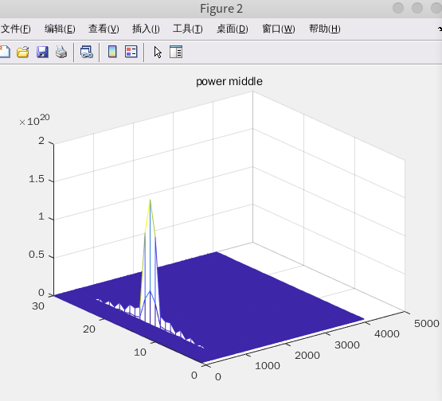
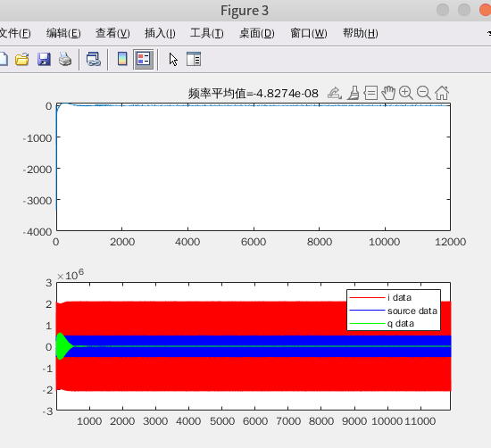
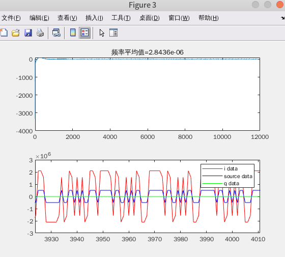

# 信号的捕获与同步
在前面的学习当中已经完成了信号的搜索，通过信号的搜索，可以看到在不同频率，不同码相位下如何对输入的卫星信号进行搜索。
在之前只介绍了频率和码相位的搜索，并且并没有得到具体的频率和码相位，只是在图上显示除了对应的相关峰的分布。
<!--more-->
其实在之前的频率，PN码搜索之后，还有一步就是卫星组合的搜索，在北斗卫星导航当中，不同的卫星组合所产生的PN码是不相同的，因此在实际的接收机当中，可能还需要一个穷举卫星组合的方式来产生具体的PN码。
关于卫星组合搜索，联合前面的频率搜索，码相位搜索的综合matlab仿真代码如下：
```m
clc;
close all;
clear all;

%% parameter define
PN_INDEX1   = 2 ;       % choose satellites 
PN_INDEX2   = 10;       % choose satellites 
SAMP_RATE = 8.184e6;    % sample rate
CODE_RATE = 2.046e6;    % standard PN code rate 2.046M 
NH_CODE_LEN = 20;       % the length of NH code is 20bit
SOURCE_DATA_LEN = 300;   % the source data num
PN_CODE_LEN = 2046;     % standard PN cod length 2046
PN_SAMP_LEN = (SAMP_RATE/CODE_RATE) * PN_CODE_LEN * NH_CODE_LEN * SOURCE_DATA_LEN; % total pn sample for data to be send

%% generate bpsk modulation data
% source_data ==> NH mod ==> PN mod ==> BPSK mod
% generate source data
source_data = rand(1, SOURCE_DATA_LEN); % generate test source data
source_data(source_data < 0.5) = -1;
source_data(source_data >= 0.5) = 1;    
source_data = repelem(source_data, 1, NH_CODE_LEN); % upsample D1 signal source data to NH code modulated rate 1Kbps

% NH code
nh_code = [0 0 0 0 0 1 0 0 1 1 0 1 0 1 0 0 1 1 1 0];
nh_code = repmat(nh_code, 1, SOURCE_DATA_LEN);     
nh_code(nh_code == 0) = -1;

% NH code modulation
nh_mod = source_data .* nh_code; % using .* instead of xor

% upsample to sample rata
nh_mod = repelem(nh_mod, 1, (SAMP_RATE/CODE_RATE)*PN_CODE_LEN);

% generate PN code & PN sample
[pn_code, pn_code_sample] = PNCode_Gen(PN_CODE_LEN, PN_SAMP_LEN, CODE_RATE, SAMP_RATE, PN_INDEX1);

% PN code modulation
pn_mod = nh_mod .* pn_code_sample; % using .* instead of xor

% generate carrier wave
AMP = 1;
ROM_DEPTH = 4096;
CARRIER_FREQ = CODE_RATE; % carrier frequency
FREQ_CTRL_WORLD = CARRIER_FREQ * 2^32/ SAMP_RATE;

rom_addr = 0: 1/ROM_DEPTH: 1-1/ROM_DEPTH;
carrier_wave_cos = AMP*cos(2*pi*rom_addr);
carrier_wave_sin = AMP*sin(2*pi*rom_addr);
% bpsk modulation
bpsk_mod = zeros(1,PN_SAMP_LEN);
rom_index = 1;
phase_accumulator = 0;

for i=1:PN_SAMP_LEN
    %bpsk modulation
    if(pn_mod(i) == -1)
        bpsk_mod(i) = -carrier_wave_cos(rom_index);
    else
        bpsk_mod(i) = carrier_wave_cos(rom_index);
    end

    phase_accumulator = phase_accumulator + FREQ_CTRL_WORLD;
    if(phase_accumulator > 2^32)
        phase_accumulator = phase_accumulator - 2^32;
    end

    rom_index = round(phase_accumulator/2^20);
    if(rom_index == 0)
        rom_index = 1;
    end
end

% plot the bpsk result
figure(1);
plot(1:1024, bpsk_mod(1:1024), 'r', 1:1024, pn_mod(1:1024),'b');
axis([0, 1024, -2, 2]);
legend('bpsk mod', 'pn mod');
title("BPSK modulation");

%% PN code capture
DATA_OFFSET = 1022;
data_in = bpsk_mod(DATA_OFFSET: end);   % input bpsk data offset

FREQ_WIDTH = 15e3;                                      % frequency search range 15kHz
FREQ_STEP = 500;                                        % frequency search step  500Hz
FREQ_SEARCH_RANGE = round(FREQ_WIDTH/FREQ_STEP);        % frequency search range

SAMP_PER_PN = round((SAMP_RATE/CODE_RATE)*PN_CODE_LEN); % for 1 complete PN code sample length
HALF_CODE_WIDTH = round((SAMP_RATE/CODE_RATE)/2);       % half code offset
PN_SEARCH_RANGE = round(SAMP_PER_PN/HALF_CODE_WIDTH);   % the total search range for pn code capture

% the power of correlation result
power_pre = zeros(FREQ_SEARCH_RANGE, PN_SEARCH_RANGE);
power_middle = zeros(FREQ_SEARCH_RANGE, PN_SEARCH_RANGE);
power_post = zeros(FREQ_SEARCH_RANGE, PN_SEARCH_RANGE);
SATELLITE_SEARCH_RANGE= 32;

%% satellite search
for satellite_index=1:SATELLITE_SEARCH_RANGE
    %% frequency search
    for freq_index=1:FREQ_SEARCH_RANGE
        
        % generate PN code
        [pn_code, pn_code_sample] = PNCode_Gen(PN_CODE_LEN, SAMP_PER_PN, CODE_RATE, SAMP_RATE, satellite_index);    % generate different prn code with satellite index
        pn_pre = [pn_code_sample(HALF_CODE_WIDTH+1:end), pn_code_sample(1:HALF_CODE_WIDTH)];
        pn_middle = pn_code_sample;
        pn_post =[pn_code_sample(SAMP_PER_PN-HALF_CODE_WIDTH+1:end), pn_code_sample(1:SAMP_PER_PN-HALF_CODE_WIDTH)];

        % generate carrier wave
        sin_carrier = zeros(1, SAMP_PER_PN);
        cos_carrier = zeros(1, SAMP_PER_PN);
        rom_index = 1;
        phase_accumulator = 0;

        % receiver frequency control word
        rx_freq_ctrl_world = round((CARRIER_FREQ + (FREQ_STEP*freq_index - FREQ_WIDTH/2))* 2^32/ SAMP_RATE);

        for i=1:SAMP_PER_PN
            sin_carrier(i) = carrier_wave_sin(rom_index);
            cos_carrier(i) = carrier_wave_cos(rom_index);
            phase_accumulator = phase_accumulator + rx_freq_ctrl_world;
            if(phase_accumulator > 2^32)
                phase_accumulator = phase_accumulator - 2^32;
            end

            rom_index = round(phase_accumulator/2^20);
            if(rom_index == 0)
                rom_index = 1;
            end
        end

        signal = data_in(1: SAMP_PER_PN);
        sample_offset = 0;


        % find correlation peak
        for code_index = 1: PN_SEARCH_RANGE
            i_data = signal .* cos_carrier;
            q_data = signal .* sin_carrier;
            % do correlation
            temp_pre_i = sum(i_data .* pn_pre);
            temp_middle_i = sum(i_data .* pn_middle);
            temp_post_i = sum(i_data .* pn_post);
            temp_pre_q = sum(q_data .* pn_pre);
            temp_middle_q = sum(q_data .* pn_middle);
            temp_post_q = sum(q_data .* pn_post);

            % calculate the power
            power_pre(freq_index, code_index) = temp_pre_i^2 + temp_pre_q^2;
            power_middle(freq_index, code_index) = temp_middle_i^2 + temp_middle_q^2;
            power_post(freq_index, code_index) = temp_post_i^2 + temp_post_q^2;

            % sample_offset = sample_offset + SAMP_PER_PN + HALF_CODE_WIDTH;
            % signal = data_in(sample_offset+1:sample_offset+SAMP_PER_PN);

            % get nex data sample
            sample_offset = sample_offset + SAMP_PER_PN;
            signal = data_in(sample_offset+1: sample_offset+SAMP_PER_PN);

            % shift the pn code with half code width to search for the code phase
            pn_pre = [pn_pre(HALF_CODE_WIDTH+1:end), pn_pre(1:HALF_CODE_WIDTH)];
            pn_middle = [pn_middle(HALF_CODE_WIDTH+1:end), pn_middle(1:HALF_CODE_WIDTH)];
            pn_post = [pn_post(HALF_CODE_WIDTH+1:end), pn_post(1:HALF_CODE_WIDTH)];
        end
    end
    % TODO: find the maximum power and frequency
    [max_power, freq_pos] = max(max(power_middle, [], 2));  % this will find the max power and the corresponding frequency index
    [max_power, code_phase_pos] = max(power_middle(freq_pos, :)); % this will find the max power and the corresponding code phase index
    code_phase_pre = code_phase_pos - HALF_CODE_WIDTH;  % the pre code phase index
    code_phase_post = code_phase_pos + HALF_CODE_WIDTH; % the post code phase index
    temp_power = power_middle(freq_pos, :);
    if (code_phase_pre < 1)
        temp_power(1: code_phase_pos) = 0;
    elseif (code_phase_post > SAMP_PER_PN)
        temp_power(code_phase_pre: SAMP_PER_PN) = 0;
    else
        temp_power(code_phase_pre: code_phase_post) = 0;
    end
    [second_max_power, second_code_phase_pos] = max(temp_power);
    if (max_power/second_max_power > 2.5)
        fprintf('%02d', satellite_index);
        figure;mesh(1:PN_SEARCH_RANGE, 1:FREQ_SEARCH_RANGE, power_pre );title('power pre'); 
        figure;mesh(1:PN_SEARCH_RANGE, 1:FREQ_SEARCH_RANGE, power_middle);title('power middle'); 
        figure;mesh(1:PN_SEARCH_RANGE, 1:FREQ_SEARCH_RANGE, power_post);title('power post');
    else
        fprintf('.');
    end
end
```

# 信号的捕获和同步
前面对之前没有实现的信号的捕获的实现的具体过程进行了一个补充，在有了前面捕获的过程之后，接下来就可以把前面捕获到的信号送入到前面学习到的PLL当中了，对载波的频率和相位进行进一步的跟踪，完成本地的想干解调。

在信号捕获阶完成之后，从捕获之后的采样点进行后一步的处理，在也即是对PLL的处理。

```
clc;
close all;
clear all;

%% parameter define
PN_INDEX1   = 2 ;       % choose satellites 
PN_INDEX2   = 10;       % choose satellites 
SAMP_RATE = 8.184e6;    % sample rate
CODE_RATE = 2.046e6;    % standard PN code rate 2.046M 
NH_CODE_LEN = 20;       % the length of NH code is 20bit
SOURCE_DATA_LEN = 800;  % the source data num
PN_CODE_LEN = 2046;     % standard PN cod length 2046
PN_SAMP_LEN = (SAMP_RATE/CODE_RATE) * PN_CODE_LEN * NH_CODE_LEN * SOURCE_DATA_LEN; % total pn sample for data to be send

%% generate bpsk modulation data
% source_data ==> NH mod ==> PN mod ==> BPSK mod
% generate source data
source_data = rand(1, SOURCE_DATA_LEN); % generate test source data
source_data(source_data < 0.5) = -1;
source_data(source_data >= 0.5) = 1;    
source_data = repelem(source_data, 1, NH_CODE_LEN); % upsample D1 signal source data to NH code modulated rate 1Kbps

% NH code
nh_code = [0 0 0 0 0 1 0 0 1 1 0 1 0 1 0 0 1 1 1 0];
nh_code = repmat(nh_code, 1, SOURCE_DATA_LEN);     
nh_code(nh_code == 0) = -1;

% NH code modulation
nh_mod = source_data .* nh_code; % using .* instead of xor
tx_nh = nh_mod;

% upsample to sample rata
nh_mod = repelem(nh_mod, 1, (SAMP_RATE/CODE_RATE)*PN_CODE_LEN);

% generate PN code & PN sample
[pn_code, pn_code_sample] = PNCode_Gen(PN_CODE_LEN, PN_SAMP_LEN, CODE_RATE, SAMP_RATE, PN_INDEX1);

% PN code modulation
pn_mod = nh_mod .* pn_code_sample; % using .* instead of xor

% generate carrier wave
AMP = 2048;
ROM_DEPTH = 4096;
CARRIER_FREQ = CODE_RATE; % carrier frequency
FREQ_CTRL_WORLD = CARRIER_FREQ * 2^32/ SAMP_RATE;

rom_addr = 0: 1/ROM_DEPTH: 1-1/ROM_DEPTH;
carrier_wave_cos = AMP*cos(2*pi*rom_addr);
carrier_wave_sin = AMP*sin(2*pi*rom_addr);
% bpsk modulation
bpsk_mod = zeros(1,PN_SAMP_LEN);
rom_index = 1;
phase_accumulator = 0;

for i=1:PN_SAMP_LEN
    %bpsk modulation
    if(pn_mod(i) == -1)
        bpsk_mod(i) = -carrier_wave_cos(rom_index);
    else
        bpsk_mod(i) = carrier_wave_cos(rom_index);
    end

    phase_accumulator = phase_accumulator + FREQ_CTRL_WORLD;
    if(phase_accumulator > 2^32)
        phase_accumulator = phase_accumulator - 2^32;
    end

    rom_index = round(phase_accumulator/2^20);
    if(rom_index == 0)
        rom_index = 1;
    end
end

% plot the bpsk result
figure(1);
plot(1:1024, bpsk_mod(1:1024), 'r', 1:1024, pn_mod(1:1024),'b');
axis([0, 1024, -2, 2]);
legend('bpsk mod', 'pn mod');
title("BPSK modulation");

%% PN code capture
DATA_OFFSET = 1022;
data_in = [bpsk_mod(DATA_OFFSET: end), bpsk_mod(1: DATA_OFFSET-1)];   % input bpsk data offset

FREQ_WIDTH = 15e3;                                      % frequency search range 15kHz
FREQ_STEP = 500;                                        % frequency search step  500Hz
FREQ_SEARCH_RANGE = round(FREQ_WIDTH/FREQ_STEP);        % frequency search range

SAMP_PER_PN = round((SAMP_RATE/CODE_RATE)*PN_CODE_LEN); % for 1 complete PN code sample length
HALF_CODE_WIDTH = round((SAMP_RATE/CODE_RATE)/2);       % half code offset
PN_SEARCH_RANGE = round(SAMP_PER_PN/HALF_CODE_WIDTH);   % the total search range for pn code capture

% the power of correlation result
power_pre = zeros(FREQ_SEARCH_RANGE, PN_SEARCH_RANGE);
power_middle = zeros(FREQ_SEARCH_RANGE, PN_SEARCH_RANGE);
power_post = zeros(FREQ_SEARCH_RANGE, PN_SEARCH_RANGE);
SATELLITE_SEARCH_RANGE= 32;

capture_flag = 0;
capture_freq = 1;
capture_codephase = 1;
capture_pn = 1;

%% satellite search
for satellite_index=1:SATELLITE_SEARCH_RANGE
    %% frequency search
    for freq_index=1:FREQ_SEARCH_RANGE
        
        % generate PN code
        [pn_code, pn_code_sample] = PNCode_Gen(PN_CODE_LEN, SAMP_PER_PN, CODE_RATE, SAMP_RATE, satellite_index);    % generate different prn code with satellite index
        pn_pre = [pn_code_sample(HALF_CODE_WIDTH+1:end), pn_code_sample(1:HALF_CODE_WIDTH)];
        pn_middle = pn_code_sample;
        pn_post =[pn_code_sample(SAMP_PER_PN-HALF_CODE_WIDTH+1:end), pn_code_sample(1:SAMP_PER_PN-HALF_CODE_WIDTH)];

        % generate carrier wave
        sin_carrier = zeros(1, SAMP_PER_PN);
        cos_carrier = zeros(1, SAMP_PER_PN);
        rom_index = 1;
        phase_accumulator = 0;

        % receiver frequency control word
        rx_freq_ctrl_world = round((CARRIER_FREQ + (FREQ_STEP*freq_index - FREQ_WIDTH/2))* 2^32/ SAMP_RATE);

        for i=1:SAMP_PER_PN
            sin_carrier(i) = carrier_wave_sin(rom_index);
            cos_carrier(i) = carrier_wave_cos(rom_index);
            phase_accumulator = phase_accumulator + rx_freq_ctrl_world;
            if(phase_accumulator > 2^32)
                phase_accumulator = phase_accumulator - 2^32;
            end

            rom_index = round(phase_accumulator/2^20);
            if(rom_index == 0)
                rom_index = 1;
            end
        end

        signal = data_in(1: SAMP_PER_PN);
        sample_offset = 0;


        % find correlation peak
        for code_index = 1: PN_SEARCH_RANGE
            i_data = signal .* cos_carrier;
            q_data = signal .* sin_carrier;
            % do correlation
            temp_pre_i = sum(i_data .* pn_pre);
            temp_middle_i = sum(i_data .* pn_middle);
            temp_post_i = sum(i_data .* pn_post);
            temp_pre_q = sum(q_data .* pn_pre);
            temp_middle_q = sum(q_data .* pn_middle);
            temp_post_q = sum(q_data .* pn_post);

            % calculate the power
            power_pre(freq_index, code_index) = temp_pre_i^2 + temp_pre_q^2;
            power_middle(freq_index, code_index) = temp_middle_i^2 + temp_middle_q^2;
            power_post(freq_index, code_index) = temp_post_i^2 + temp_post_q^2;

            % sample_offset = sample_offset + SAMP_PER_PN + HALF_CODE_WIDTH;
            % signal = data_in(sample_offset+1:sample_offset+SAMP_PER_PN);

            % get nex data sample
            sample_offset = sample_offset + SAMP_PER_PN;
            signal = data_in(sample_offset+1: sample_offset+SAMP_PER_PN);

            % shift the pn code with half code width to search for the code phase
            pn_pre = [pn_pre(HALF_CODE_WIDTH+1:end), pn_pre(1:HALF_CODE_WIDTH)];
            pn_middle = [pn_middle(HALF_CODE_WIDTH+1:end), pn_middle(1:HALF_CODE_WIDTH)];
            pn_post = [pn_post(HALF_CODE_WIDTH+1:end), pn_post(1:HALF_CODE_WIDTH)];
        end
    end
    % TODO: find the maximum power and frequency
    [max_power, freq_pos] = max(max(power_middle, [], 2));  % this will find the max power and the corresponding frequency index
    [max_power, code_phase_pos] = max(power_middle(freq_pos, :)); % this will find the max power and the corresponding code phase index
    code_phase_pre = code_phase_pos - HALF_CODE_WIDTH;  % the pre code phase index
    code_phase_post = code_phase_pos + HALF_CODE_WIDTH; % the post code phase index
    temp_power = power_middle(freq_pos, :);
    if (code_phase_pre < 1)
        temp_power(1: code_phase_pos) = 0;
    elseif (code_phase_post > SAMP_PER_PN)
        temp_power(code_phase_pre: SAMP_PER_PN) = 0;
    else
        temp_power(code_phase_pre: code_phase_post) = 0;
    end
    [second_max_power, second_code_phase_pos] = max(temp_power);
    if (max_power/second_max_power > 2.5)
        fprintf("find satellite %02d\n", satellite_index);
        figure;mesh(1:PN_SEARCH_RANGE, 1:FREQ_SEARCH_RANGE, power_middle);title('power middle'); 
        capture_flag = 1;
        capture_freq = freq_pos;
        capture_codephase = code_phase_pos;
        capture_pn = satellite_index;
        break;
    else
        fprintf('.\n');
    end
end

%% once the receiver captured the prn frame, start the carrier sync
% parameter define
MEAN_FILTER_LEN = SAMP_PER_PN;   % mean filter length
TS = MEAN_FILTER_LEN/SAMP_RATE; %loop filter update time

% calculate the order2 loop filter parameter
RATIO = 0.707; % damping ratio
NOISE_BW_F = 20; % noise band width 
WN_F = 2*NOISE_BW_F/(RATIO+(1/(4*RATIO))); %BL=WN*(RATIO+(1/(4*RATIO)))/2
A2 = 2*RATIO;

% calculate the order3 loop filter parameter
NOISE_BW_P = 10;
A3 = 1.1;
B3 = 2.4;
WN_P = (4*(A3*B3-1))*NOISE_BW_P/(A3*B3^2 + A3^2 - B3);

%% bpsk demodulation using pll
% the demodulation steps
% 1. iq demod, using the iq demodulation to get the iq data, the receiver lo_freq is coming for nco
% 2. low pass the demod signal to filter out high frequency(using mean filter )
% 3. phase detect, calculate the phase error and generate the frequency error
% 4. loop filter parameter calculate
% 5. drive the nco to generate local carrier frequency

capture_signal = data_in(sample_offset+1:end);
rom_index = 1;          % rom index
mean_cal_index = 1;
i_data=zeros(1, SAMP_PER_PN); q_data=zeros(1, SAMP_PER_PN);     % i/q demod data
i_acc =0; q_acc =0;     % i/q accumulate value
i_mean=1; q_mean=1;     % mean value of i/q samples
p_dot =1; p_cross=1;    % dot/cross value of 2 vectors
delta_phi = 0;          % phase error
freq_err = 0;           % freq error
phi = 0;                % phase error
phase_accumulator = 0;  % clear the phase accumulator

freq_err_control_word = 0;

freq_k1 = 0;
freq_k2 = 0;
phase_k1 = 0;
phase_k2 = 0;
phase_k3 = 0;
loop_acc3 = 0;
loop_acc2_t = 0;
loop_acc2 = 0;
loop_acc1_t = 0;
loop_acc1 = 0;

rx_freq_ctrl_world = round((CARRIER_FREQ + (FREQ_STEP*(capture_freq) - FREQ_WIDTH/2))* 2^32/ SAMP_RATE);
% generate pn code sample 
[pn_code, pn_code_sample] = PNCode_Gen(PN_CODE_LEN, SAMP_PER_PN, CODE_RATE, SAMP_RATE, capture_pn);    % generate different prn code with satellite index
% pn code need to find the correct code phase
if (capture_codephase ~= 1)
    pn_code_sample = [pn_code_sample(HALF_CODE_WIDTH*(capture_codephase-1)+1:end), pn_code_sample(1:HALF_CODE_WIDTH*(capture_codephase-1))];
end
   
sample_offset_r=sample_offset;
% sample left and will be calculate
signal_left = fix(((length(data_in)-sample_offset))/SAMP_PER_PN)-1;

freq_err_out = zeros(1,signal_left);
demod_i = zeros(1,signal_left);
demod_q = zeros(1,signal_left);

if (capture_flag == 1)
    disp("loop filter start")
    for i=1:signal_left
        % handle the input data
        s_t = data_in(sample_offset_r+1: sample_offset_r+SAMP_PER_PN);
        sample_offset_r = sample_offset_r + SAMP_PER_PN;

        for carrier_index=1:SAMP_PER_PN
            %% NCO control using loop filter out value
            phase_accumulator = phase_accumulator + rx_freq_ctrl_world + freq_err_control_word;
            if(phase_accumulator > 2^32)
                phase_accumulator = phase_accumulator - 2^32;
            elseif (phase_accumulator < 0)
                phase_accumulator = phase_accumulator +  2^32;
            end
        
            rom_index = fix(phase_accumulator/2^20);
            if(rom_index == 0)
                rom_index = 1;
            elseif(rom_index > 4096)
                rom_index = rom_index - 4096;
            end
            % mixing
            i_data(carrier_index) = carrier_wave_cos(rom_index)*s_t(carrier_index);
            q_data(carrier_index) = -carrier_wave_sin(rom_index)*s_t(carrier_index);
        end

        power_cr_i = sum(pn_code_sample.*i_data);
        power_cr_q = sum(pn_code_sample.*q_data);


        i_mean_t = i_mean;
        q_mean_t = q_mean;
        % calculate mean value
        i_mean = power_cr_i/MEAN_FILTER_LEN;
        q_mean = power_cr_q/MEAN_FILTER_LEN;

        %% phase error detector
        % using atan2 to calculate the phase
        if (i_mean == 0) % x=0
            phi = atan2(q_mean, 1); %avoid divide 0
        else
            phi = atan2(q_mean, i_mean);
        end

        % determine the phase trough quadrant 
        if (i_mean < 0 && q_mean > 0) % second quadrant
            phi = phi - pi;
        elseif (i_mean < 0 && q_mean < 0) % third quadrant 
            phi = phi + pi;
        elseif (q_mean == 0) % x axis
            phi = 0;
        end

        %% frequency detector(using vector)
        p_dot = i_mean*i_mean_t + q_mean*q_mean_t;
        p_cross = i_mean_t*q_mean - q_mean_t*i_mean;

        % using atan2 to calculate the phase
        if (p_dot == 0) % x=0
            delta_phi = atan2(p_cross, 1); %avoid divide 0
        else
            delta_phi = atan2(p_cross, p_dot);
        end

        % determine the phase trough quadrant 
        if (p_dot < 0 && p_cross > 0) % second quadrant
            delta_phi = delta_phi - pi;
        elseif (p_dot < 0 && p_cross < 0) % third quadrant 
            delta_phi = delta_phi + pi;
        elseif (p_cross == 0) % x axis
            delta_phi = 0;
        end

        % calculate the frequency error 2*pi*f=delta_phi/delta_t
        freq_err = (delta_phi/(MEAN_FILTER_LEN/SAMP_RATE))/(2*pi);

        %% loop filter, using order2 fll to improve order3 pll
        freq_k1 = freq_err*A2*WN_F*TS;
        freq_k2 = freq_err*(WN_F^2)*TS;
        phase_k1 = phi*(WN_P^3)*TS;
        phase_k2 = phi*(A3*WN_P^2);
        phase_k3 = phi*B3*WN_P;

        loop_acc3 = (loop_acc2+loop_acc2_t)/2 + phase_k3;
        loop_acc2_t = loop_acc2;
        loop_acc2 = ((((loop_acc1+loop_acc1_t)/2) + phase_k2)*TS)+freq_k1 + loop_acc2_t;
        loop_acc1_t = loop_acc1;
        loop_acc1 = freq_k2 + phase_k1 + loop_acc1_t;

        freq_err_control_word = (loop_acc3*2^32)/SAMP_RATE;
    
        %% watch the output
        freq_err_out(i) = freq_err_control_word;
        demod_i(i) = i_mean;
        demod_q(i) = q_mean;
    
    end
end

figure(3);
subplot(2,1,1);
plot(freq_err_out);
title(['频率平均值=',num2str((sum(freq_err_out)/(signal_left))*SAMP_RATE/2^32)]);
subplot(2,1,2);
plot(demod_i,'r');  % 
hold on;
plot(tx_nh(end-signal_left:end)*0.5e6, 'b');
hold on;
plot(demod_q,'g');
legend('i data', 'source data', 'q data');
axis([1 signal_left -3e6 3e6]);

```





