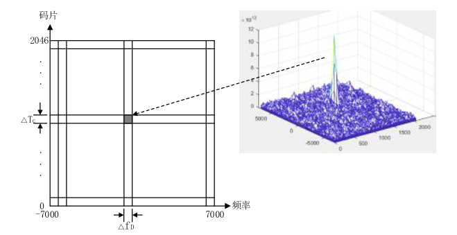
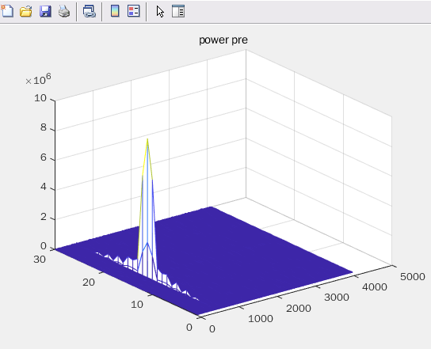
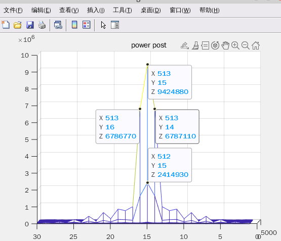

# 前言
在上一篇博客当中简单的介绍了CDMA系统中用于捕获信号的三个方向，并且在matlab中实现了最低一层的PN码的搜索，那么接下来就可以进行频率的搜索。
<!--more-->
# 频率的搜索
由于GPS发射机相对于接收机在高速运动，并且两者相隔万里，因此信号在发送出来到达接收机的时候，接收机并不能知道载波的具体的频率和相位。因此在接收机当中，需要本地生成一个载波信号用于信号的解调。
因此在这里需要进行第二个维度的搜索，也就是频率的搜索。有了上一篇博客的经验之后，在这里实现频率的搜索就比较简单了。
在这里假定一个搜索的频率范围是15KHz，因此我们需要在+/- 7.5KHz的频率范围进行搜索对应的信号，只有频率对上的时候，解调出来的效果才最好，这样在进行PN码搜索的时候才能获得最佳的相关峰。

还是以前面介绍的二维搜索的图为示意，介绍频率和码片搜索的过程：


在搜索的过程中，每个频率都需要进行码相位的搜索，每当完成一轮码相位的搜索之后，频率搜索的值增加一个步长，以此实现一个完整的搜索。

# 频率搜索的matlab实现

具体的实现的matlab代码如下，只需要在前面的码片搜索的基础上简单修改即可。

```matlab
clc;
close all;
clear all;

%% parameter define
PN_INDEX1   = 8 ;       % choose satellites 
PN_INDEX2   = 10;       % choose satellites 
SAMP_RATE = 8.184e6;    % sample rate
CODE_RATE = 2.046e6;    % standard PN code rate 2.046M 
NH_CODE_LEN = 20;       % the length of NH code is 20bit
SOURCE_DATA_LEN = 300;   % the source data num
PN_CODE_LEN = 2046;     % standard PN cod length 2046
PN_SAMP_LEN = (SAMP_RATE/CODE_RATE) * PN_CODE_LEN * NH_CODE_LEN * SOURCE_DATA_LEN; % total pn sample for data to be send

%% generate bpsk modulation data
% source_data ==> NH mod ==> PN mod ==> BPSK mod
% generate source data
source_data = rand(1, SOURCE_DATA_LEN); % generate test source data
source_data(source_data < 0.5) = -1;
source_data(source_data >= 0.5) = 1;    
source_data = repelem(source_data, 1, NH_CODE_LEN); % upsample D1 signal source data to NH code modulated rate 1Kbps

% NH code
nh_code = [0 0 0 0 0 1 0 0 1 1 0 1 0 1 0 0 1 1 1 0];
nh_code = repmat(nh_code, 1, SOURCE_DATA_LEN);     
nh_code(nh_code == 0) = -1;

% NH code modulation
nh_mod = source_data .* nh_code; % using .* instead of xor

% upsample to sample rata
nh_mod = repelem(nh_mod, 1, (SAMP_RATE/CODE_RATE)*PN_CODE_LEN);

% generate PN code & PN sample
[pn_code, pn_code_sample] = PNCode_Gen(PN_CODE_LEN, PN_SAMP_LEN, CODE_RATE, SAMP_RATE, PN_INDEX1);

% PN code modulation
pn_mod = nh_mod .* pn_code_sample; % using .* instead of xor

% generate carrier wave
AMP = 1;
ROM_DEPTH = 4096;
CARRIER_FREQ = CODE_RATE; % carrier frequency
FREQ_CTRL_WORLD = CARRIER_FREQ * 2^32/ SAMP_RATE;

rom_addr = 0: 1/ROM_DEPTH: 1-1/ROM_DEPTH;
carrier_wave_cos = AMP*cos(2*pi*rom_addr);
carrier_wave_sin = AMP*sin(2*pi*rom_addr);
% bpsk modulation
bpsk_mod = zeros(1,PN_SAMP_LEN);
rom_index = 1;
phase_accumulator = 0;

for i=1:PN_SAMP_LEN
    %bpsk modulation
    if(pn_mod(i) == -1)
        bpsk_mod(i) = -carrier_wave_cos(rom_index);
    else
        bpsk_mod(i) = carrier_wave_cos(rom_index);
    end

    phase_accumulator = phase_accumulator + FREQ_CTRL_WORLD;
    if(phase_accumulator > 2^32)
        phase_accumulator = phase_accumulator - 2^32;
    end

    rom_index = round(phase_accumulator/2^20);
    if(rom_index == 0)
        rom_index = 1;
    end
end

% plot the bpsk result
figure(1);
plot(1:1024, bpsk_mod(1:1024), 'r', 1:1024, pn_mod(1:1024),'b');
axis([0, 1024, -2, 2]);
legend('bpsk mod', 'pn mod');
title("BPSK modulation");

%% PN code capture
DATA_OFFSET = 1022;
data_in = bpsk_mod(DATA_OFFSET: end);   % input bpsk data offset

FREQ_WIDTH = 15e3;                                      % frequency search range 15kHz
FREQ_STEP = 500;                                        % frequency search step  500Hz
FREQ_SEARCH_RANGE = round(FREQ_WIDTH/FREQ_STEP);        % frequency search range

SAMP_PER_PN = round((SAMP_RATE/CODE_RATE)*PN_CODE_LEN); % for 1 complete PN code sample length
HALF_CODE_WIDTH = round((SAMP_RATE/CODE_RATE)/2);       % half code offset
PN_SEARCH_RANGE = round(SAMP_PER_PN/HALF_CODE_WIDTH);   % the total search range for pn code capture

% the power of correlation result
power_pre = zeros(FREQ_SEARCH_RANGE, PN_SEARCH_RANGE);
power_middle = zeros(FREQ_SEARCH_RANGE, PN_SEARCH_RANGE);
power_post = zeros(FREQ_SEARCH_RANGE, PN_SEARCH_RANGE);

%% frequency search
for freq_index=1:FREQ_SEARCH_RANGE
    
    % generate PN code
    [pn_code, pn_code_sample] = PNCode_Gen(PN_CODE_LEN, SAMP_PER_PN, CODE_RATE, SAMP_RATE, PN_INDEX1);
    pn_pre = [pn_code_sample(HALF_CODE_WIDTH+1:end), pn_code_sample(1:HALF_CODE_WIDTH)];
    pn_middle = pn_code_sample;
    pn_post =[pn_code_sample(SAMP_PER_PN-HALF_CODE_WIDTH+1:end), pn_code_sample(1:SAMP_PER_PN-HALF_CODE_WIDTH)];

    % generate carrier wave
    sin_carrier = zeros(1, SAMP_PER_PN);
    cos_carrier = zeros(1, SAMP_PER_PN);
    rom_index = 1;
    phase_accumulator = 0;

    % receiver frequency control word
    rx_freq_ctrl_world = round((CARRIER_FREQ + (FREQ_STEP*freq_index - FREQ_WIDTH/2))* 2^32/ SAMP_RATE);

    for i=1:SAMP_PER_PN
        sin_carrier(i) = carrier_wave_sin(rom_index);
        cos_carrier(i) = carrier_wave_cos(rom_index);
        phase_accumulator = phase_accumulator + rx_freq_ctrl_world;
        if(phase_accumulator > 2^32)
            phase_accumulator = phase_accumulator - 2^32;
        end

        rom_index = round(phase_accumulator/2^20);
        if(rom_index == 0)
            rom_index = 1;
        end
    end

    signal = data_in(1: SAMP_PER_PN);
    sample_offset = 0;


    % find correlation peak
    for code_index = 1: PN_SEARCH_RANGE
        i_data = signal .* cos_carrier;
        q_data = signal .* sin_carrier;
        % do correlation
        temp_pre_i = sum(i_data .* pn_pre);
        temp_middle_i = sum(i_data .* pn_middle);
        temp_post_i = sum(i_data .* pn_post);
        temp_pre_q = sum(q_data .* pn_pre);
        temp_middle_q = sum(q_data .* pn_middle);
        temp_post_q = sum(q_data .* pn_post);

        % calculate the power
        power_pre(freq_index, code_index) = temp_pre_i^2 + temp_pre_q^2;
        power_middle(freq_index, code_index) = temp_middle_i^2 + temp_middle_q^2;
        power_post(freq_index, code_index) = temp_post_i^2 + temp_post_q^2;

        % sample_offset = sample_offset + SAMP_PER_PN + HALF_CODE_WIDTH;
        % signal = data_in(sample_offset+1:sample_offset+SAMP_PER_PN);

        sample_offset = sample_offset + SAMP_PER_PN;
        signal = data_in(sample_offset+1: sample_offset+SAMP_PER_PN);
        pn_pre = [pn_pre(HALF_CODE_WIDTH+1:end), pn_pre(1:HALF_CODE_WIDTH)];
        pn_middle = [pn_middle(HALF_CODE_WIDTH+1:end), pn_middle(1:HALF_CODE_WIDTH)];
        pn_post = [pn_post(HALF_CODE_WIDTH+1:end), pn_post(1:HALF_CODE_WIDTH)];

    end
end


figure;mesh(1:PN_SEARCH_RANGE, 1:FREQ_SEARCH_RANGE, power_pre );title('power pre'); 
figure;mesh(1:PN_SEARCH_RANGE, 1:FREQ_SEARCH_RANGE, power_middle);title('power middle'); 
figure;mesh(1:PN_SEARCH_RANGE, 1:FREQ_SEARCH_RANGE, power_post);title('power post');
```



加一点点细节之后的结果如下：

可以看到在具体搜索的过程当中，在不同频率不同码相位下都会出现相关峰，但是只有在最佳频率和码相位的情况下出现的相关峰才会最大。