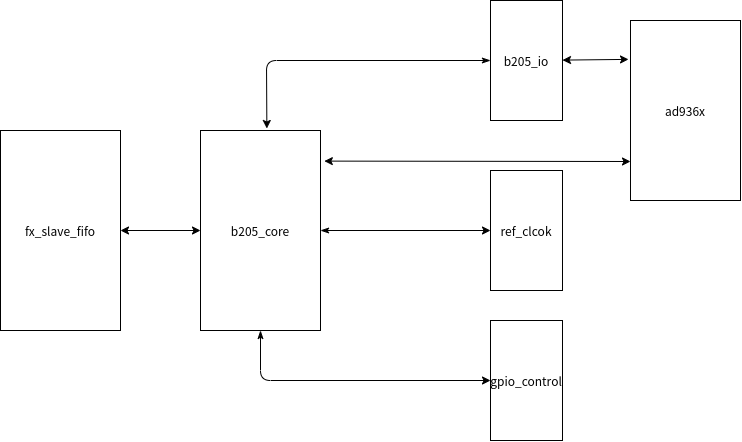
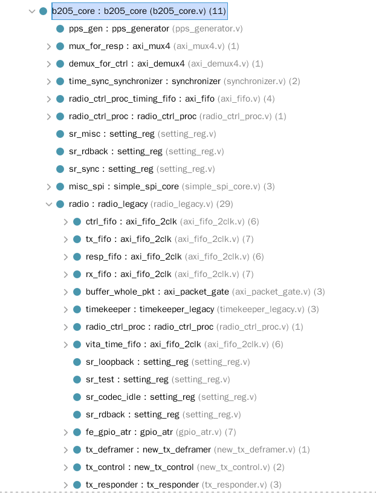

# 前言

Ettus Research可以说是在软件无线电领域处于领头地位的公司了，而且对应的许多产品除了PCB之外都是开源的，这给学习软件无线电提供了很多的资料。

以前做FPGA的时候，都不习惯去看别人的源码，现在来看，还是太天真了，当我开始看usrp b205的源码的时候，我发现ettus的源码写得是真的好，有很多值得学习的地方，所以在这里将对usrp b205的源码阅读的个人体会记录一下，也方便自己将来查阅。

公司由于业务需要，现在想要做一款软件无线电的产品，于是需要学习一下usrp的基础款的SDR设备，usrp b205是ettus最新一代当中最小的设备，想必其实现的结构也是最简单的，因此我决定从这一款设备开始。
<!--more-->

# 整体代码结构

usrp b205的整体的结构如下图所示，可以看到在FPGA中主要包含五个模块，分别是

- 和usb通信模块 fx_slave_fifo
- usrp b205核心模块， b205_core
- 与ad936x进行IQ数据交互的模块， b205_io
- 参考时钟设置模块， ref_clock
- gpio设置模块， gpio_control




# b205_core 代码结构分析
在整个系统中，最重要的模块可能就是b205_core这个模块，这个模块完成的主要功能有(个人猜测)：

- 解析上位机发送过来的命令
- IQ数据的打包和解包
- 基于时间戳的数据和命令同步
- DDC/DUC在FPGA当中的实现
- AD936x的SPI配置
- 返回上位机的响应 

这个模块的功能实在太多，从FPGA的代码里面也能看出来这个模块的内容实在很多，可能需要很长一段事件才能弄清楚这个模块具体实现了什么功能。



在 **b205_core** 当中，根据我现在已经从源码当中理解出来的东西，可以将这一个模块主要分成三个部分，分别是：

- PPS产生模块
- 系统控制模块
- radio控制模块

## pps产生
其中PPS产生模块是用于产生PPS信号的模块，PPS也就是一个一秒脉冲生成模块，在ettus的SDR当中，PPS和10MHz的参考信号都是十分重要的。
在这个模块当中可以看到pps可以是内部产生的，也可以是外部输入的，pps信号在之后会给到radio控制模块，目前还不知道这个信号具体干了些什么事，希望在之后的代码解析中能够弄明白。

```v
    /*******************************************************************
     * PPS Timing stuff
     ******************************************************************/
    // Generate an internal PPS signal
    wire int_pps;
    pps_generator #(.CLK_FREQ(100000000)) pps_gen
    (.clk(bus_clk), .pps(int_pps));

    // Flop PPS signals into radio clock domain
    reg [1:0] 	 ext_pps_del, int_pps_del;
    always @(posedge radio_clk) ext_pps_del[1:0] <= {ext_pps_del[0], pps_ext};
    always @(posedge radio_clk) int_pps_del[1:0] <= {int_pps_del[0], int_pps};

    // PPS mux
    wire [1:0] pps_select;
    wire pps =  (pps_select == 2'b01)? ext_pps_del[1] :
                (pps_select == 2'b10)? int_pps_del[1] :
                1'b0;
    assign ext_ref_is_pps = (pps_select == 2'b01);
```

## 系统控制
在系统控制模块这一部分，主要完成的工作是对系统的控制，对AD936x的控制。在这一部分当中设计比较巧妙，我花费了很长的事件才能够将这一部分的代码理解个7788然而还是有很多不理解的。
在这一部分当中最重要的就是 **radio_ctrl_proc.v** 模块。从名字上就能看到，这个模块叫做radio控制处理器，因此这一部分实现的东西还是比较复杂的，主要是要弄清楚其中的状态机的设计方法。

可以看到在这一部分，从上位机传输过来的控制信号经过 **radio_ctrl_proc** 解析之后，将会产生
`set_stb, set_addr, set_data`这样三个信号。这三个信号的作用就是用来配置系统的，包括设置从接下来的三个setting_reg 模块就能够看出，其中可以用于常规的系统控制，比如同步的选择，pps的选择等，也有用于ad936x控制的。
还有用于读回当前的状态给到上位机的，这些都是通过理清楚 **radio_ctrl_proc** 这个模块之后才能得出来的。
   
```v
    radio_ctrl_proc radio_ctrl_proc
    (
        .clk(bus_clk), .reset(bus_rst), .clear(1'b0),
        .ctrl_tdata(l0i_ctrl_tdata), .ctrl_tlast(l0i_ctrl_tlast), .ctrl_tvalid(l0i_ctrl_tvalid), .ctrl_tready(l0i_ctrl_tready),
        .resp_tdata(l0_resp_tdata), .resp_tlast(l0_resp_tlast), .resp_tvalid(l0_resp_tvalid), .resp_tready(l0_resp_tready),
        .vita_time(64'b0),
        .set_stb(set_stb), .set_addr(set_addr), .set_data(set_data),
        .ready(spi_ready), .readback(rb_data),
        .debug()
    );

    setting_reg #(.my_addr(SR_CORE_MISC), .awidth(8), .width(32), .at_reset(8'h0)) sr_misc
    (
        .clk(bus_clk), .rst(bus_rst), .strobe(set_stb), .addr(set_addr), .in(set_data),
        .out(misc_outs), .changed()
    );

    setting_reg #(.my_addr(SR_CORE_READBACK), .awidth(8), .width(2)) sr_rdback
    (
        .clk(bus_clk), .rst(bus_rst), .strobe(set_stb), .addr(set_addr), .in(set_data),
        .out(rb_addr), .changed()
    );

    always @*
     case(rb_addr)
       2'd0 : rb_data <= { 32'hACE0BA5E, COMPAT_MAJOR, COMPAT_MINOR };
       2'd1 : rb_data <= { 32'b0, spi_readback };
       2'd2 : rb_data <= { 16'b0, 8'd1, 8'd0, rb_misc };
       2'd3 : rb_data <= { 30'h0, lock_state_r };
       default : rb_data <= 64'd0;
     endcase // case (rb_addr)

    setting_reg #(.my_addr(SR_CORE_SYNC), .awidth(8), .width(3)) sr_sync
    (
        .clk(bus_clk), .rst(bus_rst), .strobe(set_stb), .addr(set_addr), .in(set_data),
        .out({time_sync,pps_select}), .changed()
    );

    simple_spi_core #(.BASE(SR_CORE_SPI), .WIDTH(8), .CLK_IDLE(0), .SEN_IDLE(8'hFF)) misc_spi
    (
        .clock(bus_clk), .reset(bus_rst),
        .set_stb(set_stb), .set_addr(set_addr), .set_data(set_data),
        .readback(spi_readback), .ready(spi_ready),
        .sen(sen), .sclk(sclk), .mosi(mosi), .miso(miso),
        .debug()
    );
```

## radio 模块
这个模块粗略来看，是进行IQ数据传输，DDC、DUC等等，还需要再看看才能理解。这个模块应该是整个系统中最复杂的模块了，实现的主要功能有：
- 与AD936x之间进行IQ数据的传输
- 接收来自上位机的命令(带有时间戳)
- 返回命令的响应(带有时间戳)
- 内部的信号的处理，DDC/DUC

希望在之后的能够一步步地把这个模块搞懂。

在下一篇博客当中会记录，radio_ctrl_proc这个模块的作用，这个模块在目前看来，是我觉得十分重要的模块，命令的解析，时间戳的同步都是靠这个模块来进行的。理解这个模块，需要理解传输的包格式，这个需要在下一步在进行了。


  
 