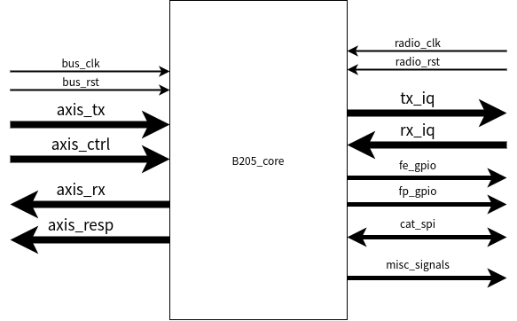
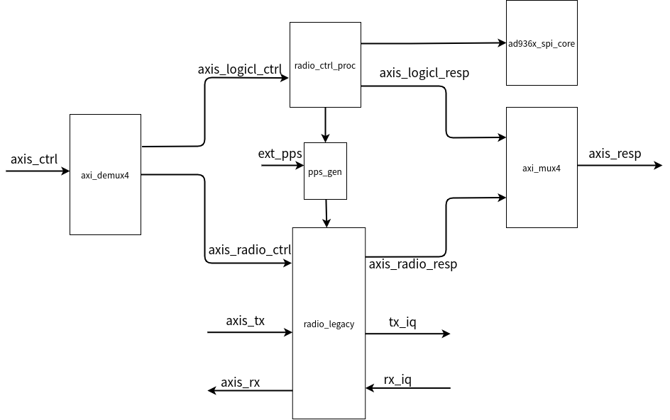
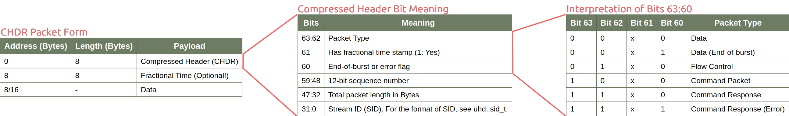
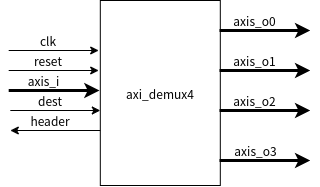
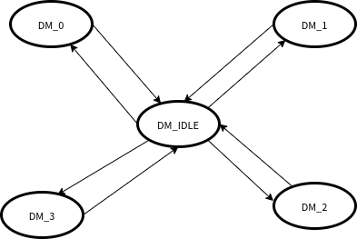
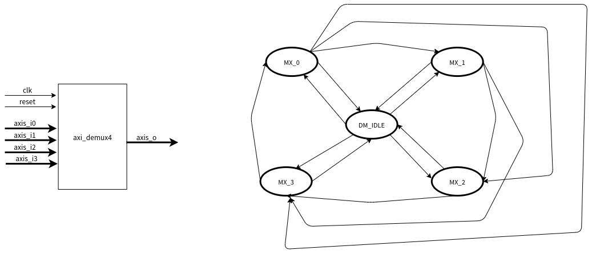
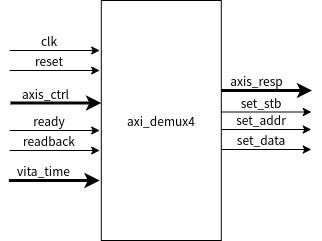
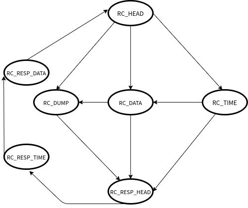

# b205 core
在前面的博客当中记录了 usrp b205 的整体的结构，只能说是从一个整体上对代码结构进行了分析，对其中细节的部分并不是十分了解，但是想要弄清楚 usrp b205 的具体的实现，还是要在这些部分下功夫才行。
b205_core 的verilog module的结构如下图所示：


<!--more-->
经过简单的阅读这个模块的源代码之后，可以大概知道这个模块的接口信号的作用：


| signal | description | 
| -- | -- | 
| bus_clk | 来自FX3的时钟 | 
| bus_rst | bus_clk时钟域的复位信号 | 
| axis_tx | 上位机经由fx3发送至FPGA的IQ数据，axis总线 | 
| axis_ctrl | 上位机经由fx发送至FPGA的控制信号，axis总线 |
| axis_rx | FPGA采集到的IQ数据经由FX3发送至上位机, axis总线 |
| axis_ctrl | FPGA响应上位机的控制信号并返回的响应，axis总线 |
| radio_clk | radio时钟域下的时钟 |
| radio_rst | radio时钟域下的复位信号|
| tx_iq | FPGA解析上位机发送来的IQ数据，转换成32位的IQ数据，发送给AD9361数据接口模块|
| rx_iq | FPGA将从AD9361接收到的32位IQ数据，经过FPGA内部的radio模块，转换成上位机能够解析的帧数据|
| fe_gpio | 射频前段开关和LED的控制信号 | 
| fp_gpio | 通用IO的控制输出 |
| cat_spi | FPGA接卸上位机的控制信号，从而驱动AD936x的SPI控制总线 |
| misc_signals | 其他的一些控制信号 |


# b205 core基本结构



## b205 Core整体结构与信号梳理
分析B205 Core的源码，b205_core这个模块按照上图的方式进行简单的划分，当然这个只是我个人的划分方法，对原始的verilog模块中还是做了简化，只是能够简单的描述一下信号的流向。

从整体结构图上来看，上位机向FPGA发送控制信号到FPGA内部是axis_ctrl这个总线，在b205_core内部，该axis_ctrl总线经过分流分成了送到两个不同的目标模块，其中一部分送到了内部的逻辑，也就是radio_ctrl_proc模块，另外一部分送到了rado信号处理模块。
radio_ctrl_proc模块接收到了控制信号之后，会去解析这些信号，并且去驱动FPGA的逻辑，比如控制AD936x，驱动内部逻辑产生返回给上位机的数据包，控制PPS信号的生成等。

radio_legacy模块接收到控制信号之后，会在内部去响应这些信号，radio_legacy模块是整个b205_core模块当中最复杂的模块，在这个里面包含了关于对命令的解析，IQ数据的转换与流量控制，向上位机返回内部的响应等等，这个模块是之后分析的重点，在这里先不做过多介绍。

radio_legacy模块和radio_ctrl_proc模块都会对上位机发出的控制命令做出响应，因此在b205_core模块里面还有用于将这两个响应信号生成源的axis总线上数据进行一个合路处理。这也就是axi_mux4这个模块的作用。

除了上面这些模块之外，在b205_core当中还有一个十分重要的模块就是PPS产生模块，PPS信号可以是内部产生的也可以是由外部输入的，pps的选择就是由radio_ctrl_proc 这个模块响应了上位机的控制信号之后进行控制的。

在usrp的源码当中，可以看到有一些模块的复用程度还是蛮高的，因此有必要弄清楚这些模块的具体的功能，能够帮助理整个系统的构成。因此接下来就会稍微研究一下在b205_core当中这些基础模块的作用。

## CHDR数据格式
在进行各个模块的功能分析之前，对传输的数据包先进行解析是有必要的，因为在verilog代码的实现的过程，都需要去解析这些数据包的内容。
关于USRP在传输过程中所传递的数据包，我也是在google上搜索了一番，在下面这个地址当中，有介绍usrp是如何同步的，其中就简单介绍了USRP在传输时的数据包的格式 CHDR数据包格式。

[Synchronizing_USRP_Events_Using_Timed_Commands_in_UHD](https://kb.ettus.com/Synchronizing_USRP_Events_Using_Timed_Commands_in_UHD)

我也找到了两个PDF文件，来介绍USRP3当中的CHDR在传输过程当中的一些情况。

[USRP3_concepts.pdf](https://github.com/black-pigeon/black-pigeon.github.io/raw/hexo/source/_posts/2021.12/usrp-b205-fpga%E6%BA%90%E7%A0%81-2/USRP3_concepts.pdf)

[Synchronizing_USRP_Events_Using_Timed_Commands_in_UHD.pdf](https://github.com/black-pigeon/black-pigeon.github.io/raw/hexo/source/_posts/2021.12/usrp-b205-fpga%E6%BA%90%E7%A0%81-2/Synchronizing_USRP_Events_Using_Timed_Commands_in_UHD.pdf)

其中CHDR帧格式如下图所示：



可以看到一个CHDR数据帧主要包含包头，时间戳(optional),和数据。其中我认为最重要的就是包头和时间戳了，包头包含了一帧数据里面十分重要的信息，从途中的Compressed Header Bit Mapping也能够看出，在帧头的这64bit当中，决定了本帧数据的类型，是否包含时间戳，是否是一次突发的传输的最后一帧数据，以及帧的长度，序列号源和目的地址等等。

其实在FPGA当中解析控制包和数据包的时候，主要也就是解析这个帧头的内容。简单了解了CHDR的帧格式之后，我就能够去看verilog源码当中的各个模块了。

## axi_dmux4 & axi_mux4
**axi_dmux4**模块是一个axis接口的分流器，如下图所示，它能够将一个输入的数据流分发到最多4个数据流通道上去，具体分发到哪一个数据流通道上，是根据这个输入的dest信号来决定的。



在这个模块内部实现了一个简单的状态机,如下图所示：



默认情况下，系统处于IDLE状态，当输入的数据帧有效的时候，将会根据输入的dest信号，跳转到4个不同的状态。在这四个不同的状态下，完成axis总线数据的分流。直到这一帧数据的结束，将会回到IDLE状态。

值得说明的是，这个模块还有一个检测包头的输出，在b205_core这个模块当中，用于检测包头的数据，并且分析这一帧控制数据是用于内部逻辑控制还是内部的radio控制的。因为这些都是组合逻辑，所以会立即执行，因此能够完成时序的要求。

该模块还有一个BUFFER属性，这个属性能够在内部表示是否对信号进行缓冲操作。
```v
    // 通过获取到的包头数据来判断是用于控制ad936x的还是用于控制内部逻辑的
    // ctrl_dst=1  ad936x control
    // ctrl_dst=0  radio control
    wire [63:0] ctrl_hdr;
    wire [1:0] ctrl_dst =
        ((ctrl_hdr[7:0] & DEMUX_SID_MASK) == R0_CTRL_SID)? 0 : (
        ((ctrl_hdr[7:0] & DEMUX_SID_MASK) == L0_CTRL_SID)? 1 : (
    3));
    axi_demux4 #(.ACTIVE_CHAN(4'b1111), .WIDTH(64), .BUFFER(1)) demux_for_ctrl
    (
        .clk(bus_clk), .reset(bus_rst), .clear(1'b0),
        .header(ctrl_hdr), .dest(ctrl_dst),
        .i_tdata(ctrl_tdata), .i_tlast(ctrl_tlast), .i_tvalid(ctrl_tvalid), .i_tready(ctrl_tready),
        .o0_tdata(r0_ctrl_tdata), .o0_tlast(r0_ctrl_tlast), .o0_tvalid(r0_ctrl_tvalid), .o0_tready(r0_ctrl_tready),
        .o1_tdata(l0_ctrl_tdata), .o1_tlast(l0_ctrl_tlast), .o1_tvalid(l0_ctrl_tvalid), .o1_tready(l0_ctrl_tready),
        .o2_tdata(), .o2_tlast(), .o2_tvalid(), .o2_tready(1'b1),
        .o3_tdata(), .o3_tlast(), .o3_tvalid(), .o3_tready(1'b1)
    );
```

**axi_mux4**这个模块实现的功能，和**axi_demux4**这个模块的功能刚好相反，他是将最多4路不同的axis数据流合路到一路axis数据流上。



该模块在内部也实现了一个简单的状态机。根据该模块的属性PRIO的不同，这个状态机有两种不同的工作模式。当属性 **PRIO=1**的时候，状态机在接收完源的一帧数据之后，将会立即回到IDLE状态。 而当**PRIO=0**的时候，当接收完一路axis信号后，会继续检测其他路是否也有有效数据，如果有就会就会跳转到对应状态接收数据
```v
// axi_mux -- takes 4 64-bit AXI stream, merges them to 1 output channel
// Round-robin if PRIO=0, priority if PRIO=1 (lower number ports get priority)
// Bubble cycles are inserted after each packet in PRIO mode, or on wraparound in Round Robin mode
module axi_mux4
  #(parameter PRIO=0,
    parameter WIDTH=64,
    parameter BUFFER=0)
   (input clk, input reset, input clear,
    input [WIDTH-1:0] i0_tdata, input i0_tlast, input i0_tvalid, output i0_tready,
    input [WIDTH-1:0] i1_tdata, input i1_tlast, input i1_tvalid, output i1_tready,
    input [WIDTH-1:0] i2_tdata, input i2_tlast, input i2_tvalid, output i2_tready,
    input [WIDTH-1:0] i3_tdata, input i3_tlast, input i3_tvalid, output i3_tready,
    output [WIDTH-1:0] o_tdata, output o_tlast, output o_tvalid, input o_tready);

endmodule
```

## radio_ctrl_proc & setting_reg
### radio_ctrl_proc
**radio_ctrl_proc** 在我看来是这个usrp b205_core当中十分巧妙的设计，该模块能够响应上位机发来的控制命令，用于控制内部逻辑或者AD936x，与此同时还能够检测时间戳，比较命令的时间戳和本地的时间戳，这对与同步和需要时间戳控制的任务来说十分重要。
其结构和内部的状态机如下图所示：





要理解这个模块的工作原理，首先就得把这个状态机给理清楚了：可以看到该状态机一共有8个状态，且各个状态之间的跳转关系也已经标出，要弄清楚这个模块的工作原理，就离不开前面介绍的CHDR的包格式了。这个状态机前半部分的主要工作就是解析上位机发送而来的控制包的数据，后半部分是产生对控制信号的响应。

- RC_HEAD状态：在该状态下，该模块会检测当前是否有有效数据，如果检测到了有效帧数据，也就是一帧数据的开始，那么就会从第一个64Bit开始解析了。会将序列号(seqnum)和源目的地址(sid)给记录下来，然后判断这一帧数据是不是控制帧(bit[63])。
  - 如果不是控制帧，那么就会跳转到**RC_DUMP**状态，相当于丢弃掉后续的数据。
  - 如果是控制帧，那么就会看是否包含时间戳，如果包含时间戳，那么就会跳转到接受时间戳的状态。
  - 如果不包含时间戳，那么就会跳转到接受数据的状态。

- RC_TIME: 接收时间戳的状态。
  - 如果在该状态下，接受到的是本帧数据的最后一个64bit数据(也就是说，这一个控制帧，除了时间戳之外不包含任何数据），那么就会跳转到产生响应的状态了也就是 **RC_RESP_HEAD**。
  - 如果在该状态下，检测到当前本地的时间戳和上位机传下来的控制帧的时间戳相等或者本地超前(模块内部有一个时间比较模块，用于比较本地的时间戳和控制帧里面的时间戳)，那么才会继续接收后面的数据，也即是跳转到RC_DATA的状态。

- RC_DATA: 接收数据状态(控制帧的第三个64bit)，
  - 在该状态下，如果检测到当前是本帧数据的最后一个64bit，那么将会跳转到产生 响应头的**RC_RESP_HEAD**
  - 如果后续还有其他数据，将跳转到**RC_DUMP**状态，将后续数据丢弃。
  - 在该状态下，还会是控制外部逻辑的信号有效。也就是：
    ```v
       assign set_stb = (rc_state == RC_DATA) & ready & ctrl_tvalid;
        assign set_addr = ctrl_tdata[39:32];
        assign set_data = ctrl_tdata[31:0];
    ```
- RC_DUMP: 该状态就是丢弃数据的状态，直到一帧数据阶数的时候，跳转到响应状态。
- RC_RESP_HEAD,RC_RESP_TIME,RC_RESP_DATA: 这个三个状态的目的就是产生一个响应的CHDR数据帧，包含帧头，时间戳，响应数据等等。
  ```v
   always @(posedge clk)
      if (set_stb)
         cmd_time <= vita_time;

   always @*
     case (rc_state)
       RC_RESP_HEAD : { resp_tlast, resp_tdata } <= {1'b0, 4'hA, seqnum, 16'd24, sid[15:0], sid[31:16] };
       RC_RESP_TIME : { resp_tlast, resp_tdata } <= {1'b0, cmd_time};
       RC_RESP_DATA : { resp_tlast, resp_tdata } <= {1'b1, readback};
       default :      { resp_tlast, resp_tdata } <= 65'h0;
     endcase // case (rc_state)
   
   assign resp_tvalid = (rc_state == RC_RESP_HEAD) | (rc_state == RC_RESP_TIME) | (rc_state == RC_RESP_DATA);
   
  ```

### setting_reg 模块
**setting_reg**实现的功能就特别简单了，应该说这个模块就是配合着前面的radio_ctrl_proc这个模块来使用的。
该模块的功能就是当radio_ctrl_proc产生了一个控制信号的时候(set_stb,set_addr,set_data)，setting_reg模块会比较当前的设置的地址是不是自己的属性所设置的地址，如果是就把输入的数据，寄存器输出到out上，并且产生一个一拍的changed信号。

从b205_core的verilog源码来看，用于ad936x的配置也是通过这种形式产生的，最终将这个控制信号通过SPI给到ad936x从而实现从上位机对ad936x的配置。也就是源码当中的**simple_spi_core**模块。
```v
radio_ctrl_proc radio_ctrl_proc
    (
        .clk(bus_clk), .reset(bus_rst), .clear(1'b0),
        .ctrl_tdata(l0i_ctrl_tdata), .ctrl_tlast(l0i_ctrl_tlast), .ctrl_tvalid(l0i_ctrl_tvalid), .ctrl_tready(l0i_ctrl_tready),
        .resp_tdata(l0_resp_tdata), .resp_tlast(l0_resp_tlast), .resp_tvalid(l0_resp_tvalid), .resp_tready(l0_resp_tready),
        .vita_time(64'b0),
        .set_stb(set_stb), .set_addr(set_addr), .set_data(set_data),
        .ready(spi_ready), .readback(rb_data),
        .debug()
    );

    setting_reg #(.my_addr(SR_CORE_MISC), .awidth(8), .width(32), .at_reset(8'h0)) sr_misc
    (
        .clk(bus_clk), .rst(bus_rst), .strobe(set_stb), .addr(set_addr), .in(set_data),
        .out(misc_outs), .changed()
    );

    setting_reg #(.my_addr(SR_CORE_READBACK), .awidth(8), .width(2)) sr_rdback
    (
        .clk(bus_clk), .rst(bus_rst), .strobe(set_stb), .addr(set_addr), .in(set_data),
        .out(rb_addr), .changed()
    );

    setting_reg #(.my_addr(SR_CORE_SYNC), .awidth(8), .width(3)) sr_sync
    (
        .clk(bus_clk), .rst(bus_rst), .strobe(set_stb), .addr(set_addr), .in(set_data),
        .out({time_sync,pps_select}), .changed()
    );

    simple_spi_core #(.BASE(SR_CORE_SPI), .WIDTH(8), .CLK_IDLE(0), .SEN_IDLE(8'hFF)) misc_spi
    (
        .clock(bus_clk), .reset(bus_rst),
        .set_stb(set_stb), .set_addr(set_addr), .set_data(set_data),
        .readback(spi_readback), .ready(spi_ready),
        .sen(sen), .sclk(sclk), .mosi(mosi), .miso(miso),
        .debug()
    );

    always @*
     case(rb_addr)
       2'd0 : rb_data <= { 32'hACE0BA5E, COMPAT_MAJOR, COMPAT_MINOR };
       2'd1 : rb_data <= { 32'b0, spi_readback };
       2'd2 : rb_data <= { 16'b0, 8'd1, 8'd0, rb_misc };
       2'd3 : rb_data <= { 30'h0, lock_state_r };
       default : rb_data <= 64'd0;
     endcase // case (rb_addr)
```

## radio_legacy模块
接下来就剩下，b205_core当中最复杂的模块了，这个模块主要用于控制FPGA内部的radio信号，在之后再做介绍了。这个内容很多，还没有开始看，单上上面的一些模块，在这个模块当中也会使用到，这能够有助于我理解这个模块当中其他模块的功能。