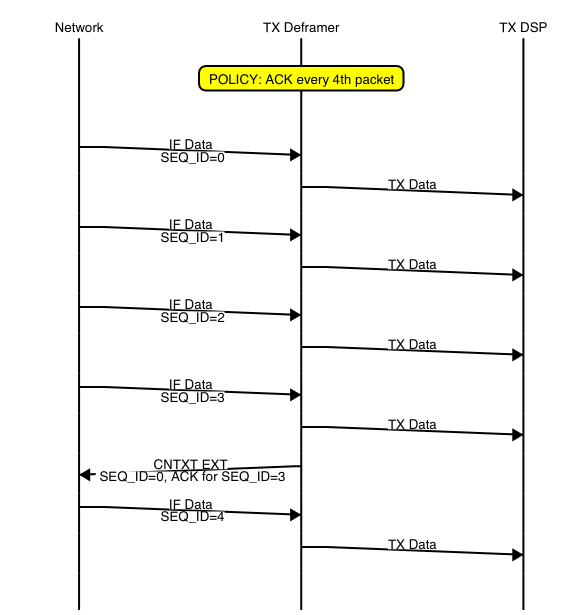

# radio_legacy 模块
在前面的两篇博客当中对USRP B205的整体的一个结构有了一定的了解。通过ettus网上的资料也能够找到一些关于USRP在传输命令时候的一些机制，并以此了解了时间戳的作用，并理解了一下数据是如何在时间戳的作用下进行同步的。

在radio_legacy 模块当中，主要涉及到的是关于无线信号的基带处理部分，在这一部分会与上位机之间进行数据的传输，因此弄懂如何进行IQ数据和上位机数据之间的转换是这一部分的一个重点。
<!--more-->

但是很遗憾，由于在这一部分，涉及到很多需要由上位机传递过来的命令，因此想要把这一部分完全搞懂，需要去阅读usrp的上位机的源码才可以，但是以我的实力，想必是不行。因此在这里只能说是对这个主要模块的信号流向进行一个简单的梳理，在之后如果自己需要使用到这个模块，就只把这个模块当做一个黑盒子，一个IP来使用了。

radio_legacy的整体结构如下图所示：


## radio_ctrl_proc & time_keeper
**radio_ctrl_proc** 模块在之前就已经介绍过了，该模块负责接受来自上位机的控制命令，将上位机的控制命令，转换成FPGA内部的控制总线上的信号。并且还能够返回一个响应给到上位机。在前面介绍上层模块的时候，对于radio_ctrl_proc模块其输入的本地时间戳的值保持为0，而在**radio_legacy** 模块当中，可以看到有一个 **time_keeper** 模块，该模块的作用就是产生一个本地的计时器，提供一个在FPGA内部的时间戳。

有关于时间戳的机制，在这里就不再重复的记录了，时间戳需要和上位机的代码一起才能够更好地理解。

可以看到上位机发送过来的控制信号，首先会经过一个跨时钟域的模块，**bus_clk**时钟域的信号准换到 **radio_clk**当中，也即是说，在 **radio_legacy** 模块当中，大部分的模块都处于 **radio_clk**当中。

返回给上位机的响应信号可以看到，在本模块当中会主要有两个来源，一个是由 **radio_legacy** 模块所产生的响应信号，还有一个是有无线信号的发送控制模块 **new_tx_responder** 产生。而响应信号的来源没有接收端的控制，这是因为接受段的响应信号是通过接受端的数据返回给上位机的。

返回给上位机的信号需要经过一个时钟域转换模块，由 **radio_clk** 时钟域转换到 **bus_clk** 时钟域。

## TX channel
TX channel是数据有host发送到ad936x的通路，在这一个支路上，主要由下图当中的绿色的模块构成。


可以看到主要包含以下几个模块：
- tx_data_cross_domain: tx数据跨时钟域模块，完成发送数据的时钟域的转换，bus_clk到radio_clk。
- new_tx_frame：在b205源码当中的实例名为tx_deframe，主要完成的工作就是将上位机传来的帧数据进行解析，将其中一些重要信息进行解析之后，添加到信号的数据流当中。这样新的数据流当中的每一个数据都能够含有这些关键信息，便于之后的对流量的控制和处理。
- new_tx_control：完成的就是对解帧之后的数据进行检测和控制，由于在前面new_tx_frame模块当中对原始的数据帧进行了解析，使得新的数据流当中每个点都包含对应数据帧的帧头信息，因此在tx_control模块当中就可以来解析这些信息了。
- new_tx_responder:在这个模块当中，会根据数据发送成功或者失败产生一些响应信号，返回给上位机，上位机接收到这些信号之后，会在软件中进行下一步的处理。
- duc_chain： FPGA内部的数字上变频模块，在这个模块当中，包含有一些简单的DSP模块，经过这个模块的处理之后，数据就会发送到AD936x模块，并最终经过调制，发送到空中了。

### tx_deframe 模块
在tx_deframe当中，有一个简单的状态机，该状态机的状态跳转图如下图所示：


主要实现的功能就是在TD_HEAD状态下，进行数据帧的检测和解析，如果接受到的数据帧是控制帧，那么则需要将这一帧数据丢弃，状态跳转到TD_DUMP。如果是数据帧，那么就会将帧头当中的具体的信息解析出来，包括数据帧长度是奇数还是偶数odd，是否包含时间戳send_at，序列号seqnum，地址sid，突发结束eob等信息。如果包含时间戳则跳转到接受时间戳状态TD_TIME并进一步跳转到接受数据的状态。
最终将数据由CHDR的格式转换为帧头信息的数据流，如下面的对应关系所示：
```v
 wire [175:0]   fifo_tdata = { odd, send_at, eob, i_tlast, seqnum/*12*/, sid, send_time/*64*/, i_tdata/*64*/ };
```

### tx_control 模块 & tx_responder 模块
在tx_control模块当中主要实现一个控制功能，能够将接收到的解帧之后的数据，转换成DSP模块需要的IQ数据。
并且还会关注帧头当中的信息，当出现错误或者成功发送的时候会产生一个error_code来记录本次发送，并且这个error_code在之后通过tx_responder模块返回给上位机。
关于这一部分的内容，具体的可以看下面的文档。
[USRP3_concepts.pdf](https://github.com/black-pigeon/black-pigeon.github.io/blob/hexo/source/_posts/2021.12/usrp-b205-fpga%E6%BA%90%E7%A0%81-2/USRP3_concepts.pdf)




## RX channel
RX 通道主要包含前面结构图中蓝色的部分，具体包括DDC模块，new_rx_frame模块，new_rx_control模块。
由于这些模块里面都有一些由上位机发送下来的控制信号，因此想要弄明白具体某一个时候发生什么变化，目前来看还是不行的，因此就只能从整体结构上来梳理一下这些模块的作用了。

### ddc_chain 模块
ddc_chain模块主要实现的是从AD936x接受数据，并将数据转换为复数IQ数据，一个IQ数据的位宽为32bit，在该模块内部会有一下DSP模块，这些模块在Spartan6和Artix7当中还有些不同，想要移植到Artix7的时候还需要注意其中的一些IP的使用才行，有一些IP在ISE当中和vivado当中已经不能够很好的兼容了，因此在使用到这些模块的时候，需要使用网表去对IP进行替换。


### new_rx_frame模块
new_rx_frame 模块将会对经过DDC模块之后的数据进行整理，将经过DDC之后的IQ数据转换为UHD当中所支持的对应的帧格式的数据。
在这个模块当中，也有一些从上位机传递过来经过radio_core之后产生的setting_bus总线上的数据，因此也需要对上位机当中的具体的行为去做了解才行。因此还是只能对这些模块的作用进行简单的分析。
在new_rx_frmae 当中有两个状态机，其中一个状态机用于将32bit的IQ数据按照顺序填充到CHDR的64bit数据当中。另外一个状态机实现将整理好的64bit的CHDR数据组装成包含帧头和时间戳的具体帧数据。


在这个状态机当中，主要完成的就是IQ数据的组装，最基本的一个工作就是在SECOND和FIRST状态的时候分别完成对第一个32bit IQ数据和第二个32bit IQ数据进行填充。还会对本帧数据产生记录一个时间戳，这在之后产生具体的帧数据是十分有效的。
需要注意的是，关于帧头信息，有一部分是从后续的rx_control模块得到的，因为rx_control模块能够根据帧的信息产生一个结束标志位等。
```v
always @(posedge clk)
    if(strobe && run)begin
        holding <= sample;
        if(instate == START)
            hold_time <= vita_time; // 保存一个时间戳，该时间戳是本帧数据产生时的时间戳
    end
wire [63:0] 	  sample_tdata = (instate == SECOND) ? {holding, sample} : {sample, 32'h0};
```
在完成IQ数据打包到帧数据当中之后，在new_rx_frame模块当中还有一个用于产生帧数据的状态机，其状态状态跳转图如下：


这个状态机的状态跳转就比较简单的，就是按照帧头，时间戳，IQ数据的格式产生一帧数据。

### rx_control模块
rx_control模块将会根据上一级的rx_frame 产生模块和DDC模块，来产生有关rx通路上的有关的状态和控制信息。其内部的工作，也和上位机通过setting bus的控制有关，因此该模块具体的工作细节，也需要联合上位机的程序来进行操作。因此在这里只是简单的分析一下该模块的工作流程。


从rx_control模块内部的状态机来看，该模块的工作比较多的，但是仔细分析这个状态机，也不难看出这些模块的一个大概的功能还是比较清晰的，在接受帧数据的时候，可能会出现各种情况，比如时间戳不对啦，帧数据提前结束啦，数据不够啦等等。因此这个模块就会根据帧头信息来监测具体的工作状态。
当发生错误的时候，会产生一个响应包通过rx数据通道发送到上位机。

在接受控制模块当中，需要注意和发送控制模块产生响应的区别，在发送模块当中，响应是通过resp这个通多发送给上位机，而在接受数据控制模块当中，响应信息是通过接受数据通道发送给上位机的。
