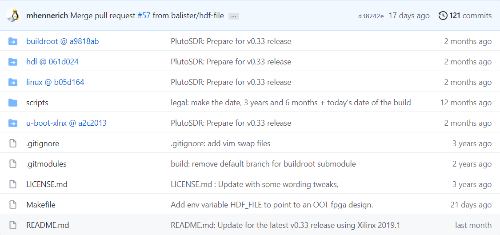
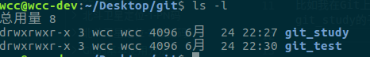
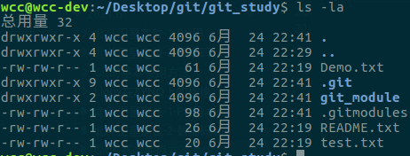
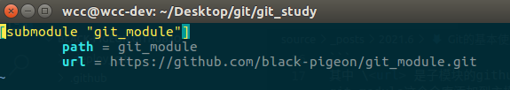
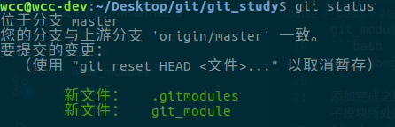
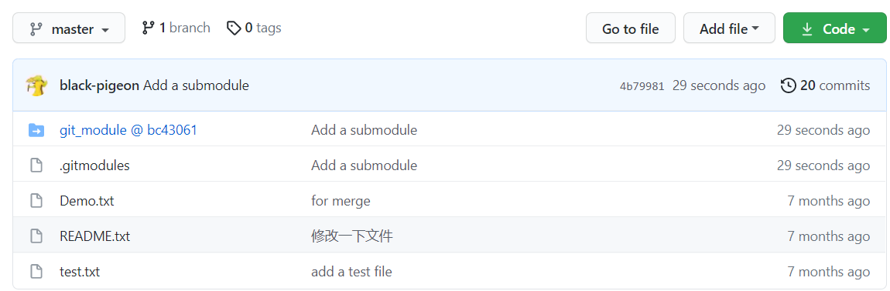
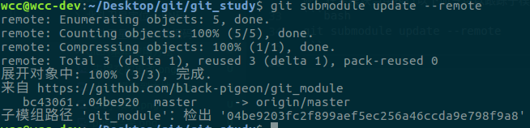
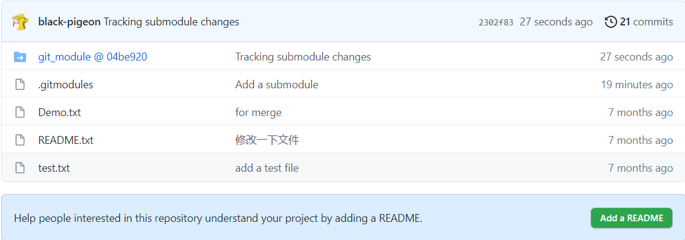
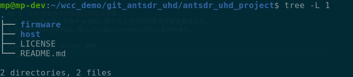

## 1. Git 添加子模块

当Git的项目比较大之后，可以将一个工程分为好几个子模块，就向上面的图中所展示的那样，在PlutoSDR的固件当中，需要由不同的子项目构成。
<!--more-->
比如我在Git上有两个仓库，一个是git_study,一个是git_module。现在想要把gitmodule作为git_study的子模块进行添加。首先把这两个仓库都克隆到本地来。

接下来进入到主模块当中，使用git submodule add 命令，添加一个子模块。
```bash
git submodule add <url> <path>
```
其中 \<url> 是子模块的github的链接，path是子模块在当前仓库当中的路径。在这里把git_module这个仓库添加到主模块的仓库当中。
```bash
git submodule add https://github.com/black-pigeon/git_module.git
```
添加完成之后会在主模块下面新生成一个.gitmodule的文件，该文件当中存储有子模块的路径信息和子模块所处的分支(branch)信息。


现在使用git status可以看到当前主模块仓库中有未提交的更改，这个时候可以把更改推到github上了。



可以看到当前子模块的commit ID是bc43061

## 2.子模块的更新

在子模块当中更新了内容，并对子模块进行了提交之后，主模块当中该如何来进行更新子模块的内容呢？在主模块当中执行以下命令可以跟踪子模块的变化。
```bash
git submodule update --remote
```

这个时候可以检测出子模块当中的更新，可以看到当前子模块的commit ID会更改为最新的commit ID。
这时候再将主模块当中的更新尽心提交就可以了。
```bash
git commit -a -m "Tracking submodule changes"
```

可以看到，主模块当中的子模块的commit ID也发生了变化。

## 3. 和并分支当中的某些文件或文件夹
git merge是用来合并两个分支的，两个分支当中的所有文件都需要被合并。
如果想要只合并一些内容，那么可以通过checkout的方式来进行合并。

比如我有一个项目：antsdr_uhd.

我这个项目其中一个分支是master， 另外一个分支是e200_dev。如果我指向合并在master分支上合并e200_dev的firmware下面的内容。那么我只需要先checkout到对应分支的目录下，比如：
```bash
git checkout e200_dev firmware/**
```
此时master分支上的firmware文件夹里面的内容就会变成e200_dev分支上的内容。
然后我们在提交对应的内容就可以了。
```bash
git status
git add .
git commit -m "xxxx"
git push
```