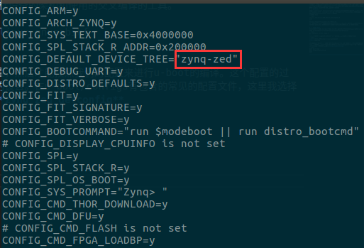
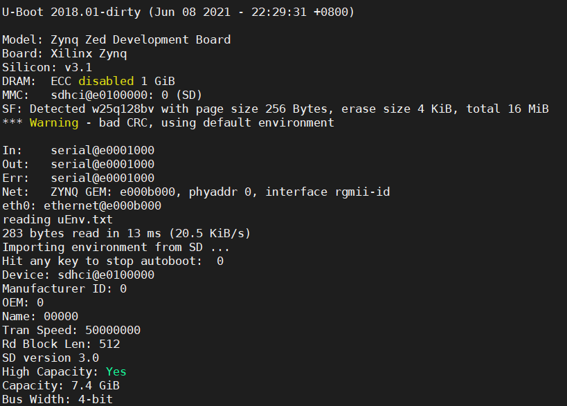
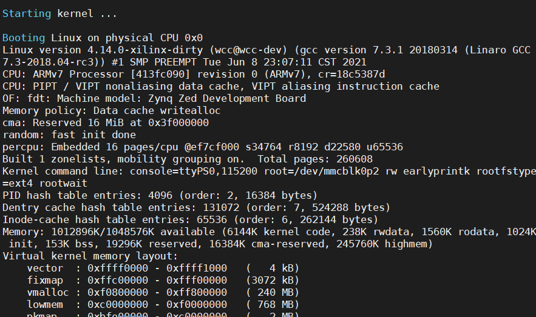
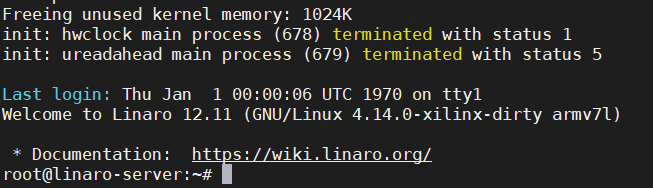

最近感觉比较迷茫，一天天不知道该干些什么，每天上班太多水，有点在上海撑不下去了。抽点空记录下学习过程吧。最近看了下linux在zynq上的移植，就决定试一试，前前后后弄了好久，都开始怀疑人生了，但是最后还是移植成功了。
# 1. Fetch Source
第一步主要就是获取源码，主要就是xilinx提供的u-boot，linux内核，还有设备树。这些文件在构建zynq支持的系统的时候都是十分重要的。这些文件都是提供在Git上的。Xilinx的wiki上也有给出如何来构建开源的linux的方法，可以参考下面的链接。
[Xilinx Open Linux](https://xilinx-wiki.atlassian.net/wiki/spaces/A/pages/18842156/Fetch+Sources)
```bash
git clone https://github.com/Xilinx/linux-xlnx.git
git clone https://github.com/Xilinx/u-boot-xlnx.git
git clone https://github.com/Xilinx/device-tree-xlnx.git
```
<!--more-->
# 2.建立最小系统
接下来就是需要一个最基本的硬件平台了，只需要在Vivado中搭建一个最小系统就醒了，我在vivado中使能了串口，以太网，sd卡，usb。用不用得到先不说，弄个最基础的出来先。
建立好最小系统之后，生成bit文件并导出hdf文件，这个文件在构建BOOT.bin的时候需要使用到，生成自己的设备树的时候同样也需要这个文件。
# 3. 生成fsbl
将hdf导入到virtual box，在virtual box只需要安装XSDK就可以了。这也是我为什么选择使用从源码的方式来学习linux了，主要是因为这个需要在虚拟机上安装的软件就不需要像petalinux那么大。并且petalinux创建一个工程挺慢的。
在终端中输入
```bash
source /opt/Xilinx/SDK/2018.3/settings64.sh
xsdk
```
输入的路径需要根据具体的安装路径来定。
打开SDK之后，根据前面生成的HDF新建fsbl工程，在新建工程的时候，选取hardware platform的时候，需要选取前面生成的hdf，就可以。然后就等生成fsbl.elf就可以了。

# 3. 编译u-boot
接下来就可以编译u-boot了，编译u-boot之前需要先把源文件切换到对应的版本上，我使用的是2018.3，因此需要在u-boot的根目录下checkout对应的tag上。
```bash
cd u-boot-xlnx
git checkout xilinx-v2018.3
```
在进行编译之前，需要先设置下目标设备的架构和使用的交叉编译的工具。
```bash
export CROSS_COMPILE=arm-linux-gnueabihf-
export ARCH=arm
```
然后需要对u-boot进行简单的配置，然后才能按照我们的配置来进行u-boot的编译。这个配置的过程，简单点可以使用xilinx提供的设置。在u-boot/configs有包含的常见的配置文件，这里我选择zed-board的配置文件，也就是**zynq_zed_defconfig**
接下来还需要修改一下u-boot的启动配置文件，该文件在**u-boot-xlnx/include/configs/zynq-common.h**
主要就是修改启动的时候不使用uramdisk
```c
"sdboot=if mmcinfo; then " \
                        "run uenvboot; " \
                        "echo Copying Linux from SD to RAM... && " \
                        "load mmc 0 ${kernel_load_address} ${kernel_image} && " \
                        "load mmc 0 ${devicetree_load_address} ${devicetree_image} && " \
                        "bootm ${kernel_load_address} - ${devicetree_load_address}; " \
                "fi\0" \
```
然后就可以开始进行u-boot的编译了。

```bash
make distclean
make zynq_zed_defconfig
make
```

可以看到u-boot需要的设备树是zynq-zed，因此只需要去修改这个对应的设备树文件符合自己的板子就可以了。
这个设备树文件在 **arch/arm/dts/zynq-zed.dts**
主要就是修改一个内存的大小适合自己就行了。
# 生成BOOT.bin
生成u-boot之后，就可以来生成BOOT.bin了，在这之前需要先将生成的u-boot更改后缀为.elf，然后使用xilinx SDK一次添加fsbl.elf,bitstream.bit,u-boot,elf就可以生成BOOT.bin了。

# 编译linux内核
接下来可以进行了linux内核的编译，linux内核编译也比较简单，首先进到linux源码目录，checkouot到对应版本的分支上。
在编译内核之前，还是先确定交叉编译器和设备架构。
```bash
cd linux-xlnx
git checkout xilinx-v2018.3
export CROSS_COMPILE=arm-linux-gnueabihf-
export ARCH=arm
```
然后和前面编译u-boot一样，找一个模板设置。配置文件在**linux-xlnx/arch/arm/configs/xilinx_zynq_defconfig**下。
然后就可以编译内核了。
编译内核结束之后还需要编译设备树文件，这个需要使用到的是zed board的参考上进行更改就可以了。设备树文件在 **linux-xlnx/arch/arm/boot/dts/zynq-zed.dts**。更改完成之后，直接使用make + 设备树名称就可以了。
```bash
make xilinx_zynq_defconfig
make uImage LOADADDR=0x00008000
make zynq-zed.dtb
```

# rootfs
文件系统比较简单，网上找一个适合自己的就好，我这里使用的是linaro-precise-server-20121124-17.tar.gz上linaro观望搜索就下载就可以了。

# 准备启动镜像
准备一个SD卡，弄成两个分区，一个分区名为BOOT，格式为FAT32，大小100MB,一个分区名为rootfs，格式为EXT4，大小为SD卡剩余空间即可。
把前面生成的 BOOT.bin,linux内核文件和设备树文件都拷贝到BOOT分区。
```bash
cp BOOT.bin /media/BOOT
cp linux-xlnx/arch/arm/boot/uImage /media/BOOT/uImage
cp linux-xlnx/arch/arm/boot/zynq-zed.dtb /media/BOOT/devicetree.dtb
```
然后新建一个环境变量文件uEnv.txt，该文件保存启动方式，文件内容如下：
```bash
uenvcmd=run sdboot
sdboot=echo Copying Linux from SD to RAM... && fatload mmc 0 0x3000000 ${kernel_image} && fatload mmc 0 0x2A00000 ${devicetree_image} && if fatload mmc 0 0x2000000 ${ramdisk_image}; then bootm 0x3000000 0x2000000 0x2A00000; else bootm 0x3000000 - 0x2A00000; fi
bootargs=console=ttyPS0,115200 root=/dev/mmcblk0p2 rw earlyprintk rootfstype=ext4 rootwait

```
同样的需要把这个文件拷贝到BOOT分区下。
```bash
cp uEnv.txt /media/BOOT/uEnv.txt
```
接下来把文件系统解压到rootfs分区。
```bash
sudo tar --strip-components=3 -C /media/rootfs -xzpf linaro-precise-server-20121124-17.tar.gz
```

# 启动系统
接下来把SD卡插入到开发板上，然后设置为SD卡启动就行了。


