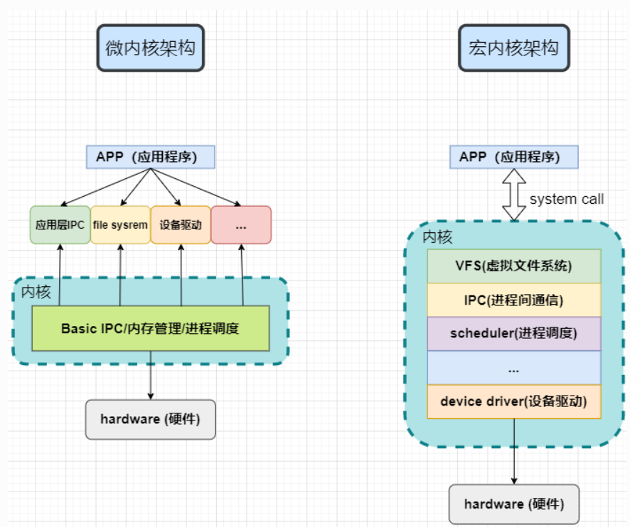
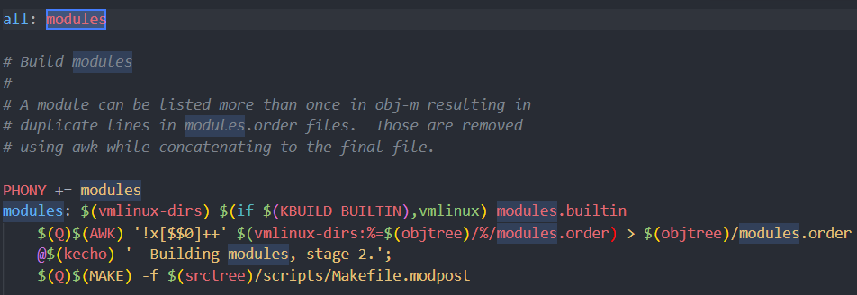
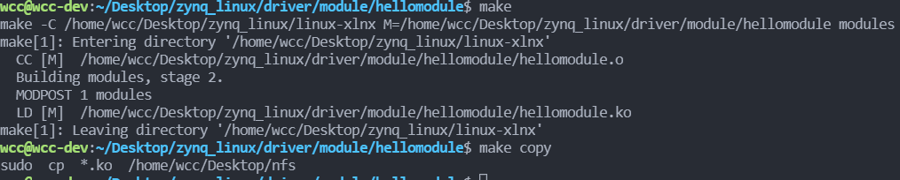
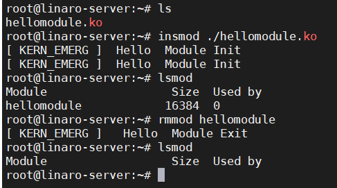

## 1. 内核模块的基本概念
在前面的博客当中记录了如何在ZYNQ上移植Linux，移植好Linux之后，就可以来学一学怎么进行嵌入式的开发了。这种比较传统的linux的学习方式的通用性应该比使用petalinux要好多了。
* 宏内核：关键功能和服务功能均在内核空间提供
    - 运行效率高
    - 扩展性较差
* 微内核：内核空间只提供关键功能，服务功能在用户空间提供
    - 运行效率较低
    - 安全性、扩展性较高


<!--more-->
内核模块编译完成之后将会得到一个后缀名为.ko的文件，该文件能够在linux系统上被加载，从而扩展内核的功能。
### 1.1 内核模块加载/卸载
- 使用insmod命令加载
- 使用rmmod命令卸载
在linux系统上使用这两个命令就能够完成内核模块的加载和卸载了。
### 1.2 内核模块源码的基本结构
#### 内核模块入口/出口
在设计内核模块的时候，在内核模块当中会有一个入口函数和一个推出函数，这两个函数分别为：
- module_init()：加载模块式该函数自动执行，进行初始化操作
- module_exit()：卸载模块时函数自动执行，进行清理操作
在加载和卸载内核模块的时候，会通过这个内核模块的入口和出口自动地进行初始化和推出清理操作。
#### 内核模块信息声明
一个内核模块的源文件除了函数的入口和出口外，还有一些模块的声明信息。
- MODULE_LICENSE()：表示模块代码接受的软件许可协议，Linux内核遵循GPL V2开源协议，内核模块与linux内核保持一致即可。
- MODULE_AUTHOR()：描述模块的作者信息
- MODULE_DESCRIPTION()：对模块的简单介绍
- MODULE_ALIAS()：给模块设置一个别名

## 2. 基础的内核模块"Hello world"
在学习内核模块之前，先从一个最基础的内核模块开始。遵循前面的内核模块的基本的概念，可以设计一个基础的内核模块，其源码如下：
```c
#include <linux/module.h>
#include <linux/init.h>
#include <linux/kernel.h>

static int __init hello_init(void)
 {
    printk(KERN_EMERG "[ KERN_EMERG ]  Hello  Module Init\n");
    printk(KERN_EMERG "[ KERN_EMERG ]  Hello  Module Init\n");
    return 0;
}

static void __exit hello_exit(void)
{
    printk(KERN_EMERG "[ KERN_EMERG ]   Hello  Module Exit\n");
}

module_init(hello_init);
module_exit(hello_exit);

MODULE_LICENSE("GPL2");
MODULE_AUTHOR("wcc ");
MODULE_DESCRIPTION("hello world module");
MODULE_ALIAS("test_module");
```
可以看到这个内核模块的源码还是比较简单的，首先从内核模块的入口开始，可以看到在module_init()和module_exit()函数当中有一个初始化函数和推出函数，在内核模块进行初始化和退出的时候将会执行这两个函数。

在函数`hello_init()`和函数`hello_exit()`当中使用了`printk()`函数，该函数实现的功能和`printf()`类似，但是这是内核空间当中能够用来提供打印信息的的函数，`printf()`不能作用于内核空间。
使用`printk()`函数的时候，需要指定打印信息的等级。数字越低，打印的优先级也就越高。

    #define KERN_EMERG 	"<0>" 通常是系统崩溃前的信息
    #define KERN_ALERT          "<1>" 需要立即处理的消息
    #define KERN_CRIT             "<2>" 严重情况
    #define KERN_ERR              "<3>" 错误情况
    #define KERN_WARNING   "<4>" 有问题的情况
    #define KERN_NOTICE       "<5>" 注意信息
    #define KERN_INFO            "<6>" 普通消息
    #define KERN_DEBUG        "<7>" 调试信息

可以使用`cat /proc/sys/kernel/printk`来查看当前终端当中的控制台的打印等级。消息级别低于当前控制台打印等级的将不会被打印。

## 3. 编译内核模块
有了内核模块的源码了，接下来就可以编译内核模块了。可以使用一个Makefile来编译这个内核模块，Makefile的内容如下：
```Makefile
KERNEL_DIR=/home/wcc/Desktop/zynq_linux/linux-xlnx

ARCH=arm
CROSS_COMPILE=arm-linux-gnueabihf-
export  ARCH  CROSS_COMPILE

obj-m := hellomodule.o
all:
	$(MAKE) -C $(KERNEL_DIR) M=$(CURDIR) modules

.PHONE:clean copy

clean:
	$(MAKE) -C $(KERNEL_DIR) M=$(CURDIR) clean	

copy:
	sudo  cp  *.ko  /home/wcc/Desktop/nfs
```
首先KERNEL_DIR指定内核源码所在的目录，之所以指定这个目录是因为在编译内核模块的时候，需要使用到内核源码下的Makefile工具。

然后制定了目标期间的架构和交叉编译工具，这个就是ZYNQ使用的就行了，在移植Linux的时候也使用的这两个。
在目标文件当中，使用系统的Make工具来进行编译。
选项"-C"：让make工具跳转到linux内核目录下读取顶层Makefile。
M=：表示内核模块源码目录。
然后在内核模块的源码所在的Makefile目录下执行`make`命令就能够编译出内核模块了。


## 4. ZYNQ上加载和卸载内核模块
编译好内核模块之后，就可以将内核模块拷贝到zynq上运行着的linux系统上了。然后使用insmod和rmmod就能够执行内核模块的加载和卸载了。

可以看到使用`insmod`加载内核模块的时候在终端上打印出了全面在内核模块源码当中设置的信息。
加载完内核模块之后，可以使用`lsmod`命令查看当前的系统中的模块，可以看到当前有一个hellomodule。
然后可以使用`rmmod`卸载模块，在卸载模块的时候，也答应除了设置的信息。
