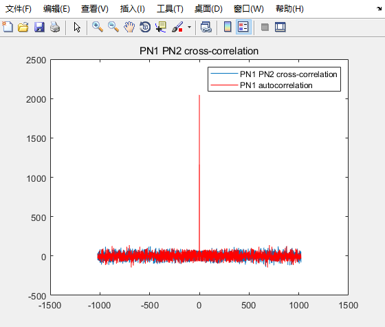
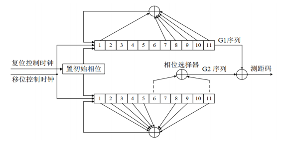
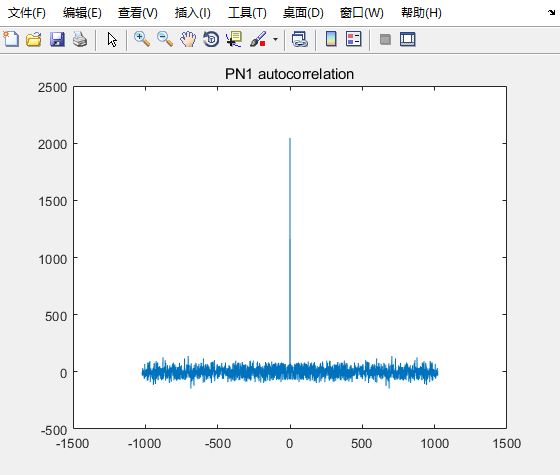

# 1.北斗信号服务
北斗系统具备导航定位和通信数传两大功能，提供其中服务。具体包括：面向全球范围，提供定位导航授时（RNSS）、全球短报文通信（GSMC）和国际搜救（SAR）三种服务；在中国及周边地区，提供星基增强（SBAS）、地基增强（GAS）、精密单点定位（PPP）和区域短报文通信（RSMC）四种服务。

<!--more-->
B1I 信号载波频率为 1561.098MHz，带宽为 4.092MHz，该信号在北斗二号和北斗三号的中圆地球轨道（MEO）卫星、倾斜地球同步轨道（IGSO）卫星和地球静止轨道（GEO）卫星上播发，提供公开服务。
在我学习的时候，主要使用到的是B1I上的信号，可以实现定位服务。

# 2. B1I信号的主要结构
B1I信号由“测距码+导航电文”调制在载波上构成，其信号表达式如下：
$$
s_{B1I}^{j}=A_{B1I}(t)C_{B1I}^{j}(t)D_{B1I}^{j}(t)cos(2\pi f_{1}t + \varphi_{B1I}^{j})
$$
上角标j表示使用的卫星编号，$A_{B1I}$表示振幅，$C_{B1I}$表示对应的测距码，$D_{B1I}$表示调制到B1I信号测距码上的数据码。$f_{1}$表示载波的频率。

## 2.1 测距码的组成
B1I 信号测距码，也称为伪随机码，码速率为2.046Mcps，码长为 2046。𝐶𝐵1𝐼码周期为(1s/2.046Mcps)\*2046 = 1ms。
B1I测距码又两对11级m序列构成(可以理解为伪随机序列)组成，其具体的结构如下图所示：

G1,G2序列的生成多项式如下：
$G1(X) = 1 + X + 𝑋^7 + 𝑋^8 + 𝑋^9 + 𝑋^{10} + 𝑋^{11}$
$G2(X) = 1 + X + 𝑋^2 + 𝑋^3 + 𝑋^3 + 𝑋^5 + X^8 + X^9 + 𝑋^{11}$
并且两个线性序列 G1 和G2 模二加（异或）产生平衡 Gold 码共 2047 比特后截断最后 1 码片生成。也可以理解为，当使用上面的结构产生PN码的时候，当生成了2046个PN码之后。将会对PN码生成器进行重置。
PN码生成器的初始值为：
**G1 序列初始相位：01010101010**
**G2 序列初始相位：01010101010**
从PN码生成器的结构中可以看到，在G2序列当中，需要提取其中两个相位的值来产生用于和G1序列进行异或，从而产生PN码。这个相位选择，是根据具体的选取的卫星来确定的，也就是说没一组卫星将会产生唯一的PN码。
常用的卫星组合如下表所示。比如卫星1号和3号，卫星1号和4号。每一组相位的选择会对应不同的PN码产生。
```c
BDB1ICAlist = [ 1  3;  1  4;  1  5;  1  6;  1  8;  1  9;  1 10;  1 11;  2  7; ...
                3  4;  3  5;  3  6;  3  8;  3  9;  3 10;  3 11;  4  5;  4  6; ...
                4  8;  4  9;  4 10;  4 11;  5  6;  5  8;  5  9;  5 10;  5 11; ...
                6  8;  6  9;  6 10;  6 11;  8  9;  8 10;  8 11;  9 10;  9 11; 10 11];
```

## 2.2 使用Matlab模拟PN码的生成
使用Matlab能够比较方便地来模拟PN码的生成理解上面的原理之后，实现起来还是比较简单的。主要就是根据伪随机码的生成规则来生成对应的PN码就可以了。

```matlab
function [pn_code, pn_code_sample] = PNCode_Gen(pn_code_len, samp_len, code_rate, samp_rate, pn_index)
%Generate standard PN code and modulation source data into pn code
%   pn_code: standard pn code, data rate is at the standard code rate of 2.046Mcps
%   pn_code_sample: the data modulated into pn code, data rate is sample rate
%   pn_code_len: the input standard code length of PN Code 2046
%   samp_len : the actual sample length
%   code rate: standard chip rate 2.046Mcps
%   samp_rate: sampling rate
%   pn_index: select which satellites to generate the PN Code

    % BeiDou B1I G2 chip Phase assignment table
    BDB1ICAlist = [ 1  3;  1  4;  1  5;  1  6;  1  8;  1  9;  1 10;  1 11;  2  7; ...
                    3  4;  3  5;  3  6;  3  8;  3  9;  3 10;  3 11;  4  5;  4  6; ...
                    4  8;  4  9;  4 10;  4 11;  5  6;  5  8;  5  9;  5 10;  5 11; ...
                    6  8;  6  9;  6 10;  6 11;  8  9;  8 10;  8 11;  9 10;  9 11; 10 11];

    code = zeros(1, pn_code_len);   % the temp pn_code array
    g1 = [0 1 0 1 0 1 0 1 0 1 0];   % g1 initial phase
    g2 = [0 1 0 1 0 1 0 1 0 1 0];   % g2 initial phase

    p1 = BDB1ICAlist(pn_index, 1);  % g2 chip assignment 1
    p2 = BDB1ICAlist(pn_index, 2);  % g2 chip assignment 2

    % Chip B1I Generator
    for i=1:pn_code_len
        % generate the final data from gold squence
        g1_out = g1(11);
        g2_out = bitxor(g2(p1), g2(p2));
        code(i) = bitxor(g1_out, g2_out);

        % gold squence feedback
        g1_feed = bitxor(bitxor(bitxor(bitxor(bitxor(g1(1),g1(7)),g1(8)),g1(9)),g1(10)),g1(11));
        g2_feed = bitxor(bitxor(bitxor(bitxor(bitxor(bitxor(bitxor(g2(1),g2(2)),g2(3)),g2(4)),g2(5)),g2(8)),g2(9)),g2(11));

        % shift the register
        g1(2:11) = g1(1:10);
        g2(2:11) = g2(1:10);
        g1(1) = g1_feed;
        g2(1) = g2_feed;
        if(i == pn_code_len)
            g1 = [ 0 1 0 1 0 1 0 1 0 1 0 ];%g1 initial phase
            g2 = [ 0 1 0 1 0 1 0 1 0 1 0 ];%g2 initial phase
        end
    end
    % turn bit 0 to -1 for a easy way to generate bpsk signal
    code(code==0) = -1;
    pn_code = code;

    % Generate pn code samples, data rate is sample rate
    % when generate real pn code samples, the sample rate 
    % is times of pn_code rate, so the pn_code samples should repeat
    % for example£º the pn_code rate is 2.046Mcps, the Sample rate is 8.184Mcps
    % The standard PN Code is   1   2   3   4   5   ...
    % The PN_code samples is    11112222333344445555...
    pn_sample_len = round(pn_code_len*(samp_rate/code_rate));   % 1 PN Code in sample rate
    pn_sample_index = ceil((code_rate/samp_rate)*(1:pn_sample_len)); % 1 PN Code samples index
    
    % generate real signal samples
    samp_cnt = 1;
    samp_index = zeros(1, samp_len);
    for i=1:samp_len % real signal sample length
        samp_index(i) = pn_sample_index(samp_cnt);
        % 1 PN Code sample is finished, repeat PN Code
        if(samp_cnt == pn_sample_len)
            samp_cnt = 0;
        end
        samp_cnt = samp_cnt + 1;
    end

    pn_code_sample = pn_code(samp_index);
end
```

# 3.相关
对于一个随机序列，其具有良好的自相关性，一个序列的自相关函数的定义如下：
$$R_{x}(\tau)=\lim_{T\rightarrow \infty }\int_{0}^{T}x(t)x(t-\tau )dt$$自相关函数从形式上来看有点类似与卷积的形式，简单来理解就是对于一个随机序列，对其进行自相关，也就相当于将这个函数进行滑动想成再求和，在这个过程当中，会出现一个相关的峰值，也就是当两个序列完全重合的时候会达到这个峰值。
在北斗卫星系统的B1I信号中，PN码是一种特殊的码，它具有良好的自相关性，并且该码是可以认为规定的周期序列，且能够较好地满足随机序列的分布特性。
使用PN码的另一个好处就是，它具有良好的自相关性，因此在发送端对原始的信号进行PN码调制，在接受端对接受到的信号进行PN码自相关，这样能够将原始的信号得到一个明显的增益，从而能够将原始信号从信号中提取出来。

为了能够演示PN码的自相关性和互相关性，可以对前面实现的PN码函数进行简单的测试，测试其自相关性和互相关性。其matlab测试代码如下：
```matlab
clc;
clear all;
close all;

PN_CODE_LEN = 2046;     % PN Code length
CODE_RATE   = 2.046e6;  % standard pn code rate
SAMP_RATE   = CODE_RATE*4; % sample rate
SAMP_LEN    = (SAMP_RATE/CODE_RATE)*PN_CODE_LEN;
PN_INDEX1   = 8 ;       % choose satellites 
PN_INDEX2   = 10;       % choose satellites 


% generate 1 PN code, and response samples
[pn1, pn1_sample] = PNCode_Gen(PN_CODE_LEN, SAMP_LEN, CODE_RATE, SAMP_RATE, PN_INDEX1);
[pn2, pn2_sample] = PNCode_Gen(PN_CODE_LEN, SAMP_LEN, CODE_RATE, SAMP_RATE, PN_INDEX2);

% autocorrelation test
pn1_r = pn1;
pn1_shift = [pn1(1024:end), pn1(1:1023)];
pn1_autocorrelation = zeros(1, PN_CODE_LEN);

for i = 1:PN_CODE_LEN
    pn1_autocorrelation(i) = sum(pn1_shift .* pn1_r);
    pn1_shift = [pn1_shift(2:end), pn1_shift(1)];
end

figure(1);
plot(-1023:1:1022, pn1_autocorrelation);
title("PN1 autocorrelation")

% cross-correlation test
pn2_shift = [pn2(1024:end), pn2(1:1023)];
pn1_pn2_cross_correlation = zeros(1,PN_CODE_LEN);
for i = 1:PN_CODE_LEN
    pn1_pn2_cross_correlation(i) = sum(pn2_shift .* pn1_r);
    pn2_shift = [pn2_shift(2:end), pn2_shift(1)];
end

figure(2);
plot(-1023:1:1022, pn1_pn2_cross_correlation);
hold on;
plot(-1023:1:1022, pn1_autocorrelation, '-r');
legend('PN1 PN2 cross-correlation','PN1 autocorrelation');
title("PN1 PN2 cross-correlation");

% sample autocorrelation test
pn1_sampe_r = pn1_sample;
pn1_sample_shift = [pn1_sample(4092:end), pn1_sample(1:4091)];
pn1_sample_autocorrelation = zeros(1, PN_CODE_LEN);

for i = 1:SAMP_LEN
    pn1_sample_autocorrelation(i) = sum(pn1_sample_shift .* pn1_sampe_r);
    pn1_sample_shift = [pn1_sample_shift(2:end), pn1_sample_shift(1)];
end

figure(3);
plot( -4092:1:4091 ,pn1_sample_autocorrelation);
title("PN1 sample autocorrelation")
```
首先可以看标准的PN码自相关的结果，如下图所示：

可以看到，PN码自相关的结果，只有一个比较明显的峰值。
然后我们可以看看不同PN码之间进行互相关的结果：

最后我们可以看以下，实际采样得到的PN码的采样点的自相关结果：
