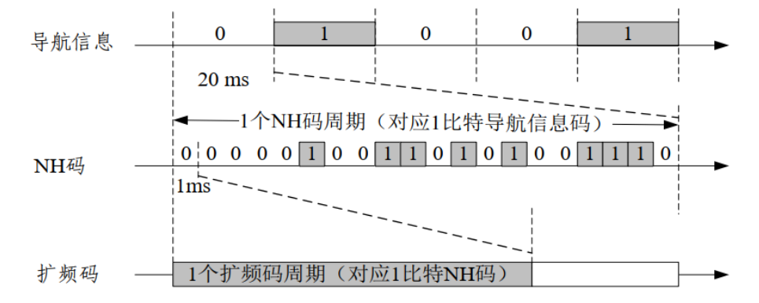
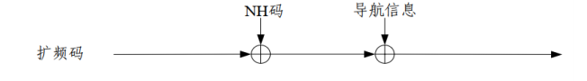
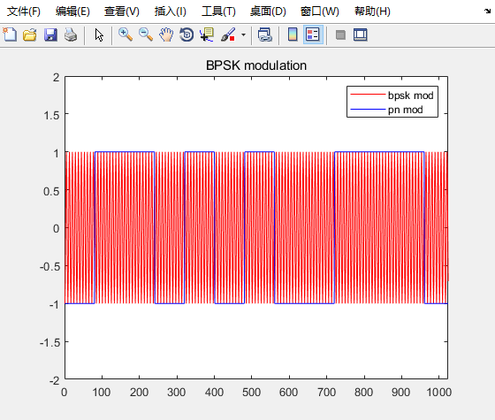
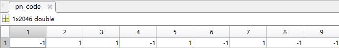
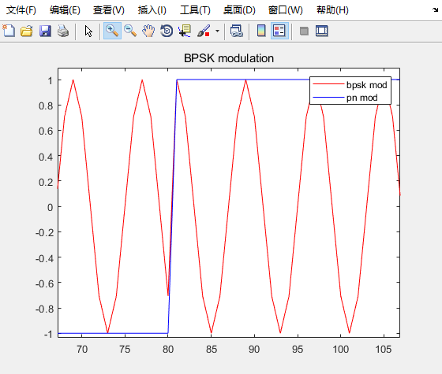

# 1. 数据码
在前面的博客中，学习了PN码是个什么玩意儿，并且学习了如何来进行相关等操作。今天将会学习在卫星定位系统中更高一层次的东西，也就是数据码。数据码也就是导航电文，导航电文提供了用于定位的最基础的信息。
根据速率和结构不同，导航电文分为 **D1** 导航电文和 **D2** 导航电文。**D1** 导航电文速率为 **50bps** ，内容包含基本导航信息（本卫星基本导航信息、全部卫星历书信息、与其他系统时间同步信息；**D2** 导航电文速率为 **500bps** ，内容包含基本导航信息和广域差分信息（北斗系统的差分及完成性信息和格网点电离层信息）。
<!--more-->
## 1.1 D1导航电文的基本结构
**D1**导航电文在实际使用的时候，首先需要经过一个**NH码**调制，也就是说，**D1**导航电文当中的每一个bit，都需要使用**NH码**进行调制，也就是对应的bit和NH码进行异或。
**D1** 导航电文的速率是 **50bps** ,也即 **D1** 导航电文的bit周期是 **20ms**。 **NH码**的周期也就是刚好是 **D1**导航电文一个bit周期。 **NH码**为20bit： **00000100110101001110** 。
从上面可以看到 **NH码**的一个bit周期是1ms，这也正好与前面学习的一个 **PN码** 的周期是相同的，所以  **NH码**的每一个bit都可以使用 **PN码**进行调制。因此D1导航电文的调制层次如下图所示：

扩频码首先与NH码进行异或进行一次调制，调制之后的结果需要和D1导航电文进行异或进行一个二次调制。
也可以看到调制的速率的变化情况：D1导航电文50bps ----> NH码调制1Kbps ----> PN码调制2.046Mbps。


# 2. 使用matlab模拟D1导航电文的BPSK调制
有了上面的D1导航电文的基本的调制层次。接下来就可以使用matlab来简单的仿真一下这个调制的过程了，其实也还算比较简单，需要弄清楚D1导航电文调制的三个层次就很简单了。PN码在前面的博客当中已经实现了，在这里只需要使用NH码调制调制和最终的BPSK调制就好了。
```matlab
clc;
clear all;
close all;

PN_CODE_LEN = 2046;     % PN Code length
CODE_RATE   = 2.046e6;  % standard pn code rate
SAMP_RATE   = CODE_RATE*8; % sample rate
PN_INDEX1   = 8 ;       % choose satellites 
PN_INDEX2   = 10;       % choose satellites 
SOURCE_DATA_NUM = 10;   % source data number
NH_CODE_LEN = 20;       % NH code length 20bit
PN_SAMP_LEN = (SAMP_RATE/CODE_RATE)*PN_CODE_LEN*NH_CODE_LEN*SOURCE_DATA_NUM;

% generate source data
source_data = rand(1,SOURCE_DATA_NUM); % 10 test datas
source_data(source_data < 0.5) = -1;
source_data(source_data >= 0.5) = 1;
source_data = repelem(source_data, 1, NH_CODE_LEN); % upsample D1 signal source to NH code modulated rate 1Kbps

% NH code
nh_code = [0 0 0 0 0 1 0 0 1 1 0 1 0 1 0 0 1 1 1 0];
nh_code = repmat(nh_code, SOURCE_DATA_NUM);     % 10bit D1 source data needs 10 PN code
nh_code(nh_code == 0) = -1;

% NH code modulation
nh_mod = source_data .* nh_code; % using .* instead of xor

% upsample to sample rate
nh_mod = repelem(nh_mod, 1, (SAMP_RATE/CODE_RATE)*PN_CODE_LEN);

% generate PN code 
[pn_code, pn_code_sample] = PNCode_Gen(PN_CODE_LEN, PN_SAMP_LEN, CODE_RATE, SAMP_RATE, PN_INDEX1);

% PN code modulation
pn_mod = nh_mod .* pn_code_sample;  % using .* instead of xor

% generate carrier wave lut, using lut
AMP = 1;
ROM_DEEPTH = 4096;
CARRIER_FREQ = CODE_RATE;   % carrier wave frequency
FREQ_CTRL_WORLD = CARRIER_FREQ * 2^32 / SAMP_RATE; % frequency control world

rom_addr = 0: 1/ROM_DEEPTH : 1-1/ROM_DEEPTH;
carrier_wave = AMP*cos(2*pi*rom_addr);  % carrier wave lut

% bpsk modulation
bpsk_mod = zeros(1,PN_SAMP_LEN);
rom_index = 1;
phase_accumulator = 0;


for i=1:PN_SAMP_LEN
    % bpsk modulation
    if(pn_mod(i) == -1)
        bpsk_mod(i) = -carrier_wave(rom_index);
    else
        bpsk_mod(i) = carrier_wave(rom_index) ;
    end

    phase_accumulator = phase_accumulator + FREQ_CTRL_WORLD;
    % phase accumulator has accumulator over 1 period
    if(phase_accumulator > 2^32)
        phase_accumulator = phase_accumulator - 2^32;
    end

    % get the rom_index to generate wave through LUT
    rom_index = round(phase_accumulator/2^20);
    if(rom_index == 0)
        rom_index = 1;
    end
end

% plot the result
figure(1);
plot(1:1024, bpsk_mod(1:1024), 'r', 1:1024, pn_mod(1:1024),'b');
axis([0, 1024, -2, 2]);
legend('bpsk mod', 'pn mod');
title("BPSK modulation");
```
调制的结果如下图所示：

标准的PN码数据如下：

最终调制的具体的结果如下图所示：

可以看到，在不同的符号下，使用到的波形的相位是不同的。