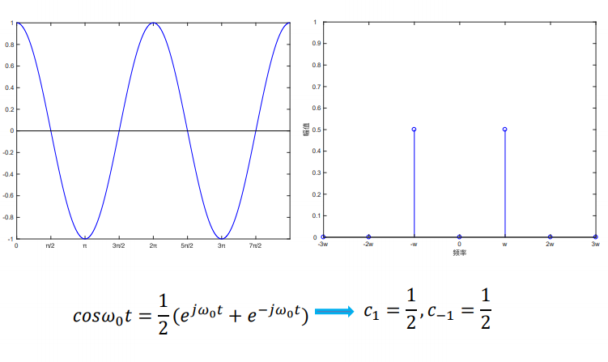
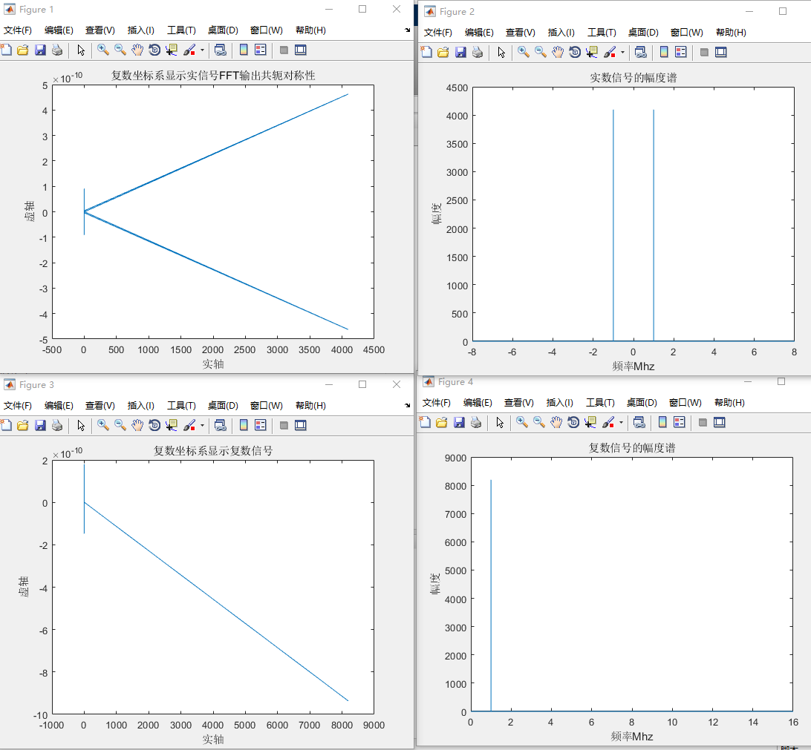

在之前学习的时候，也有记录过如何数字信号处理的一些基础的知识，专栏的链接如下：
[数字信号处理专栏](https://blog.csdn.net/qq_41332806/category_10345521.html?spm=1001.2014.3001.5482)。
感觉数字信号处理这些东西，每过一段时间最好还是回去好好温习一下，有些东西很长时间不用很容易就忘掉了。
今天主要是记录一下FFT的使用方法，在实际的使用的时候，虽然不一定需要自己去实现一个FFT的算法，在FPGA内部使用提供好的IP核就能够完成这些操作了。但是一些最基础的知识最好还是需要自己来掌握的。
<!--more-->
## 1. 实信号和复信号的频谱的区别
简单来说，通过欧拉公式能够建立起实数和复数信号之间的联系。
对于实数信号，其在频域上的表现形式是在包含正负频率分量，以一个正弦信号为例，在正的频率处和负频率处都有频率分量。而对于复数信号，频率分量可以是只包含正的频率分量和负的频率分量。

可以使用一段matlab代码来帮助理解。
```m
% parameter define
fc = 1e6;   % tone frequency
fs = 16e6;  % sample rate
N = 8192;   % samples in total
df = fs/N;  % frequency resolution
n = 0:(N-1);    

i_data = cos(2*pi*fc*n/fs);
q_data = sin(2*pi*fc*n/fs);

% generate a real signal
iq_real = complex(i_data, 0);

% using fft to analyse siganl
fft_real_signal = fft(iq_real);
abs_fft_real_signal = abs(fft(iq_real));
figure(1);
plot(real(fft_real_signal), imag(fft_real_signal));
title('复数坐标系显示实信号FFT输出共轭对称性');
ylabel('虚轴');
xlabel('实轴');

% change the x lable into MHz, for both side
% the real signal have both negative and postive frequency
x_index = 0:N-1;
x_index(x_index >= N/2) = x_index(x_index >= N/2) - N;
x_index = x_index.*df/1e6;
figure(2);
plot(x_index, abs_fft_real_signal);
title('实数信号的幅度谱');
ylabel('幅度');
xlabel('频率Mhz');

% generate a complex signal
iq_complex = complex(i_data, q_data);
% using fft to analyse siganl
fft_complex_signal = fft(iq_complex);
abs_fft_complex_signal = abs(fft(iq_complex));
figure(3);
plot(real(fft_complex_signal), imag(fft_complex_signal));
title('复数坐标系显示复数信号');
ylabel('虚轴');
xlabel('实轴');

% change the x lable into MHz, for both side
% the real signal have both negative and postive frequency
x_index = 0:N-1;
x_index = x_index.*df/1e6;
figure(4);
plot(x_index, abs_fft_complex_signal);
title('复数信号的幅度谱');
ylabel('幅度');
xlabel('频率Mhz');
```
