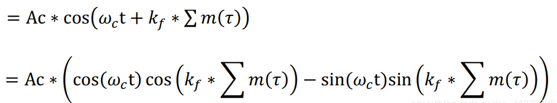

## FM 调制的原理
FM调制在之前已经实现过了，从原理上来说还是比较简单的，但是之前一直没有时间来记录一下，今天刚好在自己的实验平台上来了基于HDL的FM的调制。
关于FM的调制解调的原理在之前的一篇博客当中已经有介绍了，具体可以看
***[FM 调制解调原理](https://blog.csdn.net/qq_41332806/article/details/111311196)。***
FM已调信号的格式如下：
<!--more-->

可以看到对于FM已调信号如果使用三角公式进行展开之后的形式是非常喜人的，因为这种结构刚好是正交信号的形式，分别对应信号的I、Q两路。这个可以使用AD936x的时候能够很方便的实现了。
## FM调制的实现
从上面的FM的公式上可以看到，在使用AD936x进行这种FM信号的调制的时候，只需要将基带信号和调频灵敏度相乘之后进行求累加和，然后可以注意到这个求出的累加和是作为余弦或者正弦的相位的，因此在FPGA当中可以使用两个ROM分别存储一个周期的正弦波和余弦波，然后再将求得的累加和作为地址去从ROM中读取数据，就能够完成基带信号的生成了，接下来需要做的就是将该信号送给AD936x进行发送就可以了。
```verilog
// -----------------------------------------------------------------------------
// Copyright (c) 2019-2021 All rights reserved
// -----------------------------------------------------------------------------
// Author 	 : WCC 1530604142@qq.com
// File   	 : fm_mod.v
// Create 	 : 2021-07-07
// Revise 	 : 2021-
// Editor 	 : Vscode, tab size (4)
// Functions : fm modulation module
// 			   
// -----------------------------------------------------------------------------
module fm_mod(
    input   wire            clk         ,
    input   wire            rst_n       ,
    //====================================================
    // baseband data and valid signal
    //====================================================
    input   wire            src_valid     ,
    input   wire  [15:0]    bband_data  ,
    //====================================================
    // data put into ad936x
    //====================================================
    output  wire            dac_valid   ,
    output  wire  [11:0]    dac_data_i  ,
    output  wire  [11:0]    dac_data_q
);

//====================================================
//parameter define
//====================================================
parameter   DELAT_FRE = 75000;  // maximum frequency offset
parameter   AM = (1<<15);       // maximum amplitude of baseband signals
parameter   FS = 16_000_000;    // sampling frequency
parameter   DATAWIDTH   = 32 ;  // the data width of the phase 
localparam  KF = 16'd614;       // FM sensitivity ,(Maxmum angle frequncy offest)/（Maxmum baseband AMP)

//====================================================
// internal signals and registers
//====================================================
wire    [31:0]  mult_data   ;
reg             mult_valid    ;

reg     [31:0]  sum_data      ;
reg             sum_valid     ;

reg     [31:0]  sum_data_r      ;
reg             sum_valid_r     ;

reg     [9:0]   rom_addr      ;
reg             addr_valid    ;

reg             dac_data_valid ;

assign  dac_valid = dac_data_valid;

//----------------valid signal------------------
always @(posedge clk or negedge rst_n) begin
    if (rst_n == 1'b0) begin
        mult_valid <= 1'b0;
        sum_valid <= 1'b0;
        sum_valid_r <= 1'b0;
        addr_valid<= 1'b0;
        dac_data_valid <= 1'b0;
    end
    else  begin
        mult_valid <= src_valid;
        sum_valid <= mult_valid;
        sum_valid_r <= sum_valid;
        addr_valid <= sum_valid_r;
        dac_data_valid <= addr_valid;
    end
end

// Kf*m(t)
mult_gen u_mult_gen (
  .CLK(clk),  // input wire CLK
  .A(KF),      // input wire [15 : 0] A
  .B(bband_data),      // input wire [15 : 0] B
  .P(mult_data)      // output wire [31 : 0] P
);

//----------------sum_data------------------
always @(posedge clk or negedge rst_n) begin
    if (rst_n == 1'b0) begin
        sum_data <= 'd0;
    end
    else if (mult_valid == 1'b1) begin
        sum_data <= sum_data + mult_data;
    end
    else  begin
        sum_data <=  sum_data;
    end
end


//----------------sum_data_r------------------
always @(posedge clk or negedge rst_n) begin
    if (rst_n==1'b0) begin
        sum_data_r <= 'd0;
    end
    else if (sum_data[31] == 1'b1) begin
        sum_data_r <= sum_data + (1<<32);
    end
    else begin
        sum_data_r <= sum_data;
    end
end

//----------------rom_addr------------------
always @(posedge clk or negedge rst_n) begin
    if (rst_n == 1'b0) begin
        rom_addr <= 'd0;
    end
    else if (sum_valid_r == 1'b1) begin
        rom_addr <= sum_data_r[31:22];
    end
    else  begin
        rom_addr <=  rom_addr;
    end
end

rom_cos u_rom_cos (
  .clka(clk),    // input wire clka
  .addra(rom_addr),  // input wire [9 : 0] addra
  .douta(dac_data_i)  // output wire [11 : 0] douta
);

rom_sin u_rom_sin (
  .clka(clk),    // input wire clka
  .addra(rom_addr),  // input wire [9 : 0] addra
  .douta(dac_data_q)  // output wire [11 : 0] douta
);

endmodule       

```
## 3. 音频数据源的获取
FM调制需要使用一个音频数据源，在这里就要使用到之前的博客当中写到的东西了
[ZYNQ读取PCM文件](https://black-pigeon.github.io/2021/07/06/2021.7/ZYNQ-%E8%AF%BB%E5%8F%96PCM%E6%96%87%E4%BB%B6%E5%B9%B6%E6%92%AD%E6%94%BE/)
在AXI读取内存的时候还是按照之前的办法进行读取就可以了，只是需要主要输出的信号的valid信号需要按照AD936x LVDS 1r1t模式所支持的方式来进行变化就好。
