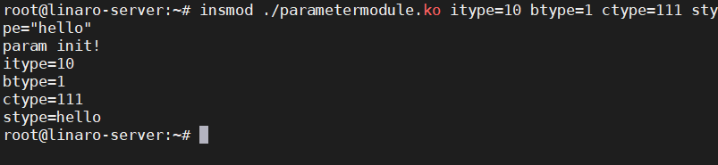
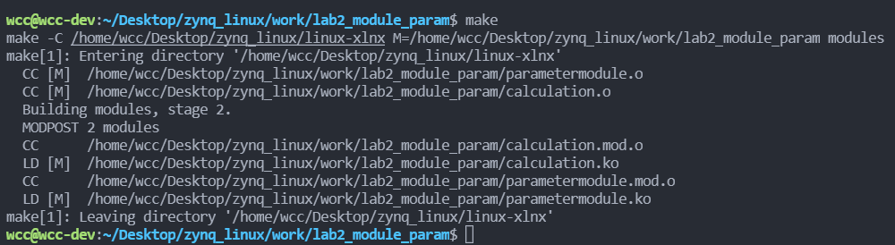
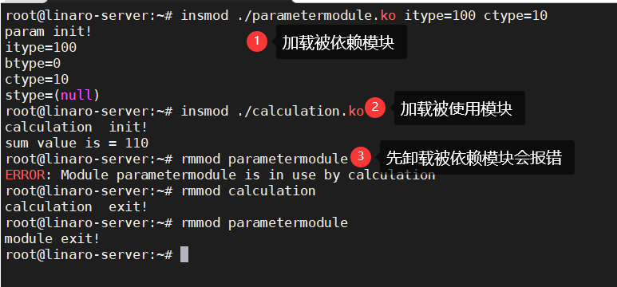
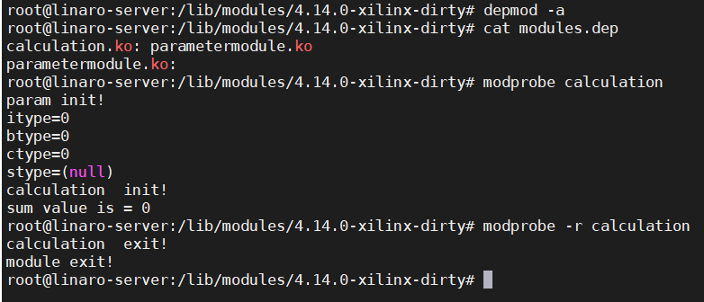

## 1. 内核模块参数
在前面的学习了如何来编译一个最基础的内核模块。了解了一个内核模块在源码当中的表现形式是什么样的。在内核模块当中可以进行参数的传递。比如在加载内核模块给内核模块指定参数，这样内核模块就能根据传递的参数来进行工作了。
使用模块参数的时候需要使用到一个模块参数的宏。
`module_param(name, type, perm)`
- name：参数名
- type：参数类型，如int、byte、bool、charp...
- perm：读写权限
<!--more-->
模块参数的使用比较简单，先定义一个简单的变量，然后将这个变量名作为`module_param()`的第一个变量进行声明就可以得到一个模块参数。
一个简简单单的例子如下：
```c
#include <linux/module.h>
#include <linux/init.h>
#include <linux/kernel.h>

static int itype=0;
module_param(itype,int,0);

static bool btype=0;
module_param(btype,bool,0700);

static char ctype=0;
module_param(ctype,byte,0);

static char  *stype=0;
module_param(stype,charp,0644);

static int __init param_init(void)
{
    printk(KERN_ALERT "param init!\n");
    printk(KERN_ALERT "itype=%d\n",itype);
    printk(KERN_ALERT "btype=%d\n",btype);
    printk(KERN_ALERT "ctype=%d\n",ctype);
    printk(KERN_ALERT "stype=%s\n",stype);
    return 0;
}

static void __exit param_exit(void)
{
 printk(KERN_ALERT "module exit!\n");
}

module_init(param_init);
module_exit(param_exit);

MODULE_LICENSE("GPL2");
MODULE_AUTHOR("wcc");
MODULE_DESCRIPTION("module_param");
MODULE_ALIAS("module_param");
```
然后执行一下Makefile，Makefile的内容和之前的类似。
```Makefile
KERNEL_DIR=/home/wcc/Desktop/zynq_linux/linux-xlnx

ARCH=arm
CROSS_COMPILE=arm-linux-gnueabihf-
export  ARCH  CROSS_COMPILE

obj-m :=  parametermodule.o
all:
	$(MAKE) -C $(KERNEL_DIR) M=$(CURDIR) modules

.PHONE:clean copy

clean:
	$(MAKE) -C $(KERNEL_DIR) M=$(CURDIR) clean	

copy:
	sudo  cp  *.ko  /home/wcc/Desktop/nfs
```
编译完成之后，将.ko文件拷贝到开发板上，然后进行模块的加载。
在加载的时候可以对该模块进行传参。比如：
```bash
insmod ./parametermodule.ko itype=10 btype=1 ctype=111 stype="hello"
```

可以看到，向模块传递的参数被成功地打印出来了。

## 符号共享
在内核模块当中，可以将某些变量和函数导出为符号，这样就能够实现在不同地模块当中使用这些函数和变量了。将函数和变量导出为符号地方式为使用以下函数：
`EXPORT_SYMBOL(sym)`
其中sym就是要导出的变量或者函数。
还是在刚刚的文件当中，将变量itype,ctype进行导出，于此同时设计一个简单的函数并导出。
```c
#include <linux/module.h>
#include <linux/init.h>
#include <linux/kernel.h>

static int itype=0;
module_param(itype,int,0);

static bool btype=0;
module_param(btype,bool,0700);

static char ctype=0;
module_param(ctype,byte,0);

static char  *stype=0;
module_param(stype,charp,0644);

static int __init param_init(void)
{
    printk(KERN_ALERT "param init!\n");
    printk(KERN_ALERT "itype=%d\n",itype);
    printk(KERN_ALERT "btype=%d\n",btype);
    printk(KERN_ALERT "ctype=%d\n",ctype);
    printk(KERN_ALERT "stype=%s\n",stype);
    return 0;
}

static void __exit param_exit(void)
{
    printk(KERN_ALERT "module exit!\n");
}
// 导出符号
EXPORT_SYMBOL(itype);
EXPORT_SYMBOL(ctype);

 int func_add(int a, int b)
  {
    return a+b;
 }
//导出函数
EXPORT_SYMBOL(func_add);

module_init(param_init);
module_exit(param_exit);

MODULE_LICENSE("GPL2");
MODULE_AUTHOR("embedfire ");
MODULE_DESCRIPTION("module_param");
MODULE_ALIAS("module_param");
```
在上面这个内核模块当中导出了两个变量和一个函数，如果我们想要在其他的内核模块当中使用这个模块导出的变量和函数，我们只需要在其他模块当中包含这些符号就可以了。

#### 其他模块头文件
```c
#ifndef __CALCULATION_H__
#define __CALCULATION_H__

extern int  itype;
extern char ctype;
int func_add(int a, int b);

#endif
```

#### 其他模块源文件
```c
#include <linux/module.h>
#include <linux/init.h>
#include <linux/kernel.h>

#include "calculation.h"

static int __init calculation_init(void)
 {
    printk(KERN_ALERT "calculation  init!\n");
    printk(KERN_ALERT "sum value is = %d\n", func_add(itype, ctype));    
    return 0;
 }

 static void __exit calculation_exit(void)
{
 printk(KERN_ALERT "calculation  exit!\n");
}


module_init(calculation_init);
module_exit(calculation_exit);

MODULE_LICENSE("GPL2");
MODULE_AUTHOR("wcc");
MODULE_DESCRIPTION("calculation module");
MODULE_ALIAS("calculation_module");
```
由于这两个模块存在一个依赖关系，因此在Makefile当中也需要进行更改，这样才能够正确地编译模块。
```Makefile
KERNEL_DIR=/home/wcc/Desktop/zynq_linux/linux-xlnx

ARCH=arm
CROSS_COMPILE=arm-linux-gnueabihf-
export  ARCH  CROSS_COMPILE

# 注意模块的依赖关系
obj-m := parametermodule.o calculation.o 

all:
	$(MAKE) -C $(KERNEL_DIR) M=$(CURDIR) modules

.PHONE:clean copy 

clean:
	$(MAKE) -C $(KERNEL_DIR) M=$(CURDIR) clean	

copy:
	sudo  cp  *.ko  /home/wcc/Desktop/nfs
```

编译完成之后，将会得到两个.ko文件，将这两个.ko文件拷贝到zynq开发板上，然后运行这两个内核模块。
由于这两个模块存在依赖关系，因此在加载和卸载模块的时候需要有一定的顺序。被依赖的模块在加载的时候需要先加载，被卸载的时候要后卸载，类似于出栈进栈的形似。


## 内核模块自动加载
前面这种加载模块必须要知道模块之间的依赖，按照顺序进行加载，比较不灵活，可以使用`modprobe`来自动确定模块间的依赖。

* 首先将所有内核模块统一放到"/lib/modules/内核版本"目录下
```bash
cp /lib/modules/4.14.0-xilinx-dirty
```
* 建立模块依赖关系
```bash
depmod -a
```
* 然后就可以查看建立起来的模块依赖
```bash
cat /lib/modules/4.14.0-xilinx-dirty/modules.dep
```
* 使用modprobe加载和卸载模块
```bash
modprobe xxx
modprobe -r xxx
```

