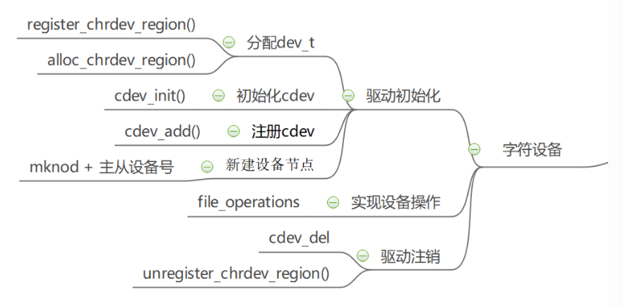
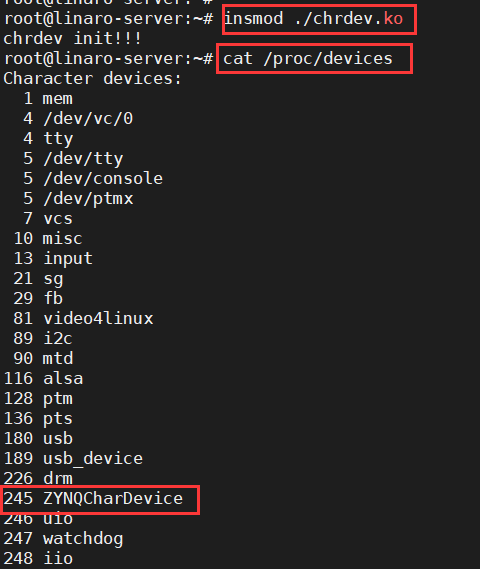
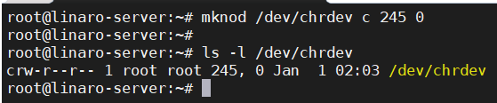
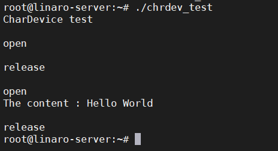
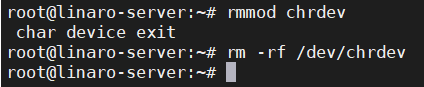

好久没有学习了，作为一个辣鸡程序员，写着自己都看不懂的辣鸡程序。还是要学习才行啊，做一个资料的搬运工。
## 1.字符设备驱动开发流程
其实这个东西我完全没弄懂，只能说照猫画虎地能够把程序跑起来，实际在linux内核里面做了些什么事，我也完全不知道。做一个在框架上耕耘的小蜜蜂。
<!--more-->
具体细节对于我这种初学者也就不去深究了，记录一下一个基本的字符设备的驱动的开发流程。然后在这个流程上慢慢补充添加东西就好了，一个基本的字符设备的开发流程如下图所示。

首先需要为这个驱动设备分配一个设备号，分配好设备号之后将该驱动设备和要执行的操作file_operation联系起来，然后将该设备添加到设备管理的哈希表当中，到这里就完成了设备的初始化操作。
初始化完成之后，在使用这个驱动的时候就可以调用open, read/write, close等函数来对设备进行基本的操作，这些操作也就时通过file_operation结构体当中指定的函数来决定的。
当要卸载驱动的时候，需要取消驱动设备的注册并将驱动设备删除。
这样就是整个字符设备驱动开发的一个流程了。
所以学习字符设备的驱动，其实也就是学习如何基于这个框架来设计代码。

## 2.字符设备开发流程中重要的函数与结构体
### 2.1 分配设备号
在进行字符设备的驱动初始化的时候，最先需要做的就是为字符设备分配一个设备号，在这一步可以采取动态分配或者静态分配的方式，一般采取动态分配会简单一点。
```c
/*
 * @param – dev	        : 分配得到的主设备号
 * @param - baseminor	: 次设备号起始值
 * @param - count	    : 次设备号的数量
 * @param - name	    : 设备的名称
 * @return			    : 0 成功;其他 失败
 */
int alloc_chrdev_region(dev_t *dev, unsigned baseminor, unsigned count, const char *name)
```
动态分配需要提供次设备号的数量和起始值，因为一个主设备下可以有多个次设备这些设备公用驱动。动态分配时还需要传入设备的名称，这样在生成的字符设备驱动当中就能够看到自己想要的名字了。还需要注意，该函数会返回分配得到的主设备号，这个主设备号在字符设备的初始化当中会多次使用到。

在内核中，dev_t用来表示设备编号，dev_t是一个32位的数，其中，高12位表示主设备号，低20位表示次设备号。
```c
#define MINORBITS    20
#define MINORMASK    ((1U << MINORBITS) - 1)

#define MAJOR(dev)   ((unsigned int) ((dev) >> MINORBITS))
#define MINOR(dev)   ((unsigned int) ((dev) & MINORMASK))
#define MKDEV(ma,mi) (((ma) << MINORBITS) | (mi))
```

### 2.2 字符设备初始化
```c
/*
 * @param – cdev	        : 驱动设备结构体指针
 * @param - file_operations	: 文件操作结构体
 * @return			        : NONE
 */
void cdev_init(struct cdev *cdev, const struct file_operations *fops)
```
在字符设备初始化的时候，需要指定一个文件操作结构体，这个文件操作结构体十分重要，它是后续操作这个字符设备的基础。在这里初始化的时候进行关联，在后续就能够通过驱动设备访问到该结构体当中的函数。

```c
struct file_operations {
   struct module *owner;
   loff_t (*llseek) (struct file *, loff_t, int);
   ssize_t (*read) (struct file *, char __user *, size_t, loff_t *);
   ssize_t (*write) (struct file *, const char __user *, size_t, loff_t *);
   long (*unlocked_ioctl) (struct file *, unsigned int, unsigned long);
   int (*open) (struct inode *, struct file *)
   int (*release) (struct inode *, struct file *);
};
```

### 2.3 添加设备到哈希表当中
```c
/*
 * @param – p	    : 指向字符设备结构体的指针
 * @param - dev	    : 用于指定设备的起始编号
 * @param - count	: 次设备号的数量
 * @return			: 0 成功;其他 失败
 */
int cdev_add(struct cdev *p, dev_t dev, unsigned count)
```

### 2.4 字符设备的操作
完成字符设备的初始化之后，就可以进行字符设备的操作了，这里就需要对前面的file_operations结构体进行天空了，需要使用那个功能就去实现对应的函数，然后将函数地址填进去就好了。

### 删除和卸载字符设备
当不需要使用字符设备的时，需要将驱动进行卸载和函数，这都比较好理解，卸载不需要的设备能够释放哈希表的空间。
```c
/*
 * @param – major	: 指定释放的主设备号
 * @param - name	: 卸载设备的名称
 * @return			: NONE
 */
static inline void unregister_chrdev(unsigned int major, const char *name)
{
__unregister_chrdev(major, 0, 256, name);
}

/*
 * @param – p	: 要删除的字符设备结构体指针
 * @return		: NONE
 */
void cdev_del(struct cdev *p)
```
了解了上面的基本操作之后，剩下的就是填空的操作了。

一个简单的字符设备的驱动如下：
```c
#include <linux/init.h>
#include <linux/module.h>
#include <linux/fs.h>
#include <linux/cdev.h>
#include <linux/uaccess.h>
#define DEVICE_NAME     "ZYNQCharDevice"
#define DEVICE_NUM      (1)
#define BUF_SIZE        128

/* 定义字符设备的设备号 */
static dev_t dev_no;
/* 定义字符设备结构体 */
static struct cdev char_dev;
/* 定义一个简单的数据缓冲区 */
static char data_buf[BUF_SIZE];

/* 声明file opreation所需要使用到的函数 */
static int chr_dev_open(struct inode *inode, struct file *filp);
static int chr_dev_release(struct inode *inode, struct file *filp);
static ssize_t chr_dev_write(struct file *filp, const char __user * buf, size_t count, loff_t *ppos);
static ssize_t chr_dev_read(struct file *filp, char __user * buf, size_t count, loff_t *ppos);

/* 声明file operations结构体 */
static struct file_operations chr_dev_fops = 
{
    .owner = THIS_MODULE,
    .open = chr_dev_open,
    .release = chr_dev_release,
    .write = chr_dev_write,
    .read = chr_dev_read,
};

/* 字符设备打开 */
static int chr_dev_open(struct inode *inode, struct file *filp)
{
    printk(KERN_EMERG "\nopen\n");
    return 0;
}

/* 字符设备释放 */
static int chr_dev_release(struct inode *inode, struct file *filp)
{
    printk(KERN_EMERG "\nrelease\n");
    return 0;
}
/* 向内核空间中写入数据 */
static ssize_t chr_dev_write(struct file *filp, const char __user * buf, size_t count, loff_t *ppos)
{
    unsigned long p = *ppos;
    int ret;
    int tmp = count ;
    if(p > BUF_SIZE)
        return 0;
    if(tmp > BUF_SIZE - p)
        tmp = BUF_SIZE - p;
    ret = copy_from_user(data_buf, buf, tmp);
    *ppos += tmp;
    return tmp;
}

/* 从内核空间中读出数据 */
static ssize_t chr_dev_read(struct file *filp, char __user * buf, size_t count, loff_t *ppos)
{
    unsigned long p = *ppos;
    int ret;
    int tmp = count ;
    static int i = 0;
    i++;
    if(p >= BUF_SIZE)
        return 0;
    if(tmp > BUF_SIZE - p)
        tmp = BUF_SIZE - p;
    ret = copy_to_user(buf, data_buf+p, tmp);
    *ppos +=tmp;
    return tmp;
}


/* 字符设备初始化函数 */
static int __init chr_dev_init(void)
{
    int ret = 0;
    printk(KERN_EMERG "chrdev init!!!\n");
    /* 采用动态分配的方式获取设备号 */
    ret = alloc_chrdev_region(&dev_no, 0, DEVICE_NUM, DEVICE_NAME);
    if(ret < 0){
        printk(KERN_EMERG "fail to alloc devno\n");
        goto alloc_err;
    }

    /* 关联字符设备结构体与文件操作结构体 */
    cdev_init(&char_dev, &chr_dev_fops);

    /* 添加字符设备到哈希表当中 */
    ret = cdev_add(&char_dev, dev_no, DEVICE_NUM);
    if(ret <0)
    {
        printk(KERN_EMERG "failed to add char device\r\n");
        goto add_err;
    }
    return 0;

add_err:
    /* 如果添加字符设备失败，需要注销设备号 */
    unregister_chrdev_region(dev_no, DEVICE_NUM);

alloc_err:
    return ret;
}
module_init(chr_dev_init);

static void __exit chr_dev_exit(void)
{
    printk(KERN_EMERG " char device exit\r\n");
    /* 注销字符设备 */
    unregister_chrdev_region(dev_no, DEVICE_NUM);
    cdev_del(&char_dev);
}
module_exit(chr_dev_exit);


MODULE_LICENSE("GPL2");
MODULE_AUTHOR("wcc");
MODULE_DESCRIPTION("char device module");
MODULE_ALIAS("test_module");
```

## 3.字符设备的测试
为了测试上面的这个简单的字符设备的驱动，需要有一个简简单单的测试程序来验证一下功能。
```c
#include <stdio.h>
#include <unistd.h>
#include <fcntl.h>
#include <string.h>
char *wbuf = "Hello World\n";
char rbuf[128];
int main(void)
{
    printf("CharDevice test\n");
    /* 打开文件 */
    int fd = open("/dev/chrdev", O_RDWR);
    /* 写入数据 */
    write(fd, wbuf, strlen(wbuf));
    /* 写入完毕，关闭文件 */
    close(fd);
    /* 打开文件 */
     fd = open("/dev/chrdev", O_RDWR);
    /* 读取文件内容 */
    read(fd, rbuf, 128);
    /* 打印读取的内容 */
    printf("The content : %s", rbuf);
    /* 读取完毕，关闭文件 */
    close(fd);
    return 0;
}
```
接下来就可以来编译这个内核模块了。

Makefile的内容如下
```Makefile
KERNEL_DIR=/home/wcc/Desktop/zynq_linux/linux-xlnx

ARCH=arm
CROSS_COMPILE=arm-linux-gnueabihf-
export  ARCH  CROSS_COMPILE

obj-m := chrdev.o 
TEST = chrdev_test

all:
	$(MAKE) -C $(KERNEL_DIR) M=$(CURDIR) modules
	$(CROSS_COMPILE)gcc -o $(TEST) main.c

.PHONE:clean copy 

clean:
	$(MAKE) -C $(KERNEL_DIR) M=$(CURDIR) clean	
	rm $(TEST)

copy:
	sudo  cp  *.ko  /home/wcc/Desktop/nfs
	sudo cp  $(TEST) /home/wcc/Desktop/nfs
```
需要将内核模块和测试程序都编译出来。然后就可以把编译出来的.ko文件和测试程序拷贝到开发板上了。

## 字符设备驱动测试
在开发板上导入驱动.ko文件，然后查看当前系统中存在的设备，可以看到当前在主设备号为245的地方分配了一个**ZYNQCharDevice**的设备，这说明驱动设备初始化成功。


然后我们就可以使用mknod在/dev目录下新创建一个字符设备了。
```bash
mknod /dev/chrdev c 245 0
```

再之后就可以调用测试程序来简单的验证一下字符设备的功能了。
可以看到在测试程序中两次打开和关闭了字符设备，并且打印出了写入的简单的字符串。

然后就可以卸载驱动和删除设备了。
```bash
rmmod chrdev
rm -f /dev/chrdev
```
