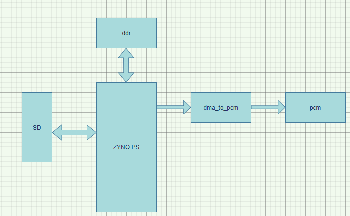
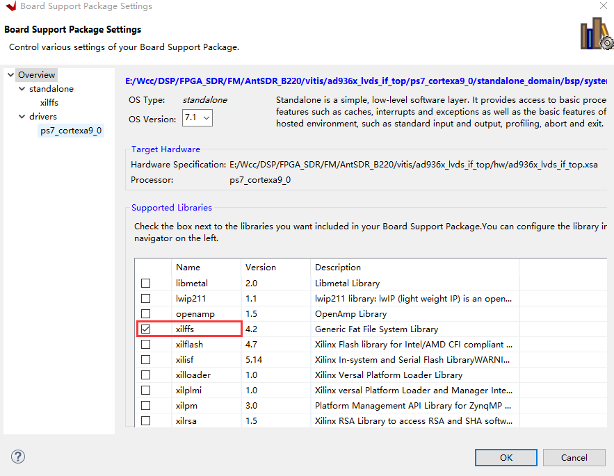
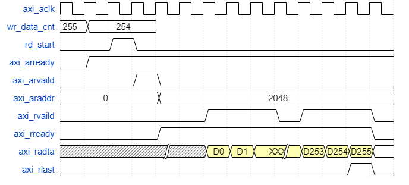

最近开始准备从头开始实现一个FM的调制月解调的实验,在进行这些实验之前,首先需要进行的一个操作就是读取SD卡当中的文件,将SD卡当中的文件读取到内存当中,在FPGA的PL端实现将数据读出,并且将读取出来的数据提供给PCM模块.这样PCM模块就能够播放音乐了.
这是实现FM调制的第一步,先有一个音频数据源.
## 1. 系统结构
ZYNQ读取SD卡的整个系统架构如下图所示:

<!--more-->

在ZYNQ的PS侧,SD卡控制器负责读取SD卡的文件,将读取到的PCM的音频数据写入到内存当中,当音频数据被写入到内存当中之后,将会启动PL端的DMA开始从内存当中将数据进行读出.读出之后的数据给到PCM模块,从而实现音频信号的播放.
在这个系统当中主要需要去实现的也就如下几个东西:<br>

- ZYNQ PS通过Xilinx提供好的API进行SD开内文件的读取
- PL端需要用户实现一个DMA的读取模块,通过AXI接口.
- 将数据从内存当中读取出来之后还需要注意音频模块的驱动,相对来说比较简单. 

## 2. PS读取SD卡文件
在Xilinx的软件开发工具vitis当中,已经移植好了FAT文件系库,在使用的时候,需要在BSP当中使能这个库就行了.

在读取SD文件或者向SD卡当中写入文件的时候按照一定的步骤来就可以了.
### 2.1 访问SD卡当中文件的一般步骤
 - 挂载SD卡 f_mount()
```c
FRESULT f_mount (
	FATFS* fs,			/* Pointer to the filesystem object (NULL:unmount)*/
	const TCHAR* path,	/* Logical drive number to be mounted/unmounted */
	BYTE opt			/* Mode option 0:Do not mount (delayed mount), 1:Mount immediately */
)
```
在进行SD卡初始化的时候,只需要简简单单地挂载一下SD卡就可以了.
```c
int sd_init()
{
	FRESULT ret;
	/* define the file path */
	TCHAR * file_path = "0:/";

	/* mount the sdcard file system */
	ret = f_mount(&fat_inst, file_path, 0);
	if(ret != FR_OK){
		xil_printf("mount sd card failed!!! Error code is %d \r\n", ret);
		return ret;
	}
	return FR_OK;
}
```
- 打开具体的某个文件 f_open()
```c
FRESULT f_open (
	FIL* fp,			/* Pointer to the blank file object */
	const TCHAR* path,	/* Pointer to the file name */
	BYTE mode			/* Access mode and file open mode flags */
)
```

- 移动到文件的具体位置 f_lseek()
```c
FRESULT f_lseek (
	FIL* fp,		/* Pointer to the file object */
	FSIZE_t ofs		/* File pointer from top of file */
)
```
- 读写文件 f_write()/f_read()
```c
FRESULT f_write (
	FIL* fp,			/* Pointer to the file object */
	const void* buff,	/* Pointer to the data to be written */
	UINT btw,			/* Number of bytes to write */
	UINT* bw			/* Pointer to number of bytes written */
)

FRESULT f_read (
	FIL* fp, 	/* Pointer to the file object */
	void* buff,	/* Pointer to data buffer */
	UINT btr,	/* Number of bytes to read */
	UINT* br	/* Pointer to number of bytes read */
)
```

- 关闭文件 f_close()
```c
FRESULT f_close (
	FIL* fp		/* Pointer to the file object to be closed */
)
```
基于上面的这些步骤,可以写两个简单的函数,从而实现对SD卡的读写.
```c
int sd_write(char * file_name, u32 * src_addr, u32 byte_len)
{
	FIL file_inst;
	FRESULT ret;
	UINT byte_write;

	/* open a pcm file */
	ret = f_open(&file_inst, file_name, FA_READ);
	if(ret != FR_OK)
	{
		xil_printf("Open file failed, the error code is %d\r\n", ret);
		return ret;
	}
	/* move to the begining of the pcm file */
	ret = f_lseek(&file_inst, 0);
	if(ret != FR_OK)
	{
		xil_printf("Move to the file beginning failed, the error code is %d\r\n", ret);
		return ret;
	}
	/* Write the data into sd card from ddr */
	ret = f_write(&file_inst, (void *)src_addr, (UINT)byte_len, &byte_write);
	if(ret != FR_OK)
	{
		xil_printf("Write file failed, the error code is %d \r\n", ret);
		return ret;
	}
	/* close the file */
	ret = f_close(&file_inst);
	if(ret != FR_OK)
	{
		xil_printf("close the file failed, the error code is %d\r\n", ret);
		return ret;
	}
	return FR_OK;
}

int sd_read(char * file_name, u32 * dist_addr, u32 byte_len)
{
	FIL file_inst;
	FRESULT ret;
	UINT byte_read;

	/* open a pcm file */
	ret = f_open(&file_inst, file_name, FA_READ);
	if(ret != FR_OK)
	{
		xil_printf("Open file failed, the error code is %d\r\n", ret);
		return ret;
	}
	/* move to the begining of the pcm file */
	ret = f_lseek(&file_inst, 0);
	if(ret != FR_OK)
	{
		xil_printf("Move to the file beginning failed, the error code is %d\r\n", ret);
		return ret;
	}
	/* Read the data from sd card into ddr */
	ret = f_read(&file_inst, (void *)dist_addr, (UINT)byte_len, &byte_read);
	if(ret != FR_OK)
	{
		xil_printf("Read file failed, the error code is %d \r\n", ret);
		return ret;
	}
	/* close the file */
	ret = f_close(&file_inst);
	if(ret != FR_OK)
	{
		xil_printf("close the file failed, the error code is %d\r\n", ret);
		return ret;
	}
	return FR_OK;
}
```
## 3. AXI 读取内存数据
在PS端读取了SD卡的文件并且将数据写入到内存当中之后,在PL端就可开始将数据读出了,在这里需要使用AXI接口,AXI接口已经使用过很多次了,不需要再详细说了.只不过再读取数据的时候需要注意一个字节序的问题.也就是数据在SD卡中存储的形式和读取到DDR当中之后再写入到FIFO当中需要注意的字节序的问题.
AXI的时序设计如下图所示,没什么好说的,就是标标准准的AXI时序就可以了.

```verilog
always @(posedge M_AXI_ACLK)begin
	if (M_AXI_ARESETN == 0 ) begin
		init_txn_ready <= 1'b0;
	end
	else if((!init_txn_ff2) && init_txn_ff)begin
		init_txn_ready <= 1'b1;
	end
end

//----------------rd_start------------------
always @(posedge M_AXI_ACLK)begin
	if (M_AXI_ARESETN == 0 ) begin
		rd_start <= 1'b0;
	end
	// the fifo don't have enought data, and the axi bus is idle, start to get data from ddr
	else if(init_txn_ready == 1'b1 && wr_data_count <= 'd2 && axi_arvalid == 1'b0 && axi_rready == 1'b0)begin
		rd_start <= 1'b1;
	end
	else begin
	  	rd_start <= 1'b0;
	end
end

//----------------axi_arvalid------------------
always @(posedge M_AXI_ACLK)begin
	if (M_AXI_ARESETN == 0 ) begin
		axi_arvalid <= 1'b0;
	end
	// read addr command is accepted
	else if (axi_arvalid == 1'b1 && M_AXI_ARREADY == 1'b1) begin
		axi_arvalid <= 1'b0;
	end
	// start to read data from ddr
	else if(rd_start == 1'b1)begin
		axi_arvalid <= 1'b1;
	end
end

//----------------axi_araddr------------------
always @(posedge M_AXI_ACLK)begin
	if (M_AXI_ARESETN == 0 ) begin
		axi_araddr <= 'd0;
	end
	// read addr command is accepted, and the address is reach to the maximum offset 
	else if (axi_arvalid == 1'b1 && M_AXI_ARREADY == 1'b1 && (axi_araddr == (pcm_end_address - ADDR_OFFSET))) begin
		axi_araddr <= 'd0;
	end
	// read addr command is accepted
	else if (axi_arvalid == 1'b1 && M_AXI_ARREADY == 1'b1) begin
		axi_araddr <= axi_araddr + ADDR_OFFSET;
	end
end

//----------------axi_rready------------------
always @(posedge M_AXI_ACLK)begin
	if (M_AXI_ARESETN == 0 ) begin
		axi_rready <= 1'b0;
	end
	// when the burst is done, stop to receive data from axi bus, ready signal should be low
	else if (end_cnt_burst == 1'b1) begin
		axi_rready <= 1'b0;
	end
	// read addr command is accepted, start to receive data from axi bus
	else if (axi_arvalid == 1'b1 && M_AXI_ARREADY == 1'b1) begin
		axi_rready <= 1'b1;
	end
end

//----------------cnt_burst------------------
// used to count how many data has be accepted
always @(posedge M_AXI_ACLK ) begin
	if (M_AXI_ARESETN == 1'b0) begin
		cnt_burst <= 'd0;
	end
	else if (add_cnt_burst) begin
		if(end_cnt_burst)
			cnt_burst <= 'd0;
		else
			cnt_burst <= cnt_burst + 1'b1;
	end
end

assign add_cnt_burst = M_AXI_RVALID & axi_rready;
assign end_cnt_burst = add_cnt_burst && cnt_burst == C_M_AXI_BURST_LEN - 1;


//----------------wr_fifo_data/wr_fifo_en------------------
always @(posedge M_AXI_ACLK ) begin
	if (M_AXI_ARESETN == 1'b0) begin
		wr_fifo_data <= 'd0;
		wr_fifo_en <= 1'b0;
	end
	// the pcm file store the data in a LSB MSB byte order, so that user should change the byte order
	else if( M_AXI_RVALID & axi_rready)begin
		wr_fifo_en <= 1'b1;
		wr_fifo_data <= {M_AXI_RDATA[15:0],M_AXI_RDATA[31:16],M_AXI_RDATA[47:32],M_AXI_RDATA[63:48]};
	end
	else begin
		wr_fifo_en <= 1'b0;
		wr_fifo_data <= 'd0;
	end
end

tx_dma_fifo inst_tx_dma_fifo (
  .rst(~M_AXI_ARESETN),            // input wire rst
  .wr_clk(M_AXI_ACLK),                // input wire wr_clk
  .rd_clk(user_clk),                // input wire rd_clk
  .din(wr_fifo_data),                      // input wire [63 : 0] din
  .wr_en(wr_fifo_en),                  // input wire wr_en
  .rd_en(rd_fifo_en),                  // input wire rd_en
  .dout(rd_fifo_data),                    // output wire [15 : 0] dout
  .full(full),                    // output wire full
  .empty(empty),                  // output wire empty
  .rd_data_count(rd_data_count),  // output wire [11 : 0] rd_data_count
  .wr_data_count(wr_data_count),  // output wire [9 : 0] wr_data_count
  .wr_rst_busy(wr_rst_busy),      // output wire wr_rst_busy
  .rd_rst_busy(rd_rst_busy)      // output wire rd_rst_busy
);

//====================================================
// The code below is used for pcm module
//====================================================

//----------------tx_ready------------------
// ready to send data into pcm module
always @(posedge user_clk or negedge M_AXI_ARESETN) begin
	if (M_AXI_ARESETN==1'b0) begin
		tx_ready <= 'd0;
	end
	else if (rd_data_count >= 1022) begin
		tx_ready <= 1'b1;
	end
end

//----------------cnt_div------------------
always @(posedge user_clk or negedge M_AXI_ARESETN) begin
	if (M_AXI_ARESETN==1'b0) begin
		cnt_div <= 'd0;
	end
	else if (tx_ready == 1'b1 && cnt_div == div_count - 1) begin
		cnt_div <= 'd0;
	end
	else if (tx_ready == 1'b1) begin
		cnt_div <=  cnt_div + 1'b1;
	end
end

//----------------rd_fifo_en------------------
always @(posedge user_clk or negedge M_AXI_ARESETN) begin
	if (M_AXI_ARESETN==1'b0) begin
		rd_fifo_en <= 1'b1;
	end
	else if (tx_ready == 1'b1 && cnt_div == div_count - 1) begin
		rd_fifo_en <= 1'b1;
	end
	else  begin
		rd_fifo_en <=  1'b0;
	end
end

//----------------tx_data/tx_valid------------------
always @(posedge user_clk or negedge M_AXI_ARESETN) begin
	if (M_AXI_ARESETN==1'b0) begin
		tx_data_r <= 'd0;
		tx_vaild_r <= 'd0;
	end
	else  begin
		tx_data_r <= rd_fifo_data;
		tx_vaild_r <= rd_fifo_en;
	end
end
```