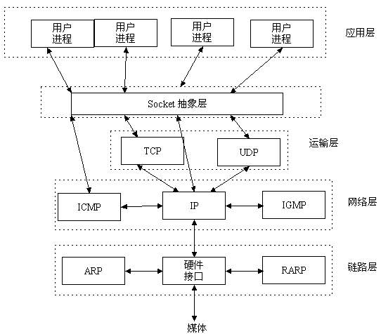
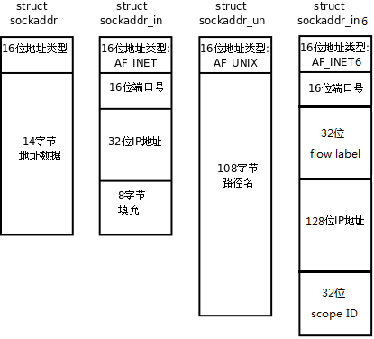
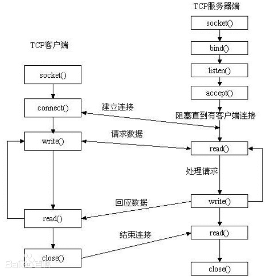
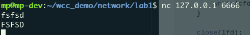

# 前言
想要在ANTSDR E310上移植USRP B系列的驱动，就需要把USB3.0的驱动替换成网口的驱动，这一部分首先得要求我对网络编程有一点点的了解。因此我决定开始学习一下网络编程。


<!--more-->
对于FPGA开发人员来说，以太网的帧结构和分层这些东西应该是基本工了，每个人都必须要去掌握。所以在在学习的时候就从软件开发的角度进行了。

# 基本概念
## 网络字节序
TCP/IP 协议规定，==网络数据流采用大端字节序==，也即低地址存放数据的高字节。例如UDP协议的端口号是1000(0x3e8),那么在网络字节序当中低地址应该存放0x03,高地址字节存档0xe8，也就是说先发送0x03再发送0xe8。
但是如果主机采取的是小端字节序，也就是低地址存放数据的低字节，那么在接受到网络字节序的数据时就会解析错误。会将上面的0x03,0xe8解析成0xe803。将先接受到的数据放0x03在低字节后接受到的数据0xe8放在高字节。

为了解决这种情况，可以调用函数对网络字节序和主机字节序进行转换。

```c
#include <arpa/inet.h>

uint32_t htonl(uint32_t hostlong); 
uint16_t htons(uint16_t hostshort);
uint32_t ntohl(uint32_t netlong);
uint16_t ntohs(uint16_t netshort);
```
上面这些函数的含义分别是： 
- h:表示主机
- n:表示网络
- l:表示32位long类型
- s:表示16位short类型

## IP 地址转换
上面看到的网络字节序的转换都是整形的数据，在实际使用IP地址的时候，人们一般用点分十进制的方式来表示，比如“192.168.1.110”这种形式，这是一个字符串的形式，因此在使用的时候，系统会提供一个函数，直接将这种点分十进制的IP地址转换成实际传输的IP地址。
```c
#include <arpa/inet.h>
int inet_pton(int af, const char *src, void *dst); //字符串IP地址转换成网络字节序
const char *inet_ntop(int af, const void *src, char *dst, socklen_t size); // 网络字节序转换成字符串IP地址
```

## sockaddr数据结构
**struct sockaddr**早期的网络编程函数都是使用sockaddr的结构体，现在用来描述一个socket的结构体根据所选协议簇的不同，可以使用sockaddr_in, sockaddr_in6。然后再在函数内部强转成sockaddr类型。

结构体如下图所示：


原始的sockaddr的结构体
```c
struct sockaddr {
	sa_family_t sa_family;  /* address family, AF_xxx */
	char sa_data[14];       /* 14 bytes of protocol address */
};
```
用于转换IPV4地址的sockaddr_in结构体，包括16位端口号，128位的IP地址和一些控制字段。
```c
struct sockaddr_in {
    __kernel_sa_family_t sin_family; /* Address family */  	
    __be16 sin_port;                 /* Port number */		
    struct in_addr sin_addr;         /* Internet address */	
    /* Pad to size of `struct sockaddr'. */
    unsigned char __pad[__SOCK_SIZE__ - sizeof(short int) -
    sizeof(unsigned short int) - sizeof(struct in_addr)];
};

struct in_addr {        
    /* Internet address. */
    __be32 s_addr;
};
```
在一些socket API当中需要传入的参数的类型是sockaddr类型的，而现在常用的类型又是sockaddr_in类型的，因此需要进行一个强转。比如：
```c
struct sockaddr_in servaddr;
bind(listen_fd, (struct sockaddr *)&servaddr, sizeof(servaddr));		/* initialize servaddr */
```

# 网络套接字
网络套接字编程的基本流程如下：


## socket函数
socket函数打开一个网络通信接口，如果成功的话，会返回一个文件描述符指向这个对应的socket，socket是linux系统当中的一个伪文件，该文件包含两个缓冲区，其中一个用于发送数据，另外一个用于接收数据，因此socket是可以以全双工的方式进行运行的。
对于IPV4的协议，domain字段需要制定为AF_INET。
对于TCP协议，type字段指定为SOCK_STREAM协议表示面向流的传输协议。
对于UDP协议，type字段指定为SOCK_DGRAM表示面向数据报的传输。
protocol默认为0。
```c
#include <sys/types.h> /* See NOTES */
#include <sys/socket.h>
int socket(int domain, int type, int protocol);
domain:
	AF_INET 这是大多数用来产生socket的协议，使用TCP或UDP来传输，用IPv4的地址
	AF_INET6 与上面类似，不过是来用IPv6的地址
	AF_UNIX 本地协议，使用在Unix和Linux系统上，一般都是当客户端和服务器在同一台及其上的时候使用
type:
	SOCK_STREAM 这个协议是按照顺序的、可靠的、数据完整的基于字节流的连接。这是一个使用最多的socket类型，这个socket是使用TCP来进行传输。
	SOCK_DGRAM 这个协议是无连接的、固定长度的传输调用。该协议是不可靠的，使用UDP来进行它的连接。
	SOCK_SEQPACKET该协议是双线路的、可靠的连接，发送固定长度的数据包进行传输。必须把这个包完整的接受才能进行读取。
	SOCK_RAW socket类型提供单一的网络访问，这个socket类型使用ICMP公共协议。（ping、traceroute使用该协议）
	SOCK_RDM 这个类型是很少使用的，在大部分的操作系统上没有实现，它是提供给数据链路层使用，不保证数据包的顺序
protocol:
	传0 表示使用默认协议。
返回值：
	成功：返回指向新创建的socket的文件描述符，失败：返回-1，设置errno
```

## bind函数
服务器程序所监听的网络地址和端口号通常是固定不变的，客户端得知服务器程序的地址和端口号之后就可以向服务器发起连接。因此服务器端需要bind绑定一个固定的网络地址和端口号。
bind()函数的作用是将socket的文件描述符和addr绑定在一起，使得通过socketfd这个文件描述符能够监听addr所描述的地址和端口号。
```c
#include <sys/types.h> /* See NOTES */
#include <sys/socket.h>
int bind(int sockfd, const struct sockaddr *addr, socklen_t addrlen);
sockfd：
	socket文件描述符
addr:
	构造出IP地址加端口号
addrlen:
	sizeof(addr)长度
返回值：
	成功返回0，失败返回-1, 设置errno
```
举个简单的例子就是将服务器与具体的地址绑定起来：

```c
listenfd = socket(AF_INET, SOCK_STREAM, 0);
struct sockaddr_in servaddr;
bzero(&servaddr, sizeof(servaddr));
servaddr.sin_family = AF_INET;
servaddr.sin_addr.s_addr = htonl(INADDR_ANY);
servaddr.sin_port = htons(6666);

bind(listenfd, (struct sockaddr *)&servaddr, sizeof(servaddr));
```

## listen函数
典型的服务器程序可以同时服务于多个客户端，当有客户端发起连接时，服务器调用的accept()返回并接受这个连接，如果有大量的客户端发起连接而服务器来不及处理，尚未accept的客户端就处于连接等待状态，listen()声明sockfd处于监听状态，并且最多允许有backlog个客户端处于连接待状态，如果接收到更多的连接请求就忽略。listen()成功返回0，失败返回-1。
简单来说，listen就是给出一个允许的最大连接数。
```c
#include <sys/types.h> /* See NOTES */
#include <sys/socket.h>
int listen(int sockfd, int backlog);
sockfd:
	socket文件描述符
backlog:
	排队建立3次握手队列和刚刚建立3次握手队列的链接数和
```

## accept函数
三方握手完成之后，服务器调用accept函数接受连接，如果服务器调用accept函数时，还没有客户端的连接请求，就会阻塞等待，直到有客户端连接上来。

```c
#include <sys/types.h> 		/* See NOTES */
#include <sys/socket.h>
int accept(int sockfd, struct sockaddr *addr, socklen_t *addrlen);
sockdf:
	socket文件描述符
addr:
	传出参数，返回链接客户端地址信息，含IP地址和端口号
addrlen:
	传入传出参数（值-结果）,传入sizeof(addr)大小，函数返回时返回真正接收到地址结构体的大小
返回值：
	成功返回一个新的socket文件描述符，用于和客户端通信，失败返回-1，设置errno
```

## connect函数
客户端需要调用connect函数连接到服务器，
```c
#include <sys/types.h> 					/* See NOTES */
#include <sys/socket.h>
int connect(int sockfd, const struct sockaddr *addr, socklen_t addrlen);
sockdf:
	socket文件描述符
addr:
	传入参数，指定服务器端地址信息，含IP地址和端口号
addrlen:
	传入参数,传入sizeof(addr)大小
返回值：
	成功返回0，失败返回-1，设置errno
```

# 实例

## server.c

```c
#include <stdio.h>
#include <unistd.h>
#include <sys/socket.h>
#include <stdlib.h>
#include <arpa/inet.h>
#include <ctype.h>

#define SERV_IP "127.0.0.1"
#define SERV_PORT 6666

int main(void)
{
    int lfd, cfd;
    struct sockaddr_in serv_addr, client_addr;
    socklen_t client_addr_len;
    char buf[BUFSIZ];
    int n, i;

    lfd = socket(AF_INET, SOCK_STREAM, 0);

    serv_addr.sin_family = AF_INET;
    serv_addr.sin_port = htons(SERV_PORT); 
    serv_addr.sin_addr.s_addr = htonl(INADDR_ANY);

    bind(lfd, (struct sockaddr *)&serv_addr, sizeof(serv_addr));

    listen(lfd, 128);

    client_addr_len = sizeof(client_addr);
    cfd = accept(lfd, (struct sockaddr *)&client_addr, &client_addr_len);

    while (1) {
        n = read(cfd, buf, sizeof(buf));
        for (i = 0; i < n; i++)
            buf[i] = toupper(buf[i]);
        write(cfd, buf, n);
    }

    close(lfd);
    close(cfd);

    return 0;
}

```

## 测试结果
使用nc命令连接到服务器，然后向服务器发送字符，会接收到从服务器返回的字符。

