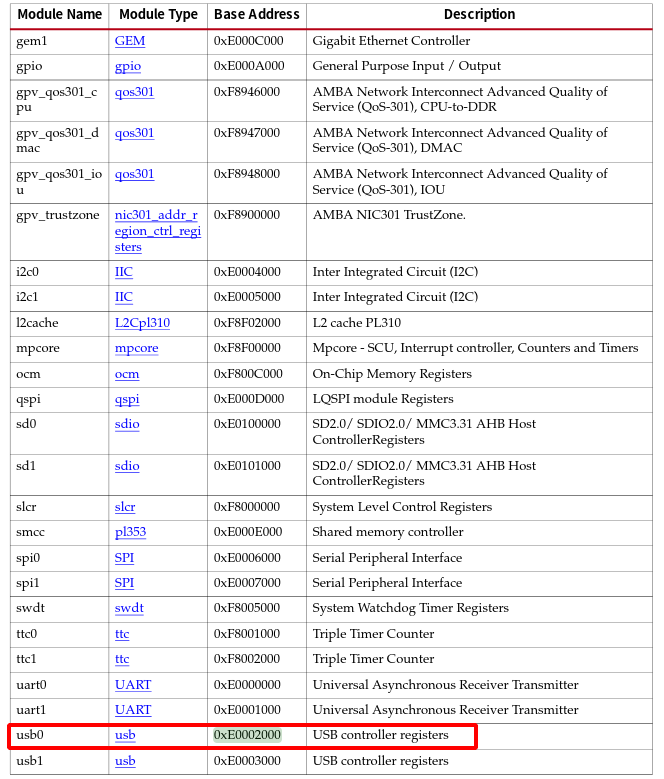
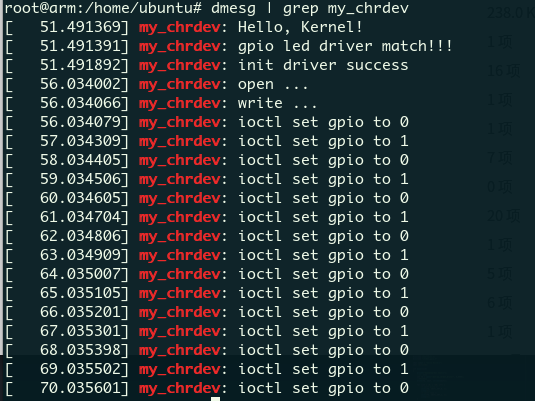

# 1. 设备树基本语法
设备树用树状结构描述设备信息，组成设备树的基本单元是 node（设备节点），这些
node 被组织成树状结构，有如下一些特征：
- 一个 device tree 文件中只有一个 root node（根节点）；
- 除了 root node，每个 node 都只有一个 parent node（父节点）；
- 一般来说，开发板上的每一个设备都能够对应到设备树中的一个 node；
- 每个 node 中包含了若干的 property-value（键-值对，当然也可以没有 value）来描述该 node 的一些
特性；
- 每个 node 都有自己的 node name（节点名字）；
- node 之间可以是平行关系，也可以嵌套成父子关系，这样就可以很方便的描述设备间的关系；
  
<!--more-->

一个具体的设树例子如下所示
```c
#include "zynq.dtsi"
#include <dt-bindings/input/input.h>
#include <dt-bindings/gpio/gpio.h>
#include <dt-bindings/interrupt-controller/irq.h>

#define AD9361_EXT_BAND_CTL_SHORTHANDS
#include <dt-bindings/iio/adc/adi,ad9361.h>

/ {
	model = "MicroPhase ANTSDR E310";
	memory {
		device_type = "memory";
		reg = <0x00000000 0x40000000>;
	};

	chosen {
		stdout-path = "/amba@0/uart@E0001000";
	};


	clocks {
		ad9364_clkin: clock@0 {
			#clock-cells = <0>;
			compatible = "adjustable-clock";
			clock-frequency = <40000000>;
			clock-accuracy = <200000>; /* 200 ppm (ppb) */
			clock-output-names = "ad9364_ext_refclk";
		};
	};

	usb_phy0: phy0 {
		compatible = "ulpi-phy";
		#phy-cells = <0>;
		reg = <0xe0002000 0x1000>;
		view-port = <0x0170>;
		drv-vbus;
	};

};


&sdhci0 {
	status = "okay";
	xlnx,has-cd = <0x0>;
	xlnx,has-power = <0x0>;
	xlnx,has-wp = <0x0>;
};

&watchdog0 {
	status = "okay";
	reset-on-timeout;
};

&gem0 {
	status = "okay";
	phy-mode = "rgmii-id";
	phy-handle = <&phy0>;

	phy0: phy@0 { /* Marvell 88e1512 */
		reg = <0>;
		compatible = "ethernet-phy-ieee802.3-c22";
		reset-gpios = <&gpio0 46 1>;
	};
};

&usb0 {
	xlnx,phy-reset-gpio = <&gpio0 47 0>;
	dr_mode = "otg";
	status = "okay";
	usb-phy = <&usb_phy0>;
};

&qspi {
	status = "okay";
	is-dual = <0>;
	num-cs = <1>;
	primary_flash: ps7-qspi@0 {
		#address-cells = <1>;
		#size-cells = <1>;
		spi-tx-bus-width = <1>;
		spi-rx-bus-width = <4>;
		compatible = "n25q256a", "n25q512a", "jedec,spi-nor"; /* same as S25FL256 */
		reg = <0x0>;
		spi-max-frequency = <50000000>;
		partition@qspi-fsbl-uboot {
			label = "qspi-fsbl-uboot";
			reg = <0x0 0x100000>; /* 1M */
		};
		partition@qspi-uboot-env {
			label = "qspi-uboot-env";
			reg = <0x100000 0x20000>; /* 128k */
		};
		partition@qspi-nvmfs {
			label = "qspi-nvmfs";
			reg = <0x120000 0xE0000>; /* 1M */
		};
		partition@qspi-linux {
			label = "qspi-linux";
			reg = <0x200000 0x1E00000>; /* 30M */
		};
	};
};

&adc {
	xlnx,channels {
		#address-cells = <1>;
		#size-cells = <0>;
		channel@0 {
			reg = <0>;
		};
	};
};

/ {
	fpga_axi: fpga-axi@0 {
		compatible = "simple-bus";
		#address-cells = <0x1>;
		#size-cells = <0x1>;
		ranges;

		axi_i2c0: i2c@41600000 {
			compatible = "xlnx,axi-iic-1.02.a", "xlnx,xps-iic-2.00.a";
			reg = <0x41600000 0x10000>;
			interrupt-parent = <&intc>;
			interrupts = <0 59 IRQ_TYPE_LEVEL_HIGH>;
			clocks = <&clkc 15>;
			clock-names = "pclk";

			#address-cells = <1>;
			#size-cells = <0>;

		};

		rx_dma: dma@7c400000 {
			compatible = "adi,axi-dmac-1.00.a";
			reg = <0x7c400000 0x10000>;
			#dma-cells = <1>;
			interrupts = <0 57 IRQ_TYPE_LEVEL_HIGH>;
			clocks = <&clkc 16>;

			adi,channels {
				#size-cells = <0>;
				#address-cells = <1>;

				dma-channel@0 {
					reg = <0>;
					adi,source-bus-width = <32>;
					adi,source-bus-type = <2>;
					adi,destination-bus-width = <64>;
					adi,destination-bus-type = <0>;
				};
			};
		};

		tx_dma: dma@7c420000 {
			compatible = "adi,axi-dmac-1.00.a";
			reg = <0x7c420000 0x10000>;
			#dma-cells = <1>;
			interrupts = <0 56 IRQ_TYPE_LEVEL_HIGH>;
			clocks = <&clkc 16>;

			adi,channels {
				#size-cells = <0>;
				#address-cells = <1>;

				dma-channel@0 {
					reg = <0>;
					adi,source-bus-width = <64>;
					adi,source-bus-type = <0>;
					adi,destination-bus-width = <32>;
					adi,destination-bus-type = <2>;
				};
			};
		};

		cf_ad9364_adc_core_0: cf-ad9361-lpc@79020000 {
			compatible = "adi,axi-ad9361-6.00.a";
			reg = <0x79020000 0x6000>;
			dmas = <&rx_dma 0>;
			dma-names = "rx";
			spibus-connected = <&adc0_ad9364>;
			adi,axi-decimation-core-available;
		};

		cf_ad9364_dac_core_0: cf-ad9361-dds-core-lpc@79024000 {
			compatible = "adi,axi-ad9364-dds-6.00.a";
			reg = <0x79024000 0x1000>;
			clocks = <&adc0_ad9364 13>;
			clock-names = "sampl_clk";
			dmas = <&tx_dma 0>;
			dma-names = "tx";
			adi,axi-interpolation-core-available;
			adi,axi-dds-default-scale = <0>;
		};

		mwipcore@43c00000 {
			compatible = "mathworks,mwipcore-axi4lite-v1.00";
			reg = <0x43c00000 0xffff>;
		};
	};
};

```

## 1.1 设备树节点与属性
一般设备树的节点都有下面的表示方式：
```c
    [label:]node-name[@unit-address] {
        [properties definitions]
        [child nodes]
    };
```
“[]”中的内容表示可选的，可有也可以没有；节点名字前加上”label”则方便在 dts文件中被其他的节点引用，其中“node-name”是节点名字，为 ASCII 字符串，节点名字应该能够清晰的描述出节点的功能，比如“gem0”就表示这个节点是 以太网外设。“unit-address”一般表示设备的地址或寄存基地址，如果某个节点没有地址或者寄存器的话“unit-address”可以不要，比如“cpu@0”、“interrupt-controller@00a01000”。每个节点都有若干属性，属性又有相对应的值（值不是必须要有的），而一个节点当中又可以嵌套其它的节点，形成父子节点。
比如上面关于FPGA这边的设备树：
对于fpga-axi这个节点，其别名为fpga_axi,设备地址是0，在其内部有许多其他的节点，比如axi_i2c0节点，rx_dma, tx_dma, cf_ad9364_adc_core_0, cf_ad9364_dac_core_0等等。

一个设备树节点当中，有一些属性是比较通用的,对于大多数节点都是可以使用的。

### compatible 属性
compatible 属性也叫做“兼容性”属性，compatible 属性的值可以是一个字符串，也可以是一个字符串列表；一般该字符串使用”<制造商>,<型号>”这样的形式进行命名，当然这不是必须要这样，这是要求大家按照这样的形式进行命名，目的是为了指定一个确切的设备，并且包括制造商的名字，以避免命名空间冲突，如下所示：
`compatible = "xlnx,xuartps", "cdns,uart-r1p8";`
xlnx 和 cdns 就表示制造商，而后面的 xuartps 和 uart-r1p8 就表示具体设备的型号。compatible 属性用于将设备和驱动绑定起来，例如该设备首先使用第一个兼容值（xlnx,xuartps）在 Linux 内核里面查找，看看能不能找到与之匹配的驱动文件，如果没有
找到的话就使用第二个兼容值（cdns,uart-r1p8）查找，直到找到或者查找完整个 Linux 内核也没有找到对应的驱动。
一般驱动程序文件都会有一个 OF 匹配表，此 OF 匹配表保存着一些 compatible 值，如果设备树中的节点的 compatible 属性值和 OF 匹配表中的任何一个值相等，那么就表示设备可以使用这个驱动。

### model 属性
model属性也是一个字符串描述信息，没有太大的作用就是描述一下设备的信息，内核在解析设备树的时候会把这个属性对应的字符串信息打印出来。

### status属性
status属性和设备状态有关，device tree当中的status标识了设备的状态，可以使用status去启用或者禁用设备。

| 值 | 描述 |
|-- |-- |
|okay | 表明设备可操作，启动设备|
|disable | 表明当前设备是不可操作，但在之后可以变为可操作的 |
| fail | 表明设备不可操作，检测到了一系列的错误 |
| fail-sss | 含义同上，后面的sss是错误内容 |


### #address-cells和#size-cells属性
这两个属性的值都是无符号32位整形，#address-cells和#size-cells这两个属性可以用在任何拥有子节点的设备当中，用来描述子节点的地址信息。
- \#address-cell用来描述子节点"reg"属性的地址表当中用来描述首地址的cell的数量。
- \#size-cells用来描述子节点"reg"属性的地址表中用来描述地址长度的cell的数量。


其中#address-cells和#size-cells 表明了子节点应该如何编写 reg 属性值，一般 reg 属性都是和地址有关的内容，和地址相关的信息有两种：起始地址和地址长度，有了这两个属性，子节点中的"reg"属性就可以描述一块连续的地址区域了；
reg 属性的格式一般为：
`reg=<address1 length1 address2 length2 ...>`
每个"address length"组合表示一个地址范围，其中address是起始地址，length是地址长度，#address-cells表示address字段占用的字长，#size-cells表示length字段占用的字长。

### reg属性
reg 属性的值一般是(address，length)对。reg 属性一般用于描述设备地址空间资源信息，一般都是描述某个外设的寄存器地址范围信息、flash 设备的分区信息等。比如:
```c
usb_phy0: phy0 {
	compatible = "ulpi-phy";
	#phy-cells = <0>;
	reg = <0xe0002000 0x1000>;
	view-port = <0x0170>;
	drv-vbus;
};
```

可以看到在USB的设备树节点当中，reg属性为 `reg = <0xe0002000 0x1000>;`,说明该设备树节点的起始地址为0xe0002000长度为0x1000,通过查阅UG585可以看到当前的起始地址确实是zynq usb控制器0的起始地址。

## 1.2节点引用
节点的名称格式为：
`[label:]node-name[@unit-address] `
通过引用label这个字段，可以方便地来访问节点。比如在zynq-7000.dtsi当中，对于默认的zynq gem以太网控制器有如下属性：
```c
	gem0: ethernet@e000b000 {
		compatible = "cdns,zynq-gem", "cdns,gem";
		reg = <0xe000b000 0x1000>;
		status = "disabled";
		interrupts = <0 22 4>;
		clocks = <&clkc 30>, <&clkc 30>, <&clkc 13>;
		clock-names = "pclk", "hclk", "tx_clk";
		#address-cells = <1>;
		#size-cells = <0>;
	};

	gem1: ethernet@e000c000 {
		compatible = "cdns,zynq-gem", "cdns,gem";
		reg = <0xe000c000 0x1000>;
		status = "disabled";
		interrupts = <0 45 4>;
		clocks = <&clkc 31>, <&clkc 31>, <&clkc 14>;
		clock-names = "pclk", "hclk", "tx_clk";
		#address-cells = <1>;
		#size-cells = <0>;
	};
```
在我们自己的设备树文件当中，将zynq-7000.dtsi这个文件包含到自己的设备树文件当中，如果想要修改其中的gem0这个设备树节点，我们可以通过引用的方式，而不必再将这个节点的所有内容都重复一边。
```c
&gem0 {
	status = "okay";
	
	phy-handle = <&phy0>;
	phy-mode = "rgmii-rxid";
	xlnx,has-mdio = <0x1>;
	gmii2rgmii-phy-handle = <&gmii_to_rgmii_0>;
	
	phy0: phy@1 {
		compatible = "ethernet-phy-id011c.c916";
		device_type = "ethernet-phy";
		reg = <0x1>;
	};

	gmii_to_rgmii_0: gmiitorgmii@8 {
		compatible = "xlnx,gmii-to-rgmii-1.0";
		reg = <0x8>;
		phy-handle = <&phy0>;
	};
};
```

## 1.3 特殊的子节点
在设备树当中有几个比较特殊的节点，aliases，chosen，以及memory，这三个节点是没有compatible属性的。

```c
	memory {
		device_type = "memory";
		reg = <0x00000000 0x20000000>;
	};

	aliases {
		ethernet0 = &gem0;
		serial0 = &uart0;
		spi0 = &qspi;
		mmc0 = &sdhci0;
	};

	chosen {
		bootargs = "earlycon";
		stdout-path = "serial0:115200n8";
	};
```
因此 aliases 节点的主要功能就是定义别名，定义别名的目的就是为了方便访问节点。但是需要注意的是，这里说的方便访问节点并不是在设备
树中访问节点，例如前面说到的使用“&label”的方式访问设备树中的节点，而是内核当中方便定位节点，例如在内核中通过 ethernet0 就可以定位到 gem0 节点（&gem0 引用的节点），再例如内核通过 serial0 就可以找到 uart0 节点。

chosen 节点一般会有两个属性，“bootargs”和“stdout-path”。

memory 节点描述了系统内存的基地址以及系统内存大小，“reg = <0x0 0x20000000>”就表示系统内存的起始地址为 0x0，大小为 0x20000000，也就是 512MB，该节点一般只有这两个属性，device_type 属性的值固定为"memory".

# 2. GPIO子系统
gpio 子系统是 linux 内核当中用于管理 GPIO 资源的一套系统，它提供了很多 GPIO 相关的 API 接口。驱动程序中使用 GPIO 之前需要向 gpio 子系统申请，申请成功之后才可以使用，例如设置 GPIO 的输入、输出方向，设置 GPIO 输出高或低电平、读取 GPIO 输入电平等等。
gpio 子系统的主要目的就是方便驱动开发者使用 gpio，驱动开发者在设备树中添加 gpio相关信息，然后就可以在驱动程序中使用 gpio 子系统提供的 API 函数来操作 GPIO，Linux 内核向驱动开发者屏蔽掉了 GPIO 的设置过程，极大的方便了驱动开发者使用 GPIO。
## 2.1 ZYNQ的GPIO子系统驱动
```c
	leds {
		compatible = "microphase,gpio-led";
		status = "okay";
		led-gpio = <&gpio0 15 1>;
	};
```
在leds这个设备树节点当中，定义了一个led-gpio的属性，该属性用于描述led设备由哪个GPIO来控制，属性值一共有三个。
“&gpio0”表示 led 引脚所使用的 IO 属于 gpio0，“15”表示 gpio0 的第 15 号 IO，通过这两个值 led 驱动程序就知道 led 引脚使用了 GPIO0_IO015 这 GPIO。“GPIO_ACTIVE_HIGH”表示高电平有效，如果改为“GPIO_ACTIVE_LOW”就表示高电平有效（GPIO_ACTIVE_HIGH 和 GPIO_ACTIVE_LOW 其实是宏定义，GPIO_ACTIVE_HIGH 等于 0，GPIO_ACTIVE_LOW 等于 1）。
在zynq-7000.dtsi当中，可以找到gpio0控制器的设备树节点：
```c
	gpio0: gpio@e000a000 {
		compatible = "xlnx,zynq-gpio-1.0";
		#gpio-cells = <2>;
		clocks = <&clkc 42>;
		gpio-controller;
		interrupt-controller;
		#interrupt-cells = <2>;
		interrupt-parent = <&intc>;
		interrupts = <0 20 4>;
		reg = <0xe000a000 0x1000>;
	};
```

“#gpio-cells”属性和“#address-cells”类似，在 gpio0 节点中#gpio-cells 的值等于 2，表示一共有两个 cell，大家可以这样理解，使用 gpio0 的时候，需要传递 2 个参数过去，第一个参数为 GPIO 编号，比如“&gpio0 15”就表示 GPIO0_IO015。第二个参数表示 GPIO 极性，如果为 0(GPIO_ACTIVE_HIGH)的话表示高电平有效，如果为1(GPIO_ACTIVE_LOW)的话表示低电平有效。

## 2.2 GPIO子系统API函数
- gpio_request()
  gpio_request 函数用于申请一个 GPIO 管脚，在使用一个 GPIO 之前一定要使用gpio_request 进行申请
	```c
	int gpio_request(unsigned gpio, const char *label)
	```
	gpio：要申请的 gpio 标号，使用 of_get_named_gpio 函数从设备树获取指定 GPIO 属性
	信息，此函数会返回这个 GPIO 的标号。
	label：给 gpio 设置个名字。
	返回值：0，申请成功；其他值，申请失败。

- gpio_free
  如果不使用某个 GPIO 了，那么就可以调用 gpio_free 函数进行释放。
  ```c
  void gpio_free(unsigned gpio)
  ```
  参数：
  	gpio： 要释放的gpio

- gpio_direction_input
  用于设置某个GPIO为输入，函数原型如下：
  ```c
  int gpio_direction_input(unsigned gpio)
  ```
  函数参数和返回值含义如下：
  gpio:要设置为输入的GPIO标号
  返回值：0设置成功；负数，设置失败。

- gpio_direction_output
  用于设置某个GPIO为输入，函数原型如下：
  ```c
  int gpio_direction_input(unsigned gpio, int value)
  ```
  函数参数和返回值含义如下：
  gpio:要设置为输出的GPIO标号
  value:GPIO输出默认值
  返回值：0设置成功；负数，设置失败。

- gpio_get_value
  用于获取某个GPIO的值，定义如下：
  ```c
  #define gpio_get_value __gpio_get_value
  int __gpio_get_value(unsigned gpio)
  ```
  函数参数和返回值含义如下：
  gpio:要获取的GPIO标号
  返回值：非负数，得到的GPIO值负数，获取失败


- gpio_set_value
  用来设置某个GPIO的值，定义如下：
  ```c
  #define gpio_set_value __gpio_get_value
  void __gpio_set_value(unsigned gpio, int value)
  ```
  函数参数和返回值含义如下：
  gpio:要设置的GPIO标号
  value:设置的输出的值

## 2.3 与GPIO相关的OF函数
- of_gpio_named_count
  of_gpio_named_count 函数用于获取设备树某个属性里面定义了几个 GPIO 信息，要注意的是空的 GPIO 信息也会被统计到，
  ```c
  int of_gpio_named_count(struct device_node *np, const char *propname)
  ```
  函数参数和返回值含义如下：
  np：设备节点。
  propname：要统计的 GPIO 属性。
  返回值：正值，统计到的 GPIO 数量；负值，失败。

- of_get_named_gpio
  此函数获取 GPIO 编号，gpio 子系统为了方便管理系统中的 GPIO 资源，每一个 GPIO 管脚都有一个对应的编号，Linux 内核中关于 GPIO 的 API 函数都要使用 GPIO 编号，此函数会将设备树中类似<&gpio0 7 GPIO_ACTIVE_LOW>的属性信息转换为对应的 GPIO 编号，此函数在驱动中使用很频繁.
  ```c
  int of_get_named_gpio(struct device_node *np, const char *propname, int index)
  ```
  函数参数和返回值含义如下：
  np：设备节点。
  propname：包含要获取 GPIO 信息的属性名。
  index：GPIO 索引，因为一个属性里面可能包含多个 GPIO，此参数指定要获取哪个 GPIO的编号，如果只有一个 GPIO 信息的话此参数为 0。
  返回值：正值，获取到的 GPIO 编号；负值，失败。


## GPIO LED 驱动
在有了上面的设备树的之后和GPIO子系统的知识之后，就可以来写一个自己的基于GPIO子系统的LED灯驱动了。
首先在设备树当中，需要定义一个led节点：
```c
	leds {
		compatible = "microphase,gpio-led";
		status = "okay";
		led-gpio = <&gpio0 15 1>;
	};
```

然后需要实现一个驱动文件：
```c
#include <linux/types.h>
#include <linux/kernel.h>
#include <linux/delay.h>
#include <linux/ide.h>
#include <linux/init.h>
#include <linux/module.h>
#include <linux/errno.h>
#include <linux/gpio.h>
#include <asm/mach/map.h>
#include <asm/uaccess.h>
#include <asm/io.h>
#include <linux/cdev.h>
#include <linux/of.h>
#include <linux/of_address.h>
#include <linux/of_gpio.h>

#include "chrdev_gpio.h"

#define DRIVER_NAME "my_chrdev_driver"
#define BUFF_SIZE 	128


/* Meta Information */
MODULE_LICENSE("GPL");
MODULE_AUTHOR("wcc");
MODULE_DESCRIPTION("A char device LKM");


struct chrdev_local{
	struct cdev cdev;
	dev_t dev_no;
	struct class *my_class ;
	struct device * my_device;
	struct device_node *nd;
	int gpio_num;
};

static struct chrdev_local my_chrdev_local;

static char vbuf[BUFF_SIZE];

ssize_t my_chrdev_read(struct file * inode, char __user * buf, size_t count, loff_t * ppos)
{
	printk("my_chrdev: read ... \n");
	unsigned long p = *ppos;
    int ret;
    int tmp = count ;
    static int i = 0;
    i++;
    if(p >= BUFF_SIZE)
        return 0;
    if(tmp > BUFF_SIZE - p)
        tmp = BUFF_SIZE - p;
    ret = copy_to_user(buf, vbuf+p, tmp);
    *ppos +=tmp;
    return tmp;
}

ssize_t my_chrdev_write(struct file * inode, const char __user * buf, size_t count, loff_t * ppos)
{
	printk("my_chrdev: write ...\n");
	unsigned long p = *ppos;
    int ret;
    int tmp = count ;
    if(p > BUFF_SIZE)
        return 0;
    if(tmp > BUFF_SIZE - p)
        tmp = BUFF_SIZE - p;
    ret = copy_from_user(vbuf, buf, tmp);
    *ppos += tmp;
    return tmp;
}

int my_chrdev_open (struct inode *inode, struct file *filp)
{
	int ret;
	printk("my_chrdev: open ... \n");
	struct chrdev_local * lp;
	/* get the char device */
	lp =  container_of(inode->i_cdev, struct chrdev_local, cdev);
	filp->private_data = lp;
	
	/* get the gpio */
	lp->gpio_num = of_get_named_gpio(lp->nd, "led-gpio", 0);
	if(!gpio_is_valid(lp->gpio_num)) {
		printk(KERN_ERR "my_chrdev: Failed to get led-gpio\n");
		return -EINVAL;
	}

	/* gpio request */
	ret = gpio_request(lp->gpio_num, "GPIO_LED0");
	if (ret < 0) {
		printk("my_chrdev: Failed to request gpio\n");
		return ret;
	}

	/* set the gpio direction */
	gpio_direction_output(lp->gpio_num, 0);
	
	return 0;
}
int my_chrdev_close (struct inode *inode, struct file *filp)
{
	printk("my_chrdev: close ... \n");

	struct chrdev_local * lp;
	lp = filp->private_data;

	gpio_free(lp->gpio_num);
	return 0;
}


long my_chrdev_ioctl (struct file * filp, unsigned int cmd, unsigned long arg){

	struct chrdev_local * lp;
	lp = filp->private_data;

	switch (cmd) {
		case IOCTL_SET_0:
			gpio_set_value(lp->gpio_num, 0);
			printk("my_chrdev: ioctl set gpio to 0 \n");
			break;

		case IOCTL_SET_1:
			gpio_set_value(lp->gpio_num,1);
			printk("my_chrdev: ioctl set gpio to 1\n");
			break;

		default: break;
	}
	return 0;
}

static struct file_operations my_chrdev_ops = {
    .owner = THIS_MODULE,
    .open = my_chrdev_open,
    .release = my_chrdev_close,
    .write = my_chrdev_write,
    .read = my_chrdev_read,
	.unlocked_ioctl = my_chrdev_ioctl
};

/**
 * @brief This function is called, when the module is loaded into the kernel
 */
static int __init my_init(void) {
	const char *str;
	int ret;
	printk("my_chrdev: Hello, Kernel!\n");

	/* get device node from dts */
	my_chrdev_local.nd = of_find_node_by_path("/leds");
	if(NULL == my_chrdev_local.nd) {
		printk("leds node can not found!\r\n");
		return -EINVAL;
	}

	/* get device node status */
	ret = of_property_read_string(my_chrdev_local.nd, "status", &str);
	if(ret < 0) {
		printk("my_chrdev: dts does not have status property\n");
	}

	/* compatible driver */
	ret = of_property_read_string(my_chrdev_local.nd, "compatible", &str);
	if (ret < 0) {
		printk("my_chrdev: the device node don't have a compatible string\n");
		return -EINVAL;
	}

	if (strcmp(str, "microphase,gpio-led")) {
		printk("my_chrdev: current driver don't support the device node\n");
		return -EINVAL;
	}

	printk("my_chrdev: gpio led driver match!!!\n");

	/* alloc char device region */
	alloc_chrdev_region(&my_chrdev_local.dev_no, 0, 1, DRIVER_NAME);
	if (ret < 0) {
		printk("my_chrdev: alloc chrdev region failed \n");
		goto alloc_err;
	}

	/* init char device */
	cdev_init(&my_chrdev_local.cdev, &my_chrdev_ops);

	/* add chrdev to kernel */
	ret = cdev_add(&my_chrdev_local.cdev, my_chrdev_local.dev_no, 1);
	if (ret < 0) {
		printk("my_chrdev: add error\n");
		goto add_err;
	}
	
	/* create a class for auto create */
	my_chrdev_local.my_class = class_create(THIS_MODULE, DRIVER_NAME);
	if (IS_ERR(my_chrdev_local.my_class)) {
		printk("my_chrdev: create class erorr ...\n");
		ret = PTR_ERR(my_chrdev_local.my_class);
		goto class_err;
	}

	/* create device for auto create */
	my_chrdev_local.my_device = device_create(my_chrdev_local.my_class, NULL,
											 my_chrdev_local.dev_no, NULL, DRIVER_NAME);
	if (IS_ERR(my_chrdev_local.my_device)) {
		printk("my_chrdev: create device error... \n");
		ret = PTR_ERR(my_chrdev_local.my_device);
		goto device_err;
	}
	printk("my_chrdev: init driver success \n");
	return 0;
device_err: 
	class_destroy(my_chrdev_local.my_class);

class_err:
	cdev_del(&my_chrdev_local.cdev);

add_err:
	unregister_chrdev_region(my_chrdev_local.dev_no, 1);

alloc_err:
	return ret;
}

/**
 * @brief This function is called, when the module is removed from the kernel
 */
static void __exit my_exit(void) {
	cdev_del(&my_chrdev_local.cdev);
	unregister_chrdev_region(my_chrdev_local.dev_no, 1);
	device_destroy(my_chrdev_local.my_class, my_chrdev_local.dev_no);
	class_destroy(my_chrdev_local.my_class);
	printk("my_chrdev: Goodbye, Kernel\n");
}

module_init(my_init);
module_exit(my_exit);

```
简单的测试程序

```c
#include <stdio.h>
#include <unistd.h>
#include <fcntl.h>
#include <string.h>
#include <sys/ioctl.h>
#include "chrdev_gpio.h"

char *wbuf = "Hello World\n";
char rbuf[128];

int main(void)
{
    printf("EmbedCharDev test\n");
    //打开文件
    int fd = open("/dev/my_chrdev_driver", O_RDWR);
    //写入数据
    write(fd, wbuf, strlen(wbuf));

    for (int i =0; i <60; i++) {
        /* ioctl write */
        ioctl(fd, IOCTL_SET_0, 1);
        sleep(1);
        /* ioctl read */
        ioctl(fd, IOCTL_SET_1, 1);
        sleep(1);
    }

    //写入完毕，关闭文件
    close(fd);
    //打开文件
     fd = open("/dev/my_chrdev_driver", O_RDWR);
    //读取文件内容
    read(fd, rbuf, 128);
    //打印读取的内容
    printf("The content : %s\n", rbuf);
    //读取完毕，关闭文件
    close(fd);
    return 0;
}
```
