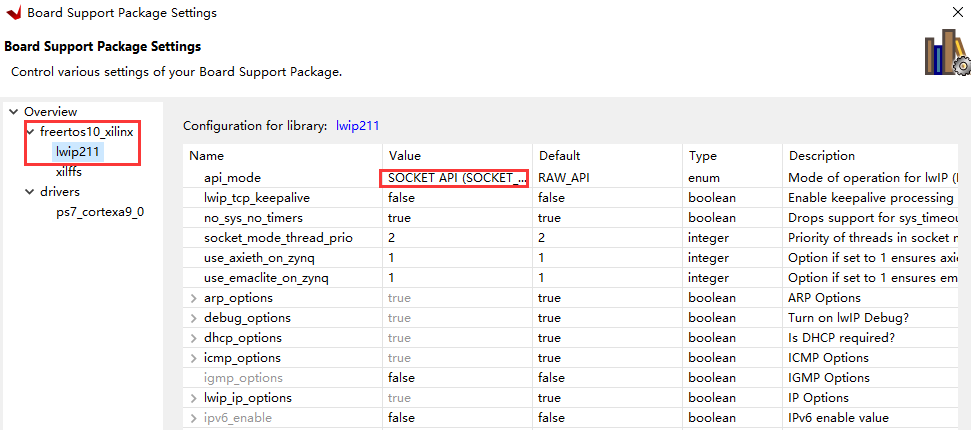

## 1. 以太网通信的实现

为了能够实现和上位机之间的通信，首先需要先把这个通路给打通。其实只是想要把以太网的通路打通，实现这个目的还是十分简单的，直接在SDK里面选中示例里面的模板工程既可以创建基于freertos的tcp或者udp的工程。但是模板里面的工程比较繁琐，有很多东西都不是自己想要的，因此需要对这些东西进行一些简化，于是想着自己来照着这个freertos的实现一下，最终也是实现了这个简单的工程，在这里先记录一下。之后的工作就可以在这个基础上进行修改就好了。
<!--more-->
### 1.1 zynq freertos程序

在zynq中实现一个freeRTOS，在创建硬件平台的时候，要选择基于freeRTOS进行创建。并且在BSP里面要使能lwip这个库，并且设置API的模式为socket API的模式，使用socket API的模式是因为对于上位机编程来说，一般都是基于socket的，这样编写出来的程序能够更加直观。

具体的代码如下，其实主要的结构都是参照freeRTOS的lwip中的模板来的。这几个线程感觉是必须要创建的，如果不这样创建线程的话，我之前尝试的程序无法运行起来。

```c
#include <stdio.h>
#include "xparameters.h"
#include "netif/xadapter.h"
#include "xil_printf.h"
#include "xil_printf.h"
#include "lwip/init.h"
#include "lwip/inet.h"
#include "lwip/sockets.h"
#include "lwipopts.h"
#include "xil_printf.h"
#include "FreeRTOS.h"
#include "task.h"
#include "sleep.h"

#define THREAD_STACKSIZE 1024

#define EMAC_ADDR XPAR_XEMACPS_0_BASEADDR

static struct netif client_netif;
struct sockaddr_in local_addr, remote_addr;

int complete_nw_thread = 0;


void network_thread()
{
    struct netif *netif;
    /* the mac address of the board. this should be unique per board */
    unsigned char mac_ethernet_address[] = { 0x00, 0x0a, 0x35, 0x00, 0x01, 0x02 };

    ip_addr_t ipaddr, netmask, gw;

    /* initialize IP addresses to be used */
    IP4_ADDR(&ipaddr,  192, 168, 1, 10);
    IP4_ADDR(&netmask, 255, 255, 255,  0);
    IP4_ADDR(&gw,      192, 168, 1, 1);

    netif = &client_netif;

    if (!xemac_add(netif, &ipaddr, &netmask, &gw, mac_ethernet_address, EMAC_ADDR)) {
        xil_printf("Error adding N/W interface\r\n");
        return ;
    }

    netif_set_default(netif);

    /* specify that the network if is up */
    netif_set_up(netif);

    /* start packet receive thread - required for lwIP operation */
    sys_thread_new("xemacif_input_thread", (void(*)(void*))xemacif_input_thread, netif,
            THREAD_STACKSIZE,
            DEFAULT_THREAD_PRIO);

    complete_nw_thread = 1;
    vTaskDelete(NULL);
}


void udp_socket_thread()
{
	int count;

	/* create socket */
	int socket_client = lwip_socket(AF_INET, SOCK_DGRAM, 0);
	if(socket_client < 0){
		xil_printf("create socket failed \r\n");
		return ;
	}
	/* Set remote server address */
	memset(&remote_addr, 0, sizeof(struct sockaddr_in));
	remote_addr.sin_family = AF_INET;
	remote_addr.sin_port = htons(8080);
	remote_addr.sin_addr.s_addr = inet_addr("192.168.1.100");

	/* Set local address */
	memset(&local_addr, 0, sizeof(struct sockaddr_in));
	local_addr.sin_family = AF_INET;
	local_addr.sin_port = htons(8080);
	local_addr.sin_addr.s_addr = inet_addr("192.168.1.10");

	/* Connect to udp server */
	int err = lwip_connect(socket_client, (struct sockaddr *)&remote_addr, sizeof(remote_addr));
	if (err != ERR_OK) {
		xil_printf("UDP client: Error on connect: %d\r\n", err);
		lwip_close(socket_client);
		return ;
	}
	/* zynq bind to a local address */
	err = lwip_bind(socket_client, (struct sockaddr*)&local_addr, sizeof(local_addr));
	if (err != ERR_OK) {
		xil_printf("UDP client: Error on bind: %d\r\n", err);
		lwip_close(socket_client);
		return ;
	}

	char tx_buf[]="Hello world---AAA\r\n";
	char rx_buf[16]={};
	socklen_t rx_bytes;
	while(1){
		/* Send Hello world to udp server */
		count = lwip_sendto(socket_client, tx_buf, sizeof(tx_buf), 0,
					(struct sockaddr *)&remote_addr, sizeof(remote_addr));
		if (count <= 0) {
			xil_printf("send failed\r\n");
		}

		/* receive data from socket */
		lwip_recvfrom(socket_client, rx_buf, sizeof(rx_buf), 0,
					(struct sockaddr *)&remote_addr, &rx_bytes);
		xil_printf("Receive data is: %s \r\n", rx_buf);
	}

	/* close socket */
	lwip_close(socket_client);
	vTaskDelete(NULL);
}

int main_thread()
{
	xil_printf("-----lwIP Socket Mode UDP Client Application------\r\n");

	/* initialize local lwip */
	lwip_init();

	/* Create a thread to initialize local ethernet */
	sys_thread_new("nw_thread", network_thread, NULL,
			THREAD_STACKSIZE, DEFAULT_THREAD_PRIO);

	while(!complete_nw_thread){
		usleep(5);
	}

	/* Create a thread for user application */
	sys_thread_new("udp_socket_thread", udp_socket_thread, NULL,
				THREAD_STACKSIZE, DEFAULT_THREAD_PRIO);

	vTaskDelete(NULL);
	return 0;
}

int main()
{
	/* Create the main thread */
	sys_thread_new("main_thread", (void(*)(void*))main_thread, 0,
			THREAD_STACKSIZE, DEFAULT_THREAD_PRIO);
	vTaskStartScheduler();
	while(1);
	return 0;
}

```

### 1.2上位机代码
上位机采用python实现，实现起来比较简单，具体的代码如下：
```py
import socket

def main():
    # Create a udp socket
    udp_socket = socket.socket(socket.AF_INET, socket.SOCK_DGRAM)
    
    # bind udp socket to local 
    local_ip = "192.168.1.100"
    local_port = 8080
    udp_socket.bind((local_ip, local_port))

    while True:
        # receive data 
        recv_data, recv_addr = udp_socket.recvfrom(1024)
        print("%s:%s" % (str(recv_addr), recv_data))
        # send data
        udp_socket.sendto(b"hello wolrd", recv_addr)
    
    udp_socket.close()

    
if __name__ == "__main__":
    main()
```
有了这个框架之后，实现以太网的传输就基本没有什么太大的问题了，接下来就可以去实现FPGA里面的工作了，把FPGA的中断连接到freeRTOS的控制器上。然后加上DMA加上和数据的交互，最终把数据传递到上位机当中并进行显示。