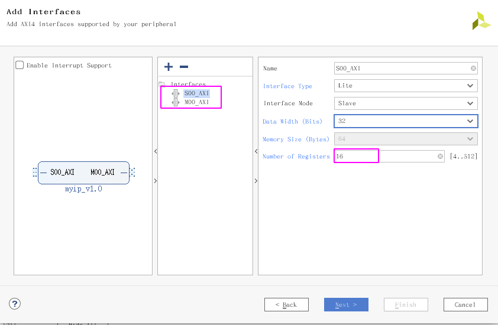
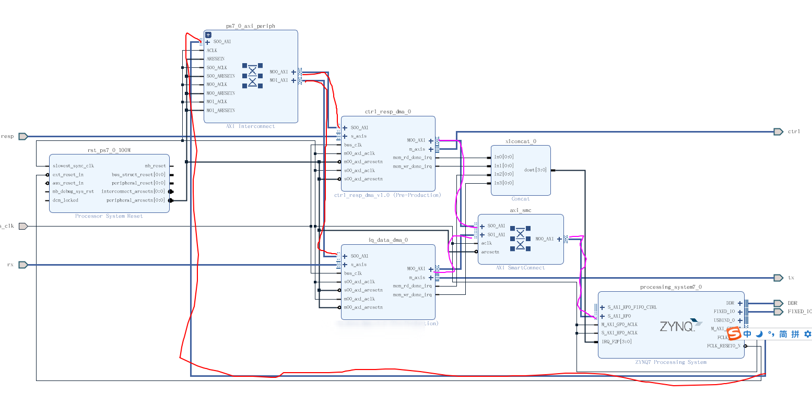

# 前言
在ZYNQ的系统设计当中，经常需要处理ARM与FPGA之间的数据交互的问题。这就引申出一个很重要的内容就是AXI4接口。
AXI接口我在之前也写过博客记录如何在FPGA当中实现数据的传输：
[AXI4向内存写入数据](https://blog.csdn.net/qq_41332806/article/details/106519058)
[AXI4从内存获取数据](https://blog.csdn.net/qq_41332806/article/details/106488920)
但是这两篇博客只是实现了一个比较简单的模块，并且里面的功能也是比较固定和死板的。
<!--more-->

刚好最近在处理USRP的固件移植的时候，遇到了需要进行ARM和FPGA之间的数据交互的问题，因此有机会把这个好好总结一下，完成了一个AXI4-Lite与AXI4-FULL接口都存在的模块。这个行为就有点像Xilinx官方提供的那种AXI接口的IP了。

# IP 设计
## 1. 功能需求
在进行PS-PL数据交互的时候，采用DMA的方式进行，因此在设计之初可以先设计IP的功能。为了简单起见，可以参考Xilinx官方所提供的AXI-DMA这个IP，模仿它的接口的行为，简单来说就是有如下的功能。
- 从某一起始地址开始，以突发的方式向内存当中写入指定长度的数据(以bytes为单位)
- 从某一起始地址开始，以突发的方式从内存当中读取指定长度的数据(以bytes为单位)

了解了IP的基本的功能之后，就需要着手去实现具体的细节了，因为想要IP的使用更加灵活，因此可以添加寄存器到IP当中，方便zynq去进行控制。

## 2. 寄存器的设计
根据前面的需求，可以简单的归纳出以下寄存器。
### DDR to FPGA 方向
数据从内存到FPGA可以看做是从内存当中读取出数据，因此可以设计以下三个寄存器
```c
#define MEM_RD_START 			CTRL_RESP_DMA_S00_AXI_SLV_REG3_OFFSET
#define MEM_RD_BASE_ADDR		CTRL_RESP_DMA_S00_AXI_SLV_REG4_OFFSET
#define MEM_RD_LENGTH 			CTRL_RESP_DMA_S00_AXI_SLV_REG5_OFFSET
```
这三个寄存器的作用分别是，**MEM_RD_START**控制一次突发传输操作的开始。
 **MEM_RD_BASE_ADDR** 控制突发开始的基地址
 **MEM_RD_LENGTH** 指定本次突发传输所需要传输的字节数。

### FPGA to DDR方向
数据从FPGA写入到DDR当中，可以设置如下三个寄存器, **MEM_WR_BASE_ADDR** 写入内存的基地址，
**MEM_WR_LENGTH** 写入内存的数据的字节数，**MEM_WR_STATUS**当前的状态。
之所以在写入内存的时候，没有控制一个开始信号，是因为写入数据是FPGA控制的，希望当FPGA写完数据之后，以**中断** 的形式通知ZYNQ，从而在ZYNQ当中能够获取到数据。
```c
#define MEM_WR_BASE_ADDR		CTRL_RESP_DMA_S00_AXI_SLV_REG0_OFFSET
#define MEM_WR_LENGTH 			CTRL_RESP_DMA_S00_AXI_SLV_REG1_OFFSET
#define MEM_WR_STATUS 			CTRL_RESP_DMA_S00_AXI_SLV_REG2_OFFSET
```

## 3. IP配置
使用Xilinx的工具能够方便地配置出AXI4接口的信号，用户只需要关注具体的实现的逻辑功能的实现就可以了。
在设计的时候，使用一个axi4_slave接口，在该接口当中可以接受来自ZYNQ的控制信号，在这里设置寄存器的个数为16，这样通过在FPGA和软件当中定义具体的寄存器的作用，最终就能够实现在软件当中对FPGA部分当中的AXI接口的IP的配置。


除了AXI4-lite slave接口外，还有一个AXI4-Full类型的master接口，该接口能够最终实现通过ZYNQ的HP接口与DDR进行高速的数据传输。
具体的block design如下图所示，可以看到在该项目当中使用到了两个自定义的AXI接口的IP，这两个IP的功能其实是很类似的都是进行PS-PL间的数据传输。
其中紫色的部分是AXI4-Full接口，该接口类型为master，也就是AXI突发的发起方向，而ZYNQ IP核上有一个S_AXI_HP接口，该接口是一个AXI4的高性能接口。因此最终通过AXI-Interconnect能够实现用户自定义的IP与DDR的数据的交互。
红色部分的接口是AXI4-Lite接口，在自定义的IP当中这两个IP都有一个slave接口，ZYNQ有一个master GP口，通过AXI-interconnect能够实现互联，ZYNQ从而可以在软件层面实现对FPGA的控制。

再之后就是在FPGA当中实现AXI4-Full的接口了，这个可以参考之前的那两篇博客，稍作修改即可，没有太多的东西。
比较重要的就是将Slave接口当中的寄存器的值给引出到master接口上，从而实现对axi4-full接口突发的控制。

## 4. 类AXI_DMA API 
在使用Xilinx的AXI4_Lite slave模板创建IP之后，导出hdf到SDK当中的时候，会自动生成这个IP的驱动，这个驱动里面包含了对这个IP的寄存器读写的基本的函数，因为要想实现用户自己的API，只需要通过调用这些寄存器读写函数即可。

### control&response transfer API
控制包和响应包的传输，可以通过调用API来进行访问，首先是控制包的传输，该API实现当从上位机接受到控制包之后，并将控制包放到内存当中，这个时候，在下位机当中就需要使能一次突发操作将内存当中的数据取出并给到FPGA进行发送。

响应包，是FPGA向内存当中写入一帧数据之后，会发起一个中断，当中断来临的时候，下位机需要将数据从内存当中更新到cache当中，然后再将数据发送给上位机。
```c
void ctrl_transfer(u32 base_addr, u32 data_len)
{
	CTRL_RESP_DMA_mWriteReg(CTRL_RESP_ADDR, MEM_RD_BASE_ADDR, base_addr);
	CTRL_RESP_DMA_mWriteReg(CTRL_RESP_ADDR, MEM_RD_LENGTH, data_len);
	CTRL_RESP_DMA_mWriteReg(CTRL_RESP_ADDR, MEM_RD_START, 0x01);
	CTRL_RESP_DMA_mWriteReg(CTRL_RESP_ADDR, MEM_RD_START, 0x00);
}

void resp_transfer(u32 base_addr, u32 * data_len)
{
	u32 transfer_length;
	CTRL_RESP_DMA_mWriteReg(CTRL_RESP_ADDR, MEM_WR_BASE_ADDR, base_addr);
	transfer_length = CTRL_RESP_DMA_mReadReg(CTRL_RESP_ADDR, MEM_WR_LENGTH);
	*data_len = transfer_length;
}
```
在上面实现了一个类似于AXI_DMA的API，在进行传输的时候，给定一个突发的起始地址，一个突发传输的长度等信号。
如果之前有使用AXI_DMA这个IP的话应该是能够比较容易理解这个过程的。

