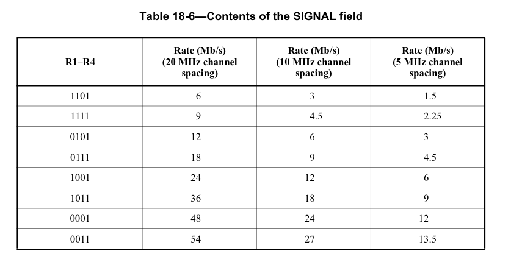

# 1. 前言

在上一篇博客当中，简单记录了一下802.11a的基本协议，想要在那么短短的篇幅当中把OFDM实现的细节讲完是不太现实的。
在这一篇博客当中，我将会介绍整个802.11a的发射机的整体结构，对发射机的整体有一个大概的了解。

<!--more-->

# 2. 整体结构
OFDM的发射机的结构如下图所示。可以将OFDM发射机分为5个部分，分别是上层用户数据产生模块， 802.11a前导码产生模块，802.11a signal域数据产生模块， 802.11a data域数据产生模块， 802.11a组帧模块。

在802.11a signal域模块和 802.11a data域模块当中又由许多小模块构成。
通过前导码产生模块，signal域数据产生模块，data域数据产生模块和最终的组帧模块，最终能够构建出来一个完整的PPDU数据。

## 2.1 用户数据产生模块
在进行OFDM实验的时候，希望能够产生一些测试数据，能够用于之后的系统的验证，在这里可以设计一个数据产生模块，该模块能够按照需要产生测试的数据，并且将数据的长度给到后续的模块进行使用。
这个数据长度是字节长度，数据长度将会填充在802.11a当中的signal域当中，除此之外，在计算OFDM 符号个数的时候，也需要使用数据的长度。
对用802.11a其可以像以太网一样用来传输网络数据，因此这个用户数据产生模块，在之后也可以替换成类似于以太网的组帧模块，这样就可以构建一个简单的系统。
当然在这里不会太详细地去实现这个模块。

## 2.2 Preamble产生模块
在Preamble产生模块当中，实现802.11a的短训练序列和长训练序列的生成。

### 2.2.1 短训练序列
短训练序列的主要用途是进行信号的检测、AGC和粗频偏估计。短训练序列都是经过精心的设计，每个短训练序列的长度为0.8us，在802.11a的前导码当中一共有10个短训练序列。这些短训练序列符号占据每个OFDM符号的52个非零子载波当中的12个。如果用-26~26来标识非零子载波的话，那么短训练序列的子载波的序号为{-24, -20, -16, -12, -8, -4, 4, 8, 12, 16, 20, 24},其中传输的传输数据为一个固定的伪随机序列，采用的QPSK的映射方式。

由于短训练序列只用了52个子载波当中12个来传输符号，因此为了保证OFDM符号的功率稳定，需要乘以因子$$\sqrt{13/6}$$.
短训练序列的的选择可以是的在较大的范围内实现粗频率估计，通常对于周期为T的重复符号而言，最大可估计的频率偏差为1/2T,因此通过测量连续两个长度为0.8us的短训练序列符号的相位差，可以估计的频率偏差可达625KHz。

### 2.2.2 长训练序列
长训练序列的紧跟在短训练序列之后，长度为8us，长训练序列符号与正常的OFDM符号一样由53个子载波(包含直流处的空子载波)组成，分别占据-26~26信道，长训练序列采用传输的是BPSK符号。表示为：

在实际使用过程当中，由与短训练序列和长训练序列是固定的，因此可以先使用matlab，python等工具先将短训练序列和长训练序列生成出来，然后将序列存储在ROM当中，在使用的时候，直接从ROM当中读取出来就可以了。

## 2.3 signal域
在前导码之后是signal域，signal域主要包含Rate和Length两个字段，Rate用于传输有关后续数据符号所用到调制信息和码速率。Length字段用于传输PSDU传输的用户数据的字节数。

在Rate字段需要根据所需要的调制方式和码速率填入对应的值。

Length字段需要注意的是，传输是从LSB到MSB。

除了Rate字段和Length字段之外，还有一些还有一些其他校验位和空闲位。
其中bit4是保留位，bit17是偶校验位，用来对前面的16bit进行校验。还有6位的尾bit。

## 2.4 Data域
在signal域之后就是数据域，Data域主要包含16bit的service域，PSDU，6bit的tail 比特以及填充比特。

service域的前7个比特需要给领用来初始化接收机的解扰器，剩下的为保留位，在发送机当中总给零，在之后就是PSDU域，该域由用户数据转换而来，用户数据转换为bit序列填入到PSDU域当中。在PSDU域结束之后是6bit的尾bit，尾bit之后是pad比特，pad比特的目的是使得DATA域的长度能够刚好为OFDM symbol的整数倍。
关于padbit的计算，在802.11a协议当中也给出了详细的说明：

首先计算处当前数据长度下所需要的OFDM的symbol的数量，其中16+8*length+6，分别值得是，service域bit，psdu数据bit，6位尾bit，NDBPS表示每个OFDM包含的数据bit的数量。相处的结果进行向上取整，从而得到完整的OFDM的符号个数，在用完整的OFDM符号的个数所包含的bit数减去总共的bit数量，从而得到需要填充的pad比特。

## 2.5 802.11a组帧模块
在最后还有一个802.11a的组帧模块，该模块的作用是将前导码，signal域，Data域所产生的时域波形给整合成最终需要发送的OFDM的数据。按照前导码，signal域，Data域的形式进行排列。

# 3. Data域和Signal域的具体实现
在Data域和Signal域模块当中，还有一些子模块，这些子模块对实现整个802.11a发射机十分重要，在之后的博客当中会依次来慢慢实现。
其中主要从Data域入手，因为Signal域只包含一个OFDM符号，弄清楚了Data域的实现过程之后，signal域的实现就十分简单了。