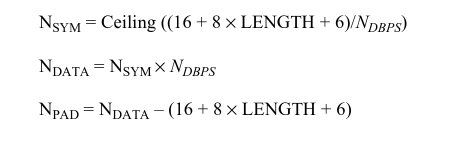
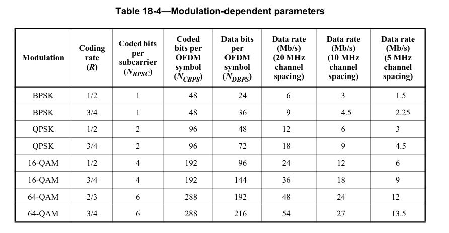
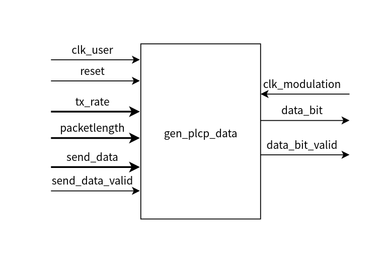
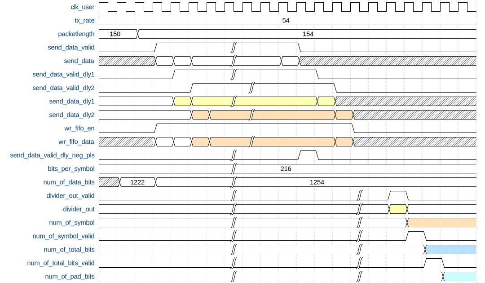
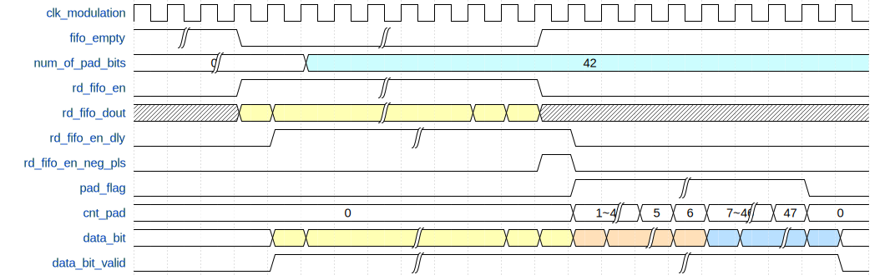
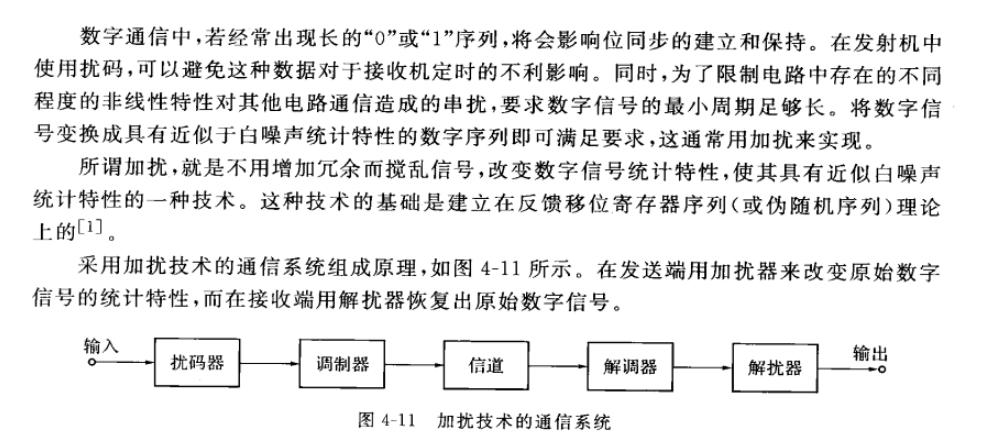
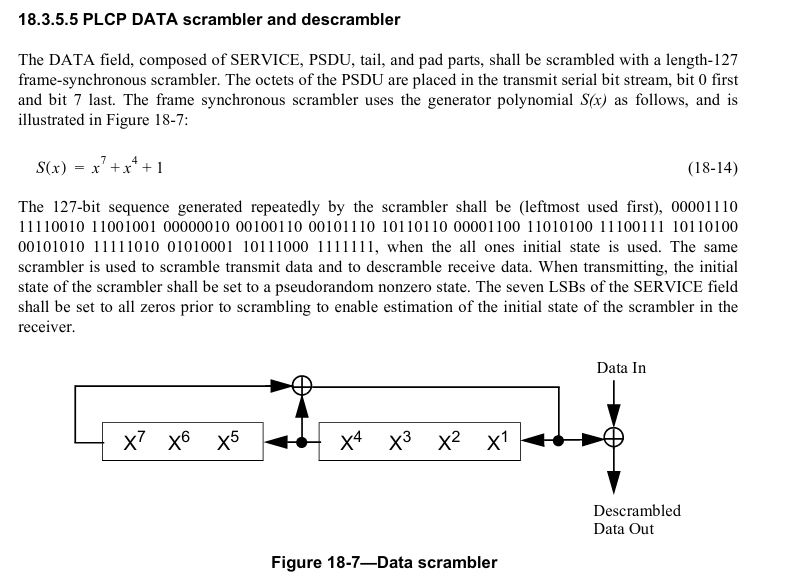
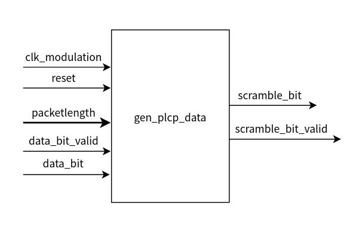
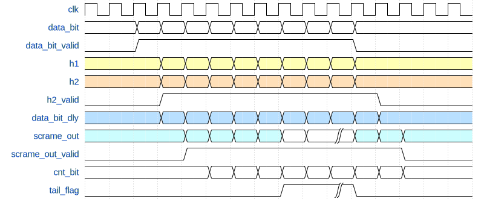

# 1. 前言
在上一篇博客当中，介绍了用户数据是如何产生的，并且给出了crc32的校验方式，对于数据域的数据来说，接下来要涉及到的就是OFDM的相关的编码，调制等操作了。在这篇博客当中，将记录对数据域的数据进行加扰。

<!--more-->

## 2. 生成Data域的用户数据bit流

### Data域构成与 pad 计算
首先回顾一下Data域的数据的组成：

可以看到在Data域当中需要包含service域的16bit数据，然后是用户数据PSDU的bit，然后是6bit的tail bit和最终的pad bit。
为了能够进行后续的操作，我们首先应该将用户的数据转换成符合要求的bit流数据。在这个过程当中，还需要去计算出具体所需要的填充bit的数量。
在这里需要先回顾一下pad bit是如何计算得到的。

在学习的时候是以OFDM QAM64 3/4码率 54Mb/s速率进行设计的，因此在设计的时候需要考虑到这些参数。可以看到NDBPS = 216.

在这里假定用户的数据长度为150，添加CRC之后的数据长度为154。那么可以计算出所需要的OFDM的符号数量为：
NSYM= ceiling((16+8x154+6)/216) = 6

包含pad bit的所有bit长度为：
NData = 6*216 = 1296

由此可以计算出pad bit为:
Npad = 1296-(16+8x154+6) = 42

在实际实现这些操作的时候，也需要在FPGA当中进行这些计算，这里目前是使用IP来完成的，先挖个坑，等到所有的系统搭建完成之后，可以尝试将这些用于计算的IP自己手动来实现一下。

### 模块设计域实现
设计一个用户bit流生成的模块，该模块的作用是将输入的用户数据按照PLCP规定的data域的格式进行转化。

其中输入的信号tx_rate表示当前802.11a的传输速率，在当前的设计为54Mb/s，通过这个变量，根据前面的不同速率域调制方式的表格是可以得到每个OFDM符号所包含的数据bit数量的。
packelength是由前面的用户数据产生模块所提供的，该信号的作用就是指示用户数据的长度，方便后续进行pad bit的计算。
最终的转换结果是串行的bit序列。
该模块有两个始终域，因此在这个里面需要进行一个时钟域的切换，在这里使用到FIFO进行时钟域的切换，并且FIFO还将完成一个将并行的8bit数据转换为穿行的bit流序列。
在clk_user时钟域下，算出填充的pad的数量。
该部分的时序设计如下图所示：


从时序设计图上可以看出，写入到FIFO的数据，在用户数据的前面添加了两个字节的数据，从PPDU的帧结构上看，这两个字节刚好对应16bit的service域。
于是在这里就将service域的数据添加到了用户数据之前。

在数据写入到FIFO之后，就可以开始将数据从FIFO当中弄取出。在这里设计的时候，写入FIFO的时钟也就是clk_user是100MHz，从FIFO中取数据的的时钟，也就是用于之后调制用的时钟的频率是40MHz，并且FIFO实现了一个8bit转1bit的转换，因此读取的速率远低于写入的速率。
在这里当FIFO不为空的时候，就将数据从FIFO当中读取出来，当FIFO当中的数全部读空的时候，再在数据的末尾添加上tail bit和pad bit。
这部分的时序设计如下图所示：

当FIFO当中有数据的时候，就将FIFO当中的数据全部读取出来，知道所有的数据读取完毕之后，再添加6bit的尾bit，然后再添加pad bit。
该模块的代码如下：

```verilog
module tx_generate_data (
    input   wire        clk_User        ,
    input   wire        reset           ,
    input   wire [5:0]  tx_Rate         , // data rate default 54Mb/s(20MHz width)
    input   wire        send_data_valid ,
    input   wire [7:0]  send_data       ,
    input   wire [15:0] packetlength    ,

    input   wire        clk_Modulation  ,
    output  reg         data_bit_valid  ,
    output  reg         data_bit 
);
    reg     [1:0]   send_data_valid_dly ;
    reg     [15:0]  send_data_dly       ;
    wire            send_data_valid_pos_pls;
    reg     [7:0]   bits_per_symbol     ;
    reg     [23:0]  num_of_data_bits    ;

    wire    [31:0]  divider_out         ;
    wire            divider_out_valid   ;

    reg     [23:0]  num_of_symbol       ;
    reg             num_of_symbol_valid ;
    wire    [31:0]  num_of_total_bits   ;
    reg             num_of_toyal_bit_valid;
    reg     [31:0]  num_of_pad_bits     ;

    wire            wr_fifo_en          ;
    wire    [7:0]   wr_fifo_din         ;
    wire            rd_fifo_en          ;
    wire            rd_fifo_dout        ;
    wire            full                ;
    wire            empty               ;

    reg             rd_fifo_en_dly      ;
    wire            rd_fifo_en_neg_pls  ;
    reg             pad_flag            ;
    reg     [31:0]  cnt_pad             ;

    //----------------send_data_valid_dly/send_data_dly------------------
    always @(posedge clk_User) begin
        if(reset == 1'b1)begin
            send_data_dly <= 'd0;
            send_data_valid_dly <= 'd0;
        end
        else begin
            send_data_dly <= {send_data_dly[7:0], send_data};
            send_data_valid_dly <= {send_data_valid_dly[0], send_data_valid};
        end
    end

    // insert 2bytes 0x00 in front of the valid data
    assign wr_fifo_en = send_data_valid_dly[1] | send_data_valid;
    assign wr_fifo_din = send_data_dly[15:8];

    // posedge of send_data_vlaid, used as the divider input valid signal
    assign send_data_valid_pos_pls = (~send_data_valid_dly[0]) & send_data_valid;


    //----------------bits_per_symbol------------------
    always @(posedge clk_User) begin
        if(reset == 1'b1)begin
            bits_per_symbol <= 'd0;
        end
        else begin
            bits_per_symbol <= tx_Rate << 2;
        end
    end

    //----------------num_of_data_bits------------------
    always @(posedge clk_User) begin
        if(reset == 1'b1)begin
            num_of_data_bits <= 'd0;
        end
        else begin
            // data region data bits, 16bit service ID + data bits + 6bit tail bits
            num_of_data_bits <= 16 + (packetlength<<3) + 6;
        end
    end

    //----------------num_of_symbol------------------
    always @(posedge clk_User) begin
        if(reset == 1'b1)begin
            num_of_symbol <= 'd0;
        end
        else if(divider_out_valid)begin
            num_of_symbol <= divider_out[31:8] + (|divider_out[7:0]);
        end
    end

    always @(posedge clk_User) begin
        if (reset == 1'b1) begin
            num_of_symbol_valid <= 1'b0;
            num_of_toyal_bit_valid <= 1'b0;
        end
        else begin
            num_of_symbol_valid <= divider_out_valid;
            num_of_toyal_bit_valid <= num_of_symbol_valid;
        end
    end

    //----------------num_of_pad_bits------------------
    always @(posedge clk_User) begin
        if(reset == 1'b1)begin
            num_of_pad_bits <= 'd0;
        end
        else if(num_of_toyal_bit_valid == 1'b1)begin
            num_of_pad_bits <= num_of_total_bits - num_of_data_bits;
        end
    end

    assign rd_fifo_en = ~empty;

    fifo_generator_8to1 u_fifo_generator_8to1 (
    .rst(reset),        // input wire rst
    .wr_clk(clk_User),  // input wire wr_clk
    .rd_clk(clk_Modulation),  // input wire rd_clk
    .din(wr_fifo_din),        // input wire [7 : 0] din
    .wr_en(wr_fifo_en),    // input wire wr_en
    .rd_en(rd_fifo_en),    // input wire rd_en
    .dout(rd_fifo_dout),      // output wire [0 : 0] dout
    .full(full),      // output wire full
    .empty(empty)    // output wire empty
    );


    ofdm_symbol_divider u_ofdm_symbol_divider (
    .aclk(clk_User),                                  // input wire aclk
    .s_axis_divisor_tvalid(send_data_valid_pos_pls),  // input wire s_axis_divisor_tvalid
    .s_axis_divisor_tdata(bits_per_symbol),           // input wire [7 : 0] s_axis_divisor_tdata
    .s_axis_dividend_tvalid(send_data_valid_pos_pls), // input wire s_axis_dividend_tvalid
    .s_axis_dividend_tdata(num_of_data_bits),         // input wire [23 : 0] s_axis_dividend_tdata
    .m_axis_dout_tvalid(divider_out_valid),           // output wire m_axis_dout_tvalid
    .m_axis_dout_tdata(divider_out)                   // output wire [31 : 0] m_axis_dout_tdata
    );

    ofdm_bits_multiplier u_ofdm_bits_multiplier (
    .CLK(clk_User),  // input wire CLK
    .A(num_of_symbol),      // input wire [23 : 0] A
    .B(bits_per_symbol),      // input wire [7 : 0] B
    .P(num_of_total_bits)      // output wire [31 : 0] P
    );


    //----------------rd_fifo_en_dly------------------
    always @(posedge clk_Modulation) begin
        rd_fifo_en_dly <= rd_fifo_en;
    end

    assign rd_fifo_en_neg_pls = rd_fifo_en_dly & (~rd_fifo_en);

    //----------------pad_flag------------------
    always@(posedge clk_Modulation)begin
        if (reset == 1'b1) begin
            pad_flag <= 1'b0;
        end
        else if((cnt_pad == (num_of_pad_bits + 6 - 1)) && (pad_flag == 1'b1))begin
            pad_flag <= 1'b0;
        end
        else if (rd_fifo_en_neg_pls == 1'b1) begin
            pad_flag <= 1'b1;
        end
    end

    //----------------cnt_pad------------------
    always @(posedge clk_Modulation) begin
        if (reset == 1'b1) begin
            cnt_pad <= 'd0;
        end
        else if((cnt_pad == (num_of_pad_bits + 6 - 1)) && (pad_flag == 1'b1))begin
            cnt_pad <= 'd0;
        end
        else if (rd_fifo_en_neg_pls | pad_flag) begin
            cnt_pad <= cnt_pad + 1'b1;
        end
    end

    //----------------data_bit------------------
    always @(posedge clk_Modulation) begin
        if (reset == 1'b1) begin
            data_bit <= 1'b0;
        end
        else if(rd_fifo_en)begin
            data_bit <= rd_fifo_dout;
        end
        else if(rd_fifo_en_neg_pls | pad_flag)begin
            data_bit <= 1'b0;
        end
    end

    always@(posedge clk_Modulation)begin
        if (reset == 1'b1) begin
            data_bit_valid <= 1'b0;
        end
        else if(rd_fifo_en | rd_fifo_en_neg_pls | pad_flag) begin
            data_bit_valid <= 1'b1;
        end
        else begin
            data_bit_valid <= 1'b0;
        end
    end

    
endmodule
```

# 3. 数据加扰模块

数据加扰的目的，书上的描述如下：

scramble 的生成多项式和硬件结构如下图所示：



加扰模块在实现的时候还是比较简单的，需要找出输入的数据需要和移位寄存器的哪几位的输出值进行异或就可以了。
加扰模块在这里没有对tail bit进行加扰，因此输出tailbit对应的位置，需要给这部分置零。

数据加扰模块的接口如下：

输入的packelength的作用是为了来定位tail bit的位置，从而将tail bit所处的位置不进行加扰。

时序设计如下图所示：


```verilog
module scramble_lc (
	input  	wire  			clk_Modulation		,
	input 	wire  			reset 				,
	input 	wire 	[15:0]	packetlength 		,
	input 	wire  			data_bit_valid 		,
	input 	wire  			data_bit 			,
	output 	reg  			scramble_bit_valid	,
	output 	reg  			scramble_bit 
	);

	//====================================================
	// parameter define
	//====================================================
	localparam SCRAMBLE_REG_INIT = 7'b0001111;
	localparam TAIL_BIT_LENGTH = 6;

	//====================================================
	// internal signals and registers
	//====================================================
	reg 	[6:0]		h1; // scramble shift register
	reg  				h2;	// output of scramble shift register
	reg   				h2_valid		; // valid of scramble shift register output
	reg  				data_bit_dly	;
	reg  				scramble_data 	;
	reg  	[19:0]		tail_bit_start	; // start index of tail bits
	reg  				tail_bit_flag	; // tail bit flag
	reg  	[19:0]		cnt_bit 		;
	reg  				scramble_bit_valid_dly 	;
	wire  				scramble_bit_valid_neg_pls;


	//----------------h1------------------
	always @(posedge clk_Modulation) begin
		if (reset == 1'b1) begin
			h1 <= SCRAMBLE_REG_INIT;
		end
		else if (scramble_bit_valid_neg_pls) begin
			h1 <= SCRAMBLE_REG_INIT;
		end
		else if(data_bit_valid) begin
			h1 <= {h1[5:0], h1[6]^h1[3]};
		end
	end

	//----------------h2------------------
	always@(posedge clk_Modulation)begin
		if (reset == 1'b1) begin
			h2 <= 1'b0;
		end
		else if(scramble_bit_valid_neg_pls)begin
			h2 <= 1'b0;
		end
		else if(data_bit_valid)begin
			h2 <= h1[6]^h1[3];
		end
	end

	//----------------data_bit_dly------------------
	always@(posedge clk_Modulation)begin
		data_bit_dly <= data_bit;
	end

	//----------------h2_valid------------------
	always @(posedge clk_Modulation) begin
		if(reset == 1'b1)begin
			h2_valid <= 1'b0;
		end
		else begin
			h2_valid <= data_bit_valid;
		end
	end

	//----------------scramble_bit_valid------------------
	always@(posedge clk_Modulation)begin
		if (reset == 1'b1) begin
			scramble_bit_valid <= 1'b0;
		end
		else begin
			scramble_bit_valid <= h2_valid;
		end
	end

	//---------------scramble_data-------------------
	always @(posedge clk_Modulation) begin
		if (reset == 1'b1) begin
			scramble_data <= 1'b0;
		end
		else if(h2_valid == 1'b1)begin
			scramble_data <= h2 ^ data_bit_dly;
		end
	end

	//----------------tail_bit_start------------------
	always@(posedge clk_Modulation)begin
		if (reset == 1'b1) begin
			tail_bit_start <= 'd0;
		end
		else begin
			tail_bit_start <= (packetlength<<3) + 16;
		end
	end

	//----------------cnt_bit------------------
	always @(posedge clk_Modulation) begin
		if (reset == 1'b1) begin
			cnt_bit <= 'd0;
		end
		else if(scramble_bit_valid == 1'b1)begin
			cnt_bit <= cnt_bit + 1'b1;
		end
		else begin
			cnt_bit <= 'd0;
		end
	end

	//----------------tail_bit_flag------------------
	always @(posedge clk_Modulation) begin
		if(reset == 1'b1)begin
			tail_bit_flag <= 1'b0;
		end
		else if(cnt_bit == (tail_bit_start+TAIL_BIT_LENGTH -1))begin
			tail_bit_flag <= 1'b0;
		end
		else if(cnt_bit == (tail_bit_start - 1))begin
			tail_bit_flag <= 1'b1;
		end
	end

	//----------------scramble_bit_valid_dly------------------
	always@(posedge clk_Modulation)begin
		scramble_bit_valid_dly <= scramble_bit_valid;
	end
	assign scramble_bit_valid_neg_pls = scramble_bit_valid_dly & (~scramble_bit_valid);

	always @(*)begin
		if(scramble_bit_valid)begin
			if(tail_bit_flag)begin
				scramble_bit = 1'b0;
			end
			else begin
				scramble_bit = scramble_data;
			end
		end
		else begin
			scramble_bit = 1'b0;
		end
	end

endmodule

```
