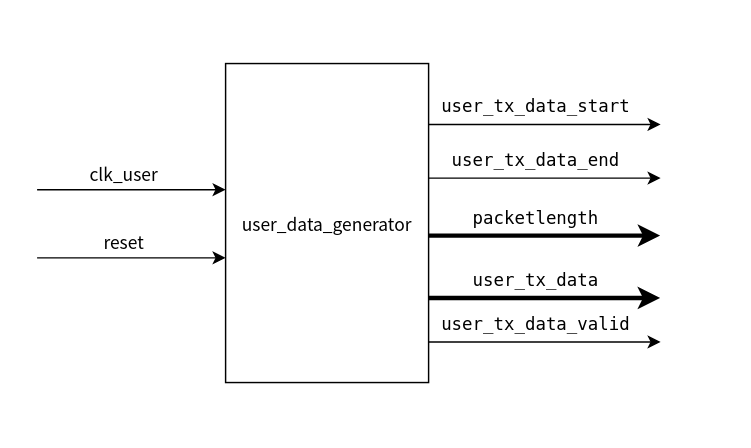

# 1. 前言
在前面的博客介绍了OFDM发射机的整体结构，真个发射机的模块还是比较多的，因此在实现的时候，按照模块设计的方式来一一实现每一个模块。这篇博客当中会介绍用户数据生成模块和为用户数据添加CRC的模块。
通过前面的介绍，我们可以知道，802.11a是可以实现传输网络数据的，在学习以太网的时候，我们可以知道在mac层上需要对数据进行crc校验，因此在实现802.11a的时候，同样可以对用户数据进行校验。
<!--more-->


## 2. 用户数据生成模块
用户数据的主要作用是循环地产生一帧用户数据，以供后续的各个模块进行使用。
在该模块当中，需要指出一帧用户数据的起始和结束，同事需要将产生的有效数据传递给下游模块，与此同时，还需要将一帧数据的长度传递给其他模块进行使用。


该模块的功能比较简单，在实际的时候的时序设计如下图所示：


该部分的代码如下：
```verilog
`timescale 1ns/1ps

module UserDataGen (
    input   wire            clk_User            , // user domain clock
    input   wire            reset               , // system reset
    
    output  reg            user_tx_data_start  , // start of user data
    output  reg            user_tx_data_end    , // end of yser data
    output  reg    [15:0]  packetlength        , // user data length including 4bytes crc
    output  reg            user_tx_data_valid  , // user data valid 
    output  wire   [7:0]   user_tx_data          // user data
);

    reg [15:0]  packet_cnt_r    ;  
    reg [15:0]  start_cnt_r     ;  
    reg [15:0]  cycle_cnt_r     ;  

    reg [15:0]  tvg_cnt         ; // counter for user data generation
    reg [15:0]  pkt_cnt         ; // counter for pakcet length


    //----------------register user packet info------------------
    always @(posedge clk_User) begin
        if(reset == 1'b1)begin
            packet_cnt_r <= 'd150; 
            start_cnt_r  <= 'd100;
            cycle_cnt_r  <= 'd19900;
        end
        else begin
            packet_cnt_r <= packet_cnt_r;    
            start_cnt_r  <= start_cnt_r;
            cycle_cnt_r  <= cycle_cnt_r;
        end
    end

    //----------------tvg_cnt------------------
    always @(posedge clk_User) begin
        if(reset == 1'b1)begin
            tvg_cnt <= 'd0;
        end
        else if(tvg_cnt == cycle_cnt_r - 1)begin
            tvg_cnt <= 'd0;
        end
        else begin
            tvg_cnt <= tvg_cnt + 1'b1;
        end
    end

    //---------------user_tx_data_start-------------------
    always @(posedge clk_User) begin
        if(reset == 1'b1)begin
            user_tx_data_start <= 1'b0;
        end
        else if(tvg_cnt == start_cnt_r - 1'b1)begin
            user_tx_data_start <= 1'b1;
        end
        else begin
            user_tx_data_start <= 1'b0;
        end
    end

    //---------------user_tx_data_end-------------------
    always @(posedge clk_User) begin
        if(reset == 1'b1)begin
            user_tx_data_end <= 1'b0;
        end
        else if(pkt_cnt == packet_cnt - 'd2)begin
            user_tx_data_end <= 1'b1;
        end
        else begin
            user_tx_data_end <= 1'b0;
        end
    end

    //----------------packetlength------------------
    always @(posedge clk_User) begin
        if(reset == 1'b1)begin
            packetlength <= 'd0;
        end
        // packet length include 4bytes crc
        else if(tvg_cnt == start_cnt_r - 1'b1) begin
            packetlength <= packet_cnt_r + 'd4;
        end
    end

    //----------------user_tx_data_valid------------------
    always @(posedge clk_User) begin
        if(reset == 1'b1)begin
            user_tx_data_valid <= 1'b0;
        end
        else if(user_tx_data_valid==1'b1 && pkt_cnt==packet_cnt_r-1'b1)begin
            user_tx_data_valid <= 1'b0;
        end
        else if(tvg_cnt == start_cnt_r - 1'b1)begin
            user_tx_data_valid <= 1'b1;
        end
    end

    //----------------pkt_cnt------------------
    always @(posedge clk_User) begin
        if(reset == 1'b1)begin
            pkt_cnt <= 'd0;
        end
        else if(user_tx_data_valid==1'b1 && pkt_cnt==packet_cnt_r-1'b1)begin
            pkt_cnt <= 'd0;
        end
        else if (user_tx_data_valid == 1'b1) begin
            pkt_cnt <= pkt_cnt + 1'b1;
        end
    end

    assign user_tx_data = pkt_cnt[7:0];

endmodule
```

## 3. CRC校验模块
## 3.1 从crc8作为起点
crc是循环冗余校验，对于输入的每一个数据都进行校验，校验完成之后的结构需要添加到原始数据之后。
crc在进行校验的时候，有一个个生成多项式来指示crc的结构， crc多项式的最高位和最低位均为1，所有的crc-8生成多项式可以表示为：
$$G(x) = x^{8}+h_{7}x^{7}+h_{6}x^{6}+h_{5}x^{5}+h_{4}x^{4}+h_{3}x^{3}+h_{2}x^{2}+h_{1}x^{1}+x^{0}$$

其中$h_{x}$为相关性。

### crc8的硬件实现
先假定一个crc-8的多项式系数为：
G(x)=0b1_0000_0111,根据CRC一位寄存器的规定，遇到1的地方就要有一个异或门，可以根据次来画出该系数下的crc-8的硬件结构。

信息码进入之后按照图中的结构进行传输，假设进入的信息码为 0b1101,那么当4bit的信息从高位到低位依次经过crc-8之后，可以得到输出的crc校验结果。

| input |R0|R1|R2|R3|R4|R5|R6|R7|
|--     |--|--|--|--|--|--|--|--|
| INIT  |0 |0 |0 |0 |0 |0 |0 |0 |
| 1     |1 |1 |1 |0 |0 |0 |0 |0 |
| 1     |1 |0 |0 |1 |0 |0 |0 |0 |
| 0     |0 |1 |0 |0 |1 |0 |0 |0 |
| 1     |1 |1 |0 |0 |0 |1 |0 |0 |

可以看到最终输出的crc校验结果是 **0b0110_0011**
现在嘉定移位寄存器的初始值和输入的数据都是任意值，来推导默认的crc-8输出结果。
假定移位寄存器的初始值为 R7R6R5R4R3R2R1R0,输入的数据为D3D2D1D0,那么最终输出的crc-8的校验结果的计算过程如下：

| input |R0     |R1         |R2                 |R3             |R4         |R5     |R6     |R7     |
|--     |--     |--         |--                 |--             |--         |--     |--     |--     |
| INIT  |R0     |R1         |R2                 |R3             |R4         |R5     |R6     |R7     |
| D3    |D3^R7  |D3^R7^R0   |D3^R7^R1           |R2             |R3         |R4     |R5     |R6     |
| D2    |D2^R6  |D2^R6^D3^R7|D2^R6^D3^R7^R0     |D3^R7^R1       |R2         |R3     |R4     |R5     |
| D1    |D1^R5  |D1^R5^D2^R6|D1^R5^D2^R6^D3^R7  |D2^R6^D3^R7^R0 |D3^R7^R1   |R2     |R3     |R4     |
| D0    |D0^R4  |D0^R4^D1^R5|D0^R4^D1^R5^D2^R6 |D1^R5^D2^R6^D3^R7 |D2^R6^D3^R7^R0 |D3^R7^R1 |R2 |R3 |
经过上面的推导，能够得到最终输出的CRC-8的校验结果，通过这种当时能够直接得到CRC-8的校验结果。
```c
crc[0] = D0^R4;
crc[1] = D0^R4^D1^R5;
crc[2] = D0^R4^D1^R5^D2^R6;
crc[3] = D1^R5^D2^R6^D3^R7;
crc[4] = D2^R6^D3^R7^R0;
crc[5] = D3^R7^R1;
crc[6] = R2;
crc[6] = R3;
```

## 3.2 32位的crc校验
标准的crc32的校验生成多项式为：
```c
 CRC polynomial coefficients: x^32 + x^26 + x^23 + x^22 + x^16 + x^12 + x^11 + x^10 + x^8 + x^7 + x^5 + x^4 + x^2 + x + 1
                              0x4C11DB7 (hex)
 CRC width:                   32 bits
 CRC shift direction:         left (big endian)
 Input word width:            8 bits
```
关于crc32的生成多项式的设计，自己推的话，确实比较复杂，需要耗费大量的时间，可以参考下面的crc-32的生成网址，生成crc32的Verilog代码：
[crc校验码生成](https://bues.ch/cms/hacking/crcgen)

其生成的crc32的verilog代码如下,实际使用的时候，我们可以直接基于这个模块进行之后的设计。
```verilog
`ifndef CRC_V_
`define CRC_V_

// CRC polynomial coefficients: x^32 + x^26 + x^23 + x^22 + x^16 + x^12 + x^11 + x^10 + x^8 + x^7 + x^5 + x^4 + x^2 + x + 1
//                              0x4C11DB7 (hex)
// CRC width:                   32 bits
// CRC shift direction:         left (big endian)
// Input word width:            8 bits

module crc (
    input [31:0] crcIn,
    input [7:0] data,
    output [31:0] crcOut
);
    assign crcOut[0] = (crcIn[24] ^ crcIn[30] ^ data[0] ^ data[6]);
    assign crcOut[1] = (crcIn[24] ^ crcIn[25] ^ crcIn[30] ^ crcIn[31] ^ data[0] ^ data[1] ^ data[6] ^ data[7]);
    assign crcOut[2] = (crcIn[24] ^ crcIn[25] ^ crcIn[26] ^ crcIn[30] ^ crcIn[31] ^ data[0] ^ data[1] ^ data[2] ^ data[6] ^ data[7]);
    assign crcOut[3] = (crcIn[25] ^ crcIn[26] ^ crcIn[27] ^ crcIn[31] ^ data[1] ^ data[2] ^ data[3] ^ data[7]);
    assign crcOut[4] = (crcIn[24] ^ crcIn[26] ^ crcIn[27] ^ crcIn[28] ^ crcIn[30] ^ data[0] ^ data[2] ^ data[3] ^ data[4] ^ data[6]);
    assign crcOut[5] = (crcIn[24] ^ crcIn[25] ^ crcIn[27] ^ crcIn[28] ^ crcIn[29] ^ crcIn[30] ^ crcIn[31] ^ data[0] ^ data[1] ^ data[3] ^ data[4] ^ data[5] ^ data[6] ^ data[7]);
    assign crcOut[6] = (crcIn[25] ^ crcIn[26] ^ crcIn[28] ^ crcIn[29] ^ crcIn[30] ^ crcIn[31] ^ data[1] ^ data[2] ^ data[4] ^ data[5] ^ data[6] ^ data[7]);
    assign crcOut[7] = (crcIn[24] ^ crcIn[26] ^ crcIn[27] ^ crcIn[29] ^ crcIn[31] ^ data[0] ^ data[2] ^ data[3] ^ data[5] ^ data[7]);
    assign crcOut[8] = (crcIn[0] ^ crcIn[24] ^ crcIn[25] ^ crcIn[27] ^ crcIn[28] ^ data[0] ^ data[1] ^ data[3] ^ data[4]);
    assign crcOut[9] = (crcIn[1] ^ crcIn[25] ^ crcIn[26] ^ crcIn[28] ^ crcIn[29] ^ data[1] ^ data[2] ^ data[4] ^ data[5]);
    assign crcOut[10] = (crcIn[2] ^ crcIn[24] ^ crcIn[26] ^ crcIn[27] ^ crcIn[29] ^ data[0] ^ data[2] ^ data[3] ^ data[5]);
    assign crcOut[11] = (crcIn[3] ^ crcIn[24] ^ crcIn[25] ^ crcIn[27] ^ crcIn[28] ^ data[0] ^ data[1] ^ data[3] ^ data[4]);
    assign crcOut[12] = (crcIn[4] ^ crcIn[24] ^ crcIn[25] ^ crcIn[26] ^ crcIn[28] ^ crcIn[29] ^ crcIn[30] ^ data[0] ^ data[1] ^ data[2] ^ data[4] ^ data[5] ^ data[6]);
    assign crcOut[13] = (crcIn[5] ^ crcIn[25] ^ crcIn[26] ^ crcIn[27] ^ crcIn[29] ^ crcIn[30] ^ crcIn[31] ^ data[1] ^ data[2] ^ data[3] ^ data[5] ^ data[6] ^ data[7]);
    assign crcOut[14] = (crcIn[6] ^ crcIn[26] ^ crcIn[27] ^ crcIn[28] ^ crcIn[30] ^ crcIn[31] ^ data[2] ^ data[3] ^ data[4] ^ data[6] ^ data[7]);
    assign crcOut[15] = (crcIn[7] ^ crcIn[27] ^ crcIn[28] ^ crcIn[29] ^ crcIn[31] ^ data[3] ^ data[4] ^ data[5] ^ data[7]);
    assign crcOut[16] = (crcIn[8] ^ crcIn[24] ^ crcIn[28] ^ crcIn[29] ^ data[0] ^ data[4] ^ data[5]);
    assign crcOut[17] = (crcIn[9] ^ crcIn[25] ^ crcIn[29] ^ crcIn[30] ^ data[1] ^ data[5] ^ data[6]);
    assign crcOut[18] = (crcIn[10] ^ crcIn[26] ^ crcIn[30] ^ crcIn[31] ^ data[2] ^ data[6] ^ data[7]);
    assign crcOut[19] = (crcIn[11] ^ crcIn[27] ^ crcIn[31] ^ data[3] ^ data[7]);
    assign crcOut[20] = (crcIn[12] ^ crcIn[28] ^ data[4]);
    assign crcOut[21] = (crcIn[13] ^ crcIn[29] ^ data[5]);
    assign crcOut[22] = (crcIn[14] ^ crcIn[24] ^ data[0]);
    assign crcOut[23] = (crcIn[15] ^ crcIn[24] ^ crcIn[25] ^ crcIn[30] ^ data[0] ^ data[1] ^ data[6]);
    assign crcOut[24] = (crcIn[16] ^ crcIn[25] ^ crcIn[26] ^ crcIn[31] ^ data[1] ^ data[2] ^ data[7]);
    assign crcOut[25] = (crcIn[17] ^ crcIn[26] ^ crcIn[27] ^ data[2] ^ data[3]);
    assign crcOut[26] = (crcIn[18] ^ crcIn[24] ^ crcIn[27] ^ crcIn[28] ^ crcIn[30] ^ data[0] ^ data[3] ^ data[4] ^ data[6]);
    assign crcOut[27] = (crcIn[19] ^ crcIn[25] ^ crcIn[28] ^ crcIn[29] ^ crcIn[31] ^ data[1] ^ data[4] ^ data[5] ^ data[7]);
    assign crcOut[28] = (crcIn[20] ^ crcIn[26] ^ crcIn[29] ^ crcIn[30] ^ data[2] ^ data[5] ^ data[6]);
    assign crcOut[29] = (crcIn[21] ^ crcIn[27] ^ crcIn[30] ^ crcIn[31] ^ data[3] ^ data[6] ^ data[7]);
    assign crcOut[30] = (crcIn[22] ^ crcIn[28] ^ crcIn[31] ^ data[4] ^ data[7]);
    assign crcOut[31] = (crcIn[23] ^ crcIn[29] ^ data[5]);
endmodule

`endif // CRC_V_
```

## 3.3 crc校验模块设计

在802.11a当中，crc校验的初始值全为1，最终的crc32输出需要将求得的crc32与32'hFFFF_FFFF异或之后作为最终的crc结果输出。


有了上述的了解之后，接下来就可以着手进行crc的数据添加了。
该模块的接口设计如下，从用户数据产生模块得到的数据，输入到本模块当中，需要给这个模块添加上crc。


接下来可以尝试这个模块的时序设计，该模块的时序设计如下图所示：


实现的代码如下：

```verilog
// -----------------------------------------------------------------------------
// Copyright (c) 2019-2022 All rights reserved
// -----------------------------------------------------------------------------
// Author 	 : WCC 1530604142@qq.com
// File   	 : crc32
// Create 	 : 2022-04-12
// Revise 	 : 2022-
// Editor 	 : Vscode, tab size (4)
// Functions : crc32 for 802.11
// CRC polynomial coefficients: x^32 + x^26 + x^23 + x^22 + x^16 + x^12 + x^11 + x^10 + x^8 + x^7 + x^5 + x^4 + x^2 + x + 1
//                              0x4C11DB7 (hex)
// CRC width:                   32 bits
// CRC shift direction:         left (big endian)
// Input word width:            8 bits
// -----------------------------------------------------------------------------

`timescale 1ns/1ps

module crc32 (
    input   wire            clk_User,
    input   wire            reset   ,
    input   wire            crc_en  ,
    input   wire    [7:0]   data_in ,

    output  wire            crc_data_valid  ,
    output  reg     [7:0]   crc_data
);

    reg         crc_en_dly      ;
    wire        crc_en_neg_pls  ;
    reg         crc_flag           ;
    reg         crc_flag_dly       ;
    reg         crc_en_neg_pls_dly;
    reg  [2:0]  cnt_crc         ;

    reg [31:0]  crc_in   ;
    wire [7:0]  data   ;
    reg [31:0]  crc_out;
    reg [31:0]  crc_q;

    assign data = data_in;

    //----------------crc check------------------
    always @(*) begin
        if(crc_en == 1'b1)begin
            crc_q[0] = (crc_in[24] ^ crc_in[30] ^ data[0] ^ data[6]);
            crc_q[1] = (crc_in[24] ^ crc_in[25] ^ crc_in[30] ^ crc_in[31] ^ data[0] ^ data[1] ^ data[6] ^ data[7]);
            crc_q[2] = (crc_in[24] ^ crc_in[25] ^ crc_in[26] ^ crc_in[30] ^ crc_in[31] ^ data[0] ^ data[1] ^ data[2] ^ data[6] ^ data[7]);
            crc_q[3] = (crc_in[25] ^ crc_in[26] ^ crc_in[27] ^ crc_in[31] ^ data[1] ^ data[2] ^ data[3] ^ data[7]);
            crc_q[4] = (crc_in[24] ^ crc_in[26] ^ crc_in[27] ^ crc_in[28] ^ crc_in[30] ^ data[0] ^ data[2] ^ data[3] ^ data[4] ^ data[6]);
            crc_q[5] = (crc_in[24] ^ crc_in[25] ^ crc_in[27] ^ crc_in[28] ^ crc_in[29] ^ crc_in[30] ^ crc_in[31] ^ data[0] ^ data[1] ^ data[3] ^ data[4] ^ data[5] ^ data[6] ^ data[7]);
            crc_q[6] = (crc_in[25] ^ crc_in[26] ^ crc_in[28] ^ crc_in[29] ^ crc_in[30] ^ crc_in[31] ^ data[1] ^ data[2] ^ data[4] ^ data[5] ^ data[6] ^ data[7]);
            crc_q[7] = (crc_in[24] ^ crc_in[26] ^ crc_in[27] ^ crc_in[29] ^ crc_in[31] ^ data[0] ^ data[2] ^ data[3] ^ data[5] ^ data[7]);
            crc_q[8] = (crc_in[0] ^ crc_in[24] ^ crc_in[25] ^ crc_in[27] ^ crc_in[28] ^ data[0] ^ data[1] ^ data[3] ^ data[4]);
            crc_q[9] = (crc_in[1] ^ crc_in[25] ^ crc_in[26] ^ crc_in[28] ^ crc_in[29] ^ data[1] ^ data[2] ^ data[4] ^ data[5]);
            crc_q[10] = (crc_in[2] ^ crc_in[24] ^ crc_in[26] ^ crc_in[27] ^ crc_in[29] ^ data[0] ^ data[2] ^ data[3] ^ data[5]);
            crc_q[11] = (crc_in[3] ^ crc_in[24] ^ crc_in[25] ^ crc_in[27] ^ crc_in[28] ^ data[0] ^ data[1] ^ data[3] ^ data[4]);
            crc_q[12] = (crc_in[4] ^ crc_in[24] ^ crc_in[25] ^ crc_in[26] ^ crc_in[28] ^ crc_in[29] ^ crc_in[30] ^ data[0] ^ data[1] ^ data[2] ^ data[4] ^ data[5] ^ data[6]);
            crc_q[13] = (crc_in[5] ^ crc_in[25] ^ crc_in[26] ^ crc_in[27] ^ crc_in[29] ^ crc_in[30] ^ crc_in[31] ^ data[1] ^ data[2] ^ data[3] ^ data[5] ^ data[6] ^ data[7]);
            crc_q[14] = (crc_in[6] ^ crc_in[26] ^ crc_in[27] ^ crc_in[28] ^ crc_in[30] ^ crc_in[31] ^ data[2] ^ data[3] ^ data[4] ^ data[6] ^ data[7]);
            crc_q[15] = (crc_in[7] ^ crc_in[27] ^ crc_in[28] ^ crc_in[29] ^ crc_in[31] ^ data[3] ^ data[4] ^ data[5] ^ data[7]);
            crc_q[16] = (crc_in[8] ^ crc_in[24] ^ crc_in[28] ^ crc_in[29] ^ data[0] ^ data[4] ^ data[5]);
            crc_q[17] = (crc_in[9] ^ crc_in[25] ^ crc_in[29] ^ crc_in[30] ^ data[1] ^ data[5] ^ data[6]);
            crc_q[18] = (crc_in[10] ^ crc_in[26] ^ crc_in[30] ^ crc_in[31] ^ data[2] ^ data[6] ^ data[7]);
            crc_q[19] = (crc_in[11] ^ crc_in[27] ^ crc_in[31] ^ data[3] ^ data[7]);
            crc_q[20] = (crc_in[12] ^ crc_in[28] ^ data[4]);
            crc_q[21] = (crc_in[13] ^ crc_in[29] ^ data[5]);
            crc_q[22] = (crc_in[14] ^ crc_in[24] ^ data[0]);
            crc_q[23] = (crc_in[15] ^ crc_in[24] ^ crc_in[25] ^ crc_in[30] ^ data[0] ^ data[1] ^ data[6]);
            crc_q[24] = (crc_in[16] ^ crc_in[25] ^ crc_in[26] ^ crc_in[31] ^ data[1] ^ data[2] ^ data[7]);
            crc_q[25] = (crc_in[17] ^ crc_in[26] ^ crc_in[27] ^ data[2] ^ data[3]);
            crc_q[26] = (crc_in[18] ^ crc_in[24] ^ crc_in[27] ^ crc_in[28] ^ crc_in[30] ^ data[0] ^ data[3] ^ data[4] ^ data[6]);
            crc_q[27] = (crc_in[19] ^ crc_in[25] ^ crc_in[28] ^ crc_in[29] ^ crc_in[31] ^ data[1] ^ data[4] ^ data[5] ^ data[7]);
            crc_q[28] = (crc_in[20] ^ crc_in[26] ^ crc_in[29] ^ crc_in[30] ^ data[2] ^ data[5] ^ data[6]);
            crc_q[29] = (crc_in[21] ^ crc_in[27] ^ crc_in[30] ^ crc_in[31] ^ data[3] ^ data[6] ^ data[7]);
            crc_q[30] = (crc_in[22] ^ crc_in[28] ^ crc_in[31] ^ data[4] ^ data[7]);
            crc_q[31] = (crc_in[23] ^ crc_in[29] ^ data[5]);
        end
        else begin
            crc_q = 32'hFFFF_FFFF;
        end
    end


    always@(posedge clk_User)begin
        crc_en_dly <= crc_en;
    end

    assign crc_en_neg_pls = (~crc_en) & crc_en_dly;

    always@(posedge clk_User)begin
        if(reset == 1'b1)begin
            crc_in <= 32'hFFFF_FFFF;
            crc_out <= 32'hFFFF_FFFF;
        end
        else if(cnt_crc=='d3 && crc_flag == 1'b1)begin
            crc_in <= 32'hFFFF_FFFF;
            crc_out <= 32'hFFFF_FFFF;
        end
        else if(crc_en)begin
            crc_in <= crc_q;
            crc_out <= crc_q ^ 32'hFFFF_FFFF;
        end
    end

    //----------------crc_flag------------------
    always @(posedge clk_User) begin
        if(reset == 1'b1)begin
            crc_flag <= 1'b0;
        end
        else if(cnt_crc=='d3 && crc_flag == 1'b1) begin
            crc_flag <= 1'b0;
        end
        else if(crc_en_neg_pls)begin
            crc_flag <= 1'b1;
        end
    end

    always @(posedge clk_User) begin
        crc_flag_dly <= crc_flag;
        crc_en_neg_pls_dly <= crc_en_neg_pls;
    end

    //----------------cnt_crc------------------
    always @(posedge clk_User) begin
        if(reset == 1'b1)begin
            cnt_crc <= 'd0;
        end
        else if(cnt_crc=='d3 && crc_flag == 1'b1)begin
            cnt_crc <= 'd0;
        end
        else if(crc_flag == 1'b1 || crc_en_neg_pls)begin
            cnt_crc <= cnt_crc + 1'b1;
        end
    end

    //----------------crc_data------------------
    always @(posedge clk_User) begin
        if(reset == 1'b1)begin
            crc_data <= 'd0;
        end
        else if(crc_en == 1'b1) begin
            crc_data <= data_in;
        end
        else if(crc_en_neg_pls | crc_flag) begin
            case(cnt_crc)
                0: crc_data <= crc_out[31:24];
                1: crc_data <= crc_out[23:16];
                2: crc_data <= crc_out[15:8];
                3: crc_data <= crc_out[7:0];
                default: crc_data <= 'd0;
            endcase
        end
        else begin
            crc_data <= 'd0;
        end
    end

    assign crc_data_valid = crc_en_dly | crc_en_neg_pls_dly | crc_flag_dly;
    
endmodule

```