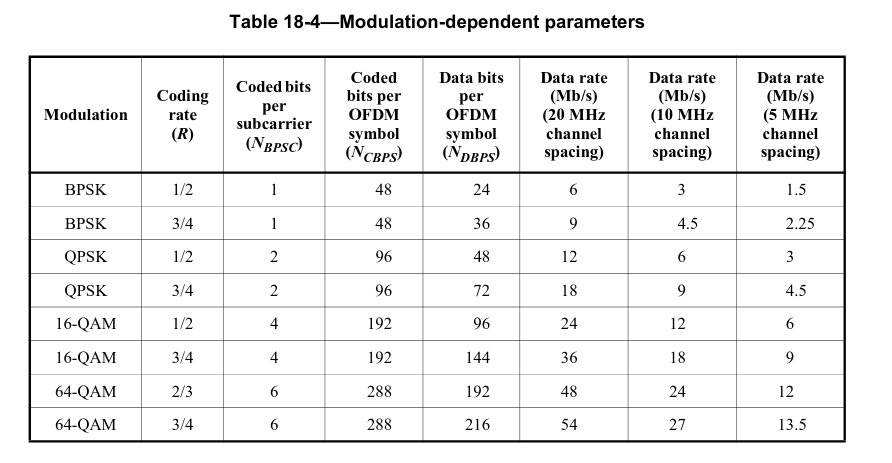

# 1. 前言
疫情宅家，其他工作上的事情不太好做，但是也算是找到一个难得的补充知识的时间了。
作为一个FPGAer，日常当中经常用的就是用FPGA来玩常用的接口，但是感觉这样的日子是走不长远的，需要不断地补充新的知识才可以。
在家这段时间，完成了802.11a的这个协议的OFDM的发射机这一部分的内容的FPGA的实现。于是觉得自己需要把这一部分给记录下来，方便给自己之后进行查阅。
<!--more-->
# 2. 802.11a物理层协议

## 2.1 802.11a相关参数
了解802.11a物理层协议之前，可以先了解一下802.11a的物理层所使用到的主要的参数。

在学习的时候，我主要以20MHz的带宽的802.11a进行学习，因此在这里记录的也主要是和20M带宽相关的一些参数。
对于20MHz带宽的802.11a的相关参数主要有：

对于20MHz的带宽的情况下，一个OFDM的符号的长度为4us，其中有0.8us的保护间隔(GI),出去GI之外的有效数据长度为3.2us。
由此可以得到子载波之间的间隔为1/3.2us= 312.5KHz。
802.11a协议标准采用48个子载波进行数据传输，除了这48传输数据的子载波外，每个OFDM符号内还包括4个导频子载波，还有一个0频的直流。

为了兼顾传输效率与可靠性，系统可以根据信道的状况采用不同效率的纠错编码在各个子载波之间进行数据的传递，再配合上不同的调制方式即可获得6~54Mb/s的编码速率，如下图所示：

其中基本的编码方式为长度为7，编码效率为1/2的卷积编码(Convolution Encoding),再通过对卷积编码后的数据进行删余(Puncturing)操作，可以得到2/3,3/4的编码。
1/2码率的编码与BPSK，QPSK，16QAM调制分别可以提供6，12，24Mb/s的数据传输速率
2/3码率的编码与QAM64调制可以提供48Mb/s的数据传输速率
3/4码率的编码与BPSK，QPSK，16QAM，64QAM调制分别可以提供9,18,36,54Mb/s的数据传输速率。
传输速率的计算公式为: 48个子载波\*每个子载波承载的bit数量\*编码效率/OFDM符号周期。
以QAM64调制，3/4编码效率为例，其数据传输效率为：
48\*6\*(3/4)/4=54Mb/s。

## 2.2 PPDU帧结构
下图为802.11a标准规定的物理层协议数据单元(Physical Protocol Data Unit, PPDU),也是基带发射器索要生成的数据结构。
从PPDU的帧结构可以看出，一个PPDU主要包含3个部分，分别是前导码，signal域，Data域。

前导码包含10个短训练序列STS和两个长训练序列LTS,每个短训练序列的长度为0.8us，每个长训练序列的长度为3.2us，长训练序列的保护间隔为1.6us，前导码的长度为16us。

前导码之后是SIGNAL域，长度为一个OFDM符号的长度，其中包含有后续数据的调制类型，编码速率和字节长度。

最后是PSDU也就是数据域部分，该部分包含的是用户数据经过OFDM调制过后的数据。
由这三个部分最终就构成了PPDU的数据结构。在实现OFDM的发射机的整个过程当中，其实就是实现这每一个部分的过程。

在接下来的博客当中，我会逐步记录如何来实现一个OFDM的发送机的过程。这其中具体包括用户数据生成，CRC校验，数据加扰scramble,卷积编码 Convolution Encoding， 数据删余 Puncture， QAM64星座图映射， IFFT数据转换与添加循环前缀等等这些最基本的操作。
逐步由DATA域到signal域到前导码，最终实现一个完整的OFDM的发送机。