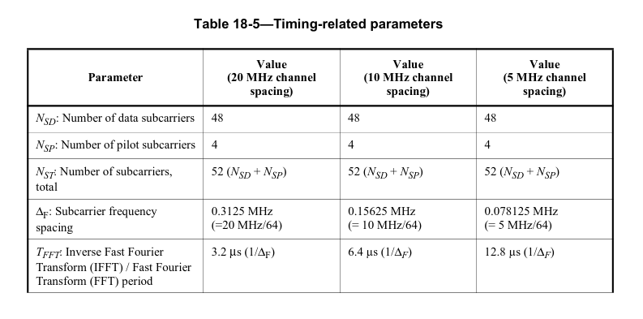
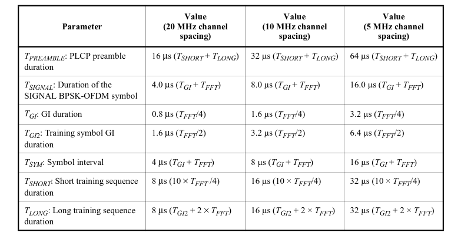
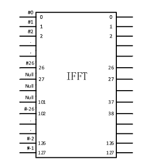
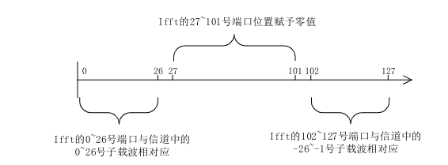
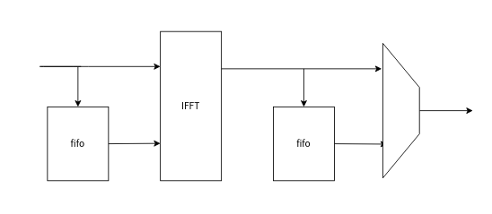
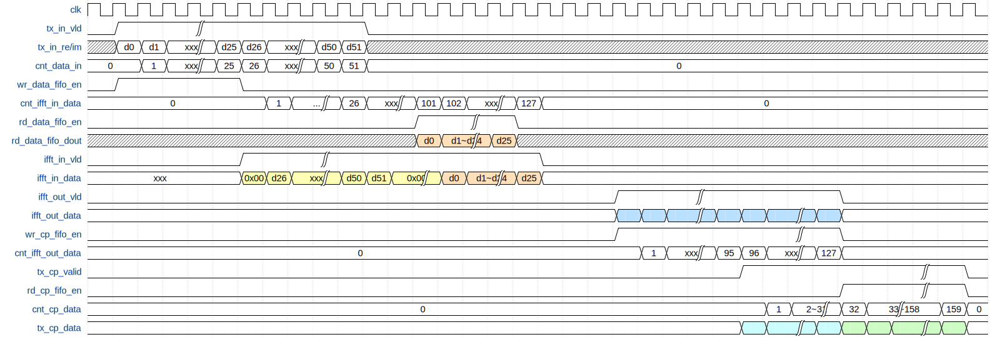

# 1. 前言
在上一篇博客当中，已经实现了星座图的映射，得到了在频域上的点。在经过64QAM调制之后，接下来要做的就是将频域的信号，转换到时域，因为最终在信道中传输的信号都是实际存在的信号。
为了能够消除传输过程当中的符号间干扰，在IFFT处理完毕之后还要加上循环前缀。

<!--more-->
# 2. IFFT
因为在一开始选择调制模式的时候，OFDM的调制模式为64QAM，速率为54Mb/s，带宽为20MHz，因此可以得到相关的时序参数如下：


可以看到一个OFDM的符号的有效数据周期是3.2us，一个OFDM的符号周期是4us。假设采样率是20M，那么该采样率下的采样周期是50ns，因此一个OFDM符号的有效周期需要64个采样点。假设采样率是40M，那么在之后可以通过抽取的方式来进行下采样到20M，因此在采样率为40M的时候，需要IFFT的长度为128点，这样一个符号的长度才能满足3.2us的要求。

在实际使用的时候IFFT的处理是使用xilinx的IP来实现的，因此需要知道这个IP的工作方式，对于该IP，以一个128点的IFFT IP来举例。其IP的第一个输入是0频的值，1~64是正频率，65~127是负频率。以OFDM的子载波为例子，来使用IFFT的话，其零频对应IFFT的第一个输入，而子载波1~26，分别对应IFFT的1~26，子载波-26~-1对应102~127端口。
IFFT IP的其他位置补零即可。





# 3. 添加循环前缀
在经过IFFT处理之后，我们能够得到时域采样点，为了能够消除符号间的干扰，需要对数据进行循环前缀的添加。在实际的处理过程当中，只需要将一个OFDM符号的末尾的时域波形进行复制然后添加到符号的有效数据之前即可。
由OFDM的符号长度可以知道，一个OFDM的保护间隔为0.8us，因此只需要将一个OFDM符号有效数据的末尾的1/4进行复制即可完成循环前缀的添加。

# 4. 模块的实现
在了解了基本的原理之后，就可以着手进行该模块的设计了，在前面一个模块当中，我们可以直到，映射完成之后的结果是按照通道-26到26依次传输出来，并且不包含零频。而传入到IFFT的模块的信号需要按照先传输正频率部分的频点，然后传输负频率的频点。因此需要对-26到-1的子载波的频点进行缓存。
当IIFT处理到第102~127，再依次将数据负频率的频点依次从FIFO中取出来。
当IFFT处理完128点之后，会将时域采样点输出，为了能够将OFDM符号末尾的时域点进行复制作为循环前缀，因此需要将处理完成之后的数据进行缓存，当循环前缀输出完毕之后，再从FIFO当中把OFDM符号的时域点依次取出。




该模块的时需设计如下：


该部分代码如下：
```verilog
`timescale 1ns / 1ps

module tx_freqd_to_timed(
	input	wire 			clk_Modulation					,
	input	wire 			reset							,
	input	wire 	[15:0]	n_ofdm_syms						,
	input	wire 			tx_freqd_to_timed_valid			,
	input	wire 	[31:0]	tx_freqd_to_timed_re			,
	input	wire 	[31:0]	tx_freqd_to_timed_im			,
	output 	reg 			tx_freq_to_timed_cycle_flag		,
	output 	reg 			tx_add_cyclic_prefix_valid		,
	output 	reg 			tx_add_cyclic_prefix_end		,
	output 	reg 	[15:0]	tx_add_cyclic_prefix_re			,
	output 	reg 	[15:0]	tx_add_cyclic_prefix_im
    );

	reg  [7:0]	cnt_data_in 		; // counter for how many datas go into this module
	reg  		ifft_in_tvalid		; // data go into ifft valid 
	reg  [7:0]	cnt_ifft_in_data 	; // counter for how many datas send to ifft
	reg  [7:0]	cnt_ifft_out_data 	; // counter for how many datas from ifft output
	reg  [7:0]	cnt_cp_data  		; // counter for add cyclic prefix
	reg  [15:0]	cnt_ofdm_symbol 	; // counter for ofdm symbol
	wire  		ifft_in_tlast 		; // last beat of ifft input data
	reg [63:0]	ifft_in_tdata 		; // bit [63:32] the imaginary part, bit [31:0] real part

	wire [79:0] ifft_out_tdata		; // ifft output data bit[79:40] imaginary part, bit[39:0] real part
	wire [7:0] 	ifft_out_tuser		; // indicate the index of the ifft output
	wire 		ifft_out_tvalid 	; // ifft output data valid
	wire  		ifft_out_tlast 		; // last beat of ifft output

	reg [15:0] ifft_out_re  		; // ifft real part after truncation
	reg [15:0] ifft_out_im  		; // ifft imaginary part after truncation

	wire [63:0] wr_data_fifo_din	; // bit [63:32] the imaginary part, bit [31:0] real part
	reg 		wr_data_fifo_en		;
	reg 		rd_data_fifo_en		;
	wire [63:0] rd_data_fifo_dout	; // bit [63:32] the imaginary part, bit [31:0] real part
	wire   		data_fifo_full		;
	wire   		data_fifo_empty		;

	wire [31:0] wr_cp_fifo_din		; // after truncation data, bit[31:16] imaginary part, bit [15:0] real part
	wire  		wr_cp_fifo_en		;
	reg  		rd_cp_fifo_en		;
	wire [31:0] rd_cp_fifo_dout		;
	wire  		cp_fifo_full		;
	wire  		cp_fifo_empty		;


	//----------------wr_data_fifo_en------------------
	always @(*) begin
		// buffer the -26 ~ -1 channel data for ofdm symbol
		if(tx_freqd_to_timed_valid == 1'b1 && cnt_data_in < 26)begin
			wr_data_fifo_en = 1'b1;
		end
		else begin
			wr_data_fifo_en = 1'b0;
		end
	end

	assign wr_data_fifo_din = {tx_freqd_to_timed_im, tx_freqd_to_timed_re};

	//----------------cnt_data_in------------------
	always @(posedge clk_Modulation) begin
		if (reset == 1'b1) begin
			cnt_data_in <= 'd0;
		end
		else if (tx_freqd_to_timed_valid) begin
			cnt_data_in <= cnt_data_in + 1'b1;
		end
		else begin
			cnt_data_in <= 'd0;
		end
	end

	//----------------ifft_in_valid------------------
	always @(posedge clk_Modulation) begin
		if (reset == 1'b1) begin
			ifft_in_tvalid <= 1'b0;
		end
		else if (ifft_in_tvalid == 1'b1 && cnt_ifft_in_data == 'd127) begin
			ifft_in_tvalid <= 1'b0;
		end
		else if (tx_freqd_to_timed_valid == 1'b1 && cnt_data_in == 'd25) begin
			ifft_in_tvalid <= 1'b1;
		end
	end

	//----------------cnt_ifft_in_data------------------
	always @(posedge clk_Modulation) begin
		if (reset == 1'b1) begin
			cnt_ifft_in_data <= 'd0;
		end
		else if (ifft_in_tvalid == 1'b1 && cnt_ifft_in_data == 'd127) begin
			cnt_ifft_in_data <= 'd0;
		end
		else if (ifft_in_tvalid == 1'b1) begin
			cnt_ifft_in_data <= cnt_ifft_in_data + 1'b1;
		end

	end

	//----------------rd_data_fifo_en------------------
	// read out the buffered channel -26 ~ -1 ofdm data,
	// put it into the ifft 101 ~ 127 point 
	always @(posedge clk_Modulation) begin
		if (reset == 1'b1) begin
			rd_data_fifo_en <= 1'b0;
		end
		else if (ifft_in_tvalid == 1'b1 && cnt_ifft_in_data == 'd126) begin
			rd_data_fifo_en <= 1'b0;
		end
		else if (ifft_in_tvalid == 1'b1 && cnt_ifft_in_data == 'd100) begin
			rd_data_fifo_en <= 1'b1;
		end
	end

	//----------------ifft_in_tdata------------------
	always @(posedge clk_Modulation) begin
		if (reset == 1'b1) begin
			ifft_in_tdata <= 'd0;
		end
		//channel 1~26
		else if (ifft_in_tvalid == 1'b1 && tx_freqd_to_timed_valid == 1'b1) begin
			ifft_in_tdata <= {tx_freqd_to_timed_im, tx_freqd_to_timed_re};
		end
		// channel -26 ~ -1
		else if (ifft_in_tvalid == 1'b1 && rd_data_fifo_en == 1'b1) begin
			ifft_in_tdata <= rd_data_fifo_dout;
		end
		//channel 0 is DC, other unused channel set to zero
		else begin
			ifft_in_tdata <= 'd0;
		end
	end

	//----------------ifft_in_tlast------------------
	assign ifft_in_tlast = cnt_ifft_in_data == 'd127;

	fifo_generator_tx_freqd_to_timed u_fifo_generator_tx_freqd_to_timed (
		.clk(clk_Modulation),      // input wire clk
		.srst(reset),    // input wire srst
		.din(wr_data_fifo_din),      // input wire [63 : 0] din
		.wr_en(wr_data_fifo_en),  // input wire wr_en
		.rd_en(rd_data_fifo_en),  // input wire rd_en
		.dout(rd_data_fifo_dout),    // output wire [63 : 0] dout
		.full(data_fifo_full),    // output wire full
		.empty(data_fifo_empty)  // output wire empty
	);

	xfft_tx_freqd_to_timed u_xfft_tx_freqd_to_timed (
		.aclk(clk_Modulation),                                                // input wire aclk
		.s_axis_config_tdata(8'd0),                  // input wire [7 : 0] s_axis_config_tdata
		.s_axis_config_tvalid(1'b1),                // input wire s_axis_config_tvalid
		.s_axis_config_tready(),                // output wire s_axis_config_tready
		.s_axis_data_tdata(ifft_in_tdata),                      // input wire [63 : 0] s_axis_data_tdata
		.s_axis_data_tvalid(ifft_in_tvalid),                    // input wire s_axis_data_tvalid
		.s_axis_data_tready(),                    // output wire s_axis_data_tready
		.s_axis_data_tlast(ifft_in_tlast),                      // input wire s_axis_data_tlast
		.m_axis_data_tdata(ifft_out_tdata),                      // output wire [79 : 0] m_axis_data_tdata
		.m_axis_data_tuser(ifft_out_tuser),                      // output wire [7 : 0] m_axis_data_tuser
		.m_axis_data_tvalid(ifft_out_tvalid),                    // output wire m_axis_data_tvalid
		.m_axis_data_tready(1'b1),                    // input wire m_axis_data_tready
		.m_axis_data_tlast(ifft_out_tlast),                      // output wire m_axis_data_tlast
		.event_frame_started(),                 // output wire event_frame_started
		.event_tlast_unexpected(),            	// output wire event_tlast_unexpected
		.event_tlast_missing(),                 // output wire event_tlast_missing
		.event_status_channel_halt(),      		// output wire event_status_channel_halt
		.event_data_in_channel_halt(),    		// output wire event_data_in_channel_halt
		.event_data_out_channel_halt()  		// output wire event_data_out_channel_halt
	);


	fifo_generator_tx_add_cyclic_prefix u_fifo_generator_tx_add_cyclic_prefix (
		.clk(clk_Modulation),      // input wire clk
		.srst(reset),    // input wire srst
		.din(wr_cp_fifo_din),      // input wire [31 : 0] din
		.wr_en(wr_cp_fifo_en),  // input wire wr_en
		.rd_en(rd_cp_fifo_en),  // input wire rd_en
		.dout(rd_cp_fifo_dout),    // output wire [31 : 0] dout
		.full(cp_fifo_full),    // output wire full
		.empty(cp_fifo_empty)  // output wire empty
	);

	//----------------ifft_out_re/im------------------
	always @(*) begin
		if(ifft_out_tvalid == 1'b1)begin
			// the highest 3 bits is the same, there is no overflow
			if (ifft_out_tdata[79:77] == 3'b111 || ifft_out_tdata[79:77] == 3'b000) begin
				ifft_out_im <= ifft_out_tdata[77:62];
			end
			// the highest 3bits is not the same and the data is negative
			else if (ifft_out_tdata[79] == 1'b1) begin
				ifft_out_im <= 16'h8000;
			end
			// the highest 3 bits is not the same and the data is positive
			else if (ifft_out_tdata[79] == 1'b0) begin
				ifft_out_im <= 16'h7FFF;
			end
			else begin
				ifft_out_im <= 'd0;
			end
		end
		else begin
			ifft_out_im <= 'd0;
		end
	end

	always @(*) begin
		if(ifft_out_tvalid == 1'b1)begin
			// the highest 3 bits is the same, there is no overflow
			if (ifft_out_tdata[39:37] == 3'b111 || ifft_out_tdata[39:37] == 3'b000) begin
				ifft_out_re <= ifft_out_tdata[37:22];
			end
			// the highest 3bits is not the same and the data is negative
			else if (ifft_out_tdata[39] == 1'b1) begin
				ifft_out_re <= 16'h8000;
			end
			// the highest 3 bits is not the same and the data is positive
			else if (ifft_out_tdata[39] == 1'b0) begin
				ifft_out_re <= 16'h7FFF;
			end
			else begin
				ifft_out_re <= 'd0;
			end
		end
		else begin
			ifft_out_re <= 'd0;
		end
	end

	assign wr_cp_fifo_din = {ifft_out_im, ifft_out_re};
	assign wr_cp_fifo_en = ifft_out_tvalid;

	//----------------cnt_ifft_out_data------------------
	always @(posedge clk_Modulation) begin
		if (reset == 1'b1) begin
			cnt_ifft_out_data <= 'd0;
		end
		else if (ifft_out_tvalid == 1'b1 && cnt_ifft_out_data == 'd127) begin
			cnt_ifft_out_data <= 'd0;
		end
		else if (ifft_out_tvalid == 1'b1) begin
			cnt_ifft_out_data <= cnt_ifft_out_data + 1'b1;
		end
	end

	//----------------tx_freq_to_timed_cycle_flag------------------
	always @(posedge clk_Modulation) begin
		if (reset == 1'b1) begin
			tx_freq_to_timed_cycle_flag <= 1'b0;
		end
		else if(ifft_out_tvalid == 1'b1 && cnt_ifft_out_data == 'd127)begin
			tx_freq_to_timed_cycle_flag <= 1'b1;
		end
		else begin
			tx_freq_to_timed_cycle_flag <= 1'b0;
		end
	end

	//----------------tx_add_cyclic_prefix_valid------------------
	always @(posedge clk_Modulation) begin
		if (reset == 1'b1) begin
			tx_add_cyclic_prefix_valid <= 1'b0;
		end
		else if (tx_add_cyclic_prefix_valid == 1'b1 && cnt_cp_data == 'd159) begin
			tx_add_cyclic_prefix_valid <= 1'b0;
		end
		else if (cnt_ifft_out_data == 'd95) begin
			tx_add_cyclic_prefix_valid <= 1'b1;
		end
	end

	//----------------cnt_cp_data------------------
	always @(posedge clk_Modulation) begin
		if (reset == 1'b1) begin
			cnt_cp_data <= 'd0;
		end
		else if (tx_add_cyclic_prefix_valid == 1'b1 && cnt_cp_data == 'd159) begin
			cnt_cp_data <= 'd0;
		end
		else if (tx_add_cyclic_prefix_valid == 1'b1) begin
			cnt_cp_data <= cnt_cp_data + 1'b1;
		end
	end

	//----------------rd_cp_fifo_en------------------
	always @(posedge clk_Modulation) begin
		if (reset == 1'b1) begin
			rd_cp_fifo_en <= 1'b0;
		end
		else if (tx_add_cyclic_prefix_valid == 1'b1 && cnt_cp_data == 'd159) begin
			rd_cp_fifo_en <= 1'b0;
		end
		else if (tx_add_cyclic_prefix_valid == 1'b1 && cnt_cp_data == 'd31) begin
			rd_cp_fifo_en <= 1'b1;
		end
	end

	always @(*) begin
		// add the tail part of one symbol
		if (tx_add_cyclic_prefix_valid == 1'b1 && ifft_out_tvalid == 1'b1) begin
			tx_add_cyclic_prefix_re <= ifft_out_re;
			tx_add_cyclic_prefix_im <= ifft_out_im;
		end
		else if (rd_cp_fifo_en == 1'b1) begin
			tx_add_cyclic_prefix_re <= rd_cp_fifo_dout[15:0];
			tx_add_cyclic_prefix_im <= rd_cp_fifo_dout[31:16];
		end
		else begin
			tx_add_cyclic_prefix_re <= 'd0;
			tx_add_cyclic_prefix_im <= 'd0;
		end
	end

	//----------------cnt_ofdm_symbol------------------
	always @(posedge clk_Modulation) begin
		if (reset == 1'b1) begin
			cnt_ofdm_symbol <= 'd0;
		end
		else if (tx_add_cyclic_prefix_valid == 1'b1 && cnt_cp_data == 'd159 && cnt_ofdm_symbol == n_ofdm_syms-1) begin
			cnt_ofdm_symbol <= 'd0;
		end
		else if (tx_add_cyclic_prefix_valid == 1'b1 && cnt_cp_data == 'd159) begin
			cnt_ofdm_symbol <= cnt_ofdm_symbol + 1'b1;
		end
	end
	//----------------tx_add_cyclic_prefix_end------------------
	always @(posedge clk_Modulation) begin
		if (reset == 1'b1) begin
			tx_add_cyclic_prefix_end <= 1'b0;
		end
		else if (tx_add_cyclic_prefix_valid == 1'b1 && cnt_cp_data == 'd159 && cnt_ofdm_symbol == n_ofdm_syms-1) begin
			tx_add_cyclic_prefix_end <= 1'b1;
		end
		else begin
			tx_add_cyclic_prefix_end <= 1'b0;
		end
	end

endmodule


```