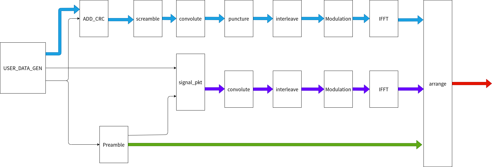

# 1. 前言
在之前的博客当中，已经实现了802.11a当中数据域的一系列处理，最终得到了数据域的时域波形。相较于数据域，signal域的处理很类似并且更简单。
signal域的数据不需要进行加扰和删余操作，因此实现起来比较简单。
signal域的数据采用的是BPSK的调制方式，占据一个OFDM符号。
下图的紫色部分，显示了signal域数据的处理过程。

signal域数首先会根据格式产生一帧数据，然后这个数据再依次经过1/2卷积编码，交织，BPSK调制，IFFT转换以及添加循环前缀之后，最终得到signal域的时域波形。
<!--more-->

# 2. Signal 域帧结构

在前导码之后是signal域，signal域主要包含Rate和Length两个字段，Rate用于传输有关后续数据符号所用到调制信息和码速率。Length字段用于传输PSDU传输的用户数据的字节数。


在Rate字段需要根据所需要的调制方式和码速率填入对应的值。

Length字段需要注意的是，传输是从LSB到MSB。

除了Rate字段和Length字段之外，还有一些还有一些其他校验位和空闲位。
其中bit4是保留位，bit17是偶校验位，用来对前面的16bit进行校验。还有6位的尾bit。

该模块的工作在前导码生成完成之后，该模块可以根据用户的需要将速率和用户数据字节长度等信息填写到signal域数据的对应字段当中。

# 3. signal域数据帧生成设计
了解了signal域的数据帧的构成，就可以来动手实现signal域数据帧的生成，具体的时序设计如下图所示：
在Rate字段需要根据所需要的调制方式和码速率填入对应的值。

由于在length字段当中，length的是LSB在前，MSB在后，因此首先可以对数据长度这个变量进行一个高低位翻转。
然后再对前面的17bit进行偶校验，并将校验的结果填写到校验位上。

具体的代码设计如下：
```verilog
`timescale 1ns / 1ps

module tx_gen_pkt_sig(
	input 	wire		clk_Modulation			,
	input 	wire		reset					,
	input 	wire [5:0]	tx_Rate					,
	input	wire		preamble_ready			,
	input 	wire [15:0]	packetlength			,
	output 	reg 		tx_gen_pkt_sig_valid	,
	output 	wire 		tx_gen_pkt_sig_out
);


	reg 	[3:0] 	rate_and_mod		; // code rate and modulation mode
	reg  	[11:0]	byte_length 		; // byte length of one pkt, need to be reversed, LSB first, MSB least
	reg  			byte_reverse_valid	;
	wire  			even_parity_bit 	; // even parity bit of the signal domain
	reg  	[23:0]	signal_frame_withou_parity;
	wire  	[23:0] 	s  					;
	reg   			signal_frame_withou_parity_valid;
	reg  	[23:0] 	signal_frame_with_parity;
	reg  	[5:0]	cnt_data_bit 		;

	always @(posedge clk_Modulation) begin
		if (reset == 1'b1) begin
			rate_and_mod <= 'd0;
		end
		else if(preamble_ready == 1'b1) begin
			case(tx_Rate)
				6'd54: rate_and_mod <= 4'b0011; 	// 64QAM, 3/4 code rate
				6'd48: rate_and_mod <= 4'b0001; 	// 64QAM, 2/3 code rate
				6'd36: rate_and_mod <= 4'b1011; 	// 16QAM, 3/4 code rate
				6'd24: rate_and_mod <= 4'b1001; 	// 16QAM, 2/3 code rate
				6'd18: rate_and_mod <= 4'b0111;	// QPSK, 3/4 code rate
				6'd12: rate_and_mod <= 4'b0101; 	// QPSK, 2/3 code rate
				6'd9 : rate_and_mod <= 4'b1111; 	// BPSK, 3/4 code rate
				6'd6 : rate_and_mod <= 4'b1101; 	// BPSK, 1/2
				default : rate_and_mod <= 4'b0011;
			endcase
		end
	end

	always @(posedge clk_Modulation) begin
		if (reset == 1'b1) begin
			byte_length <= 'd0;
		end
		else if (preamble_ready == 1'b1) begin
			byte_length <= {packetlength[0], packetlength[1], packetlength[2], packetlength[3], packetlength[4], packetlength[5],
							packetlength[6], packetlength[7], packetlength[8], packetlength[9], packetlength[10], packetlength[11]};
		end
	end

	//---------------byte_reverse_valid-------------------
	always @(posedge clk_Modulation) begin
		if (reset == 1'b1) begin
			byte_reverse_valid <= 1'b0;
		end
		else if (preamble_ready) begin
			byte_reverse_valid <= 1'b1;
		end
		else begin
			byte_reverse_valid <= 1'b0;
		end
	end

	//----------------signal_frame_withou_parity------------------
	always @(posedge clk_Modulation) begin
		if (reset == 1'b1) begin
			signal_frame_withou_parity <= 'd0;
			signal_frame_withou_parity_valid <= 'd0;
		end
		else if (byte_reverse_valid == 1'b1) begin
			signal_frame_withou_parity_valid <= 1'b1;
			signal_frame_withou_parity <= {rate_and_mod, 1'b0, byte_length, 1'b0, 6'b000000};
		end
		else begin
			signal_frame_withou_parity_valid <= 1'b0;
		end
	end

	//----------------signal_frame_with_parity------------------
	assign s = signal_frame_withou_parity;
	assign even_parity_bit = ^s[23:7];

	always @(posedge clk_Modulation)begin
		if(reset == 1'b1) begin
			signal_frame_with_parity <= 'd0;
		end
		else if (signal_frame_withou_parity_valid) begin
			signal_frame_with_parity[6] <= even_parity_bit;
			signal_frame_with_parity[23:7] <=signal_frame_withou_parity[23:7];
			signal_frame_with_parity[5:0] <= signal_frame_withou_parity[5:0];
		end
		else if (tx_gen_pkt_sig_valid == 1'b1) begin
			signal_frame_with_parity <= {signal_frame_with_parity[22:0], 1'b0};
		end
	end

	always @(posedge clk_Modulation) begin
		if (reset == 1'b1) begin
			tx_gen_pkt_sig_valid <= 1'b0;
		end
		else if (cnt_data_bit == 'd23 && tx_gen_pkt_sig_valid == 1'b1) begin
			tx_gen_pkt_sig_valid <= 1'b0;
		end
		else if (signal_frame_withou_parity_valid) begin
			tx_gen_pkt_sig_valid <= 1'b1;
		end
	end

	//----------------cnt_data_bit------------------
	always @(posedge clk_Modulation) begin
		if (reset == 1'b1) begin
			cnt_data_bit <= 'd0;
		end
		else if (cnt_data_bit == 'd23 && tx_gen_pkt_sig_valid == 1'b1) begin
			cnt_data_bit <= 'd0;
		end
		else if(tx_gen_pkt_sig_valid == 1'b1)begin
			cnt_data_bit <= cnt_data_bit + 1'b1;
		end
	end

	assign tx_gen_pkt_sig_out = signal_frame_with_parity[23];


endmodule

```
