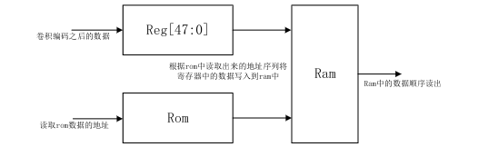
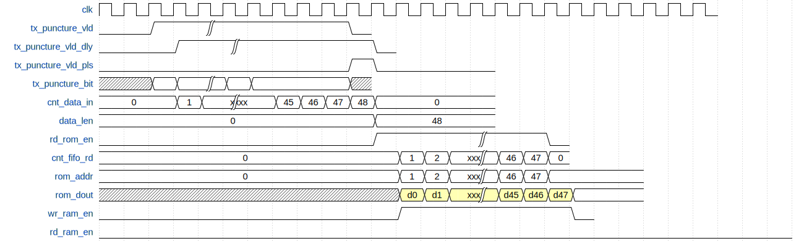
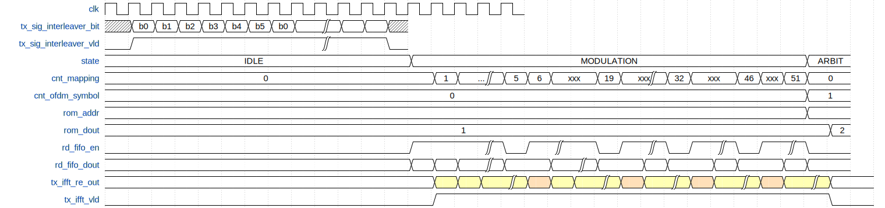

# 1. 前言
在之前的博客当中，已经完成了数据域的OFDM的处理，信号域数据的生成，再接下来就是对信号域的数据进行处理了。信号域的数据的处理，相较于数据域信号的处理，是十分类似，但是更加简单的。

<!--more-->
在对signal域的数据进行处理的时候，需要进行1/2卷积编码,交织，BPSK调制，IFFT与添加循环前缀。在这篇博客当中将依次实现这些模块。

# 2. Signal域处理
## 2.1 卷积编码
signal域的卷积编码和data域的卷积编码是一致的，具体的内容可以参考data域的卷积编码那一部分。

[Data域卷积编码](https://black-pigeon.github.io/2022/05/01/2022.5/OFDM-802-11a%E5%AD%A6%E4%B9%A0-%E5%8D%B7%E7%A7%AF%E7%BC%96%E7%A0%81/)

## 2.2 signal域数据交织
有了前面对数据域交织的处理学习之后，很容易就能够明白signal域的交织该如何来进行处理。在实际实现的时候，可以先将交织对应的地址存储在ROM当中，当signal域的数据来的时候，再从ROM中将地址读出，作为RAM的写地址，从而实现交织。


产生交织地址映射的matlab代码如下：
```matlab
interleaver_depth = 48;
n_syms_per_ofdm_sym = 48;

idx=zeros(1,interleaver_depth);

s = max([interleaver_depth/n_syms_per_ofdm_sym/2 1]);

intlvr_patt = interleaver_depth/16*rem(0:interleaver_depth-1,16) + floor((0:interleaver_depth-1)/16);

perm_patt = s*floor(intlvr_patt/s)+ ...
   mod(intlvr_patt+interleaver_depth-floor(16*intlvr_patt/interleaver_depth),s);

idx = perm_patt;

fid = fopen('single_intlvr_patt_bpsk.coe','w');
fprintf(fid,'memory_initialization_radix = 10;\n');
fprintf(fid,'memory_initialization_vector = \n');
fprintf(fid,'%d,\n',idx(1:end-1)); 
fprintf(fid,'%d;\n',idx(end)); 
fclose(fid);
```

该模块的时序设计如下：

该部分的代码如下：
```verilog
`timescale 1ns / 1ps
module tx_gen_sig_interleaver(
	input 	wire 			clk_Modulation					,
	input 	wire 			reset							,
	input 	wire 			tx_gen_sig_interleaver_in_valid	,
	input 	wire 	[1:0]	tx_gen_sig_interleaver_in_bit	,
	output 	wire 			tx_gen_sig_interleaver_valid	,
	output 	wire 			tx_gen_sig_interleaver_bit
    );


	//====================================================
	// internal signals and registers
	//====================================================

	reg  			tx_interleaver_in_valid_dly	;
	wire  			tx_interleaver_in_valid_neg_pls;

	reg  	[5:0]	cnt_fifo_rd 				;
	reg  			rd_rom_fifo_en 				;
	wire  			fifo_dout 					;
	wire  			full,empty 					;
	wire  	[5:0]	rom_dout 					;
	reg  	[5:0]	rom_addr					;

	reg   			wr_ram_en 					;
	reg  			wr_ram_en_dly 				;
	wire  			wr_ram_en_neg_pls 			;
	wire  	[5:0]	wr_ram_addr 				;
	wire  	[5:0]	rd_ram_addr 				;
	reg  			rd_ram_en 					;
	reg  	[5:0]	cnt_ram_rd  				;
	wire  			ram_dout 					;
	reg  			ram_dout_valid				;


	always @(posedge clk_Modulation) begin
		tx_interleaver_in_valid_dly <= tx_gen_sig_interleaver_in_valid;
	end

	assign tx_interleaver_in_valid_neg_pls = tx_interleaver_in_valid_dly & (~tx_gen_sig_interleaver_in_valid);


	sfifo_sig_interleave u_sfifo_sig_interleave (
		.clk(clk_Modulation),      // input wire clk
		.srst(reset),    // input wire srst
		.din(tx_gen_sig_interleaver_in_bit),      // input wire [0 : 0] din
		.wr_en(tx_gen_sig_interleaver_in_valid),  // input wire wr_en
		.rd_en(rd_rom_fifo_en),  // input wire rd_en
		.dout(fifo_dout),    // output wire [0 : 0] dout
		.full(full),    // output wire full
		.empty(empty)  // output wire empty
	);

	blk_mem_tx_gen_sig_interleaver u_blk_mem_tx_gen_sig_interleaver (
		.clka(clk_Modulation),    // input wire clka
		.addra(rom_addr),  // input wire [8 : 0] addra
		.douta(rom_dout)  // output wire [8 : 0] douta
	);

	//----------------rd_rom_fifo_en------------------
	always @(posedge clk_Modulation) begin
		if (reset == 1'b1) begin
			rd_rom_fifo_en <= 1'b0;
		end
		else if(rd_rom_fifo_en == 1'b1 && cnt_fifo_rd == 'd47)begin
			rd_rom_fifo_en <= 1'b0;
		end
		else if(tx_interleaver_in_valid_neg_pls == 1'b1)begin
			rd_rom_fifo_en <= 1'b1;
		end
	end

	//----------------cnt_fifo_rd------------------
	always @(posedge clk_Modulation) begin
		if (reset == 1'b1) begin
			cnt_fifo_rd <= 'd0;
		end
		else if (rd_rom_fifo_en == 1'b1 && cnt_fifo_rd == 'd47) begin
			cnt_fifo_rd <= 'd0;
		end
		else if(rd_rom_fifo_en) begin
			cnt_fifo_rd <= cnt_fifo_rd + 1'b1;
		end
	end

	//----------------rom_addr------------------
	always @(posedge clk_Modulation) begin
		if (reset == 1'b1) begin
			rom_addr <= 'd0;
		end
		else if(tx_interleaver_in_valid_neg_pls)begin
			rom_addr <= 'd0;
		end
		else if ((rom_addr == 'd47) && (rd_rom_fifo_en == 1'b1)) begin
			rom_addr <= 'd0;
		end
		else if(rd_rom_fifo_en == 1'b1)begin
			rom_addr <= rom_addr + 1'b1;
		end
	end


	assign wr_ram_addr = rom_dout;

	always @(posedge clk_Modulation) begin
		wr_ram_en <= rd_rom_fifo_en;
		wr_ram_en_dly <= wr_ram_en;
	end
	assign wr_ram_en_neg_pls = (~wr_ram_en) & wr_ram_en_dly;

	blk_mem_gen_tx_gen_interleaved_bits u_blk_mem_gen_tx_gen_interleaved_bits (
		.clka(clk_Modulation),    // input wire clka
		.wea(wr_ram_en),      // input wire [0 : 0] wea
		.addra(wr_ram_addr),  // input wire [13 : 0] addra
		.dina(fifo_dout),    // input wire [0 : 0] dina
		.clkb(clk_Modulation),    // input wire clkb
		.enb(rd_ram_en),      // input wire enb
		.addrb(rd_ram_addr),  // input wire [13 : 0] addrb
		.doutb(ram_dout)  // output wire [0 : 0] doutb
	);

	//----------------rd_ram_en------------------
	always @(posedge clk_Modulation) begin
		if(reset == 1'b1)begin
			rd_ram_en <= 1'b0;
		end
		else if(rd_ram_en == 1'b1 && cnt_ram_rd == 'd47)begin
			rd_ram_en <= 1'b0;
		end
		else if(wr_ram_en_neg_pls)begin
			rd_ram_en <= 1'b1;
		end
	end

	//----------------cnt_ram_rd------------------
	always @(posedge clk_Modulation) begin
		if (reset == 1'b1) begin
			cnt_ram_rd <= 'd0;
		end
		else if(rd_ram_en == 1'b1 && cnt_ram_rd == 'd47)begin
			cnt_ram_rd <= 'd0;
		end
		else if(rd_ram_en == 1'b1)begin
			cnt_ram_rd <= cnt_ram_rd + 1'b1;
		end	
	end
	assign rd_ram_addr = cnt_ram_rd;

	//----------------rd_ram_valid------------------
	always @(posedge clk_Modulation) begin
		ram_dout_valid <= rd_ram_en;
	end

	assign tx_gen_sig_interleaver_valid = ram_dout_valid;
	assign tx_gen_sig_interleaver_bit = ram_dout_valid ? ram_dout : 1'b0;

	
endmodule
```

## 2.3 signal域调制
signal域的调制与data域的调制也比较类似，signal域的调制采用的是BPSK的调制方式，也需要使用到OFDM的48个子载波来承载数据，和data域的调制一样，同样包含4个导频和一个0频的直流。
由于signal域采用的是BPSK的调制，因此在调制之后，只有实部上有数据而虚部上没有数据。
从前面的signal域的帧结构可以知道，signal域的数据一共有24bit，经过1/2卷积编码之后，数据长度为48bit，由于采用BPSK的调制方式，因此这48bit刚好能够对应一个48个OFDM的子载波。
该部分的时序设计同data域的调制模块的时序设计是比较类似的，时序设计图如下：




```verilog
`timescale 1ns / 1ps
module tx_gen_sig_modulate(
	input 	wire   		clk_Modulation					,
	input 	wire   		reset							,
	input 	wire   		tx_gen_sig_modulate_in_valid	,
	input 	wire   		tx_gen_sig_modulate_in_bit		,
	output 	reg 		tx_gen_sig_modulate_valid		,
	output 	reg [31:0]	tx_gen_sig_modulate_re			,
	output 	reg [31:0]	tx_gen_sig_modulate_im	
    );

	
	//====================================================
	// paramter define
	//====================================================
	localparam IDLE  	= 3'b001;
	localparam MODULATE = 3'b010;
	localparam ARBIT 	= 3'b100;	

	//----------------QAM64 I/Q mapping------------------
	//Fixed-point quantization, 1 sign bit, 1 bit interger, 30bit decimal
	localparam QAM64_IQ_B000 = 3135193572; //3'b000 ==> -7, -7/sqrt(42) ==>3135193572
	localparam QAM64_IQ_B001 = 3466557494; //3'b001 ==> -5, -5/sqrt(42) ==>3466557494
	localparam QAM64_IQ_B011 = 3797921415; //3'b011 ==> -3, -3/sqrt(42) ==> 3,797,921,415
	localparam QAM64_IQ_B010 = 4129285336; //3'b010 ==> -1, -1/sqrt(42) ==>4,129,285,336
	localparam QAM64_IQ_B110 = 165681960 ; //3'b110 ==> 1, 1/sqrt(42) ==>165,681,960
	localparam QAM64_IQ_B111 = 497045881 ; //3'b111 ==> 3, 3/sqrt(42) ==>497045881
	localparam QAM64_IQ_B101 = 828409802 ; //3'b101 ==> 5, 5/sqrt(42) ==>828409802
	localparam QAM64_IQ_B100 = 1159773723; //3'b100 ==> 7, 7/sqrt(42) ==> 1159773723

	localparam BPSK_IQ_ONE = 1073741824;
	localparam BPSK_IQ_MINUS_ONE = 3221225472;

	localparam QAM64_IQ_ONE = 1073741824;
	localparam QAM64_IQ_MINUS_ONE = 3221225472;
	
	//====================================================
	// internal signals and registers
	//====================================================
	reg   			tx_modulate_in_valid_dly		; 
	wire  			tx_modulate_in_valid_neg_pls	;


	reg   	[2:0]	state  							; // state register
	reg  	[7:0]	cnt_mapping 					;
	reg   			rd_fifo_en  					;
	wire         	rd_fifo_dout 					;
	wire   			full,empty  					;

	//----------------tx_modulate_in_valid_dly------------------
	always @(posedge clk_Modulation) begin
		tx_modulate_in_valid_dly <= tx_gen_sig_modulate_in_valid;
	end
	assign tx_modulate_in_valid_neg_pls = tx_modulate_in_valid_dly & (~tx_gen_sig_modulate_in_valid);

	
	fifo_tx_gen_sig_modulate_48_52 u_fifo_tx_gen_sig_modulate_48_52 (
		.clk(clk_Modulation),      // input wire clk
		.srst(reset),    // input wire srst
		.din(tx_gen_sig_modulate_in_bit),      // input wire [0 : 0] din
		.wr_en(tx_gen_sig_modulate_in_valid),  // input wire wr_en
		.rd_en(rd_fifo_en),  // input wire rd_en
		.dout(rd_fifo_dout),    // output wire [0 : 0] dout
		.full(full),    // output wire full
		.empty(empty)  // output wire empty
	);


	//----------------state------------------
	always @(posedge clk_Modulation) begin
		if(reset == 1'b1)begin
			state <= IDLE;
		end
		else begin
			case(state)
				IDLE : begin
					if(tx_modulate_in_valid_neg_pls)begin
						state <= MODULATE;
					end
				end

				MODULATE : begin
					if (cnt_mapping == 'd51) begin
						state <= ARBIT;
					end
				end

				ARBIT : begin
					if(empty == 1'b1)begin
						state <= IDLE;
					end
				end

				default : state <= IDLE;
			endcase
		end
	end

	//----------------cnt_mapping------------------
	always @(posedge clk_Modulation) begin
		if (reset == 1'b1) begin
			cnt_mapping <= 'd0;
		end
		else if (state == MODULATE && cnt_mapping == 'd51) begin
			cnt_mapping <= 'd0;
		end
		else if (state == MODULATE) begin
			cnt_mapping <= cnt_mapping + 1'b1;
		end
		else begin
			cnt_mapping <= 'd0;
		end
	end

	//----------------rd_fifo_en------------------
	always @(*) begin
		if (state == MODULATE) begin
			if (cnt_mapping == 'd5 || cnt_mapping == 'd19 || cnt_mapping == 'd32 || cnt_mapping == 'd46) begin
				rd_fifo_en = 1'b0;
			end
			else begin
				rd_fifo_en = 1'b1;
			end
		end
		else begin
			rd_fifo_en = 1'b0;
		end
	end

	//------------------tx_gen_sig_modulate_re----------------
	always @(posedge clk_Modulation) begin
		if (reset == 1'b1) begin
			tx_gen_sig_modulate_re <= 'd0;
		end
		else if(state == MODULATE)begin
			// insert pilot according to the pilot index,when rom dout is 1, the inserted pilot is 1 1 1 -1
			// when rom dout is 0 the inserted pilot is -1 -1 -1 1
			if(cnt_mapping == 'd5 || cnt_mapping == 'd19 || cnt_mapping =='d32)begin
				tx_gen_sig_modulate_re <= BPSK_IQ_ONE;
			end
			else if (cnt_mapping == 'd46) begin
				tx_gen_sig_modulate_re <= BPSK_IQ_MINUS_ONE;
			end
			else begin
				if(rd_fifo_dout == 1'b1)begin
					tx_gen_sig_modulate_re <= BPSK_IQ_ONE;
				end
				else begin
					tx_gen_sig_modulate_re <= BPSK_IQ_MINUS_ONE;
				end
			end
		end
		else begin
			 tx_gen_sig_modulate_re <= 'd0;
		end
	end

	//------------------tx_gen_sig_modulate_im----------------
	always @(posedge clk_Modulation) begin
		if (reset == 1'b1) begin
			tx_gen_sig_modulate_im <= 'd0;
		end
		else if(state == MODULATE)begin
			// insert pilot according to the pilot index,when rom dout is 1, the inserted pilot is 1 1 1 -1
			// when rom dout is 0 the inserted pilot is -1 -1 -1 1
			if(cnt_mapping == 'd5 || cnt_mapping == 'd19 || cnt_mapping =='d32 || cnt_mapping == 'd46)begin
				 tx_gen_sig_modulate_im <= 'd0;
			end
			else begin
				tx_gen_sig_modulate_im <= 'd0;
			end
		end
		else begin
			 tx_gen_sig_modulate_im <= 'd0;
		end
	end

	always @(posedge clk_Modulation) begin
		if (reset == 1'b1) begin
			tx_gen_sig_modulate_valid <= 1'b0;
		end
		else if (state == MODULATE) begin
			tx_gen_sig_modulate_valid <= 1'b1;
		end
		else begin
			tx_gen_sig_modulate_valid <= 1'b0;
		end
	end


endmodule
```

## 2.4 IFFT和循环前缀
ITTF模块和添加循环前缀的操作和data域的操作是完全一致的，可以看前面实现
[星座图映射域循环前缀](https://black-pigeon.github.io/2022/05/05/2022.5/OFDM-802-11a%E5%AD%A6%E4%B9%A0-%E6%98%9F%E5%BA%A7%E5%9B%BE%E6%98%A0%E5%B0%84/)
