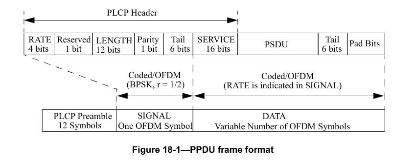
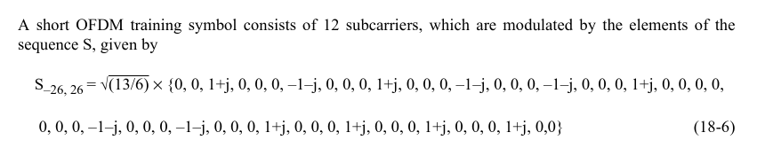
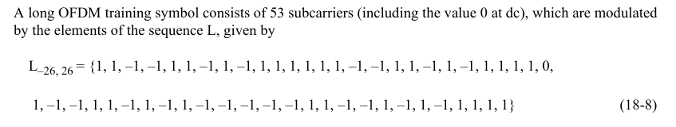
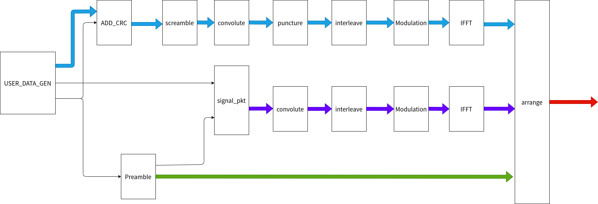
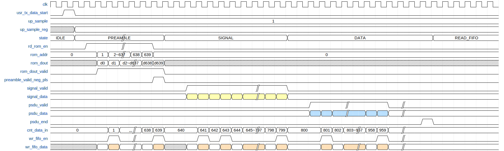

# 1. 前言
在之前已经完成了data域与signal域的数据的处理，在构建整个802.11a OFDM数据帧的时候，只剩下前导码这部分的内容还没有实现了。


<!--more-->

# 2. 前导码
## 2.1 短训练序列
短训练序列的主要用途是进行信号的检测、AGC和粗频偏估计。短训练序列都是经过精心的设计，每个短训练序列的长度为0.8us，在802.11a的前导码当中一共有10个短训练序列。这些短训练序列符号占据每个OFDM符号的52个非零子载波当中的12个。如果用-26~26来标识非零子载波的话，那么短训练序列的子载波的序号为{-24, -20, -16, -12, -8, -4, 4, 8, 12, 16, 20, 24},其中传输的传输数据为一个固定的伪随机序列，采用的QPSK的映射方式。

由于短训练序列只用了52个子载波当中12个来传输符号，因此为了保证OFDM符号的功率稳定，需要乘以因子 $\sqrt{13/6}$.
短训练序列的的选择可以是的在较大的范围内实现粗频率估计，通常对于周期为T的重复符号而言，最大可估计的频率偏差为1/2T,因此通过测量连续两个长度为0.8us的短训练序列符号的相位差，可以估计的频率偏差可达625KHz。

## 2.2 长训练序列
长训练序列的紧跟在短训练序列之后，长度为8us，长训练序列符号与正常的OFDM符号一样由53个子载波(包含直流处的空子载波)组成，分别占据-26~26信道，长训练序列采用传输的是BPSK符号。表示为：



在实际使用过程当中，由与短训练序列和长训练序列是固定的，因此可以先使用matlab，python等工具先将短训练序列和长训练序列生成出来，然后将序列存储在ROM当中，在使用的时候，直接从ROM当中读取出来就可以了。

# 3.训练序列生成
由于训练序列是一个固定的序列，因此，我们可以先使用matlab等工具来实现生成这些序列，并将这些荀烈存储在RAM当中，这样在之后，只需要从RAM中将训练序列读取出来即可。
从前面的介绍可以知道，一共有10个短训练序列和2个长训练序列。实现这部分的matlab代码如下：

```matlab
clear all;
clc;
mod_ofdm_syms =  sqrt(13/6)*[0 0 1+j 0 0 0 -1-j 0 0 0 1+j 0 0 0 -1-j 0 0 0 -1-j 0 0 0 1+j 0 0 0 0 0 0 -1-j 0 0 0 -1-j 0 0 0 ...
      1+j 0 0 0 1+j 0 0 0 1+j 0 0 0 1+j 0 0];
%mod_ofdm_syms=1:52;
NumSubc = 52;
up=2;
int16 re;
int16 im;
int16 re1;
int16 im1;

syms_into_ifft = zeros(64,1);
syms_into_ifft([7:32 34:59],:)=reshape(mod_ofdm_syms,NumSubc,1);
syms_into_ifft([33:64 1:32],:) = syms_into_ifft;
% up sample
syms_into_ifft_up = zeros(64*up,1);
syms_into_ifft_up(1:32,:) = syms_into_ifft(1:32,:);
syms_into_ifft_up(end-31:end,:) = syms_into_ifft(33:64,:);
%freq convert to time domain
ifft_out = ifft(syms_into_ifft_up);
time_syms = zeros(1,64*up);
time_syms = ifft_out(:).';
re = real(time_syms);
im = imag(time_syms);
re = round(re * 2^15);
im = round(im * 2^15);
sign_re = (re<0);
sign_im = (im<0);
re = re + sign_re*2^16;
im = im + sign_im*2^16;

mod_ofdm_syms = [1 1 -1 -1 1 1 -1 1 -1 1 1 1 1 1 1 -1 -1 1 1 -1 1 -1 1 1 1 1 ...
      1 -1 -1 1 1 -1 1 -1 1 -1 -1 -1 -1 -1 1 1 -1 -1 1 -1 1 -1 1 1 1 1];

syms_into_ifft = zeros(64,1);
syms_into_ifft([7:32 34:59],:)=reshape(mod_ofdm_syms,NumSubc,1);
syms_into_ifft([33:64 1:32],:) = syms_into_ifft;
% up sample
syms_into_ifft_up = zeros(64*up,1);
syms_into_ifft_up(1:32,:) = syms_into_ifft(1:32,:);
syms_into_ifft_up(end-31:end,:) = syms_into_ifft(33:64,:);
%freq convert to time domain
ifft_out = ifft(syms_into_ifft_up);
time_syms = zeros(1,64*up);
time_syms = ifft_out(:).';
re1 = real(time_syms);
im1 = imag(time_syms);
re1 = round(re1 * 2^15);
im1 = round(im1 * 2^15);
sign_re1 = (re1<0);
sign_im1 = (im1<0);
re1 = re1 + sign_re1*2^16;
im1 = im1 + sign_im1*2^16;

fid = fopen('preamble_real.coe','w');
fprintf(fid,'memory_initialization_radix = 10;\n');
fprintf(fid,'memory_initialization_vector = \n');
for i=1:10
    fprintf(fid,'%d,\n',re(1:16*up)); %St1~t10
end
fprintf(fid,'%d,\n',re1(65:128));%GI2
fprintf(fid,'%d,\n',re1(1:128)); %L T1
fprintf(fid,'%d,\n',re1(1:127)); %L T2
fprintf(fid,'%d;\n',re1(end));
fclose(fid);

fid = fopen('preamble_imag.coe','w');
fprintf(fid,'memory_initialization_radix = 10;\n');
fprintf(fid,'memory_initialization_vector = \n');
for i=1:10
    fprintf(fid,'%d,\n',im(1:16*up)); %St1~t10
end
fprintf(fid,'%d,\n',im1(65:128));%GI2
fprintf(fid,'%d,\n',im1(1:128)); %L T1
fprintf(fid,'%d,\n',im1(1:127)); %L T2
fprintf(fid,'%d;\n',im1(end));
fclose(fid);

```
在上面的代码当中，将训练序列按照10个长训练序列，一个长训练序列保护间隔，2个长训练序列的方式进行排列，这样就可以最终生成实部和虚部的coe文件，通过这个coe文件就能够在FPGA当中获得输出的前导码的信号。

# 4. 构建完整PLCP帧
在了解了前导码如何生成之后，就可以将前导码，signal域，data域的数据全部组合在一起实现一个完整的plcp数据帧了。最终将这个plcp信号帧通过AD9361发送出去就完成了ofdm的发送部分。


实现的思路是：按照前导码，signal域，data域的数据进行排列，将这些数据全部缓存到一个FIFO当中，当所有的数据都写入到FIFO之后，再从FIFO中将这一帧数据读出取来，从而实现一个完整的数据帧。

为了能够兼容更大带宽的设计，采样率可以支持40M和20M，当采样率为40M的时候，直接将前面实现的那些模块生成的数据缓存到FIFO当中即可，但是如果使用20M采样率的时候，需要将前面实现的模块生成的数据进行一个1/2的抽取，才能作为最终的信号输出。

实现的时序如下图所示：


具体的实现代码如下：

```verilog
`timescale 1ns / 1ps

module tx_out_arrange(
	input 	wire  			clk_Modulation						,
	input 	wire  			reset								,
	input 	wire  	[1:0]	tx_Upsample							,
	input 	wire  			user_tx_data_start					,
	input 	wire  			tx_add_cyclic_prefix_valid			,
	input 	wire  			tx_add_cyclic_prefix_end			,
	input 	wire  	[15:0]	tx_add_cyclic_prefix_re				,
	input 	wire  	[15:0]	tx_add_cyclic_prefix_im				,
	input 	wire  			tx_gen_sig_add_cyclic_prefix_valid	,
	input 	wire  	[15:0]	tx_gen_sig_add_cyclic_prefix_re		,
	input 	wire  	[15:0]	tx_gen_sig_add_cyclic_prefix_im		,
	output 	reg 			preamble_ready						,
	output 	wire 			tx_802p11_out_valid					,
	output 	wire 	[15:0]	tx_802p11_re_out					,
	output 	wire 	[15:0]	tx_802p11_im_out
    );

	//====================================================
	// parameter define
	//====================================================
	localparam PREAMBLE_LEN = 640;
	localparam SIGNAL_LEN 	= 160;

	localparam IDLE = 5'b00001;
	localparam PREAMBLE = 5'b00010;
	localparam SIGNAL = 5'b00100;
	localparam DATA = 5'b01000;
	localparam READ_FIFO = 5'b10000;

	//====================================================
	// internal signals and registers
	//====================================================
	reg  	[4:0]	state 			;
	reg  	[1:0]	tx_upsample_reg ;
 	reg   			rd_rom_en 		;
	reg		[9:0]	rom_addr 		;
	wire 	[15:0]	rom_dout_re 	;
	wire 	[15:0]	rom_dout_im 	;
	reg  			rom_dout_valid	;
	wire  			rd_rom_en_neg_pls;

	reg  	[17:0] 	cnt_data_in 	;
	
	reg  			wr_fifo_en 		;
	reg  	[31:0]	wr_fifo_din 	;
	wire   			rd_fifo_en 		;
	wire  	[31:0] 	rd_fifo_dout 	;

	wire   			fifo_empty;
	wire  			fifo_full;


	//----------------state------------------
	always @(posedge clk_Modulation) begin
		if (reset == 1'b1) begin
			state <= IDLE;
		end
		else begin
			case(state)
				IDLE : begin
					if(user_tx_data_start)begin
						state <= PREAMBLE;
					end
				end
				
				PREAMBLE : begin
					if(cnt_data_in == PREAMBLE_LEN - 1)begin
						state <= SIGNAL;
					end
				end

				SIGNAL : begin
					if (cnt_data_in == (PREAMBLE_LEN + SIGNAL_LEN - 1)) begin
						state <= DATA;
					end
				end

				DATA : begin
					if(tx_add_cyclic_prefix_end)begin
						state <= READ_FIFO;
					end
				end

				READ_FIFO : begin
					if(fifo_empty == 1'b1)begin
						state <= IDLE;
					end
				end

				default : begin
					state <= IDLE;
				end
			endcase
		end
	end

	//----------------tx_upsample_reg------------------
	always @(posedge clk_Modulation) begin
		if (reset == 1'b1) begin
			tx_upsample_reg <= 'd0;
		end
		else if (user_tx_data_start == 1'b1) begin
			tx_upsample_reg <= tx_Upsample;
		end
	end

	//----------------rd_rom_en------------------
	always @(posedge clk_Modulation) begin
		if (reset == 1'b1) begin
			rd_rom_en <= 1'b0;
		end
		else if (rd_rom_en == 1'b1 && rom_addr == PREAMBLE_LEN - 1) begin
			rd_rom_en <= 1'b0;
		end
		else if (user_tx_data_start == 1'b1) begin
			rd_rom_en <= 1'b1;
		end
	end

	//----------------rom_dout_valid------------------
	always @(posedge clk_Modulation) begin
		rom_dout_valid <= rd_rom_en;
	end

	//----------------rom_addr------------------
	always @(posedge clk_Modulation) begin
		if(reset == 1'b1)begin
			rom_addr <= 'd0;
		end
		else if (rd_rom_en == 1'b1 && rom_addr == PREAMBLE_LEN - 1) begin
			rom_addr <= 'd0;
		end
		else if (rd_rom_en == 1'b1) begin
			rom_addr <= rom_addr + 1'b1;
		end
	end

	always @(posedge clk_Modulation) begin
		if (reset == 1'b1) begin
			preamble_ready <= 1'b0;
		end
		else if (cnt_data_in == PREAMBLE_LEN - 1) begin
			preamble_ready <= 1'b1;
		end
		else begin
			preamble_ready <= 1'b0;
		end
	end


	blk_mem_preamble_im u_blk_mem_preamble_im (
		.clka(clk_Modulation),    // input wire clka
		.addra(rom_addr),  // input wire [9 : 0] addra
		.douta(rom_dout_im)  // output wire [15 : 0] douta
	);
	blk_mem_preamble_re u_blk_mem_preamble_re (
		.clka(clk_Modulation),    // input wire clka
		.addra(rom_addr),  // input wire [9 : 0] addra
		.douta(rom_dout_re)  // output wire [15 : 0] douta
	);
	
	//----------------cnt_data_in------------------
	always @(posedge clk_Modulation) begin
		if (reset == 1'b1) begin
			cnt_data_in <= 'd0;
		end
		else if(tx_add_cyclic_prefix_end)begin
			cnt_data_in <= 'd0;
		end
		else if (state == PREAMBLE && rom_dout_valid == 1'b1) begin
			cnt_data_in <= cnt_data_in + 1'b1;
		end
		else if (state == SIGNAL && tx_gen_sig_add_cyclic_prefix_valid == 1'b1) begin
			cnt_data_in <= cnt_data_in + 1'b1;
		end
		else if (state == DATA && tx_add_cyclic_prefix_valid == 1'b1) begin
			cnt_data_in <= cnt_data_in + 1'b1;
		end
	end

	always @(*) begin
		case(state)
			PREAMBLE: wr_fifo_din = {rom_dout_im, rom_dout_re};
			SIGNAL: wr_fifo_din = {tx_gen_sig_add_cyclic_prefix_im, tx_gen_sig_add_cyclic_prefix_re};
			DATA : wr_fifo_din = {tx_add_cyclic_prefix_im, tx_add_cyclic_prefix_re};
			default: wr_fifo_din = 'd0;
		endcase
	end

	always @(*) begin
		if (tx_upsample_reg == 'd1) begin
			if (cnt_data_in[0] == 1'b1) begin
				wr_fifo_en = 1'b1;
			end
			else begin
				wr_fifo_en = 1'b0;
			end
		end
		else if(tx_upsample_reg == 'd2)begin
			wr_fifo_en = rom_dout_valid | tx_gen_sig_add_cyclic_prefix_valid | tx_add_cyclic_prefix_valid;
		end
		else begin
			wr_fifo_en = 1'b0;
		end
	end

	fifo_generator_tx_out_arrange u_fifo_generator_tx_out_arrange (
		.clk(clk_Modulation),      // input wire clk
		.srst(reset),    // input wire srst
		.din(wr_fifo_din),      // input wire [31 : 0] din
		.wr_en(wr_fifo_en),  // input wire wr_en
		.rd_en(rd_fifo_en),  // input wire rd_en
		.dout(rd_fifo_dout),    // output wire [31 : 0] dout
		.full(fifo_full),    // output wire full
		.empty(fifo_empty)  // output wire empty
	);

	assign rd_fifo_en = (state == READ_FIFO) ? (~fifo_empty) : 1'b0;
	assign tx_802p11_out_valid = rd_fifo_en;
	assign tx_802p11_im_out = rd_fifo_dout[31:16];
	assign tx_802p11_re_out = rd_fifo_dout[15:0];

endmodule
```
