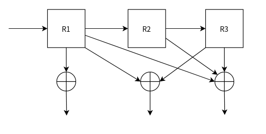
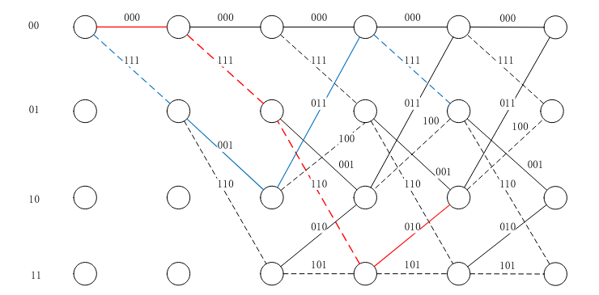
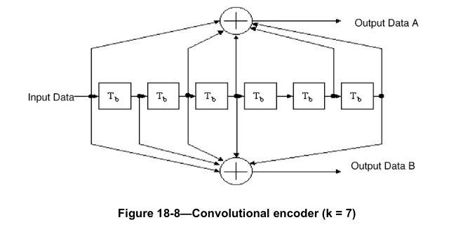
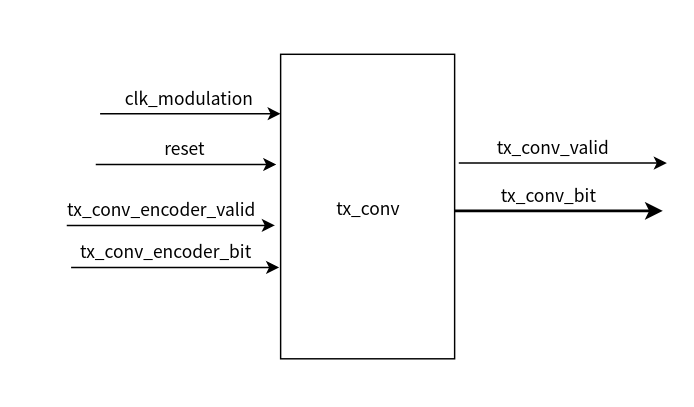
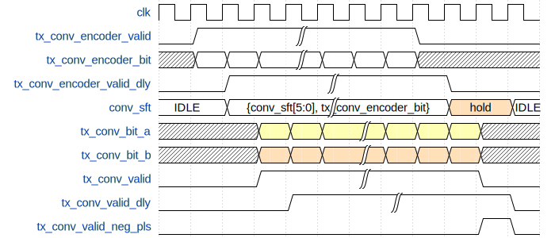
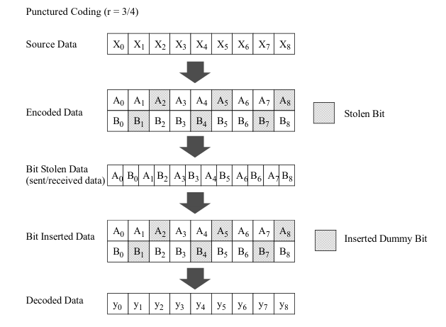
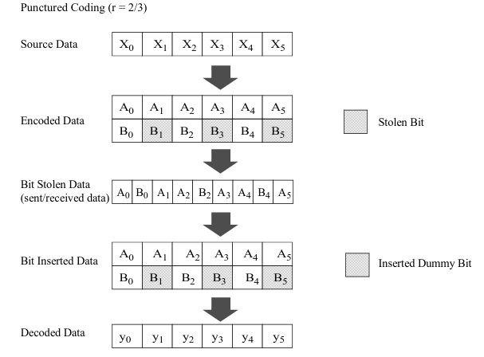
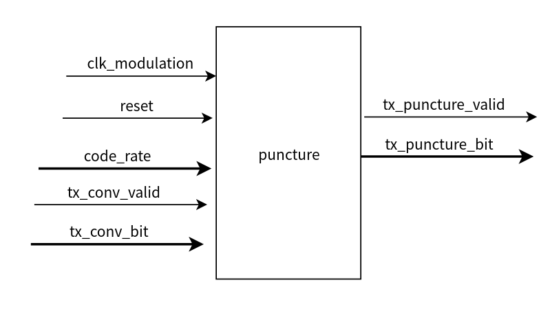
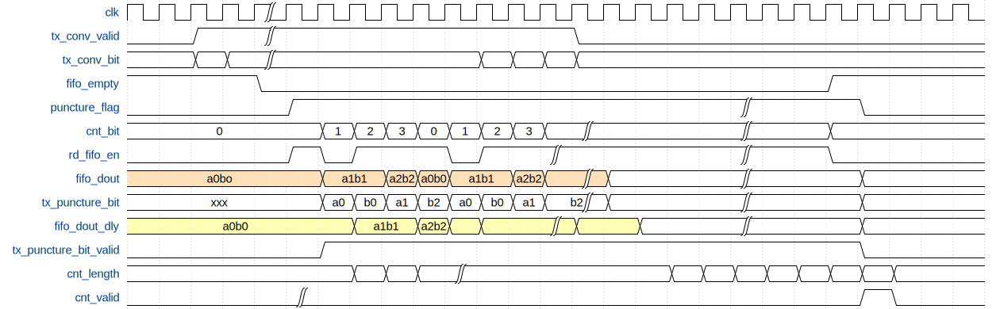

# 1. 前言
在上一篇博客当中，已经实现了PPDU的数据域的用户数据的生成，在这之中按照service域，PSDU域，tail bit和pad bit进行生成和填充。
然后对生成的bit流数据进行了加扰操作。
在对802.11a的数据域的接下来的操作就是进行信道编码。在本博客当中会介绍802.11a当中的卷积编码和删余操作，从而实现想要的3/4码速率数据。

<!--more-->

# 2. 卷积编码

## 2.1 卷积编码的举例
卷积码编码器实质上是一个有限状态的线性移位寄存器。这个移位寄存器由若干个寄存器单元组成，且寄存器单元按一定的规则连接到代数运算单元，将运算结果作为编码比特输出。
一个简单的卷积编码器的结构如下图所示：

R1， R2， R3， 是三个寄存器，输入数据进行过这个卷积编码器将在下方输出结果。
卷积编码的输出有如下关系：

$$C_{1} = B_{1}$$

$$C_{2} = B_{1} \bigoplus B_{3} $$  

$$C_{3} = B_{1} \bigoplus B_{2} \bigoplus B_{3}$$

假设输入的数据是0110，那么经过卷积编码器之后的结果可以由如下表格给出

| Input |R1     |R2     |R3     | Output|
| ----  | ----  | ----  | ----  | ----  |
|INIT   | 0     |  0    |0      |000    |
|0      |0      |0      |0      |000    |
|1      |1      |0      |0      |111    |
|1      |1      |1      |0      |110    |
|0      |0      |1      |1      |010    |

如果将卷积编码的这个过程在一个图来表示可以按照如下的方式来标注：

网格图中，具有相同状态的节点合并在一起；当输入比特为零时用实线表示，当输入比特为 1 时用虚线；支路上标注的码元为输出比特；最左侧为卷积编器的低两个寄存器的值。


n：编码器每次输出的码元个数；
k：编码器每次输入的信息码元个数，一般 k=1；
N：约束长度，在 k=1 的情况下，表示编码器的输出与本次及之前输入的 N个码元相关;
那么上图所示的卷积编码结构可以描述为（3，1，3）;
其编码效率为 k/N,则该卷机编码的效率为 1/3。

## 2.2 802.11a卷积编码器
卷积编码使用的生成多项式是 $g0 = (133)_{8}$，$g1= (171)_{8}$，码率为 1/2，其生成多项式用二进制表示为 g0 = 1011011，g1 = 1111001，该卷积码可以表示为（2,1,7），即每时钟周期输出两个比特数据，输入 1 个比特数据，约束长度为7。


每输入一bit的数据，将会依次输出A，B两bit的数据。
在实际设计的收根据上面图中的结构就可以来设置卷积编码器的结构了。将移位寄存器当中的对应bit的值取出来做异或，即可得到输出的AB数据。

## 2.3 卷积编码模块设计
在了解了802.11a的卷积编码的原理之后，就可以着手来进行卷积编码器模块的设计了。


该模块的输入是由上一级模块经过加扰之后的输出bit。在这个模块当中经过卷积编码，最终输出2bit的卷积编码数据。

该模块的时序设计如下图所示：


首先将输入的bit移入到移位寄存器当中,由于将输入的bit放到一位寄存当中，因此对于输入有效信号进行一拍的delay，然后在这个输入数据有效的延拍信号的作用下根据卷机编码器的结构产生卷积编码之后的数据。
值得注意的是，在前面介绍802.11a的卷积编码器当中的生成多项式系数是从低位到高位的，而在代码中需要按照一个移位寄存器传递数据的方式来进行移位。

```verilog
module tx_conv_encoder (
	input 	wire 			clk_Modulation	,
	input 	wire 			reset 			,
	input 	wire  			tx_conv_encoder_valid	,
	input 	wire  			tx_conv_encoder_bit 	,
	output 	reg  			tx_conv_valid 			,
	output 	wire  [1:0]		tx_conv_bit		
	);


	wire [6:0]	conv_coef1;
	wire [6:0]	conv_coef2;

	reg   		tx_conv_encoder_valid_dly;
	reg  		tx_conv_encoder_bit_dly;
	reg  [6:0]	conv_sft;
	reg   		tx_conv_valid_dly;
	wire  		tx_conv_valid_neg_pls;
	reg  		tx_conv_bit_a;
	reg  		tx_conv_bit_b;

	assign conv_coef1 = 7'b1101101;
	assign conv_coef2 = 7'b1001111;

	always @(posedge clk_Modulation) begin
		if (reset == 1'b1) begin
			tx_conv_encoder_valid_dly <= 1'b0;
			tx_conv_encoder_bit_dly <= 1'b0;
		end
		else begin
			tx_conv_encoder_valid_dly <= tx_conv_encoder_valid;		
			tx_conv_encoder_bit_dly	<= tx_conv_encoder_bit;	
		end
	end

	//----------------conv_sft------------------
	always @(posedge clk_Modulation) begin
		if (reset == 1'b1) begin
			conv_sft <= 'd0;
		end
		else if(tx_conv_valid_neg_pls)begin
			conv_sft <= 'd0;
		end
		else if(tx_conv_encoder_valid)begin
			conv_sft <= {conv_sft[5:0], tx_conv_encoder_bit};
		end
	end

	//----------------tx_conv_valid_dly------------------
	always @(posedge clk_Modulation) begin
		tx_conv_valid_dly <= tx_conv_valid;
	end
	assign tx_conv_valid_neg_pls = tx_conv_valid_dly & (~tx_conv_valid);

	//-------------tx_conv_bit_a/b---------------------
	always @(posedge clk_Modulation) begin
		if (reset == 1'b1) begin
			tx_conv_bit_a <= 1'b0;
			tx_conv_bit_b <= 1'b0;
		end
		else if(tx_conv_valid_neg_pls)begin
			tx_conv_bit_a <= 1'b0;
			tx_conv_bit_b <= 1'b0;
		end
		else if(tx_conv_encoder_valid_dly)begin
			tx_conv_bit_a <= (conv_sft[6]&conv_coef1[6]) ^(conv_sft[5]&conv_coef1[5]) ^ (conv_sft[4]&conv_coef1[4])^ (conv_sft[3]&conv_coef1[3]) 
							^(conv_sft[2]&conv_coef1[2]) ^(conv_sft[1]&conv_coef1[1]) ^ (conv_sft[0]&conv_coef1[0]) ;
			tx_conv_bit_b <= (conv_sft[6]&conv_coef2[6]) ^(conv_sft[5]&conv_coef2[5]) ^ (conv_sft[4]&conv_coef2[4])^ (conv_sft[3]&conv_coef2[3]) 
							^(conv_sft[2]&conv_coef2[2]) ^(conv_sft[1]&conv_coef2[1]) ^ (conv_sft[0]&conv_coef2[0]) ;
			
		end
	end

	//----------------tx_conv_valid------------------
	always @(posedge clk_Modulation) begin
		if(reset == 1'b1)begin
			tx_conv_valid <= 1'b0;
		end
		else begin
			tx_conv_valid <= tx_conv_encoder_valid_dly;
		end
	end

	assign tx_conv_bit = {tx_conv_bit_a, tx_conv_bit_b};
endmodule

```


# 3. 删余模块
在前面执行了卷积编码之后，得到了一个1/2编码速率的卷积编码，在实际的使用当中，802.11a支持不同的编码速率，比如2/3编码，3/4编码，为了能够得到对应的编码速率，需要将卷积编码之后的结构进行删除其中的一些bit。
删余的过程如下图所示：
3/4编码速率的删余过程

2/3编码速率的删余过程


改模块的接口如下：

改模块实现功能的具体步骤如下：
- 首先将输入的数据缓存到FIFO当中
- 当FIFO不为空的时候，将数据从FIFO当中读取出来。
- 读取FIFO需要根据删余模块的编码速率进行控制，因为FIFO的读出的位宽是2bit，而最终输出的是1bit的信号，因此将读出的数据缓存一拍，以便根据需要输出对应的bit，从而实现删余操作。
从图中的黄色和橙色部分的情况可以看出具体的工作过程。



```verilog
`timescale 1ns/1ps

module tx_puncture (
	input 	wire  			clk_Modulation	,
	input 	wire  			reset 			,
	input 	wire  	[1:0]	tx_ConvCodeRate	,
	input 	wire  			tx_conv_valid	,
	input 	wire  	[1:0]	tx_conv_bit 	,

	output 	reg  			tx_puncture_valid	,
	output 	reg  			tx_puncture_bit 	,
	output 	wire  			tx_puncture_bit_cnt_valid	,
	output 	wire  	[15:0]	tx_puncture_bit_cnt	
);


	reg  		fifo_rd_en 	;
	wire [1:0]	fifo_dout 	;
	reg  [1:0]	fifo_dout_dly ;
	wire  		full,empty	;

	reg  		puncture_flag 	;
	reg  [3:0]	cnt_puncture	;
	reg  		tx_puncture_valid_dly;
	wire  		tx_puncture_valid_neg_pls;
	reg [19:0]	cnt_bit 		;

	fifo_generator_tx_puncture u_fifo_generator_tx_puncture (
		.clk(clk_Modulation),       // input wire clk
		.srst(reset),    			// input wire srst
		.din(tx_conv_bit),      	// input wire [1 : 0] din
		.wr_en(tx_conv_valid),  	// input wire wr_en
		.rd_en(fifo_rd_en),         // input wire rd_en
		.dout(fifo_dout),           // output wire [1 : 0] dout
		.full(full),                // output wire full
		.empty(empty)               // output wire empty
	);
	//----------------puncture_flag------------------
	always @(posedge clk_Modulation) begin
		if (reset == 1'b1) begin
			puncture_flag <= 1'b0;
		end
		else if(empty == 1'b0)begin
			puncture_flag <= 1'b1;
		end
		else begin
			puncture_flag <= 1'b0;
		end
	end

	//----------------cnt_puncture------------------
	// the ofdm symbole is 216bit, so there is no doubt that 
	// when the valid bit is finished, the counter will go back to zero: 0000000123,0123....0123000000
	always @(posedge clk_Modulation) begin
		if (reset == 1'b1) begin
			cnt_puncture <= 'd0;
		end
		else if(puncture_flag == 1'b1)begin
			if(cnt_puncture == 'd3)begin
				cnt_puncture <= 'd0;
			end
			else begin
				cnt_puncture <= cnt_puncture + 1'b1;
			end
		end
		else begin
			cnt_puncture <= 'd0;
		end
	end

	always @(*) begin
		if(empty==1'b0 && puncture_flag == 1'b1)begin
			case(cnt_puncture)
				0: fifo_rd_en = 1'b1;
				1: fifo_rd_en = 1'b0;
				2: fifo_rd_en = 1'b1;
				3: fifo_rd_en = 1'b1;
				default : fifo_rd_en = 1'b0;
			endcase
		end
		else begin
			fifo_rd_en = 1'b0;
		end
	end

	always @(posedge clk_Modulation) begin
		fifo_dout_dly <= fifo_dout;
	end

	always @(posedge clk_Modulation) begin
		if (reset == 1'b1) begin
			tx_puncture_bit <= 1'b0;
		end
		else if(empty==1'b0 && puncture_flag == 1'b1)begin
			case(cnt_puncture)
				0: tx_puncture_bit <= fifo_dout[1];
				1: tx_puncture_bit <= fifo_dout_dly[0];
				2: tx_puncture_bit <= fifo_dout[1];
				3: tx_puncture_bit <= fifo_dout[0];
				default: tx_puncture_bit <= 1'b0;
			endcase
		end
		else begin
			tx_puncture_bit <= 1'b0;
		end
	end

	always @(posedge clk_Modulation) begin
		if (reset == 1'b1) begin
			tx_puncture_valid <= 1'b0;
		end
		else if(empty==1'b0 && puncture_flag == 1'b1)begin
			tx_puncture_valid <= 1'b1;
		end
		else begin
			tx_puncture_valid <= 1'b0;
		end
	end

	always @(posedge clk_Modulation) begin
		tx_puncture_valid_dly <= tx_puncture_valid;
	end
	assign tx_puncture_valid_neg_pls = (tx_puncture_valid_dly)&(~tx_puncture_valid);

	always @(posedge clk_Modulation) begin
		if(reset == 1'b1)begin
			cnt_bit <= 'd0;
		end
		else if(tx_puncture_valid == 1'b1)begin
			cnt_bit <= cnt_bit + 1'b1;
		end
		else begin
			cnt_bit <= 'd0;
		end
	end

	assign tx_puncture_bit_cnt_valid = tx_puncture_valid_neg_pls;
	assign tx_puncture_bit_cnt = cnt_bit>>1;


endmodule

```