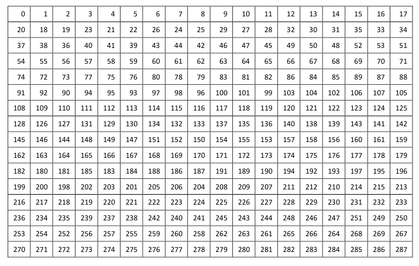

# 1. 前言
在之前的博客当中，实现了数据的卷积编码，在卷积编码当中需要注意的是对于tail bit的部分，需要在最中的输出结果处置零。
在数据域的处理当中，下一步的操作就是实现数据域的交织了。


<!--more-->

# 2. 分组交织器
分组交织器是针对一组bit进行的，该分组当中bit的数量称为交织深度，交织深度越大，离散度越大，抗突发差错的能力也就越大，相应的引起的交织编码处理时间也越长。

我们可以用一个矩阵来描述分组交织器，将数据按照行进行写入数据，按照列的方式进行读出，或者按照相反的方式也是可以的。
4x5的分组交织器，由此可见交织深度为20，以行的方式进行写入，以列的方式进行读出。

|0  |1  |2  |3  |4  |
|-- |-- |-- |-- |-- |
|5  |6  |7  |8  |9  |
|10 |11 |12 |13 |14 |
|15 |16 |17 |18 |19 |

反交织的作用与交织的作用正好相反，将上图当中的矩阵进行转秩，然后同样按照以行的方式进行写入，以列的方式进行读出，即可将原始的数据恢复。

|0  |5  |10 |15 |
|-- |-- |-- |-- |
|1  |6  |11 |16 |
|2  |7  |12 |17 |
|3  |8  |13 |18 |
|4  |9  |14 |19 |

# 3. 802.11a当中的交织
802.11a当中交织的深度为一个OFDM符号，因此这是一个分组交织器，交织深度与所采用的调制方式有关：BPSK，QPSK，16QAM，64QAM的交织深度分别为48，96，192，288个bit。每种调制当时的交织深度是通过数据子载波的数量与每个符号当中bit的个数相乘得到的。

文档当中规定802.11a的数据域的交织分为两个步骤：
第一次交织的目的是保证相邻的比特在经过ofdm调制之后数据会落在不相邻的子载波上。
第二次交织是在第一次交织的基础上进行的，在这一过程中是将一小段比特数据在它们所占的位置上重新排列。
这两次交织的目的就是最大程度上的避免数据流连续的被映射到星座图的某一部分区域情况的出现，同时，交织后的数据在发送过程中可能会出现突发错误，当在对数据进行解交织的时候就可以将连续的错误离散的分布到各个子信道上，从而减轻衰落信道对系统性能的影响，随工作模式的不同，第一步处理的交织深度和交织方式都会不同，而第二次交织方式甚至是否进行也都不尽相同。

定义第一次交织前的编码比特序列角标顺序号用 k 表示，交织之后的数据序列角标顺序号用 i 表示，第二次交织后数据序列角标顺序号用 j 来表示，我们可以得到如下公式：

因此在调制方式为QAM64，速率为54Mb/s的情况下能够确定s=3，$N_{CBPS}=288$
有了这些参数之后，我们就可以在matlab当中将这个交织的变换关系给计算出来，并将这些值存储在一个ROM当中，这样在之后，我们只需要根据这个关系进行将数据写入到一个RAM对应的地址当中，再依次将数据从RAM中读取出来即可以完成交织的工作。



## 3.1 matlab生成交织表
```matlab
interleaver_depth = 288;
n_syms_per_ofdm_sym = 48;

idx=zeros(1,interleaver_depth);

s = max([interleaver_depth/n_syms_per_ofdm_sym/2 1]);

intlvr_patt = interleaver_depth/16*rem(0:interleaver_depth-1,16) + floor((0:interleaver_depth-1)/16);

perm_patt = s*floor(intlvr_patt/s)+ ...
   mod(intlvr_patt+interleaver_depth-floor(16*intlvr_patt/interleaver_depth),s);

idx = perm_patt;

fid = fopen('index.coe','w');
fprintf(fid,'memory_initialization_radix = 10;\n');
fprintf(fid,'memory_initialization_vector = \n');
fprintf(fid,'%d,\n',idx(1:end-1)); 
fprintf(fid,'%d;\n',idx(end)); 
fclose(fid);

```

## 4. 交织模块的实现
有了前面的交织模块的介绍，实现交织模块就不是什么难事了。交织模块的时序设计如下：

具体的过程如下：
- 首先经过删余之后的数据进入到交织模块当中，交织模块会使用一个FIFO将数据进行缓存，在将一帧数据缓存结束的时候，统计处一共有多少数据。
- 当数据写入到FIFO当中之后，开始将ROM当中的数据读出，ROM_DOUT作为RAM的写地址，于此同事将从FIFO当中读出的数据写入到该地址当中。
- ROM中只存有0~287的地址，因此每当处理完一个符号的交织之后，之后再写入RAM的地址需要做一个OFDM符号深度的偏移。
- 当RAM当中已经有完整的一帧交织过后的数据之后，将数据从RAM中读出，给到下一级模块进行使用。

具体的代码如下：

```verilog

`timescale 1ns/1ps

module tx_interleaver (
	input	wire  			clk_Modulation	,
	input 	wire  			reset 			,
	input 	wire  	[1:0]	tx_Modulation		,//调制模式
	input 	wire 			tx_interleaver_in_valid	,
	input 	wire 			tx_interleaver_in_bit		,
	input 	wire 			tx_puncture_bit_cnt_valid	,
	input 	wire  	[15:0]	tx_puncture_bit_cnt	,
	output 	reg 			intlvr_patt_valid	,
	output 	reg 	[15:0]	intlvr_patt	,
	output 	wire 			interleaved_bit_valid,
	output 	wire 			interleaved_bit			

);

	//====================================================
	// internal signals and registers
	//====================================================
	reg  	[8:0]	multi_rate_rom_start_addr	; // the interleaver mapping rom start addr (depending on the code rate)
	reg  	[8:0]	multi_rate_rom_end_addr 	; // the interleaver mapping rom end addr (depending on the code rate)
	reg  	[8:0]	multi_rate_rom_length 		; // the length of interleaver mapping rom (depending on the code rate)

	reg  			tx_interleaver_in_valid_dly	;
	wire  			tx_interleaver_in_valid_neg_pls;

	reg  	[15:0]	cnt_data_in 				;
	reg  	[15:0]	data_len 					;

	reg  	[15:0]	cnt_fifo_rd 				;
	reg  			rd_rom_fifo_en 				;
	wire  			fifo_dout 					;
	wire  			full,empty 					;
	wire  	[8:0]	rom_dout 					;
	reg  	[8:0]	rom_addr					;

	reg   			wr_ram_en 					;
	reg  			wr_ram_en_dly 				;
	wire  			wr_ram_en_neg_pls 			;
	reg  	[15:0]	wr_ram_addr_base 			;
	wire  	[15:0]	wr_ram_addr 				;
	wire  	[15:0]	rd_ram_addr 				;
	reg  			rd_ram_en 					;
	reg  	[15:0]	cnt_ram_rd  				;
	wire  			ram_dout 					;
	reg  			ram_dout_valid				;

	always @(posedge clk_Modulation) begin
		if (reset == 1'b1) begin
			multi_rate_rom_start_addr <= 'd0; 
			multi_rate_rom_end_addr <= 'd0;
			multi_rate_rom_length <= 'd0;
		end
		else if(tx_Modulation == 'd3)begin
			multi_rate_rom_start_addr <= 'd0; 
			multi_rate_rom_end_addr <= 'd287;
			multi_rate_rom_length <= 'd288;
		end
	end

	//----------------cnt_data_in------------------
	always @(posedge clk_Modulation) begin
		if (reset == 1'b1) begin
			cnt_data_in <= 'd0;
		end
		else if(tx_interleaver_in_valid)begin
			cnt_data_in <= cnt_data_in + 1'b1;
		end
		else begin
			cnt_data_in <= 'd0;
		end
	end

	always @(posedge clk_Modulation) begin
		tx_interleaver_in_valid_dly <= tx_interleaver_in_valid;
	end

	assign tx_interleaver_in_valid_neg_pls = tx_interleaver_in_valid_dly & (~tx_interleaver_in_valid);

	//----------------data_len------------------
	always @(posedge clk_Modulation) begin
		if (reset == 1'b1) begin
			data_len <= 'd0;
		end
		else if(tx_interleaver_in_valid_neg_pls)begin
			data_len <= cnt_data_in;
		end
	end


	fifo_generator_tx_interleaver u_fifo_generator_tx_interleaver (
		.clk(clk_Modulation),      // input wire clk
		.srst(reset),    // input wire srst
		.din(tx_interleaver_in_bit),      // input wire [0 : 0] din
		.wr_en(tx_interleaver_in_valid),  // input wire wr_en
		.rd_en(rd_rom_fifo_en),  // input wire rd_en
		.dout(fifo_dout),    // output wire [0 : 0] dout
		.full(full),    // output wire full
		.empty(empty)  // output wire empty
	);

	blk_mem_gen_single_intlvr_patt u_blk_mem_gen_single_intlvr_patt (
		.clka(clk_Modulation),    // input wire clka
		.addra(rom_addr),  // input wire [8 : 0] addra
		.douta(rom_dout)  // output wire [8 : 0] douta
	);

	//----------------rd_rom_fifo_en------------------
	always @(posedge clk_Modulation) begin
		if (reset == 1'b1) begin
			rd_rom_fifo_en <= 1'b0;
		end
		else if(rd_rom_fifo_en == 1'b1 && cnt_fifo_rd == data_len-1)begin
			rd_rom_fifo_en <= 1'b0;
		end
		else if(tx_interleaver_in_valid_neg_pls == 1'b1)begin
			rd_rom_fifo_en <= 1'b1;
		end
	end

	//----------------cnt_fifo_rd------------------
	always @(posedge clk_Modulation) begin
		if (reset == 1'b1) begin
			cnt_fifo_rd <= 'd0;
		end
		else if (rd_rom_fifo_en == 1'b1 && cnt_fifo_rd == data_len-1) begin
			cnt_fifo_rd <= 'd0;
		end
		else if(rd_rom_fifo_en) begin
			cnt_fifo_rd <= cnt_fifo_rd + 1'b1;
		end
	end

	//----------------rom_addr------------------
	always @(posedge clk_Modulation) begin
		if (reset == 1'b1) begin
			rom_addr <= 'd0;
		end
		else if(tx_interleaver_in_valid_neg_pls)begin
			rom_addr <= multi_rate_rom_start_addr;
		end
		else if ((rom_addr == multi_rate_rom_end_addr) && (rd_rom_fifo_en == 1'b1)) begin
			rom_addr <= multi_rate_rom_start_addr;
		end
		else if(rd_rom_fifo_en == 1'b1)begin
			rom_addr <= rom_addr + 1'b1;
		end
	end

	//----------------wr_ram_addr_base------------------
	always @(posedge clk_Modulation) begin
		if (reset == 1'b1) begin
			wr_ram_addr_base <= 'd0;
		end
		else if(rd_rom_fifo_en == 1'b1)begin
			if(rom_addr == multi_rate_rom_length-1)begin
				wr_ram_addr_base <= wr_ram_addr_base + multi_rate_rom_length;
			end
		end
		else begin
			wr_ram_addr_base <= 'd0;
		end
	end

	assign wr_ram_addr = wr_ram_addr_base + rom_dout;

	always @(posedge clk_Modulation) begin
		wr_ram_en <= rd_rom_fifo_en;
		wr_ram_en_dly <= wr_ram_en;
	end
	assign wr_ram_en_neg_pls = (~wr_ram_en) & wr_ram_en_dly;

	blk_mem_gen_tx_interleaver u_blk_mem_gen_tx_interleaver (
		.clka(clk_Modulation),    // input wire clka
		.wea(wr_ram_en),      // input wire [0 : 0] wea
		.addra(wr_ram_addr),  // input wire [13 : 0] addra
		.dina(fifo_dout),    // input wire [0 : 0] dina
		.clkb(clk_Modulation),    // input wire clkb
		.enb(rd_ram_en),      // input wire enb
		.addrb(rd_ram_addr),  // input wire [13 : 0] addrb
		.doutb(ram_dout)  // output wire [0 : 0] doutb
	);
			
	//----------------rd_ram_en------------------
	always @(posedge clk_Modulation) begin
		if(reset == 1'b1)begin
			rd_ram_en <= 1'b0;
		end
		else if(rd_ram_en == 1'b1 && cnt_ram_rd == data_len-1)begin
			rd_ram_en <= 1'b0;
		end
		else if(wr_ram_en_neg_pls)begin
			rd_ram_en <= 1'b1;
		end
	end

	//----------------cnt_ram_rd------------------
	always @(posedge clk_Modulation) begin
		if (reset == 1'b1) begin
			cnt_ram_rd <= 'd0;
		end
		else if(rd_ram_en == 1'b1 && cnt_ram_rd == data_len-1)begin
			cnt_ram_rd <= 'd0;
		end
		else if(rd_ram_en == 1'b1)begin
			cnt_ram_rd <= cnt_ram_rd + 1'b1;
		end	
	end
	assign rd_ram_addr = cnt_ram_rd;

	//----------------rd_ram_valid------------------
	always @(posedge clk_Modulation) begin
		ram_dout_valid <= rd_ram_en;
	end

	assign interleaved_bit_valid = ram_dout_valid;
	assign interleaved_bit = ram_dout;
	
endmodule

```