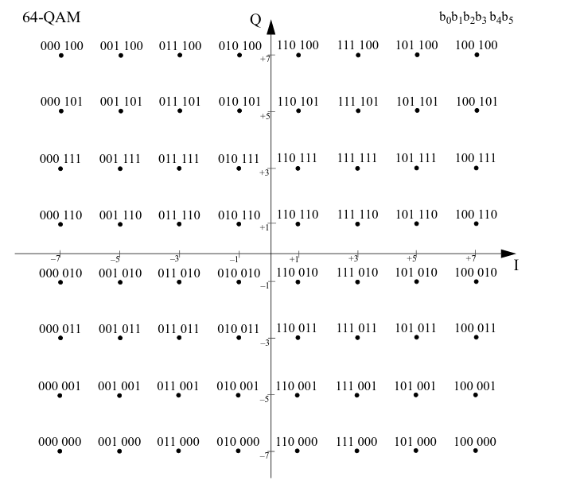
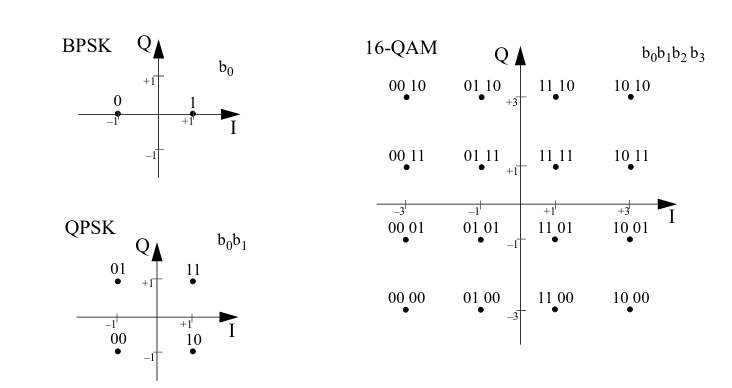
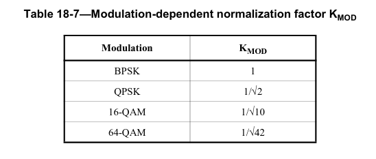
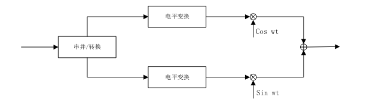
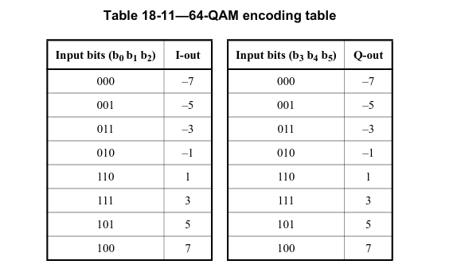
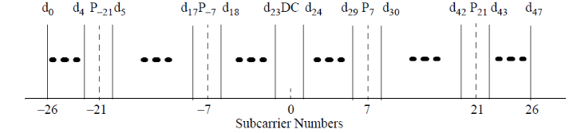
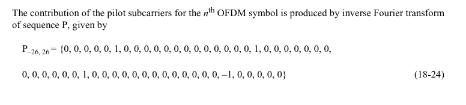
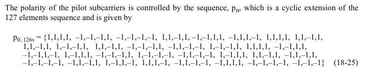
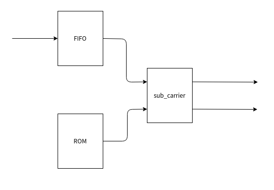
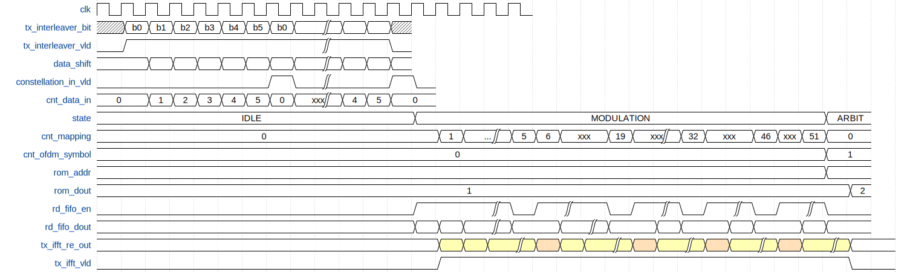

# 1. 前言
在上一篇博客当中，已经完成了数据域的交织，数据域的数据经过交织之后，下一步就是需要对交织之后的bit进行星座图的映射了。

<!--more-->

# 2. 调制
在 ofdm 通信系统中根据不同的速率要求，其子载波需要用二进制相移键控（bpsk）、正交相移键控（qpsk）、或正交幅度调制（qam）方式进行调制。数据经过卷积编码和交织后，串行比特流每 1、2、4 或 6 个比特被分为一组，用一定的规律将比特流映射成为复数，形成 BPSK，QPSK，16QAM，64QAM 调制。


在传输过程中调制方式可能发生变化，如 signal 域的数据采用的是 bpsk 调制，而 data 域采用的是另一种调制方式，为了使所有的映射有一样的平均功率，需要对映射进行归一化。映射后的复数值乘上一个归一化的量 Kmod，即可得到输出数据。Kmod 的值根据不同的调制模式而不同。


## 2.1 QAM调制
QAM 与其他调制技术相比，能得到更高的频谱效率，且具有抗噪声能力强等优点，因此得到了广泛的应用。QAM调制中，数据信号由相互正交的两个载波的幅度变化表示。QAM 是一种矢量调制，将输入比特先映射（一般采用格雷码）到一个复平面（星座图）上，形成复数调制符号，然后将该符号的 i、q 分量（即该复数的实部和虚部）分别对应调制在相互正交（时域正交）的两个载波cos 和 sin 上。
正交振幅调制可以表示为：
$$s(t)=A_{m}cos(wt)+B_{m}cos(wt) (0 \leq t\leq Ts)$$

上述式子当中$A_{m}, B_{m}$就是调制之后得到的实部和虚部的数据。


## 2.2 QAM64 调制
64QAM在星座图上具有64个星座点，每个星座点代表一种状态，每6个bit表示一个星座点，其映射关系如下：

穿行输入的bit，每6个bit构成一个星座点，第一个进来的是b0,进入的顺序依次排列为b0b1b2b3b4b5，根据映射表，可以得到虚部和实部的映射结果：

b0b1b2对应I路，b3b4b5对应Q路数据，再乘以归一化因子，得到调制之后的IQ路的值。
根据上面的表格，我们可以将最终映射出来的结果计算出来，这里以1位符号位，1位整数位，30位小数位来对结果进行量化：
```verilog
//----------------QAM64 I/Q mapping------------------
//Fixed-point quantization, 1 sign bit, 1 bit interger, 30bit decimal
localparam QAM64_IQ_B000 = 3135193572; //3'b000 ==> -7, -7/sqrt(42) ==>3135193572
localparam QAM64_IQ_B001 = 3466557494; //3'b001 ==> -5, -5/sqrt(42) ==>3466557494
localparam QAM64_IQ_B011 = 3797921415; //3'b011 ==> -3, -3/sqrt(42) ==> 3797921415
localparam QAM64_IQ_B010 = 4129285336; //3'b010 ==> -1, -1/sqrt(42) ==>4129285336
localparam QAM64_IQ_B110 = 165681960 ; //3'b110 ==> 1, 1/sqrt(42) ==>165681960
localparam QAM64_IQ_B111 = 497045881 ; //3'b111 ==> 3, 3/sqrt(42) ==>497045881
localparam QAM64_IQ_B101 = 828409802 ; //3'b101 ==> 5, 5/sqrt(42) ==>828409802
localparam QAM64_IQ_B100 = 1159773723; //3'b100 ==> 7, 7/sqrt(42) ==> 1159773723

localparam QAM64_IQ_ONE = 1073741824;
localparam QAM64_IQ_MINUS_ONE = 3221225472;
```

## 2.3 插入导频
在接收机当中，虽然利用接收到的短/长训练序列，能够进行信道均衡，频偏校正，但符号还会存在一定的剩余频率偏差，并且偏差会随着时间的积累而累积，会造成所有子载波产生一定的剩余相位偏转。因此，还需要不断的对参考相位进行跟踪。要实现这一功能，需要在 52 个非零子载波中插入 4 个导频符号。

Data 域的数据经过星座图映射后形成对应的复数值，每个 ofdm 符号周期可以通过 48 个子信道发出 48 个调制后的数据，所以把这些值每 48 个分成一组，每一组将对应一个 ofdm 符号。
子载波的数量一共有 53 个，每个子载波的标号为-26,-25,...,-1,0,1,...,26。其中 48 个复数数据分别对应到-26 至-22，-20 至-8，-6至-1，1 至 6，8 至 20，以及 20 至 26 这些子载波上，四个导频子信道分别对应到-21，-7，7 和 21 这 4 个子载波上。0 号子载波上填充零值（直流）。


导频所处位置的值，是根据一个循环的导频的极性控制序列来完成的，该极性控制序列如下：

每个导频极性对应一个OFDM符号，比如第一个OFDM符号也就是signal域的符号，其导频极性控制为1，那么其输出导频位置所给的值就位1 1 1 -1，又比如第5个OFDM符号，也就是第4个data域的OFDM符号，其极性控制为-1，那么其导频位置所给的值就位-1 -1 -1 1。

# 3. 星座图映射与导频插入
了解了基本的原理之后就可以着手进行模块的设计了。在本模块当中主要实现的是如何来生成映射之后的数据。
- 首先，串行的bit，需要按照QAM64的方式转换成一个个的6bit的星座点，然后将这个转换之后的星座点写入到一个FIFO当中。
- 当一帧数据的所有星座点全部写入到FIFO之后，开始进行星座图的映射和导频的插入。
- 使能一个计数器，计数器的技术值是从0~51，这个值对应着除0频之外的所有子载波的序号。然后再根据计数器的值，来控制是否从FIFO当红读取星座点进行映射，或者在计数到导频位置的时候，插入导频。
- 等待一个OFDM传递给下一个模块，IFFT模块将一个OFDM符号处理完毕之后，在进行下一个OFDM符号的处理。直到所有的星座点全部处理完毕。


该过程的时序设计如下图所示：


**NOTE: 在对数据域进行调制的时候，导频控制序列是从地址1开始累加，直到处理完126个OFDM符号是，这是导频控制序列读取到第126个，然后才会回到0，然后从0~126循环，因为在802.11a当中，第一个OFDM符号是signal域的符号，data域是从第二个符号开始。 **

该模块的代码如下：

```verilog
`timescale 1ns / 1ps
module tx_modulate(
	input 	wire		clk_Modulation				,
	input 	wire		reset						,
	input 	wire		tx_modulate_in_valid		,
	input 	wire		tx_modulate_in_bit			,
	input 	wire		tx_freq_to_timed_cycle_flag	,
	output 	reg [15:0]	n_ofdm_syms					,
	output 	reg 		tx_modulate_out_valid		,
	output 	reg [31:0]	tx_modulate_re_out			,
	output 	reg [31:0]	tx_modulate_im_out
    );

	//====================================================
	// paramter define
	//====================================================
	localparam IDLE  	= 3'b001;
	localparam MODULATE = 3'b010;
	localparam ARBIT 	= 3'b100;	

	//----------------QAM64 I/Q mapping------------------
	//Fixed-point quantization, 1 sign bit, 1 bit interger, 30bit decimal
	localparam QAM64_IQ_B000 = 3135193572; //3'b000 ==> -7, -7/sqrt(42) ==>3135193572
	localparam QAM64_IQ_B001 = 3466557494; //3'b001 ==> -5, -5/sqrt(42) ==>3466557494
	localparam QAM64_IQ_B011 = 3797921415; //3'b011 ==> -3, -3/sqrt(42) ==> 3,797,921,415
	localparam QAM64_IQ_B010 = 4129285336; //3'b010 ==> -1, -1/sqrt(42) ==>4,129,285,336
	localparam QAM64_IQ_B110 = 165681960 ; //3'b110 ==> 1, 1/sqrt(42) ==>165,681,960
	localparam QAM64_IQ_B111 = 497045881 ; //3'b111 ==> 3, 3/sqrt(42) ==>497045881
	localparam QAM64_IQ_B101 = 828409802 ; //3'b101 ==> 5, 5/sqrt(42) ==>828409802
	localparam QAM64_IQ_B100 = 1159773723; //3'b100 ==> 7, 7/sqrt(42) ==> 1159773723

	localparam QAM64_IQ_ONE = 1073741824;
	localparam QAM64_IQ_MINUS_ONE = 3221225472;
	
	//====================================================
	// internal signals and registers
	//====================================================
	reg   			tx_modulate_in_valid_dly		; 
	wire  			tx_modulate_in_valid_neg_pls	;
	reg  	[5:0] 	constellation_point 			; // serial bit to parallel constellation ponit
	reg  			constellation_point_vld			; // constellation point valid
	reg 	[3:0]	cnt_data_in 					; // counter for the data shift register
	reg		[15:0]	cnt_constellation_point 		; // counter for constellation point
	reg  	[15:0]	num_of_constellation_point 		; // total number of constellation point
	reg   			num_of_constellation_point_vld 	;

	wire  	[23:0] 	divider_result 					;
	wire   			divider_result_vld 				;

	reg   	[2:0]	state  							; // state register
	reg  	[7:0]	cnt_mapping 					;
	reg   			rd_fifo_en  					;
	wire    [5:0] 	rd_fifo_dout 					;
	wire   			full,empty  					;
	reg  	[7:0]	rom_addr 						;
	wire   			rom_dout 						;

	//----------------tx_modulate_in_valid_dly------------------
	always @(posedge clk_Modulation) begin
		tx_modulate_in_valid_dly <= tx_modulate_in_valid;
	end
	assign tx_modulate_in_valid_neg_pls = tx_modulate_in_valid_dly & (~tx_modulate_in_valid);

	//----------------constellation_ponit------------------
	always @(posedge clk_Modulation) begin
		if(reset == 1'b1)begin
			constellation_point <= 'd0;
		end
		else if(tx_modulate_in_valid_neg_pls)begin
			constellation_point <= 'd0;
		end
		else if(tx_modulate_in_valid)begin
			constellation_point <= {constellation_point[4:0], tx_modulate_in_bit};
		end
	end

	//----------------cnt_data_in------------------
	always @(posedge clk_Modulation) begin
		if (reset == 11'b1) begin
			cnt_data_in <= 'd0;
		end
		else if(tx_modulate_in_valid == 1'b1 && cnt_data_in == 'd5)begin
			cnt_data_in <= 'd0;
		end
		else if(tx_modulate_in_valid == 1'b1)begin
			cnt_data_in <= cnt_data_in + 1'b1;
		end
	end

	//---------------constellation_point_vld-------------------
	always @(posedge clk_Modulation) begin
		if(reset == 1'b1)begin
			constellation_point_vld <= 1'b0;
		end
		else if(tx_modulate_in_valid == 1'b1 && cnt_data_in == 'd5)begin
			constellation_point_vld <= 1'b1;
		end
		else begin
			constellation_point_vld <= 1'b0;
		end
	end

	//----------------cnt_constellation_point------------------
	always @(posedge clk_Modulation) begin
		if(reset == 1'b1)begin
			cnt_constellation_point <= 'd0;
		end
		else if(tx_modulate_in_valid_neg_pls)begin
			cnt_constellation_point <= 'd0;
		end
		else if(tx_modulate_in_valid == 1'b1 && cnt_data_in == 'd5)begin
			cnt_constellation_point <= cnt_constellation_point + 1'b1;
		end
	end

	//----------------num_of_constellation_point------------------
	always @(posedge clk_Modulation) begin
		if (reset == 1'b1) begin
			num_of_constellation_point <= 'd0;
			num_of_constellation_point_vld <= 1'b0;
		end
		else if (tx_modulate_in_valid_neg_pls) begin
			num_of_constellation_point <= cnt_constellation_point;
			num_of_constellation_point_vld <= 1'b1;
		end
		else begin
			num_of_constellation_point_vld <= 1'b0;
		end
	end

	div_gen_0 u_ofdm_symbol_cal (
		.aclk(clk_Modulation),                                      // input wire aclk
		.s_axis_divisor_tvalid(num_of_constellation_point_vld),    // input wire s_axis_divisor_tvalid
		.s_axis_divisor_tdata(8'd48),      // input wire [7 : 0] s_axis_divisor_tdata
		.s_axis_dividend_tvalid(num_of_constellation_point_vld),  // input wire s_axis_dividend_tvalid
		.s_axis_dividend_tdata(num_of_constellation_point),    // input wire [15 : 0] s_axis_dividend_tdata
		.m_axis_dout_tvalid(divider_result_vld),          // output wire m_axis_dout_tvalid
		.m_axis_dout_tdata(divider_result)            // output wire [23 : 0] m_axis_dout_tdata
	);

	always @(posedge clk_Modulation) begin
		if (reset == 1'b1) begin
			n_ofdm_syms <= 'd0;
		end
		else if(divider_result_vld)begin
			n_ofdm_syms <=divider_result[23:8];
		end
	end

	fifo_generator_tx_modulate u_fifo_generator_tx_modulate (
		.clk(clk_Modulation),      // input wire clk
		.srst(reset),    // input wire srst
		.din(constellation_point),      // input wire [5 : 0] din
		.wr_en(constellation_point_vld),  // input wire wr_en
		.rd_en(rd_fifo_en),  // input wire rd_en
		.dout(rd_fifo_dout),    // output wire [5 : 0] dout
		.full(full),    // output wire full
		.empty(empty)  // output wire empty
	);

	tx_pilot_rom u_tx_pilot_rom (
		.clka(clk_Modulation),    // input wire clka
		.addra(rom_addr),  // input wire [6 : 0] addra
		.douta(rom_dout)  // output wire [0 : 0] douta
	);

	//----------------state------------------
	always @(posedge clk_Modulation) begin
		if(reset == 1'b1)begin
			state <= IDLE;
		end
		else begin
			case(state)
				IDLE : begin
					if(tx_modulate_in_valid_neg_pls)begin
						state <= MODULATE;
					end
				end

				MODULATE : begin
					if (cnt_mapping == 'd51) begin
						state <= ARBIT;
					end
				end

				ARBIT : begin
					if(empty == 1'b1)begin
						state <= IDLE;
					end
					else if(tx_freq_to_timed_cycle_flag == 1'b1 && empty==1'b0)begin
						state <= MODULATE;
					end
				end

				default : state <= IDLE;
			endcase
		end
	end

	//----------------cnt_mapping------------------
	always @(posedge clk_Modulation) begin
		if (reset == 1'b1) begin
			cnt_mapping <= 'd0;
		end
		else if (state == MODULATE && cnt_mapping == 'd51) begin
			cnt_mapping <= 'd0;
		end
		else if (state == MODULATE) begin
			cnt_mapping <= cnt_mapping + 1'b1;
		end
		else begin
			cnt_mapping <= 'd0;
		end
	end

	always @(posedge clk_Modulation) begin
		if (reset == 1'b1) begin
			rom_addr <= 'd0;
		end
		else if (tx_modulate_in_valid_neg_pls) begin
			rom_addr <= 1;
		end
		else if (state == MODULATE && cnt_mapping == 'd51 && rom_addr == 126) begin
			rom_addr <= 'd0;
		end
		else if (state == MODULATE && cnt_mapping == 'd51 ) begin
			rom_addr <= rom_addr + 1'b1;
		end
	end

	//----------------rd_fifo_en------------------
	always @(*) begin
		if (state == MODULATE) begin
			if (cnt_mapping == 'd5 || cnt_mapping == 'd19 || cnt_mapping == 'd32 || cnt_mapping == 'd46) begin
				rd_fifo_en = 1'b0;
			end
			else begin
				rd_fifo_en = 1'b1;
			end
		end
		else begin
			rd_fifo_en = 1'b0;
		end
	end

	//------------------tx_modulate_re_out----------------
	always @(posedge clk_Modulation) begin
		if (reset == 1'b1) begin
			tx_modulate_re_out <= 'd0;
		end
		else if(state == MODULATE)begin
			// insert pilot according to the pilot index,when rom dout is 1, the inserted pilot is 1 1 1 -1
			// when rom dout is 0 the inserted pilot is -1 -1 -1 1
			if(cnt_mapping == 'd5 || cnt_mapping == 'd19 || cnt_mapping =='d32)begin
				if (rom_dout == 1'b1) begin
					tx_modulate_re_out <= QAM64_IQ_ONE;
				end
				else begin
					tx_modulate_re_out <= QAM64_IQ_MINUS_ONE;
				end
			end
			else if (cnt_mapping == 'd46) begin
				if (rom_dout == 1'b1) begin
					tx_modulate_re_out <= QAM64_IQ_MINUS_ONE;
				end
				else begin
					tx_modulate_re_out <= QAM64_IQ_ONE;
				end
			end
			else begin
				case(rd_fifo_dout[5:3])
					3'b000: tx_modulate_re_out <= QAM64_IQ_B000;
					3'b001: tx_modulate_re_out <= QAM64_IQ_B001;
					3'b010: tx_modulate_re_out <= QAM64_IQ_B010;
					3'b011: tx_modulate_re_out <= QAM64_IQ_B011;
					3'b100: tx_modulate_re_out <= QAM64_IQ_B100;
					3'b101: tx_modulate_re_out <= QAM64_IQ_B101;
					3'b110: tx_modulate_re_out <= QAM64_IQ_B110;
					3'b111: tx_modulate_re_out <= QAM64_IQ_B111;
					default : tx_modulate_re_out <= 'd0;
				endcase
			end
		end
		else begin
			 tx_modulate_re_out <= 'd0;
		end
	end

		//------------------tx_modulate_im_out----------------
	always @(posedge clk_Modulation) begin
		if (reset == 1'b1) begin
			tx_modulate_im_out <= 'd0;
		end
		else if(state == MODULATE)begin
			// insert pilot according to the pilot index,when rom dout is 1, the inserted pilot is 1 1 1 -1
			// when rom dout is 0 the inserted pilot is -1 -1 -1 1
			if(cnt_mapping == 'd5 || cnt_mapping == 'd19 || cnt_mapping =='d32 || cnt_mapping == 'd46)begin
				 tx_modulate_im_out <= 'd0;
			end
			else begin
				case(rd_fifo_dout[2:0])
					3'b000: tx_modulate_im_out <= QAM64_IQ_B000;
					3'b001: tx_modulate_im_out <= QAM64_IQ_B001;
					3'b010: tx_modulate_im_out <= QAM64_IQ_B010;
					3'b011: tx_modulate_im_out <= QAM64_IQ_B011;
					3'b100: tx_modulate_im_out <= QAM64_IQ_B100;
					3'b101: tx_modulate_im_out <= QAM64_IQ_B101;
					3'b110: tx_modulate_im_out <= QAM64_IQ_B110;
					3'b111: tx_modulate_im_out <= QAM64_IQ_B111;
					default : tx_modulate_im_out <= 'd0;
				endcase
			end
		end
		else begin
			 tx_modulate_im_out <= 'd0;
		end
	end

	always @(posedge clk_Modulation) begin
		if (reset == 1'b1) begin
			tx_modulate_out_valid <= 1'b0;
		end
		else if (state == MODULATE) begin
			tx_modulate_out_valid <= 1'b1;
		end
		else begin
			tx_modulate_out_valid <= 1'b0;
		end
	end

endmodule

```


