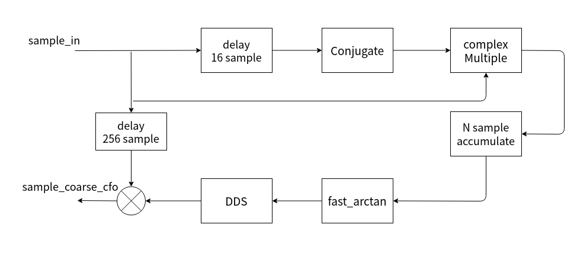

# 1. 前言
在之前的博客当中记录了如何来检测短训练序列，在检测短训练序列的时候，实现了一系列的模块，这些模块在无线通信的算法里面是比较常用的，在之后的学习当中也将会经常使用到。
检测到短训练序列之后，可以使用短训练序列对接收到的信号进行粗频偏校正，在这篇博客当中，我会记录学习这一部分的内容。

<!--more-->
# 2. 802.11a粗频偏校正原理


在接收机接收信号的过程如上图所示，在信号传递的过程当中需要经过无线信道，在接收机当中，由于本地载波和采样时钟与数据源端地不一致，从而引入了频偏到信号当中。由于频偏的引入，会对基带信号的处理带来影响，为了需要消除频偏带来的影响。
假设要接接收的信号的中心频率为 $f_c$ , 本地接受到的信号由于频偏可以看做本地使用了一个 $(1+e)f_c $ 的载波去接收信号，根据混频的原理，在接收信号时候将会得到 $(((1+e)f_c)-f_c)$ 和 $ (((1+e)f_c)+f_c) $ ，也即是差频项和倍频项。倍频项可以通过低通滤波器滤除。
这样我们在基带得到的信号就有一个 $ef_c$ 的频偏。频偏校正的目的就是尽量消除 $ef_c$ 所带来的影响。

根据角频率公式 $w = 2\pi f_s$ ;
那么在信号的每个采样周期下得到的弧度变化量是 $\alpha = wT_s = 2\pi f_sT_s $ ;
因此如果我们能够估计出每个采样周期弧度的变化量，那么我们就能够计算出基带信号的频偏。

下图是文献当中关于使用短训练序列进行校正的时候所采取的估计信号的弧度变化量的方法。

可以看到公式当中对当前采样点的共轭和延时16个采样点之后的数据进行相乘之后进行累加，并求取累加之后的复数的相位，最后将这个相位除以16，得到最终估计的相位。
因为采用的是对当前采样点进行取共轭，因此这个估计出来的相位与实际的方向正好是相反的。
估计出这个相位之后，就可以得到估计出来的频率，将这个频偏叠加到输入的信号上，从而达到校正频偏的作用。
$f_e = \alpha_{ST}/(2\pi T_s)$ ;

假设输入的信号为 $ S(n)= e^{2\pi f_i nT_s}$ ，那么产生的频偏校正信号为 $ S(cfo) = e^{-2\pi f_e nT_S} =  e^{-n\alpha_{st}}$ 

# 3. matlab 验证
```matlab
%%%%%%%%%%%%%%%%%%%%%%%%%%%%%%%%%%%%%%%%%%%%%%%%%%%%%%%%%%%%%%%%%%%%%%%%%%%%%%%%%%%%
% coarse frequency correction
% α_st = sum(s[m].*conj(s[m+16]))
% α_st = 2*pi*16*fc/Fs
% fc = α_st*Fs/(2*pi*16)
%%%%%%%%%%%%%%%%%%%%%%%%%%%%%%%%%%%%%%%%%%%%%%%%%%%%%%%%%%%%%%%%%%%%%%%%%%%%%%%%%%%%
clc;
clear all;
close all;

load('RxIQ.mat');
rx_sample = double(RxSave);
Fs = 20e6;
freq_offset = -16e3;    % freq offset of rx 120K

% the length of the input sequence
time_squence = [0:length(rx_sample)-1].';

% radian per samples
radian_per_sample = (2*pi*freq_offset/Fs); % 2*pi*f*T

% freq offset data
freq_offset_data = exp(1i*(time_squence*radian_per_sample)); %exp(jwt)

% data with freq offset
rx_sample = rx_sample.*freq_offset_data; % add freq offset to original data

corr = zeros(1,1000);
est_angle = zeros(1,1000);
for i=1:1000
    if(sum(abs(rx_sample(i:i+15).^2)) == 0)
        corr(i) = 0;
        est_angle(i)=0;
    else
        est_angle(i) = sum(conj(rx_sample(i:i+15)).*rx_sample(i+16:i+16+15));     % for the purpose of using angle
        % est_angle(i) = sum(conj(rx_sample(i:i+15)).*rx_sample(i+16:i+16+15));       % for the purpose of using fix_actan
        corr(i) = (abs(sum(rx_sample(i:i+15).*conj(rx_sample(i+16:i+16+15))))/abs(sum(rx_sample(i:i+15).*conj(rx_sample(i:i+15)))));
    end
end

short_sync_index = find((corr>0.75) & (corr <1.25)==1);
freq_est=(angle(est_angle(short_sync_index(100)))/(2*pi*16))*Fs;
display(freq_est);
est_freq_data = exp(-1i*(time_squence*(2*pi*freq_est/Fs)));

% freq_est=(fix_atan2(imag(est_angle(short_sync_index(100))),real(est_angle(short_sync_index(100))))/(2*pi*16))*Fs;
% Q = imag(est_angle(short_sync_index(100)));
% I = real(est_angle(short_sync_index(100)));
% fix_angle = fix_atan2(Q,I);
% display(Q);
% display(I);
% display(fix_angle);

% n=0:2047;
% s_rom = sin(2*pi*n/2048);
% c_rom = cos(2*pi*n/2048);
% freq_ctrl_word = fix(((freq_est/Fs)*2^32));
% display(freq_ctrl_word);

% phase_acc = 0;
% for i=1:length(rx_sample)
%     phase_acc = phase_acc - freq_ctrl_word;
%     if phase_acc > 2^32
%         phase_acc = phase_acc - 2^32;
%     elseif phase_acc < 0
%         phase_acc = phase_acc + 2^32;
%     end
%     rom_addr = bitshift(uint32(phase_acc),-21)+1;
%     est_freq_data(i,1) = complex(c_rom(rom_addr), s_rom(rom_addr));
% end

rx_correct_sample = rx_sample .* est_freq_data;

figure(1)
plot(corr);
hold on;
plot(real(rx_sample(1:1000))/(max(real(rx_sample(1:1000)))*0.5));
figure(2)
plot(real(rx_sample(1:1000)));
hold on;
plot(real(rx_correct_sample(1:1000)),'r','linewidth',0.8);
hold on;
plot(real(RxSave(1:1000)),'--g','linewidth',0.6);
title("blue: data with freq offset, red: data with coarse cfo, green original data without freq offset")

```

# 4. FPGA设计
了解了算法原理之后，就可以进行FPGA的设计了，在上一篇博客当中介绍过，上一篇博客当中实现的那些模块，许多都是能够共用的，因此能够帮助加快设计流程。

首先进来的采样点先延时16个采样点，然后对延时之后的采样点进行取共轭，然后将延时后的采样点和当前的采样点复数乘法，复数乘法的结果进行16点累加。累加得到的输出经过arctan或者cordic算法实现相位的求取之后。根据所求取的估算的相位，产生一个频率控制字用于驱动DDS粗频偏校正信号。最后将输入的采样点和粗频偏校正信号进行复数乘法之后，得到经过粗频偏校正之后的结果。

## 4.1 fast arctan算法
在FPGA当中实现三角函数比如反正切arctan这一类的函数是比较困难的，常用的方法是使用cordic算法来进行反正切的计算。当然也有一些常见的用于快速近似计算的方法，在这里推荐两个网站上面介绍了如何使用近似的方法来计算arctan，这对使用FPGA来实现很有意义。
___
[fixed-point-atan2](https://dspguru.com/dsp/tricks/fixed-point-atan2-with-self-normalization/)

___

[M_PI_4*x - x*(fabs(x) - 1)*(0.2447 + 0.0663*fabs(x))](http://nghiaho.com/?p=997)


___
在本篇博客当中，主要实现第二个算法模块，用于实现快速的反正切计算。
也就是 **est_alpha = M_PI_4*x - x*(fabs(x) - 1)*(0.2447 + 0.0663*fabs(x))； (x=q/i)**
该模块的设计思路以及时序如下:


上游模块检测到短训练序列之后，给出检测到短训练序列的的信号的IQ路数据，本模块将会对IQ路数据进行求取相位。
按照上面的公式，首先需要求的IQ信号的结果作为主要公式当中的x的值，然后一次进行多次乘法运算，最终将结果进行一个累加，最终得到输出的相位的值。
上面的时序图中将各个步骤进行了展示，为了减少DSP资源的消耗，在FPGA当中采用对不同的状态进行控制，从而实现只需要一个触发器，一个乘法器就能能够完成上面的算法，为此需要控制计算的状态，在不同的状态下完成不同的计算。
这里的计算过程是计算定点数。
具体的verilog代码如下 ：
**fix_arctan.v**
```verilog
module fix_arctan (
    input   wire            clk                         ,
    input   wire            rst                         ,
    input   wire            enable                      ,
    input   wire    [31:0]  y_in                        , // input q 
    input   wire    [31:0]  x_in                        , // input I
    input   wire            xy_in_valid                 ,
    output  reg     [31:0]  angle_out                   , // angle out of current 
    output  reg             angle_out_valid             ,
    output  reg     [31:0]  angle_out_div16x2pi         , // fix point angle out 
    output  reg             angle_out_div16x2pi_valid
);

    //====================================================
    // parameter define
    //====================================================
    localparam IDLE     = 3'd0;
    localparam DIV      = 3'd1;
    localparam XABS     = 3'd2;
    localparam ABS663   = 3'd3;
    localparam XMABS    = 3'd4;
    localparam XMABS2   = 3'd5;
    localparam M_PI_4   = 3'd6;
    localparam MULT_LAST= 3'd7;

    localparam FIX_ONE      = 32'd268435456;
    localparam FIX_QUART_PI = 32'd210828714;
    localparam FIX_P2447    = 32'd65686156;
    localparam FIX_P0663    = 32'd17797270;
    localparam FIX_DIV2PIX16= 32'd2670176;


    //====================================================
    // internalsignals and registers
    //====================================================
    reg  [2:0]      state               ;
    reg             xy_in_valid_r       ;
    reg  [31:0]     x_in_r              ;
    reg  [31:0]     y_in_r              ;
    wire            div_out_valid       ;
    wire [63:0]     div_out             ;
    reg  [31:0]     fix_div_out         ; // 1 bit sign, 3 bit quotient, 28 bit fractional
    reg             fix_div_out_valid   ;
    reg  [31:0]     abs_div             ;
    reg  [31:0]     abs_div_minus_1     ;
    reg             abs_div_valid       ;
    reg  [31:0]     mult_in_a           ;
    reg  [31:0]     mult_in_b           ;
    reg             mult_in_valid       ;
    wire [63:0]     mult_out            ;
    reg  [2:0]      mult_in_valid_dly   ;
    wire            mult_out_valid      ;
    reg             abs663_valid        ;
    reg  [31:0]     abs663_plus_p2447   ;
    reg             xmabs_valid         ;
    reg  [31:0]     xmabs_data          ;
    reg             xmabs2_valid        ;
    reg  [31:0]     xmabs2_data         ;
    reg             xmquart_pi_valid    ;
    reg  [31:0]     xmquart_pi_data     ;


    always @(posedge clk ) begin
        if (rst==1'b1) begin
            x_in_r <= 'd0;
            y_in_r <= 'd0;
        end
        else if(xy_in_valid == 1'b1)begin
            x_in_r <= (x_in==0)? 1: x_in;
            y_in_r <= y_in;
        end
    end

    always @(posedge clk ) begin
        if (rst==1'b1) begin
            xy_in_valid_r <= 1'b0;
        end
        else  begin
            xy_in_valid_r <= xy_in_valid;
        end

    end


      
    //----------------state------------------
    always @(posedge clk ) begin
        if (rst==1'b1) begin
            state <= IDLE;
        end
        else begin
            case(state)
                IDLE : begin
                    if(enable == 1'b1 && xy_in_valid == 1'b1)begin
                        state <= DIV;
                    end
                end

                DIV : begin
                    if(fix_div_out_valid == 1'b1)begin
                        state <= XABS;
                    end
                end

                XABS : begin
                    if(abs_div_valid == 1'b1)begin
                        state <= ABS663;
                    end
                end

                ABS663 : begin
                    if (abs663_valid == 1'b1) begin
                        state <= XMABS;
                    end
                end

                XMABS : begin
                    if (xmabs_valid == 1'b1) begin
                        state <= XMABS2;
                    end
                end

                XMABS2 : begin
                    if (xmabs2_valid == 1'b1) begin
                        state <= M_PI_4;
                    end
                end

                M_PI_4 : begin
                    if (xmquart_pi_valid == 1'b1) begin
                        state <= MULT_LAST;
                    end
                end

                MULT_LAST: begin
                    if(angle_out_div16x2pi_valid)begin
                        state <= IDLE;
                    end
                end

                default : state <= IDLE;
            endcase
        end
    end

    div_gen_tb u_div_gen_tb (
        .aclk(clk),                             // input wire aclk
        .s_axis_divisor_tvalid(xy_in_valid_r),    // input wire s_axis_divisor_tvalid
        .s_axis_divisor_tdata(x_in_r),            // input wire [31 : 0] s_axis_divisor_tdata
        .s_axis_dividend_tvalid(xy_in_valid_r),   // input wire s_axis_dividend_tvalid
        .s_axis_dividend_tdata(y_in_r),           // input wire [31 : 0] s_axis_dividend_tdata
        .m_axis_dout_tvalid(div_out_valid),          // output wire m_axis_dout_tvalid
        .m_axis_dout_tdata(div_out)            // output wire [47 : 0] m_axis_dout_tdata
    );

    //----------------fix_div_out------------------
    always @(posedge clk ) begin
        if (rst==1'b1) begin
            fix_div_out <= 'd0;
        end
        else if (enable == 1'b1) begin
            // 1 bit sign, 3 bit quotient, 28 bit fractional
            fix_div_out <= {div_out[63], div_out[34:32], 28'd0} + {{4{div_out[31]}},div_out[30:3]};
        end
    end

    //----------------fix_div_out_valid------------------
    always @(posedge clk ) begin
        fix_div_out_valid <= div_out_valid;
        abs_div_valid <= fix_div_out_valid;
    end

    //----------------abs_div------------------
    always @(posedge clk ) begin
        if (rst==1'b1) begin
            abs_div <= 'd0;
            abs_div_minus_1 <= 'd0;
        end
        else if (fix_div_out_valid == 1'b1) begin
            abs_div <= fix_div_out[31] ? (~fix_div_out)+1: fix_div_out ;
            abs_div_minus_1 <= fix_div_out[31] ? (~fix_div_out)+1 - FIX_ONE: fix_div_out - FIX_ONE;
        end
    end


    //----------------mult_in_valid------------------
    always @(posedge clk ) begin
        if (rst==1'b1) begin
            mult_in_valid <= 1'b0;
            mult_in_a <= 'd0;
            mult_in_b <= 'd0;
        end
        else if (state == XABS &&  abs_div_valid == 1'b1) begin
            mult_in_valid <= 1'b1;
            mult_in_a <= abs_div;
            mult_in_b <= FIX_P0663;
        end
        else if (state == ABS663 && abs663_valid == 1'b1) begin
            mult_in_valid <= 1'b1;
            mult_in_a <= abs_div_minus_1;
            mult_in_b <= fix_div_out;
        end
        else if (state == XMABS && xmabs_valid == 1'b1) begin
            mult_in_valid <= 1'b1;
            mult_in_a <= xmabs_data;
            mult_in_b <= abs663_plus_p2447;
        end
        else if (state == XMABS2 && xmabs2_valid == 1'b1) begin
            mult_in_valid <= 1'b1;
            mult_in_a <= fix_div_out;
            mult_in_b <= FIX_QUART_PI;
        end
        else if (state == MULT_LAST && angle_out_valid == 1'b1) begin
            mult_in_valid <= 1'b1;
            mult_in_a <= FIX_DIV2PIX16;
            mult_in_b <= angle_out;
        end
        else  begin
            mult_in_valid <=  1'b0;
        end
    end

    always @(posedge clk) begin
        mult_in_valid_dly <= {mult_in_valid_dly[1:0], mult_in_valid};
    end

    assign mult_out_valid = mult_in_valid_dly[2];

    mult_fix_arctan u_mult_fix_arctan (
        .CLK(clk),  // input wire CLK
        .A(mult_in_a),      // input wire [31 : 0] A
        .B(mult_in_b),      // input wire [31 : 0] B
        .P(mult_out)      // output wire [63 : 0] P
    );

    //----------------abs663_plus_p2447------------------
    always @(posedge clk ) begin
        if (rst==1'b1) begin
            abs663_plus_p2447 <= 'd0;
            abs663_valid <= 1'b0;
            xmabs_data <= 'd0;
            xmabs_valid <= 1'b0;
            xmabs2_data <= 'd0;
            xmabs2_valid <= 1'b0;
            xmquart_pi_data <= 'd0;
            xmquart_pi_valid <= 1'b0;
            angle_out_div16x2pi <= 'd0;
            angle_out_div16x2pi_valid <= 1'b0;
        end
        else if (state == ABS663 && mult_out_valid == 1'b1) begin
            abs663_plus_p2447 <= {mult_out[63], mult_out[58:56], mult_out[55:28]} + FIX_P2447;
            abs663_valid <= 1'b1;
        end
        else if (state == XMABS && mult_out_valid == 1'b1) begin
            xmabs_data <= {mult_out[63], mult_out[58:56], mult_out[55:28]};
            xmabs_valid <= 1'b1;
        end
        else if (state == XMABS2 && mult_out_valid == 1'b1) begin
            xmabs2_data <= {mult_out[63], mult_out[58:56], mult_out[55:28]};
            xmabs2_valid <= 1'b1;
        end
        else if (state == M_PI_4 && mult_out_valid == 1'b1) begin
            xmquart_pi_data <= {mult_out[63], mult_out[58:56], mult_out[55:28]};
            xmquart_pi_valid <= 1'b1;
        end
        else if (state == MULT_LAST && mult_out_valid == 1'b1) begin
            angle_out_div16x2pi <= {mult_out[63], mult_out[58:56], mult_out[55:28]};
            angle_out_div16x2pi_valid <= 1'b1;
        end
        else begin
            abs663_valid <= 1'b0;
            xmabs_valid <= 1'b0;
            xmabs2_valid <= 1'b0;
            xmquart_pi_valid <= 1'b0;
            angle_out_div16x2pi_valid <= 1'b0;
        end
    end

    always @(posedge clk ) begin
        if (rst==1'b1) begin
            angle_out <= 'd0;
            angle_out_valid <= 1'b0;
        end
        else if (xmquart_pi_valid ==1'b1 ) begin
            angle_out <= xmquart_pi_data - xmabs2_data;
            angle_out_valid <= 1'b1;
        end
        else begin
            angle_out_valid <= 1'b0;
        end
    end

endmodule
```
## 4.2 粗频偏校正
在上一步计算出估计的相位之后，就可以根据这个计算出来的相位产生一个频率控制字，从而实现输出一个校正的信号，叠加到原始信号上，从而实现粗频偏校正。

具体的步骤，就如上面的图中所示：
```verilog
module rx_coarse_sync_with_st (
    input   wire            clk                         ,
    input   wire            rst                         ,
    input   wire            enable                      ,
    input   wire    [15:0]  sample_in_i                 ,
    input   wire    [15:0]  sample_in_q                 ,
    input   wire            sample_in_valid             ,

    input   wire    [31:0]  sts_coarse_freq_offset_i    ,
    input   wire    [31:0]  sts_coarse_freq_offset_q    ,
    input   wire            sts_coarse_freq_offset_valid,   

    output  reg     [15:0]  sample_cfoc_i               ,// data after coarse freq offset
    output  reg     [15:0]  sample_cfoc_q               ,
    output  reg             sample_cfoc_valid                   
);


    //====================================================
    // internal signals and registers
    //====================================================
    wire            sample_delay_out_valid      ;
    wire  [15:0]    sample_delay_out_i, sample_delay_out_q; 
    reg   [15:0]    sample_delay_out_i_dly, sample_delay_out_q_dly;

    // fix point data 1bit sign, 3bit quotient, 28bit fractional
    wire  [31:0]    angle_out                   ; // actual estimate angle data
    wire            angle_out_valid             ;
    wire  [31:0]    angle_out_div16x2pi         ; // estimate angle data for drive dds
    wire            angle_out_div16x2pi_valid   ;

    reg   [31:0]    freq_control_word           ;
    reg   [31:0]    phase_accumulator           ;
    reg             phase_acc_valid             ;
    wire  [15:0]    dds_cfoc_i, dds_cfoc_q      ;
    wire            dds_cfoc_valid              ;

    wire            cmpy_cfoc_out_valid         ;
    wire  [31:0]    cmpy_cfoc_out_i, cmpy_cfoc_out_q;


    // delay input samples, after coarse freq offset is calculated out, 
    // correction freq could add to these samples
    sample_delay#(
        .DATA_WIDTH              ( 32 ),
        .DELAY_DEEPTH            ( 256 )
    )u_sample_delay(
        .clk                     ( clk                     ),
        .rst                     ( rst                     ),
        .enable                  ( enable                  ),
        .sample_in_valid         ( sample_in_valid         ),
        .sample_in               ( {sample_in_q, sample_in_i} ),
        .sample_delay_out_valid  ( sample_delay_out_valid  ),
        .sample_delay_out        ( {sample_delay_out_q, sample_delay_out_i})
    );


    fix_arctan u_fix_arctan(
        .clk                        ( clk                       ),
        .rst                        ( rst                       ),
        .enable                     ( enable                    ),
        .y_in                       ( sts_coarse_freq_offset_q  ),
        .x_in                       ( sts_coarse_freq_offset_i  ),
        .xy_in_valid                ( sts_coarse_freq_offset_valid),
        .angle_out                  ( angle_out                 ),
        .angle_out_valid            ( angle_out_valid           ),
        .angle_out_div16x2pi        ( angle_out_div16x2pi       ),
        .angle_out_div16x2pi_valid  ( angle_out_div16x2pi_valid  )
    );

    always @(posedge clk ) begin
        if (rst==1'b1) begin
            freq_control_word <= 'd0;
        end
        else if (enable == 1'b1) begin
            freq_control_word <= {angle_out_div16x2pi, 4'd0};
        end
        else  begin
            freq_control_word <=  'd0;
        end
    end
    

    always @(posedge clk ) begin
        if (rst==1'b1) begin
            phase_accumulator <= 'd0;
        end
        else if (enable == 1'b1) begin
            if (sample_delay_out_valid == 1'b1) begin
                phase_accumulator <= phase_accumulator - freq_control_word;
            end
        end
        else  begin
            phase_accumulator <=  'd0;
        end
    end

    //----------------phase_acc_valid------------------
    always @(posedge clk) begin
        if (rst==1'b1) begin
            phase_acc_valid <= 1'b0;
        end
        else if (enable == 1'b1 && sample_delay_out_valid == 1'b1) begin
            phase_acc_valid <= 1'b1;
        end
        else  begin
            phase_acc_valid <=  1'b0;
        end
    end

    always @(posedge clk) begin
        {sample_delay_out_i_dly, sample_delay_out_q_dly} <= {sample_delay_out_i, sample_delay_out_q};
    end


    // 1 beat latency
    dds_cfoc u_dds_cfoc (
        .aclk(clk),                                // input wire aclk
        .s_axis_phase_tvalid(phase_acc_valid),  // input wire s_axis_phase_tvalid
        .s_axis_phase_tdata({ {4{phase_accumulator[31]}},phase_accumulator[31:20]}),    // input wire [15 : 0] s_axis_phase_tdata
        .m_axis_data_tvalid(dds_cfoc_valid),    // output wire m_axis_data_tvalid
        .m_axis_data_tdata({dds_cfoc_q, dds_cfoc_i})      // output wire [31 : 0] m_axis_data_tdata
    );
    


    cmpy_cfoc u_cmpy_cfoc (
        .aclk(clk),                              // input wire aclk
        .s_axis_a_tvalid(dds_cfoc_valid),        // input wire s_axis_a_tvalid
        .s_axis_a_tdata({dds_cfoc_q, dds_cfoc_i}),          // input wire [31 : 0] s_axis_a_tdata
        .s_axis_b_tvalid(dds_cfoc_valid),        // input wire s_axis_b_tvalid
        .s_axis_b_tdata({sample_delay_out_q_dly, sample_delay_out_i_dly}),          // input wire [31 : 0] s_axis_b_tdata
        .m_axis_dout_tvalid(cmpy_cfoc_out_valid),  // output wire m_axis_dout_tvalid
        .m_axis_dout_tdata({cmpy_cfoc_out_q, cmpy_cfoc_out_i})    // output wire [63 : 0] m_axis_dout_tdata
    );

    //----------------sample_cfoc_valid------------------
    always @(posedge clk ) begin
        if (rst==1'b1) begin
            sample_cfoc_valid <= 1'b0;
        end
        else if (enable == 1'b1) begin
            sample_cfoc_valid <= cmpy_cfoc_out_valid;
            // sample_cfoc_valid <= sample_delay_out_valid;
        end
        else  begin
            sample_cfoc_valid <=  'd0;
        end
    end

    //----------------sample_cfoc_i/q------------------
    always @(posedge clk ) begin
        if (rst==1'b1) begin
            sample_cfoc_i <= 'd0;
            sample_cfoc_q <= 'd0;
        end
        else if (enable == 1'b1) begin
            sample_cfoc_i <= {cmpy_cfoc_out_i[31],cmpy_cfoc_out_i[26:12]};
            sample_cfoc_q <= {cmpy_cfoc_out_q[31],cmpy_cfoc_out_q[26:12]};
            // sample_cfoc_i <= sample_delay_out_i;
            // sample_cfoc_q <= sample_delay_out_q;
        end
        else  begin
            sample_cfoc_i <= 'd0;
            sample_cfoc_q <= 'd0;
        end
    end

endmodule

```