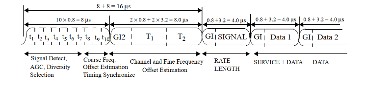
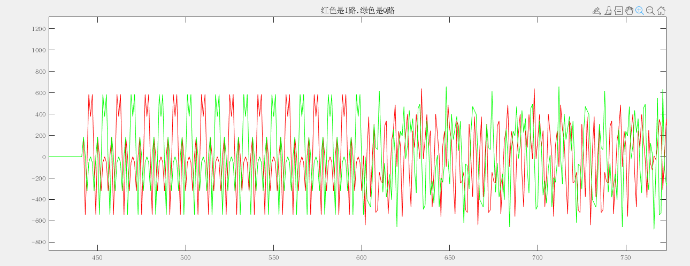
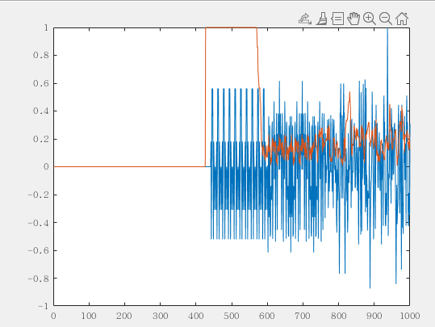
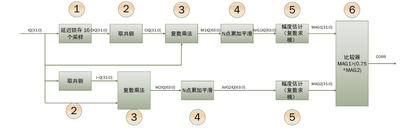

# 1. 前言
在前面实现了802.11a的发送数据包的生成，从而完成了802.11a的发送数据通路。在上面实现了数据的加扰，卷积编码，交织，OFDM星座图映射，IFFT的转换和添加循环前缀，添加前导码LTS，STS等操作。
相较于802.11a的发送数据链路，接受数据链路的难度相较于发送链路会大很多，里面涉及了许多同步的算法的设置，频偏的校正等操作。
从这篇博客开始，我将会记录在学习802.11a数据解调的过程中所学习到的东西。
<!--more-->

# 2. 短训练序列的检测原理
在一个802.11a的数据帧当中，首先是10个短训练序列，每个短训练序列的长度是0.8us，在解调802.11a的帧数据的时候，可以使用短训练序列来进行包检测。

在前面实现OFDM发送机的时候，我们可以知道，这10个短训练序列是重复的，因此在接收端可以对接受到的信号进行相关来检测相关峰，因为当短训练序列正好对上的时候，根据短训练序列的特性，相关的结果将呈现一个较大的值。
一个短训练序列的周期是0.8us，在20M采样率的情况下，一个段训练序列需要16个采样周期。
$$
corr(i) = \frac{\sum_{i=0}^{N}s[i]\times \overline{s[i+16]}}{\sum_{i=0}^{N}s[i]\times \overline{s[i]}}
$$

其中 $\overline{s[i+16]}$ 是之后16个采样点的共轭， $\overline{s[i]}$ 是当前采样点的共轭。在进行相关的时候，到了段训练序列的值，那么当前相关出来的结果应该接近1。
其中短训练序列的时域波形如下：


```matlab
clc;
clear all;
close all;

load('RxIQ.mat');
rx_sample = double(RxSave);

for i = 1:1000
    if (sum(abs(rx_sample(i:i+15).^2)) == 0)
        corr(i) = 0;
    else
        corr(i) = abs(sum(rx_sample(i:i+15).*conj(rx_sample(i+16:i+16+15))))/abs(sum(rx_sample(i:i+15).*conj(rx_sample(i:i+15))));
    end
end

figure(1);
plot(real(rx_sample(1:1000))/max(abs(real(rx_sample(1:1000)))));
hold on;
plot(corr);
```
在进行相关之后，可以看到当前的相关结果会出现一个持续一段时间的相关峰。

在实际的FPGA实现的时候，我们就可以根据这个算法来进行设计，实际上，检测短训练序列还需要加入一些额外的条件，才能保证不会发生误判。
- 短训练序列出现相关峰，并且要连续地保持足够长的时间，由于有10个短训练序列，一个短训练序列的周期是0.8us，在20M采样率下短训练序列一共有160个采样点。因此首先需要满足检测到有连续100个采样点满足相关峰地值接近1。
- 可以看到在相关峰超过阈值的之后，短训练序列输入的信号依然会有正有负，因此我们可以计数当前检测到的数据的正负的个数，并且当正数和负数都大于一定阈值的时候，才判定当前检测到了短训练序列。

# 3. 短训练序列检测的实现
在前面了解了短训练序列的原理，别看在matlab里面就是一行代码的事情，想要用FPGA来实现，需要将这一行代码一步一步地拆开，转换到对应的硬件资源上，才能最终实现包的检测。
我们可以再回顾一下这个算法：
从这里不难看出，在设计的时候，需要进行以下的操作，分别是对数据进行延时16拍，对当前数据和延时16拍之后的数据取共轭，进行复数乘法，求累加和，分子分母进行比较。
$$
corr(i) = \frac{\sum_{i=0}^{N}s[i]\times \overline{s[i+16]}}{\sum_{i=0}^{N}s[i]\times \overline{s[i]}}
$$

因此在实现上述算法的过程的时候，我们需要分别实现各个模块的操作。
上面这个算法的硬件实现方法，可以参考如下框图。

主要信号可以分为两路，分别对应上面的公式当中的分子和分母的数据。
首先可以看分子上这一路数据。
- 首先对输入的信号进行延时16个采样点
- 然后对延时模块输出的信号进行取共轭
- 然后将当前的采样点和延时16采样点之后的数据进行复数乘法
- 经过复数乘法之后的数据需要在累加一段时间，在这里我们设计累加16个采样点，也就是刚好一个STS的长度
- 然后使用一个幅度估计的算法来计算出当前的复数信号的模，也就是我们计算出的分子上的结果。

对于分母上的过程，其处理方式和分子的类似
- 然后对当前采样点的信号进行取共轭
- 然后将当前的采样点和其共轭后的数据进行复数乘法
- 经过复数乘法之后的数据需要在累加一段时间，在这里我们设计累加16个采样点，也就是刚好一个STS的长度
- 然后使用一个幅度估计的算法来计算出当前的复数信号的模，也就是我们计算出的分母上的结果。

最后，我们需要比较分子和分母上的这两个模的大小，当分子上的模大于 3/4分母时，可以判定当前出现了短训练序列出现了相关峰。出现相关峰之后，还需要进行进一步的处理才能判断当前的确检测到了短训练序列。

- 出现相关峰之后，首先我们得保证相关峰的结果需要保持100个连续的采样点。
- 其次我们得保证，在相关峰持续的时候，输入的实际的采样点的值，既有正数也有复数，并且正负数的个数都需要大于一定的阈值，比如30，因为短训练序列的正负数是基本一致的。

## 3.1 延时模块
