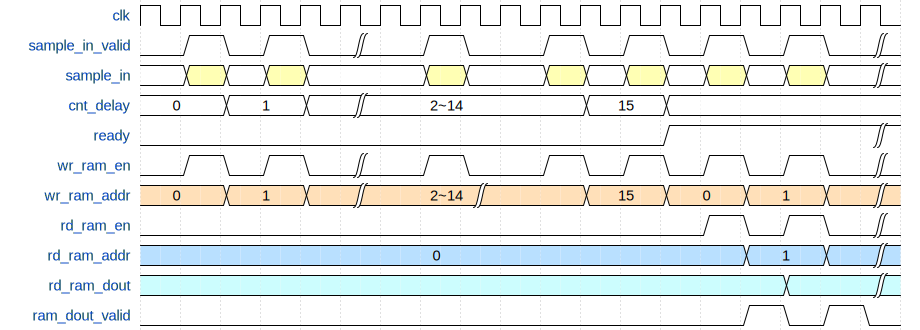
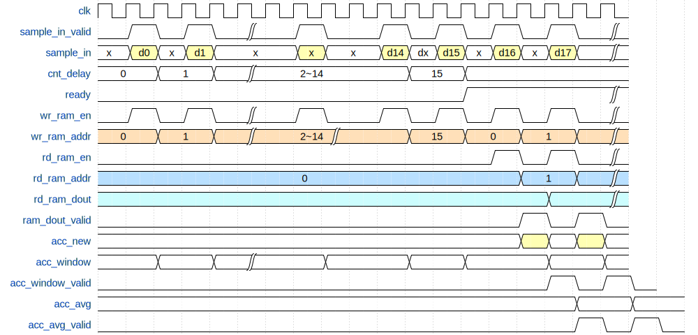
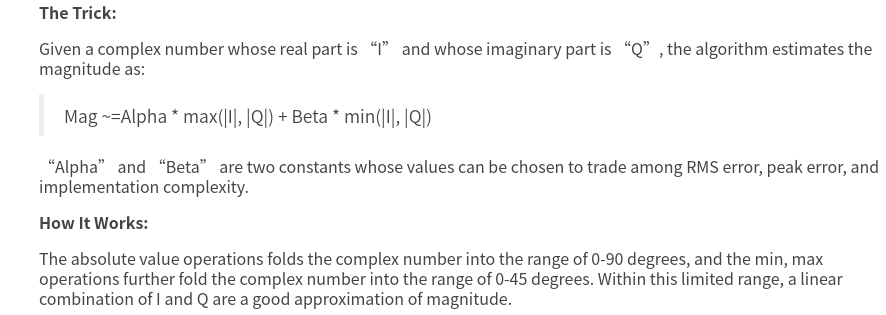
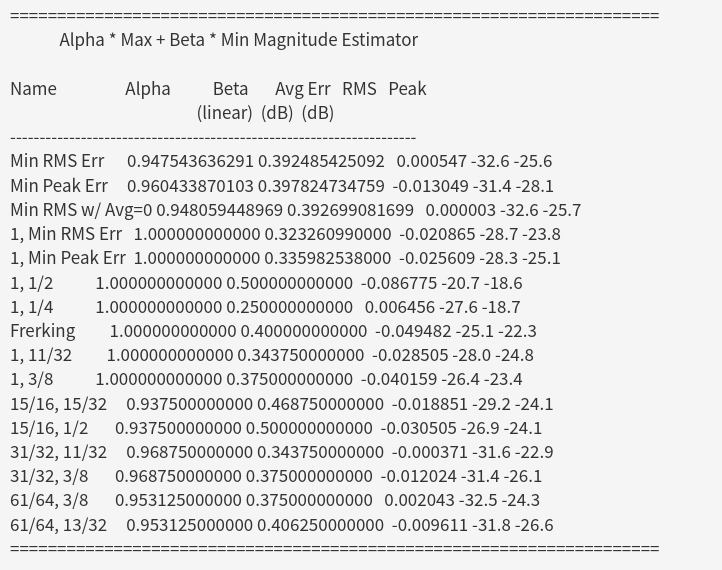
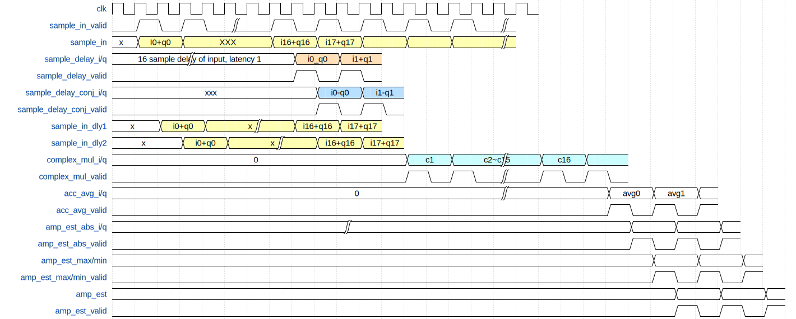

# 1. 前言
在前面实现了802.11a的发送数据包的生成，从而完成了802.11a的发送数据通路。在上面实现了数据的加扰，卷积编码，交织，OFDM星座图映射，IFFT的转换和添加循环前缀，添加前导码LTS，STS等操作。
相较于802.11a的发送数据链路，接受数据链路的难度相较于发送链路会大很多，里面涉及了许多同步的算法的设置，频偏的校正等操作。
从这篇博客开始，我将会记录在学习802.11a数据解调的过程中所学习到的东西。
<!--more-->

# 2. 短训练序列的检测原理
在一个802.11a的数据帧当中，首先是10个短训练序列，每个短训练序列的长度是0.8us，在解调802.11a的帧数据的时候，可以使用短训练序列来进行包检测。

在前面实现OFDM发送机的时候，我们可以知道，这10个短训练序列是重复的，因此在接收端可以对接受到的信号进行相关来检测相关峰，因为当短训练序列正好对上的时候，根据短训练序列的特性，相关的结果将呈现一个较大的值。
一个短训练序列的周期是0.8us，在20M采样率的情况下，一个段训练序列需要16个采样周期。
$$
corr(i) = \frac{\sum_{i=0}^{N}s[i]\times \overline{s[i+16]}}{\sum_{i=0}^{N}s[i]\times \overline{s[i]}}
$$

其中 $\overline{s[i+16]}$ 是之后16个采样点的共轭， $\overline{s[i]}$ 是当前采样点的共轭。在进行相关的时候，到了段训练序列的值，那么当前相关出来的结果应该接近1。
其中短训练序列的时域波形如下：


```matlab
clc;
clear all;
close all;

load('RxIQ.mat');
rx_sample = double(RxSave);

for i = 1:1000
    if (sum(abs(rx_sample(i:i+15).^2)) == 0)
        corr(i) = 0;
    else
        corr(i) = abs(sum(rx_sample(i:i+15).*conj(rx_sample(i+16:i+16+15))))/abs(sum(rx_sample(i:i+15).*conj(rx_sample(i:i+15))));
    end
end

figure(1);
plot(real(rx_sample(1:1000))/max(abs(real(rx_sample(1:1000)))));
hold on;
plot(corr);
```
在进行相关之后，可以看到当前的相关结果会出现一个持续一段时间的相关峰。

在实际的FPGA实现的时候，我们就可以根据这个算法来进行设计，实际上，检测短训练序列还需要加入一些额外的条件，才能保证不会发生误判。
- 短训练序列出现相关峰，并且要连续地保持足够长的时间，由于有10个短训练序列，一个短训练序列的周期是0.8us，在20M采样率下短训练序列一共有160个采样点。因此首先需要满足检测到有连续100个采样点满足相关峰地值接近1。
- 可以看到在相关峰超过阈值的之后，短训练序列输入的信号依然会有正有负，因此我们可以计数当前检测到的数据的正负的个数，并且当正数和负数都大于一定阈值的时候，才判定当前检测到了短训练序列。

# 3. 短训练序列检测的实现
在前面了解了短训练序列的原理，别看在matlab里面就是一行代码的事情，想要用FPGA来实现，需要将这一行代码一步一步地拆开，转换到对应的硬件资源上，才能最终实现包的检测。
我们可以再回顾一下这个算法：
从这里不难看出，在设计的时候，需要进行以下的操作，分别是对数据进行延时16拍，对当前数据和延时16拍之后的数据取共轭，进行复数乘法，求累加和，分子分母进行比较。
$$
corr(i) = \frac{\sum_{i=0}^{N}s[i]\times \overline{s[i+16]}}{\sum_{i=0}^{N}s[i]\times \overline{s[i]}}
$$

因此在实现上述算法的过程的时候，我们需要分别实现各个模块的操作。
上面这个算法的硬件实现方法，可以参考如下框图。

主要信号可以分为两路，分别对应上面的公式当中的分子和分母的数据。
首先可以看分子上这一路数据。
- 首先对输入的信号进行延时16个采样点
- 然后对延时模块输出的信号进行取共轭
- 然后将当前的采样点和延时16采样点之后的数据进行复数乘法
- 经过复数乘法之后的数据需要在累加一段时间，在这里我们设计累加16个采样点，也就是刚好一个STS的长度
- 然后使用一个幅度估计的算法来计算出当前的复数信号的模，也就是我们计算出的分子上的结果。

对于分母上的过程，其处理方式和分子的类似
- 然后对当前采样点的信号进行取共轭
- 然后将当前的采样点和其共轭后的数据进行复数乘法
- 经过复数乘法之后的数据需要在累加一段时间，在这里我们设计累加16个采样点，也就是刚好一个STS的长度
- 然后使用一个幅度估计的算法来计算出当前的复数信号的模，也就是我们计算出的分母上的结果。

最后，我们需要比较分子和分母上的这两个模的大小，当分子上的模大于 3/4分母时，可以判定当前出现了短训练序列出现了相关峰。出现相关峰之后，还需要进行进一步的处理才能判断当前的确检测到了短训练序列。

- 出现相关峰之后，首先我们得保证相关峰的结果需要保持100个连续的采样点。
- 其次我们得保证，在相关峰持续的时候，输入的实际的采样点的值，既有正数也有复数，并且正负数的个数都需要大于一定的阈值，比如30，因为短训练序列的正负数是基本一致的。

## 3.1 延时模块

延时模块的设计思路如下：
当采样点进入延时模块时，首先将数据写入到RAM当中，当RAM当中已经存有需要延时的采样点个数之后，拉高一个ready信号，在ready信号拉高之后，再进来一个采样点，就会把地址0的数据读出，并且将这个新写入的数据存到地址0当中，然后按着这个顺序依次进行，这样就能够完成延时需要的时钟周期了。

该部分的代码如下：

```verilog
module sample_delay #(
    parameter DATA_WIDTH = 32,
    parameter DELAY_DEEPTH = 16
) ( 
    input   wire                        clk                     ,   
    input   wire                        rst                     ,
    input   wire                        enable                  ,
    input   wire                        sample_in_valid         ,    
    input   wire [DATA_WIDTH-1:0]       sample_in               ,
    output  reg                         sample_delay_out_valid  ,
    output  wire [DATA_WIDTH-1:0]       sample_delay_out
);
    //  The following function calculates the address width based on specified RAM depth
    function integer clogb2;
    input integer depth;
        for (clogb2=0; depth>0; clogb2=clogb2+1)
        depth = depth >> 1;
    endfunction

    //====================================================
    // internal signals and resgiters
    //====================================================
    reg                                 delay_ready ; // delay enough samples 
    reg [clogb2(DELAY_DEEPTH-1)-1:0]    cnt_delay   ; // delay counter

    wire                                wr_ram_en   ;
    reg [clogb2(DELAY_DEEPTH-1)-1:0]    wr_ram_addr ;
    wire[DATA_WIDTH-1:0]                wr_ram_data ;

    wire                                rd_ram_en   ;
    reg [clogb2(DELAY_DEEPTH-1)-1:0]    rd_ram_addr ;
    wire[DATA_WIDTH-1:0]                rd_ram_data ;


    //----------------cnt_delay------------------
    always @(posedge clk) begin
        if (rst == 1'b1) begin
            cnt_delay <= 'd0;
        end
        else if (enable == 1'b1) begin
            if(delay_ready == 1'b0 && sample_in_valid == 1'b1 && cnt_delay == DELAY_DEEPTH -1)begin
                cnt_delay <= 'd0;
            end
            if(delay_ready == 1'b0 && sample_in_valid == 1'b1)begin
                cnt_delay <= cnt_delay + 1'b1;
            end
        end
        else begin
            cnt_delay <= 'd0;
        end
    end

    //----------------delay_ready------------------
    always @(posedge clk ) begin
        if (rst==1'b1) begin
            delay_ready <= 1'b0;
        end
        else if (enable == 1'b1) begin
            if (delay_ready == 1'b0 && sample_in_valid == 1'b1 && cnt_delay == DELAY_DEEPTH -1) begin
                delay_ready <= 1'b1;
            end
        end
        else begin
            delay_ready <=  1'b0;
        end
    end

    //----------------wr_ram_addr------------------
    always @(posedge clk ) begin
        if (rst==1'b1) begin
            wr_ram_addr <= 'd0;
        end
        else if (enable == 1'b1) begin
            if (samplmodule sample_delay #(
    parameter DATA_WIDTH = 32,
    parameter DELAY_DEEPTH = 16
) ( 
    input   wire                        clk                     ,   
    input   wire                        rst                     ,
    input   wire                        enable                  ,
    input   wire                        sample_in_valid         ,    
    input   wire [DATA_WIDTH-1:0]       sample_in               ,
    output  reg                         sample_delay_out_valid  ,
    output  wire [DATA_WIDTH-1:0]       sample_delay_out
);
    //  The following function calculates the address width based on specified RAM depth
    function integer clogb2;
    input integer depth;
        for (clogb2=0; depth>0; clogb2=clogb2+1)
        depth = depth >> 1;
    endfunction

    //====================================================
    // internal signals and resgiters
    //====================================================
    reg                                 delay_ready ; // delay enough samples 
    reg [clogb2(DELAY_DEEPTH-1)-1:0]    cnt_delay   ; // delay counter

    wire                                wr_ram_en   ;
    reg [clogb2(DELAY_DEEPTH-1)-1:0]    wr_ram_addr ;
    wire[DATA_WIDTH-1:0]                wr_ram_data ;

    wire                                rd_ram_en   ;
    reg [clogb2(DELAY_DEEPTH-1)-1:0]    rd_ram_addr ;
    wire[DATA_WIDTH-1:0]                rd_ram_data ;


    //----------------cnt_delay------------------
    always @(posedge clk) begin
        if (rst == 1'b1) begin
            cnt_delay <= 'd0;
        end
        else if (enable == 1'b1) begin
            if(delay_ready == 1'b0 && sample_in_valid == 1'b1 && cnt_delay == DELAY_DEEPTH -1)begin
                cnt_delay <= 'd0;
            end
            if(delay_ready == 1'b0 && sample_in_valid == 1'b1)begin
                cnt_delay <= cnt_delay + 1'b1;
            end
        end
        else begin
            cnt_delay <= 'd0;
        end
    end

    //----------------delay_ready------------------
    always @(posedge clk ) begin
        if (rst==1'b1) begin
            delay_ready <= 1'b0;
        end
        else if (enable == 1'b1) begin
            if (delay_ready == 1'b0 && sample_in_valid == 1'b1 && cnt_delay == DELAY_DEEPTH -1) begin
                delay_ready <= 1'b1;
            end
        end
        else begin
            delay_ready <=  1'b0;
        end
    end

    //----------------wr_ram_addr------------------
    always @(posedge clk ) begin
        if (rst==1'b1) begin
            wr_ram_addr <= 'd0;
        end
        else if (enable == 1'b1) begin
            if (sample_in_valid == 1'b1 && wr_ram_addr == DELAY_DEEPTH - 1) begin
                wr_ram_addr <= 'd0;
            end
            else if (sample_in_valid == 1'b1) begin
                wr_ram_addr <= wr_ram_addr + 1'b1;
            end
        end
        else  begin
            wr_ram_addr <=  'd0;
        end
    end

    assign wr_ram_en = sample_in_valid;
    assign wr_ram_data = sample_in;


    simple_2port_ram#(
        .RAM_WIDTH       ( DATA_WIDTH ),
        .RAM_DEPTH       ( DELAY_DEEPTH ),
        .RAM_PERFORMANCE ( "LOW_LATENCY" ),
        .INIT_FILE       ( "" )
    )u_simple_2port_ram(
        .addra           ( wr_ram_addr     ),
        .addrb           ( rd_ram_addr     ),
        .dina            ( wr_ram_data     ),
        .clka            ( clk             ),
        .clkb            ( clk             ),
        .wea             ( wr_ram_en       ),
        .enb             ( rd_ram_en       ),
        .rstb            ( rst             ),
        .regceb          ( 1'b1            ),
        .doutb           ( rd_ram_data     )
    );


    //----------------rd_ram_addr------------------
    always @(posedge clk ) begin
        if (rst==1'b1) begin
            rd_ram_addr <= 'd0;
        end
        else if (enable == 1'b1) begin
            if (sample_in_valid == 1'b1 && delay_ready == 1'b1 && (rd_ram_addr == DELAY_DEEPTH - 1)) begin
                rd_ram_addr <= 'd0;
            end
            else if (sample_in_valid == 1'b1 && delay_ready == 1'b1) begin
                rd_ram_addr <= rd_ram_addr + 1'b1;
            end
        end
        else  begin
            rd_ram_addr <=  'd0;
        end
    end

    assign rd_ram_en = sample_in_valid & delay_ready;

    //----------------sample_delay_out_valid------------------
    always @(posedge clk) begin
        sample_delay_out_valid <= rd_ram_en;
    end

    assign sample_delay_out = rd_ram_data;
    
endmodulee_in_valid == 1'b1 && wr_ram_addr == DELAY_DEEPTH - 1) begin
                wr_ram_addr <= 'd0;
            end
            else if (sample_in_valid == 1'b1) begin
                wr_ram_addr <= wr_ram_addr + 1'b1;
            end
        end
        else  begin
            wr_ram_addr <=  'd0;
        end
    end

    assign wr_ram_en = sample_in_valid;
    assign wr_ram_data = sample_in;


    simple_2port_ram#(
        .RAM_WIDTH       ( DATA_WIDTH ),
        .RAM_DEPTH       ( DELAY_DEEPTH ),
        .RAM_PERFORMANCE ( "LOW_LATENCY" ),
        .INIT_FILE       ( "" )
    )u_simple_2port_ram(
        .addra           ( wr_ram_addr     ),
        .addrb           ( rd_ram_addr     ),
        .dina            ( wr_ram_data     ),
        .clka            ( clk             ),
        .clkb            ( clk             ),
        .wea             ( wr_ram_en       ),
        .enb             ( rd_ram_en       ),
        .rstb            ( rst             ),
        .regceb          ( 1'b1            ),
        .doutb           ( rd_ram_data     )
    );


    //----------------rd_ram_addr------------------
    always @(posedge clk ) begin
        if (rst==1'b1) begin
            rd_ram_addr <= 'd0;
        end
        else if (enable == 1'b1) begin
            if (sample_in_valid == 1'b1 && delay_ready == 1'b1 && (rd_ram_addr == DELAY_DEEPTH - 1)) begin
                rd_ram_addr <= 'd0;
            end
            else if (sample_in_valid == 1'b1 && delay_ready == 1'b1) begin
                rd_ram_addr <= rd_ram_addr + 1'b1;
            end
        end
        else  begin
            rd_ram_addr <=  'd0;
        end
    end

    assign rd_ram_en = sample_in_valid & delay_ready;

    //----------------sample_delay_out_valid------------------
    always @(posedge clk) begin
        sample_delay_out_valid <= rd_ram_en;
    end

    assign sample_delay_out = rd_ram_data;
    
endmodule
```

## 3.2 求累加和模块
求累加和模块的时序设计如下所示：

该模块的设计思路如下：
输入的采样点，在采样点有效的情况下进行累加，并将输入的采样点写入到RAM当中，当累加到需要的采样点个数的时候，比如16，会拉高这个ready信号，ready信号拉高之后，再来一个采样点，将RAM当中的第一个采样点读出，并且将新进入的采样点写入。与此同时累加和再原来的基础上，加上新进来的采样点的值并且减去从RAM当中读出的值，也就16个采样点之前的值，这样就能够保证求取一个长度为16的窗口当中的累加和了。

该部分的实现代码如下：
```verilog
module accumulate_avg #(
    parameter DATA_WIDTH = 32,
    parameter DELAY_DEEPTH = 16
) ( 
    input   wire                        clk                     ,   
    input   wire                        rst                     ,
    input   wire                        enable                  ,
    input   wire                        sample_in_valid         ,    
    input   wire [DATA_WIDTH-1:0]       sample_in               ,
    output  reg                         acc_avg_out_valid       ,
    output  reg  [DATA_WIDTH-1:0]       acc_avg_out
);
    //  The following function calculates the address width based on specified RAM depth
    function integer clogb2;
    input integer depth;
        for (clogb2=0; depth>0; clogb2=clogb2+1)
        depth = depth >> 1;
    endfunction

    //====================================================
    // parameter define
    //====================================================
    localparam EXT_WDITH = clogb2(DELAY_DEEPTH-1);

    //====================================================
    // internal signals and resgiters
    //====================================================
    reg                                 delay_ready ; // delay enough samples 
    reg [clogb2(DELAY_DEEPTH-1)-1:0]    cnt_delay   ; // delay counter
    reg                                 sample_in_valid_dly1,sample_in_valid_dly2;
    
    reg                                 delay_ready_dly1, delay_ready_dly2, delay_ready_dly3;

    wire                                wr_ram_en   ;
    reg [clogb2(DELAY_DEEPTH-1)-1:0]    wr_ram_addr ;
    wire[DATA_WIDTH-1:0]                wr_ram_data ;

    wire                                rd_ram_en   ;
    reg [clogb2(DELAY_DEEPTH-1)-1:0]    rd_ram_addr ;
    wire[DATA_WIDTH-1:0]                rd_ram_data ;
    reg                                 rd_ram_valid;

    reg [DATA_WIDTH + EXT_WDITH-1:0]    acc_window  ;
    reg                                 acc_window_valid;
    reg [DATA_WIDTH-1:0]                acc_new     ;
    wire[DATA_WIDTH-1:0]                acc_old     ;
    wire[DATA_WIDTH + EXT_WDITH-1:0]    acc_ext_new ;
    wire[DATA_WIDTH + EXT_WDITH-1:0]    acc_ext_old ;


    //----------------cnt_delay------------------
    always @(posedge clk) begin
        if (rst == 1'b1) begin
            cnt_delay <= 'd0;
        end
        else if (enable == 1'b1) begin
            if(delay_ready == 1'b0 && sample_in_valid == 1'b1 && cnt_delay == DELAY_DEEPTH -1)begin
                cnt_delay <= 'd0;
            end
            if(delay_ready == 1'b0 && sample_in_valid == 1'b1)begin
                cnt_delay <= cnt_delay + 1'b1;
            end
        end
        else begin
            cnt_delay <= 'd0;
        end
    end

    //----------------delay_ready------------------
    always @(posedge clk ) begin
        if (rst==1'b1) begin
            delay_ready <= 1'b0;
        end
        else if (enable == 1'b1) begin
            if (delay_ready == 1'b0 && sample_in_valid == 1'b1 && cnt_delay == DELAY_DEEPTH -1) begin
                delay_ready <= 1'b1;
            end
        end
        else begin
            delay_ready <=  1'b0;
        end
    end

    //----------------wr_ram_addr------------------
    always @(posedge clk ) begin
        if (rst==1'b1) begin
            wr_ram_addr <= 'd0;
        end
        else if (enable == 1'b1) begin
            if (sample_in_valid == 1'b1 && wr_ram_addr == DELAY_DEEPTH - 1) begin
                wr_ram_addr <= 'd0;
            end
            else if (sample_in_valid == 1'b1) begin
                wr_ram_addr <= wr_ram_addr + 1'b1;
            end
        end
        else  begin
            wr_ram_addr <=  'd0;
        end
    end

    assign wr_ram_en = sample_in_valid;
    assign wr_ram_data = sample_in;

    always @(posedge clk ) begin
        if (rst==1'b1) begin
            sample_in_valid_dly1 <= 1'b0;
            sample_in_valid_dly2 <= 1'b0;
            delay_ready_dly1 <= 1'b0;
            delay_ready_dly2 <= 1'b0;
            delay_ready_dly3 <= 1'b0;
        end
        else  begin
            sample_in_valid_dly1 <=  sample_in_valid;
            sample_in_valid_dly2 <=  sample_in_valid_dly1;
            delay_ready_dly1 <= delay_ready;
            delay_ready_dly2 <= delay_ready_dly1;
        end
    end


    simple_2port_ram#(
        .RAM_WIDTH       ( DATA_WIDTH ),
        .RAM_DEPTH       ( DELAY_DEEPTH ),
        .RAM_PERFORMANCE ( "LOW_LATENCY" ),
        .INIT_FILE       ( "" )
    )u_simple_2port_ram(
        .addra           ( wr_ram_addr     ),
        .addrb           ( rd_ram_addr     ),
        .dina            ( wr_ram_data     ),
        .clka            ( clk             ),
        .clkb            ( clk             ),
        .wea             ( wr_ram_en       ),
        .enb             ( rd_ram_en       ),
        .rstb            ( rst             ),
        .regceb          ( 1'b1            ),
        .doutb           ( rd_ram_data     )
    );


    //----------------rd_ram_addr------------------
    always @(posedge clk ) begin
        if (rst==1'b1) begin
            rd_ram_addr <= 'd0;
        end
        else if (enable == 1'b1) begin
            if (sample_in_valid == 1'b1 && delay_ready == 1'b1 && (rd_ram_addr == DELAY_DEEPTH - 1)) begin
                rd_ram_addr <= 'd0;
            end
            else if (sample_in_valid == 1'b1 && delay_ready == 1'b1) begin
                rd_ram_addr <= rd_ram_addr + 1'b1;
            end
        end
        else  begin
            rd_ram_addr <=  'd0;
        end
    end

    assign rd_ram_en = sample_in_valid & delay_ready;

    //----------------rd_ram_valid------------------
    always @(posedge clk) begin
        rd_ram_valid <= rd_ram_en;
    end

    //----------------acc_new/old------------------
    always @(posedge clk ) begin
        if (rst==1'b1) begin
            acc_new <= 'd0;
        end
        else if (enable == 1'b1) begin
            if (delay_ready == 1'b1 && sample_in_valid == 1'b1) begin
                acc_new <= sample_in;
            end
        end
        else  begin
            acc_new <=  'd0;
        end
    end

    assign acc_old = rd_ram_data;

    assign acc_ext_new = {{EXT_WDITH{acc_new[DATA_WIDTH-1]}}, acc_new};
    assign acc_ext_old = {{EXT_WDITH{acc_old[DATA_WIDTH-1]}}, acc_old};
    
    //----------------acc_window------------------
    always @(posedge clk ) begin
        if (rst==1'b1) begin
            acc_window <= 'd0;
        end
        else if (enable == 1'b1) begin
            if(delay_ready == 1'b0)begin
                if(sample_in_valid == 1'b1)begin
                    acc_window <= acc_window + {{EXT_WDITH{sample_in[DATA_WIDTH-1]}},sample_in};
                end
            end
            else begin
                if (rd_ram_valid == 1'b1) begin
                   acc_window <= acc_window - acc_ext_old + acc_ext_new; 
                end
            end
        end
        else  begin
            acc_window <=  'd0;
        end
    end

    //----------------acc_window_valid------------------
    always @(posedge clk ) begin
        if (rst==1'b1) begin
            acc_window_valid <= 1'b0;
        end
        else if (enable == 1'b1) begin
            if (delay_ready == 1'b1 ) begin
                acc_window_valid <= rd_ram_valid;
            end
        end
        else  begin
            acc_window_valid <=  1'b0;
        end
    end

    //----------------avg_out_valid------------------
    always @(posedge clk ) begin
        if (rst==1'b1) begin
            acc_avg_out_valid <= 1'b0;
        end
        else if (enable == 1'b1) begin
            // latency 2 beat
            acc_avg_out_valid <= delay_ready ? acc_window_valid | (~delay_ready_dly2 & delay_ready_dly1) : sample_in_valid_dly2;
        end
        else  begin
            acc_avg_out_valid <= 1'b0;
        end
    end

    //----------------acc_avg_out------------------
    always @(posedge clk ) begin
        if (rst==1'b1) begin
            acc_avg_out <= 'd0;
        end
        else if (enable == 1'b1) begin
            acc_avg_out <= acc_window[DATA_WIDTH + EXT_WDITH-1: EXT_WDITH];
        end
        else  begin
            acc_avg_out <=  'd0;
        end
    end
    
endmodule
```
## 3.3 幅度估计算法
下面的网站介绍了一种幅度估计算法，相较于原始的根据IQ信号求取模的方式，使用这种简单的方式能够使用硬件比较方便的实现。
[magnitude-estimator](https://dspguru.com/dsp/tricks/magnitude-estimator/)

根据输入的I路和Q路的数据的绝对值来估计幅度，其中参数alpha和beta可以有如下的取值：

在硬件设计的时候，可以选择alpha为1，beta为0.25。

有了这个幅度估计的算法最为支撑，就能够很容易地完成短训练序列的检测了，具体的设计时序如下：

经过累加求和之后的自相关和互相关的值，依次求取各自的IQ路的绝对值，然后根据幅度估计算法，求得自相关和互相关的结果，并且进行比较，通过比较分子和分母的值从而判定是否检测到802.11a的包。
这部分的代码如下：
```verilog
module ofdm_packet_detect (
    input   wire                clk                     ,
    input   wire                rst                     ,
    input   wire                enable                  ,   
    input   wire    [15:0]      sample_in_i             ,
    input   wire    [15:0]      sample_in_q             ,
    input   wire                sample_in_valid         ,
    input   wire    [15:0]      sts_detect_threshold    , // decision threshold
    output  reg                 sts_detect_flag           // detected the ofdm short training sequence
    );

    //====================================================
    // delay path
    //====================================================
    // delay one short traning sequence(16 beates in this case)
    wire            sample_delay_out_valid;
    wire    [31:0]  sample_delay_out;
    wire    [15:0]  sample_delay_out_i, sample_delay_out_q;
    
    // get the Conjugate value of the 16 beats delay
    reg     [15:0]  sample_delay_conj_i, sample_delay_conj_q;
    reg             sample_delay_conj_valid;

    // delay the input data for cross correlation
    reg     [15:0]  sample_in_i_dly1, sample_in_i_dly2;
    reg     [15:0]  sample_in_q_dly1, sample_in_q_dly2;
    reg             sample_in_valid_dly1, sample_in_valid_dly2;

    // calculate the complex multiplication
    wire            s_delay_complex_out_valid;
    wire    [63:0]  s_delay_complex_out;
    wire    [31:0]  s_delay_complex_out_i, s_delay_complex_out_q;

    // calculate the accumulate value for cross correlation
    wire            s_delay_acc_avg_i_valid, s_delay_acc_avg_q_valid;
    wire    [31:0]  s_delay_acc_avg_i, s_delay_acc_avg_q;

    // get the absolute value of i/q for amplitude estimation
    reg             s_delay_est_abs_valid;
    reg     [31:0]  s_delay_est_abs_i, s_delay_est_abs_q;
    
    // get the max and min value of i/q for amplitude estimation
    reg             s_delay_est_max_min_valid;
    reg     [31:0]  s_delay_est_max, s_delay_est_min;

    // calculate the amplitude estimation 
    // mag = alpha*max(|I|, |Q|) + beta*min(|I|, |Q|);
    // alpha=1, beta=1/4
    reg             s_delay_amp_est_valid;
    reg     [31:0]  s_delay_amp_est;

    //====================================================
    // current path
    //====================================================

    // the conjugate value the current sample, this at the same beat 
    // of sample_in_i/q_dly2
    reg     [15:0]  s_curr_conj_q, s_curr_conj_i;
    reg             s_curr_conj_valid;

    // calculate the complex multiplication
    wire            s_curr_complex_out_valid;
    wire    [63:0]  s_curr_complex_out;
    wire    [31:0]  s_curr_complex_out_i, s_curr_complex_out_q;

    // calculate the accumulate value for auto-correlation
    wire            s_curr_acc_avg_i_valid, s_curr_acc_avg_q_valid;
    wire    [31:0]  s_curr_acc_avg_i, s_curr_acc_avg_q;

    // get the absolute value of i/q for amplitude estimation
    reg             s_curr_est_abs_valid;
    reg     [31:0]  s_curr_est_abs_i, s_curr_est_abs_q;
    
    // get the max and min value of i/q for amplitude estimation
    reg             s_curr_est_max_min_valid;
    reg     [31:0]  s_curr_est_max, s_curr_est_min;

    // calculate the amplitude estimation 
    // mag = alpha*max(|I|, |Q|) + beta*min(|I|, |Q|);
    // alpha=1, beta=1/4
    reg             s_curr_amp_est_valid;
    reg     [31:0]  s_curr_amp_est;
    wire    [31:0]  s_curr_amp_est_075; // 75% of current amplitude estimation value

    //====================================================
    // detect region
    //====================================================
    reg     [15:0]  pos_threshold, neg_threshold;
    reg     [15:0]  amp_est_threshold;
    reg     [15:0]  cnt_pos, cnt_neg;
    reg     [15:0]  cnt_est_ok;
        
    

    /*********************************************************
                        delay path
    *********************************************************/
    //======================================================
    // delay 16 samples for Cross correlation
    // the sample_delay_out has 1 beat delay from sample_in
    //======================================================
    sample_delay#(
        .DATA_WIDTH              ( 32 ),
        .DELAY_DEEPTH            ( 16 )
    )u_sample_delay(
        .clk                     ( clk                     ),
        .rst                     ( rst                     ),
        .enable                  ( enable                  ),
        .sample_in_valid         ( sample_in_valid         ),
        .sample_in               ( {sample_in_q, sample_in_i} ),
        .sample_delay_out_valid  ( sample_delay_out_valid  ),
        .sample_delay_out        ( sample_delay_out        )
    );
    assign sample_delay_out_q = sample_delay_out[31:16];
    assign sample_delay_out_i = sample_delay_out[15:0];

    //====================================================
    // Conjugate the sample
    // 1 beat latency
    //====================================================
    always @(posedge clk ) begin
        if (rst==1'b1) begin
            sample_delay_conj_q <= 'd0;
            sample_delay_conj_i <= 'd0;
            sample_delay_conj_valid <= 1'b0;
        end
        else  begin
            sample_delay_conj_q <= ~sample_delay_out_q + 1;
            sample_delay_conj_i <= sample_delay_out_i;
            sample_delay_conj_valid <= sample_delay_out_valid;
        end
    end

    //====================================================
    // delay 2 beats of the input sample,
    // In order to be able to match the 
    // data with a delay of 16 sampling points 
    //====================================================
    always @(posedge clk) begin
        if(rst == 1'b1)begin
            sample_in_i_dly1 <= 'd0;
            sample_in_i_dly2 <= 'd0;
            sample_in_q_dly1 <= 'd0;
            sample_in_q_dly2 <= 'd0;
            sample_in_valid_dly1 <= 'd0;
            sample_in_valid_dly2 <= 'd0;
        end
        else begin
            sample_in_i_dly1 <= sample_in_i;
            sample_in_i_dly2 <= sample_in_i_dly1;
            sample_in_q_dly1 <= sample_in_q;
            sample_in_q_dly2 <= sample_in_q_dly1;
            sample_in_valid_dly1 <= sample_in_valid;
            sample_in_valid_dly2 <= sample_in_valid_dly1; 
        end
    end

    //====================================================
    // complex multiplication, conj(s[i])*s[i+16]
    // 4 beats latency
    //====================================================
    cmpy_iq16 u_cmpy_iq16_packet_detect_delay (
        .aclk(clk),                              // input wire aclk
        .s_axis_a_tvalid(sample_delay_conj_valid),        // input wire s_axis_a_tvalid
        .s_axis_a_tdata({sample_delay_conj_q, sample_delay_conj_i}),          // input wire [31 : 0] s_axis_a_tdata
        .s_axis_b_tvalid(sample_delay_conj_valid),        // input wire s_axis_b_tvalid
        .s_axis_b_tdata({sample_in_q_dly2, sample_in_i_dly2}),          // input wire [31 : 0] s_axis_b_tdata
        .m_axis_dout_tvalid(s_delay_complex_out_valid),  // output wire m_axis_dout_tvalid
        .m_axis_dout_tdata(s_delay_complex_out)    // output wire [63 : 0] m_axis_dout_tdata
    );

    assign s_delay_complex_out_i = s_delay_complex_out[31:0];
    assign s_delay_complex_out_q = s_delay_complex_out[63:32];

    //====================================================
    // calculate the 16 sample accumulate value
    // 3 beats latency
    //====================================================
    accumulate_avg#(
        .DATA_WIDTH         ( 32 ),
        .DELAY_DEEPTH       ( 16 )
    )u_acc_avg_delay_i(
        .clk                ( clk                       ),
        .rst                ( rst                       ),
        .enable             ( enable                    ),
        .sample_in_valid    ( s_delay_complex_out_valid ),
        .sample_in          ( s_delay_complex_out_i     ),
        .acc_avg_out_valid  ( s_delay_acc_avg_i_valid   ),
        .acc_avg_out        ( s_delay_acc_avg_i         )
    );

    accumulate_avg#(
        .DATA_WIDTH         ( 32 ),
        .DELAY_DEEPTH       ( 16 )
    )u_acc_avg_delay_q(
        .clk                ( clk                       ),
        .rst                ( rst                       ),
        .enable             ( enable                    ),
        .sample_in_valid    ( s_delay_complex_out_valid ),
        .sample_in          ( s_delay_complex_out_q     ),
        .acc_avg_out_valid  ( s_delay_acc_avg_q_valid   ),
        .acc_avg_out        ( s_delay_acc_avg_q         )
    );

    //====================================================
    // Amplitude estimation, step 1:
    // get the absolute value of i/q data
    //====================================================
    always @(posedge clk ) begin
        if (rst==1'b1) begin
            s_delay_est_abs_valid <= 1'b0;
        end
        else if (enable == 1'b1) begin
            s_delay_est_abs_valid <= s_delay_acc_avg_i_valid; 
        end
        else  begin
            s_delay_est_abs_valid <=  1'b0;
        end
    end

    always @(posedge clk ) begin
        if (rst==1'b1) begin
            s_delay_est_abs_i <= 'd0;
            s_delay_est_abs_q <= 'd0;
        end
        else if (enable == 1'b1) begin
            if (s_delay_acc_avg_i_valid == 1'b1) begin
                s_delay_est_abs_i <= s_delay_acc_avg_i[31]? ~(s_delay_acc_avg_i)+1 : s_delay_acc_avg_i;
                s_delay_est_abs_q <= s_delay_acc_avg_q[31]? ~(s_delay_acc_avg_q)+1 : s_delay_acc_avg_q;
            end
        end
        else  begin
            s_delay_est_abs_i <= 'd0;
            s_delay_est_abs_q <= 'd0;
        end
    end

    //====================================================
    // Amplitude estimation, step 2:
    // get the max and min value of |I|, |Q|
    //====================================================
    always @(posedge clk ) begin
        if (rst==1'b1) begin
            s_delay_est_max_min_valid <= 1'b0;
        end
        else if (enable == 1'b1) begin
            s_delay_est_max_min_valid <= s_delay_est_abs_valid; 
        end
        else  begin
            s_delay_est_max_min_valid <=  1'b0;
        end
    end

    always @(posedge clk ) begin
        if (rst==1'b1) begin
            s_delay_est_max <= 'd0;
            s_delay_est_min <= 'd0;
        end
        else if (enable == 1'b1) begin
            if (s_delay_est_abs_valid == 1'b1) begin
                s_delay_est_max <= (s_delay_est_abs_i > s_delay_est_abs_q) ? s_delay_est_abs_i : s_delay_est_abs_q;
                s_delay_est_min <= (s_delay_est_abs_i < s_delay_est_abs_q) ? s_delay_est_abs_i : s_delay_est_abs_q;
            end
        end
        else  begin
            s_delay_est_max <= 'd0;
            s_delay_est_min <= 'd0;
        end
    end   

    //====================================================
    // Amplitude estimation, step 3:
    // calculate the amplitude estimation 
    // mag = alpha*max(|I|, |Q|) + beta*min(|I|, |Q|);
    // alpha=1, beta=1/4
    //====================================================
    always @(posedge clk ) begin
        if (rst==1'b1) begin
            s_delay_amp_est_valid <= 1'b0;
        end
        else if (enable == 1'b1) begin
            s_delay_amp_est_valid <= s_delay_est_max_min_valid; 
        end
        else  begin
            s_delay_amp_est_valid <=  1'b0;
        end
    end

    always @(posedge clk ) begin
        if (rst==1'b1) begin
            s_delay_amp_est <= 'd0;
        end
        else if (enable == 1'b1) begin
            if (s_delay_est_abs_valid == 1'b1) begin
                s_delay_amp_est <= s_delay_est_max + s_delay_est_min[31:2];
            end
        end
        else  begin
            s_delay_amp_est <= 'd0;
        end
    end      

    //====================================================
    // get the conjugate value of current samples
    //====================================================
    always @(posedge clk) begin
        if(rst == 1'b1)begin
            s_curr_conj_q <= 'd0;
            s_curr_conj_i <= 'd0;
            s_curr_conj_valid <= 1'b0;
        end
        else begin
            s_curr_conj_valid <= sample_in_valid_dly1;
            s_curr_conj_i <= sample_in_i_dly1;
            s_curr_conj_q <= ~sample_in_q_dly1 + 1;
        end
    end

    /*********************************************************
                        current path
    *********************************************************/
    //====================================================
    // complex multiplication, conj(s[i])*s[i]
    // 4 beats latency
    //====================================================
    cmpy_iq16 u_cmpy_iq16_packet_detect_curr (
        .aclk(clk),                              // input wire aclk
        .s_axis_a_tvalid(s_curr_conj_valid),        // input wire s_axis_a_tvalid
        .s_axis_a_tdata({s_curr_conj_q, s_curr_conj_i}),          // input wire [31 : 0] s_axis_a_tdata
        .s_axis_b_tvalid(s_curr_conj_valid),        // input wire s_axis_b_tvalid
        .s_axis_b_tdata({sample_in_q_dly2, sample_in_i_dly2}),          // input wire [31 : 0] s_axis_b_tdata
        .m_axis_dout_tvalid(s_curr_complex_out_valid),  // output wire m_axis_dout_tvalid
        .m_axis_dout_tdata(s_curr_complex_out)    // output wire [63 : 0] m_axis_dout_tdata
    );

    assign s_curr_complex_out_i = s_curr_complex_out[31:0];
    assign s_curr_complex_out_q = s_curr_complex_out[63:32];

    //====================================================
    // calculate the 16 sample accumulate value
    // 3 beats latency
    //====================================================
    accumulate_avg#(
        .DATA_WIDTH         ( 32 ),
        .DELAY_DEEPTH       ( 16 )
    )u_acc_avg_curr_i(
        .clk                ( clk                       ),
        .rst                ( rst                       ),
        .enable             ( enable                    ),
        .sample_in_valid    ( s_curr_complex_out_valid ),
        .sample_in          ( s_curr_complex_out_i     ),
        .acc_avg_out_valid  ( s_curr_acc_avg_i_valid   ),
        .acc_avg_out        ( s_curr_acc_avg_i         )
    );

    accumulate_avg#(
        .DATA_WIDTH         ( 32 ),
        .DELAY_DEEPTH       ( 16 )
    )u_acc_avg_curr_q(
        .clk                ( clk                       ),
        .rst                ( rst                       ),
        .enable             ( enable                    ),
        .sample_in_valid    ( s_curr_complex_out_valid ),
        .sample_in          ( s_curr_complex_out_q     ),
        .acc_avg_out_valid  ( s_curr_acc_avg_q_valid   ),
        .acc_avg_out        ( s_curr_acc_avg_q         )
    );

    //====================================================
    // Amplitude estimation, step 1:
    // get the absolute value of i/q data
    //====================================================
    always @(posedge clk ) begin
        if (rst==1'b1) begin
            s_curr_est_abs_valid <= 1'b0;
        end
        else if (enable == 1'b1) begin
            s_curr_est_abs_valid <= s_curr_acc_avg_i_valid; 
        end
        else  begin
            s_curr_est_abs_valid <=  1'b0;
        end
    end

    always @(posedge clk ) begin
        if (rst==1'b1) begin
            s_curr_est_abs_i <= 'd0;
            s_curr_est_abs_q <= 'd0;
        end
        else if (enable == 1'b1) begin
            if (s_curr_acc_avg_i_valid == 1'b1) begin
                s_curr_est_abs_i <= s_curr_acc_avg_i[31]? ~(s_curr_acc_avg_i)+1 : s_curr_acc_avg_i;
                s_curr_est_abs_q <= s_curr_acc_avg_q[31]? ~(s_curr_acc_avg_q)+1 : s_curr_acc_avg_q;
            end
        end
        else  begin
            s_curr_est_abs_i <= 'd0;
            s_curr_est_abs_q <= 'd0;
        end
    end

    //====================================================
    // Amplitude estimation, step 2:
    // get the max and min value of |I|, |Q|
    //====================================================
    always @(posedge clk ) begin
        if (rst==1'b1) begin
            s_curr_est_max_min_valid <= 1'b0;
        end
        else if (enable == 1'b1) begin
            s_curr_est_max_min_valid <= s_curr_est_abs_valid; 
        end
        else  begin
            s_curr_est_max_min_valid <=  1'b0;
        end
    end

    always @(posedge clk ) begin
        if (rst==1'b1) begin
            s_curr_est_max <= 'd0;
            s_curr_est_min <= 'd0;
        end
        else if (enable == 1'b1) begin
            if (s_curr_est_abs_valid == 1'b1) begin
                s_curr_est_max <= (s_curr_est_abs_i > s_curr_est_abs_q) ? s_curr_est_abs_i : s_curr_est_abs_q;
                s_curr_est_min <= (s_curr_est_abs_i < s_curr_est_abs_q) ? s_curr_est_abs_i : s_curr_est_abs_q;
            end
        end
        else  begin
            s_curr_est_max <= 'd0;
            s_curr_est_min <= 'd0;
        end
    end   

    //====================================================
    // Amplitude estimation, step 3:
    // calculate the amplitude estimation 
    // mag = alpha*max(|I|, |Q|) + beta*min(|I|, |Q|);
    // alpha=1, beta=1/4
    //====================================================
    always @(posedge clk ) begin
        if (rst==1'b1) begin
            s_curr_amp_est_valid <= 1'b0;
        end
        else if (enable == 1'b1) begin
            s_curr_amp_est_valid <= s_curr_est_max_min_valid; 
        end
        else  begin
            s_curr_amp_est_valid <=  1'b0;
        end
    end

    always @(posedge clk ) begin
        if (rst==1'b1) begin
            s_curr_amp_est <= 'd0;
        end
        else if (enable == 1'b1) begin
            if (s_curr_est_abs_valid == 1'b1) begin
                s_curr_amp_est <= s_curr_est_max + s_curr_est_min[31:2];
            end
        end
        else  begin
            s_curr_amp_est <= 'd0;
        end
    end

    assign s_curr_amp_est_075 = s_curr_amp_est[31:2] + s_curr_amp_est[31:1];

    /*********************************************************
                        detect region
    *********************************************************/
        
    always @(posedge clk ) begin
        if (rst==1'b1) begin
            pos_threshold <= 'd0;
            neg_threshold <= 'd0;
            amp_est_threshold <= 'd0;
        end
        else if (enable) begin
            pos_threshold <= sts_detect_threshold >> 2;
            neg_threshold <= sts_detect_threshold >> 2;
            amp_est_threshold <= sts_detect_threshold ;
        end
        else  begin
            pos_threshold <=  'd0;
            neg_threshold <= 'd0;
            amp_est_threshold <= 'd0;
        end
    end

    //----------------cnt_est_ok------------------
    always @(posedge clk ) begin
        if (rst==1'b1) begin
            cnt_est_ok <= 'd0;
        end
        else if (enable == 1'b1) begin
            // detect the sequence
            if (s_delay_amp_est_valid == 1'b1 && s_delay_amp_est > s_curr_amp_est_075 && cnt_est_ok == amp_est_threshold) begin
                cnt_est_ok <= 'd0;
            end
            else if (s_delay_amp_est_valid == 1'b1 && s_delay_amp_est > s_curr_amp_est_075) begin
                cnt_est_ok <= cnt_est_ok + 1'b1;
            end
            else if (s_delay_amp_est_valid == 1'b1 && s_delay_amp_est <= s_curr_amp_est_075) begin
                cnt_est_ok <= 'd0;
            end
        end
        else  begin
            cnt_est_ok <=  'd0;
        end
    end

    //----------------cnt_pos/cnt_neg------------------
    always @(posedge clk ) begin
        if (rst==1'b1) begin
            cnt_pos <= 'd0;
            cnt_neg <= 'd0;
        end
        else if (enable == 1'b1) begin
            if (s_delay_amp_est_valid == 1'b1 && s_delay_amp_est > s_curr_amp_est_075) begin
                if (sample_in_i[15]) begin
                    cnt_neg <= cnt_neg + 1'b1;
                end
                else begin
                    cnt_pos <= cnt_pos + 1'b1;
                end
            end
            else if (s_delay_amp_est_valid == 1'b1 && s_delay_amp_est <= s_curr_amp_est_075) begin
                cnt_neg <= 'd0;
                cnt_pos <= 'd0;
            end
        end
        else  begin
            cnt_pos <=  'd0;
            cnt_neg <= 'd0;
        end
    end

    always @(posedge clk ) begin
        if (rst==1'b1) begin
            sts_detect_flag <= 1'b0;
        end
        else if (s_delay_amp_est_valid == 1'b1 && s_delay_amp_est > s_curr_amp_est_075 && cnt_est_ok == amp_est_threshold) begin
            if (cnt_pos > pos_threshold && cnt_neg > neg_threshold) begin
                sts_detect_flag <= 1'b1;
            end
            else begin
                sts_detect_flag <= 1'b0;
            end
        end
        else begin
            sts_detect_flag <= 1'b0;
        end
    end
    
endmodule
```

可以看到在使用FPGA实现算法的时候。代码量还是比较大的，不过在这一部分的内容当中的许多模块在之后的算法当中也可以进行使用，算是比较通用的一些模块了。
