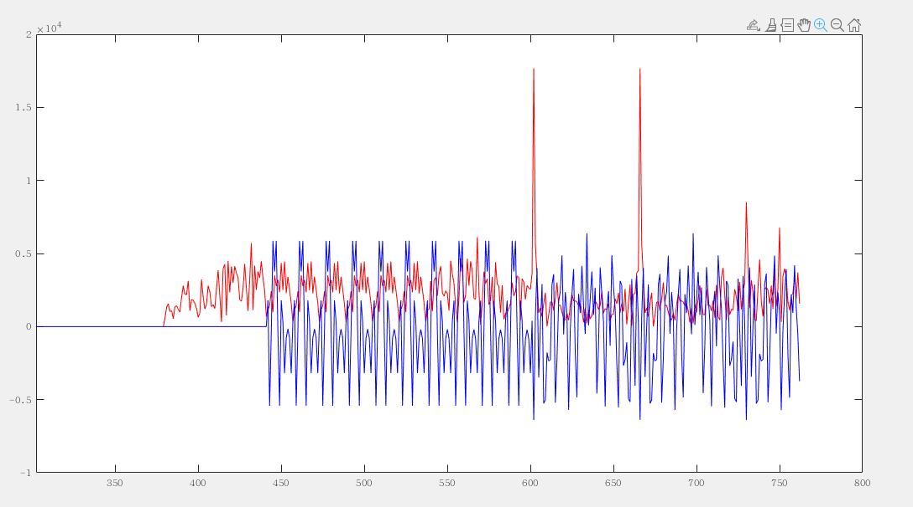
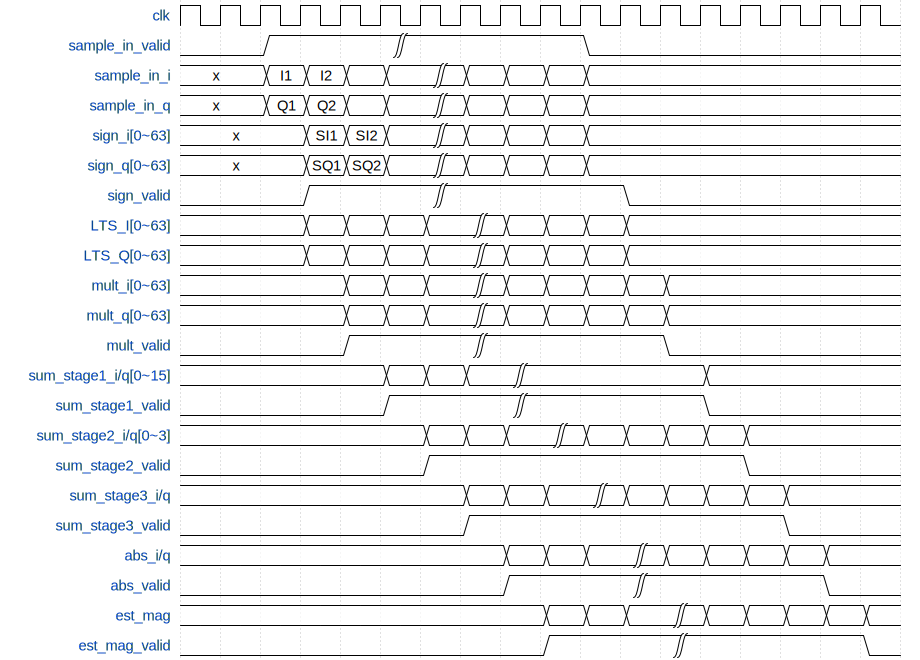
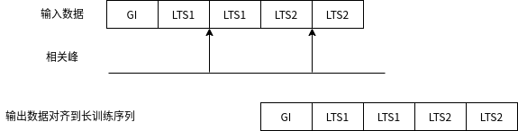
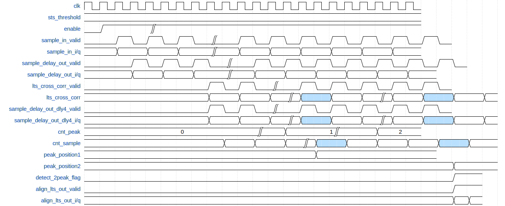

# 1. 前言
在之前的博客当中，已经实现了OFDM的短训练序列的检测与使用短训练序列进行符号的粗频偏校正。
进行粗频偏校正之后的数据还需要进一步的处理，为后续的FFT变换到频域做准备。在802.11a当中，前导码除了10个STS还有两个LTS，LTS的作用是用来进行精细的频偏校正和符号对齐的。
<!--more-->

# 2. 长训练序列的检测原理
长训练序列具有自相关性，接收到的信号在与标准的长训练序列进行相关的时候，如果出现一个十分明显的相关峰，那么此时接收到的信号正好与长训练序列对齐。
因此在进行长训练序列的检测的时候，可以使用这种方式通过检测出现两个相关峰来判断当前的信号。
用于长训练序列的检测公式如下：
$$ 
y[i]=\sum_{k=0}^{63} s[i+k] *\overline{LTS[k]}
$$
其中 $\overline{LTS[k]}$ 是长训练序列的共轭。长训练序列是一个固定的序列，在接受端，我们可以提前将这个序列计算好。
每当输入一个采样点的时候，我们都需要对这个采样点和长训练序列进行相关操作，也就进行64次的乘法和求取这64个乘法的累加和。
因为在802.11a当中有两个LTS，因此在进行上述的相关操作的时候，会出现两个相关峰，并且两个相关峰之间的距离正好是64个采样点。

从上面可以看到在进行长训练序列检测的时候，要进行大量的乘法运算，这在FPGA当中实现的时候肯定是需要耗费大量的资源的，因此对这个乘法运算进行优化很有必要。

因为输入信号 S[i]和 LT 有相关性，我们只需要取 S[i]的符号位即可也就是正数映射为 1，负数映射为-1，这样我们去做相关运算同样可以获得相关峰。这样我们 64 个负数乘法器就可以转化为加法器了。
假定输入信号为 $s[i]=a+ib$ , 长训练序列为 $\overline{LT[i]}=c+id$ ,那么两者相乘得到的结果为：
$$
s[i]*\overline{LT[i]} = (a+ib)*(c+id) = (ac-bd) + i(ad+bc) 
$$

在只考虑输入信号 $s[i]$ 的符号位的情况下，上面的式子就可以进行一步的简化，从而将乘法运算转换为加减法运算。
```verilog
case(sign(a,b))
    2'b00: res = (c-d) + i(d+c);
    2'b01: res = (c+d) + i(d-c);
    2'b10: res = (-c-d) + i(-d+c);
    2'b11: res = (-c+d) + i(-d-c)
endcase
```

在长训练序列检测的时候，我们还需要考虑到长训练序列前面的保护间隔，长训练序列的保护间隔是长训练序列的一个符号的后半部分，一次我们也可以利用长训练序列的保护间隔来进行检测。

# 3. 长训练序列检测的matlab实现

```matlab
%%%%%%%%%%%%%%%%%%%%%%%%%%%%%%%%%%%%%%%%%%%%%%%%%%%%%%%%%%%%%%%%%%%%%%%%%%%%%%%%%%%%
% coarse frequency correction
% α_st = sum(s[m].*conj(s[m+16]))
% α_st = 2*pi*16*fc/Fs
% fc = α_st*Fs/(2*pi*16)
%%%%%%%%%%%%%%%%%%%%%%%%%%%%%%%%%%%%%%%%%%%%%%%%%%%%%%%%%%%%%%%%%%%%%%%%%%%%%%%%%%%%
clc;
clear all;
close all;

load('RxIQ.mat');
rx_sample = double(RxSave);
Fs = 20e6;
freq_offset = -16e3;    % freq offset of rx 120K

% the length of the input sequence
time_squence = [0:length(rx_sample)-1].';

% radian per samples
radian_per_sample = (2*pi*freq_offset/Fs); % 2*pi*f*T

% freq offset data
freq_offset_data = exp(1i*(time_squence*radian_per_sample)); %exp(jwt)

% data with freq offset
rx_sample = rx_sample.*freq_offset_data; % add freq offset to original data

% long training sequence
mod_ofdm_syms = [1 1 -1 -1 1 1 -1 1 -1 1 1 1 1 1 1 -1 -1 1 1 -1 1 -1 1 1 1 1 ...
      1 -1 -1 1 1 -1 1 -1 1 -1 -1 -1 -1 -1 1 1 -1 -1 1 -1 1 -1 1 1 1 1];

syms_into_ifft = zeros(64,1);

% mapping the LTS into the ifft channel, channel 33 is DC, channle 7:32 is -26~-1, channel 34:59 is channel 1~26
syms_into_ifft([7:32 34:59],:)=reshape(mod_ofdm_syms,52,1);

% the negative freq will put into the tail when ifft
syms_into_ifft([33:64 1:32],:) = syms_into_ifft;

% ifft modulation
ifft_out = ifft(syms_into_ifft);
time_syms = zeros(1,64);
time_syms = ifft_out(:).';
% get the long training sequence
long_training_sequence=(time_syms.*2048).';
% change the long training sequence for packet detect, the GI+1/2LTS for detect packet
long_training_sequence=[long_training_sequence(end/2+1:end);long_training_sequence(1:end/2)];

corr = zeros(1,1000);
est_angle = zeros(1,1000);
for i=1:1000
    if(sum(abs(rx_sample(i:i+15).^2)) == 0)
        corr(i) = 0;
        est_angle(i)=0;
    else
        % est_angle(i) = sum(conj(rx_sample(i:i+15)).*rx_sample(i+16:i+16+15));     % for the purpose of using angle
        est_angle(i) = sum(conj(rx_sample(i:i+15)).*rx_sample(i+16:i+16+15))/16;    % for the purpose of using fix_actan
        corr(i) = (abs(sum(rx_sample(i:i+15).*conj(rx_sample(i+16:i+16+15))))/abs(sum(rx_sample(i:i+15).*conj(rx_sample(i:i+15)))));
    end
end

short_sync_index = find((corr>0.75) & (corr <1.25)==1);
% freq_est=(angle(est_angle(short_sync_index(100)))/(2*pi*16))*Fs;
% display(freq_est);
% est_freq_data = exp(-1i*(time_squence*(2*pi*freq_est/Fs)));

freq_est=(fix_atan2(imag(est_angle(short_sync_index(100))),real(est_angle(short_sync_index(100))))/(2*pi*16))*Fs;
Q = imag(est_angle(short_sync_index(100)));
I = real(est_angle(short_sync_index(100)));
fix_angle = fix_atan2(Q,I);
display(Q);
display(I);
display(fix_angle);

n=0:2047;
s_rom = sin(2*pi*n/2048);
c_rom = cos(2*pi*n/2048);
freq_ctrl_word = fix(((freq_est/Fs)*2^32));
display(freq_ctrl_word);

phase_acc = 0;
for i=1:length(rx_sample)
    phase_acc = phase_acc - freq_ctrl_word;
    if phase_acc > 2^32
        phase_acc = phase_acc - 2^32;
    elseif phase_acc < 0
        phase_acc = phase_acc + 2^32;
    end
    rom_addr = bitshift(uint32(phase_acc),-21)+1;
    est_freq_data(i,1) = complex(c_rom(rom_addr), s_rom(rom_addr));
end

rx_correct_sample = rx_sample .* est_freq_data;

% get the sign of the input samples, sign bit 0 maps to 1, sign bit 1 maps to -1
no_r= (real(rx_correct_sample)<0)*(-2)+1;
no_i= (imag(rx_correct_sample)<0)*(-2)+1;
rx_norms=complex(no_r,no_i);

for i=1:1000
    rx_cross_sum = sum(rx_norms(i:i+64-1).*conj(long_training_sequence));
    rx_cross_corr(i)= abs(rx_cross_sum)
end

index=find(rx_cross_corr>1.1e4);
if length(index)>=2
    if length(index)==2 && (index(2)-index(1))>=62 && (index(2)-index(1))<=65
        thres_index=index(2)+64+32;
    end
end
figure(1)
plot(rx_cross_corr(1:thres_index),'r');
hold on;
plot(real(rx_correct_sample(1:thres_index))*10,'b');


figure(2)
plot(corr);
hold on;
plot(real(rx_sample(1:1000))/(max(real(rx_sample(1:1000)))*0.5));
figure(3)
plot(real(rx_sample(1:1000)));
hold on;
plot(real(rx_correct_sample(1:1000)),'r','linewidth',0.8);
hold on;
plot(real(RxSave(1:1000)),'--g','linewidth',0.6);
```


可以看到在对长训练序列进行相关的时候会出现两个较大的相关峰，通过这两个相关峰，我们就可以为之后的符号对齐和精频偏校正提供一个定位的标准。

# 4.长训练序列检测的FPGA实现
输入信号与LTS序列进行相关的时序设计如下图所示：

具体的过程如下：
- 输入的信号首先取得I/Q路的符号位，并使用一个移位寄存器将64个连续采样点的符号位都进行一个保存。
- 将符号与LTS序列的共轭值进行相乘，在这里可以使用前面介绍的优化的算法，还需要根据输入信号的IQ路的符号位来进行简单的加减法操作即可。
- 获得到的64个乘法的结果再进行累加，一次进行64个数的加法是不太好的，因此使用三级流水的方式，来计算这64个数的结果。
- 累加完成之后得到了相关的结果，为了获取相关峰，还需要对幅度进行估计，这里可以使用之前的模块当中也使用到的幅度估计算法。
- 最终能够得到估计出来的幅度

实现的代码如下：
```sv
module long_training_seq_cross_corr (
    input   wire            clk                 ,
    input   wire            rst                 ,
    input   wire            enable              ,
    input   wire            sample_in_valid     ,
    input   wire    [15:0]  sample_in_i         ,
    input   wire    [15:0]  sample_in_q         ,
    output  reg     [31:0]  lts_cross_corr      ,
    output  reg             lts_cross_corr_valid
);

parameter [15:0] LTS_I [0:63]= {
    64896,  50,     376,    65160,  65525,  308,    65014,  65037, 
    65392,  65305,  65289,  285,    337,    64998,  65302,  151, 
    256,    488,    65444,  240,    100,    64976,  4,      218, 
    400,    65379,  65064,  245,    86,     397,    163,    65515,  
    640,    65515,  163,    397,    86,     245,    65064,  65379,  
    400,    218,    4,      64976,  100,    240,    65444,  488, 
    256,    151,    65302,  64998,  337,    285,    65289,  65305, 
    65392,  65037,  65014,  308,    65525,  65160,  376,    50};

parameter [15:0] LTS_Q [0:63]={
    0,      65136,  65102,  65064,  65316,  303,    84,     68, 
    618,    89,     65203,  65478,  65158,  65269,  65375,  65133, 
    256,    17,     64878,  61,     240,    194,    471,    65519, 
    106,    435,    226,    359,    65422,  65197,  455,    493, 
    0,      65043,  65081,  339,    114,    65177,  65310,  65101, 
    65430,  17,     65065,  65342,  65296,  65475,  658,    65519, 
    65280,  403,    161,    267,    378,    58,     333,    65447, 
    64918,  65468,  65452,  65233,  220,    472,    434,    400};


    reg [63:0]  sign_i          ;
    reg [63:0]  sign_q          ;
    reg         sign_valid      ;

    reg [15:0]  mult_i [0:63]   ;
    reg [15:0]  mult_q [0:63]   ;
    reg         mult_valid      ;

    reg [15:0]  sum_stage1_i [0:15] ;
    reg [15:0]  sum_stage1_q [0:15] ;
    reg         sum_stage1_valid    ;

    reg [15:0]  sum_stage2_i [0:3]  ;
    reg [15:0]  sum_stage2_q [0:3]  ;
    reg         sum_stage2_valid    ;

    reg [15:0]  sum_stage3_i        ;
    reg [15:0]  sum_stage3_q        ;
    reg         sum_stage3_valid    ;

    wire [15:0] abs_i               ;
    wire [15:0] abs_q               ;


    


    //----------------sign_i/q------------------
    always @(posedge clk ) begin
        if (rst==1'b1) begin
            sign_i <= 'd0;
            sign_q <= 'd0;
        end
        else if (enable == 1'b1 ) begin
            if (sample_in_valid == 1'b1) begin
                sign_i <= {sample_in_i[15], sign_i[63:1]};
                sign_q <= {sample_in_q[15], sign_q[63:1]};
            end
        end
        else begin
            sign_i <= 'd0;
            sign_q <= 'd0;
        end
    end

    //----------------sign_valid------------------
    always @(posedge clk ) begin
        if (rst==1'b1) begin
            sign_valid <= 1'b0;
        end
        else if (enable == 1'b1) begin
            sign_valid <= sample_in_valid;
        end
        else  begin
            sign_valid <=  1'b0;;
        end
    end

    //----------------mult_i/q------------------
    // s(i:i+63).*cnoj(LTS)
    // s[i]=a+ib, LT[i]=c-id
    // s[i]*LT[i] = (ac+bd) + i(bc -ad), a b could be the sign bit 
    genvar i;
    generate;
        for ( i=0; i<64; i=i+1) begin
            always @(posedge clk ) begin
                if (rst==1'b1) begin
                    mult_i[i] <= 'd0;
                    mult_q[i] <= 'd0;
                end
                else if (enable == 1'b1) begin
                    if (sign_valid == 1'b1) begin
                        case({sign_i[i],sign_q[i]})
                            2'b00: begin 
                                //a=1,b=1, s[i]*LT[i] = (c+d) + i(c-d)
                                mult_i[i] <= LTS_I[i] + LTS_Q[i];
                                mult_q[i] <= LTS_I[i] - LTS_Q[i];
                            end

                            2'b01: begin
                                //a=1,b=-1, s[i]*LT[i] = (c-d) + i(-c-d)
                                mult_i[i] <= LTS_I[i] - LTS_Q[i];
                                mult_q[i] <= ((~LTS_I[i]) + 1) - LTS_Q[i];
                            end
                            
                            2'b10: begin
                                //a=-1,b=1, s[i]*LT[i] = (-c+d) + i(c-d)
                                mult_i[i] <= LTS_Q[i] - LTS_I[i];
                                mult_q[i] <= LTS_I[i] + LTS_Q[i];
                            end

                            2'b11: begin
                                //a=-1,b=-1, s[i]*LT[i] = (-c-d) + i(-c+d)
                                mult_i[i] <= ((~LTS_I[i]) + 1) - LTS_Q[i];
                                mult_q[i] <= LTS_Q[i] - LTS_I[i] ;
                            end
                        endcase
                    end
                end
                else begin
                    mult_i[i] <=  'd0;
                    mult_q[i] <= 'd0;
                end
            end
        end
    endgenerate

    //----------------mult_valid------------------
    always @(posedge clk ) begin
        if (rst==1'b1) begin
            mult_valid <= 1'b0;
        end
        else if (enable == 1'b1) begin
            mult_valid <= sign_valid;
        end
        else  begin
            mult_valid <=  1'b0;;
        end
    end

    //----------------sum_stage1_i/q------------------
    generate
        for (i=0; i<16; i=i+1) begin
            always @(posedge clk ) begin
                if (rst==1'b1) begin
                    sum_stage1_i[i] <= 'd0;
                    sum_stage1_q[i] <= 'd0;
                end
                else if (enable == 1'b1) begin
                    if (mult_valid == 1'b1) begin
                        sum_stage1_i[i] <= mult_i[4*i] + mult_i[4*i+1] + mult_i[4*i+2] + mult_i[4*i+3];
                        sum_stage1_q[i] <= mult_q[4*i] + mult_q[4*i+1] + mult_q[4*i+2] + mult_q[4*i+3]; 
                    end
                end
                else  begin
                    sum_stage1_i[i] <= 'd0;
                    sum_stage1_q[i] <= 'd0;
                end
            end  
        end
    endgenerate

    //----------------sum_stage1_valid------------------
    always @(posedge clk ) begin
        if (rst==1'b1) begin
            sum_stage1_valid <= 1'b0;
        end
        else if (enable == 1'b1) begin
            sum_stage1_valid <= mult_valid;
        end
        else  begin
            sum_stage1_valid <=  1'b0;;
        end
    end


    //----------------sum_stage2_i/q------------------
    generate
        for (i=0; i<4; i=i+1) begin
            always @(posedge clk ) begin
                if (rst==1'b1) begin
                    sum_stage2_i[i] <= 'd0;
                    sum_stage2_q[i] <= 'd0;
                end
                else if (enable == 1'b1 ) begin
                    if (sum_stage1_valid == 1'b1) begin
                        sum_stage2_i[i] <= sum_stage1_i[4*i] + sum_stage1_i[4*i+1] + sum_stage1_i[4*i+2] + sum_stage1_i[4*i+3];
                        sum_stage2_q[i] <= sum_stage1_q[4*i] + sum_stage1_q[4*i+1] + sum_stage1_q[4*i+2] + sum_stage1_q[4*i+3];
                    end
                end
                else  begin
                    sum_stage2_i[i] <= 'd0;
                    sum_stage2_q[i] <= 'd0;
                end
            end  
        end
    endgenerate

    //----------------sum_stage2_valid------------------
    always @(posedge clk ) begin
        if (rst==1'b1) begin
            sum_stage2_valid <= 1'b0;
        end
        else if (enable == 1'b1) begin
            sum_stage2_valid <= sum_stage1_valid;
        end
        else  begin
            sum_stage2_valid <=  1'b0;;
        end
    end


    //----------------sum_stage3_i/q------------------
    always @(posedge clk ) begin
        if (rst==1'b1) begin
            sum_stage3_i <= 'd0;
            sum_stage3_q <= 'd0;
        end
        else if (enable == 1'b1 ) begin
            if (sum_stage2_valid == 1'b1) begin
                sum_stage3_i <= sum_stage2_i[0] + sum_stage2_i[1] + sum_stage2_i[2] + sum_stage2_i[3];
                sum_stage3_q <= sum_stage2_q[0] + sum_stage2_q[1] + sum_stage2_q[2] + sum_stage2_q[3];
            end
        end
        else  begin
            sum_stage3_i <= 'd0;
            sum_stage3_q <= 'd0;
        end
    end  


    //----------------sum_stage3_valid------------------
    always @(posedge clk ) begin
        if (rst==1'b1) begin
            sum_stage3_valid <= 1'b0;
        end
        else if (enable == 1'b1) begin
            sum_stage3_valid <= sum_stage2_valid;
        end
        else  begin
            sum_stage3_valid <=  1'b0;;
        end
    end


    // //----------------abs_i/q------------------
    // always @(posedge clk ) begin
    //     if (rst==1'b1) begin
    //         abs_i <= 'd0;
    //         abs_q <= 'd0;
    //     end
    //     else if (enable == 1'b1 ) begin
    //         if (sum_stage3_valid == 1'b1) begin
    //             abs_i <= sum_stage3_i[15] ? (~sum_stage3_i + 1) : sum_stage3_i;
    //             abs_q <= sum_stage3_q[15] ? (~sum_stage3_q + 1) : sum_stage3_q;
    //         end
    //     end
    //     else  begin
    //         abs_i <= 'd0;
    //         abs_q <= 'd0;
    //     end
    // end  


    // //----------------abs_valid------------------
    // always @(posedge clk ) begin
    //     if (rst==1'b1) begin
    //         abs_valid <= 1'b0;
    //     end
    //     else if (enable == 1'b1) begin
    //         abs_valid <= sum_stage3_valid;
    //     end
    //     else  begin
    //         abs_valid <=  1'b0;;
    //     end
    // end

    assign abs_i = sum_stage3_i[15] ? (~sum_stage3_i + 1) : sum_stage3_i;
    assign abs_q = sum_stage3_q[15] ? (~sum_stage3_q + 1) : sum_stage3_q;

    //-----------------lts_cross_corr-----------------
    always @(posedge clk ) begin
        if (rst==1'b1) begin
            lts_cross_corr <= 'd0;
        end
        else if (enable == 1'b1) begin
            if (sum_stage3_valid == 1'b1) begin
                if (abs_i >= abs_q) begin
                    lts_cross_corr <= abs_i + abs_q[15:2];
                end
                else begin
                    lts_cross_corr <= abs_i[15:2] + abs_q;
                end
            end
        end
        else  begin
            lts_cross_corr <= 'd0;
        end
    end  

    //----------------lts_cross_corr_valid------------------
    always @(posedge clk ) begin
        if (rst==1'b1) begin
            lts_cross_corr_valid <= 1'b0;
        end
        else if (enable == 1'b1) begin
            lts_cross_corr_valid <= sum_stage3_valid;
        end
        else  begin
            lts_cross_corr_valid <=  1'b0;;
        end
    end

endmodule

```

# 5. 使用长训练序列进行符号对齐
在检测到长训练序列之后为了能够是进入到FFT的符号是希望的符号，需要对符号进行对齐操作。

具体的操作过程如下图所示：
当检测到LTS的两个相关峰的时候，可以把检测到第二个相关峰的位置记录下来，因为使用到了LTS的GI，所以出现相关峰的位置是在每个LTS符号的中间，因此可以对输入的采样点进行延时一定的采样点，从而完成符号的对齐。从上面的图中可以看出，只需要将输入的数据延时96个采样点就能够将信号对齐到第二个相关峰出现的位置。

LTS检测与符号对齐的时序设计如下所示。

- 输入的信号首先经过前面介绍的先关模块，求得相关的结果，根据相关结果，判断是否出现相关峰，将出现相关峰的位置记录下来。
- 如果检测到两个相关峰，需要判断两个相关峰的位置是否是相差了64个采样点，只有两个相关峰相差了64个采样点的时候，才能证明在一个OFDM符号内检测到了LTS。
- 当检测到两个LTS的相关峰之后，就可以将延时之后的数据对齐了，这里需要注意，延时时间，除了需要延时64个采样点的时间之外，还需要注意相关模块的计算和判断相关峰还需要一定的时钟周期的处理，因此还需要根据这些处理所用的时间进行相应的延时。

具体的代码设计如下：
```verilog
module lts_detect_align(
    input   wire            clk                     ,
    input   wire            rst                     ,
    input   wire            enable                  ,
    input   wire    [15:0]  lts_threshold           ,
    input   wire            sample_in_valid         ,
    input   wire    [15:0]  sample_in_i             ,
    input   wire    [15:0]  sample_in_q             ,

    output  wire            align_lts1_valid        ,
    output  wire    [15:0]  align_lts1_i            ,
    output  wire    [15:0]  align_lts1_q            ,

    output  wire            acc_avg_valid           ,
    output  wire    [15:0]  acc_avg_i               ,
    output  wire    [15:0]  acc_avg_q               ,

    output  reg             detect_lts_status       ,//0 ok, 1 error
    output  reg             detect_lts_status_valid
);

    wire                lts_cross_corr_valid    ;
    wire    [31:0]      lts_cross_corr          ;
    
    wire                sample_delay_out_valid  ;
    wire    [15:0]      sample_delay_out_i      ;
    wire    [15:0]      sample_delay_out_q      ;

    reg     [15:0]      sample_delay_out_i_dly0 ;
    reg     [15:0]      sample_delay_out_i_dly1 ;
    reg     [15:0]      sample_delay_out_i_dly2 ;
    reg     [15:0]      sample_delay_out_i_dly3 ;
    reg     [15:0]      sample_delay_out_i_dly4 ;

    reg     [15:0]      sample_delay_out_q_dly0 ;
    reg     [15:0]      sample_delay_out_q_dly1 ;
    reg     [15:0]      sample_delay_out_q_dly2 ;
    reg     [15:0]      sample_delay_out_q_dly3 ;
    reg     [15:0]      sample_delay_out_q_dly4 ;


    reg                 sample_delay_out_v_dly0 ;
    reg                 sample_delay_out_v_dly1 ;
    reg                 sample_delay_out_v_dly2 ;
    reg                 sample_delay_out_v_dly3 ;
    reg                 sample_delay_out_v_dly4 ;


    reg     [15:0]      cnt_sample              ;
    reg     [15:0]      peak_position1          ;
    reg     [15:0]      peak_position2          ;
    reg     [2:0]       cnt_peak                ;
    reg                 detect_2peak_flag       ;
    


    //======================================================
    // delay 96 samples for Cross correlation
    // the sample_delay_out has 1 system clock delay from sample_in
    //======================================================
    sample_delay#(
        .DATA_WIDTH              ( 32 ),
        .DELAY_DEEPTH            ( 96 )
    )u_sample_delay(
        .clk                     ( clk                                      ),
        .rst                     ( rst                                      ),
        .enable                  ( enable                                   ),
        .sample_in_valid         ( sample_in_valid                          ),
        .sample_in               ( {sample_in_q, sample_in_i}               ),
        .sample_delay_out_valid  ( sample_delay_out_valid                   ),
        .sample_delay_out        ( {sample_delay_out_q, sample_delay_out_i} )
    );


    always @(posedge clk) begin
        sample_delay_out_i_dly0 <= sample_delay_out_i       ;
        sample_delay_out_i_dly1 <= sample_delay_out_i_dly0  ;
        sample_delay_out_i_dly2 <= sample_delay_out_i_dly1  ;
        sample_delay_out_i_dly3 <= sample_delay_out_i_dly2  ;
        sample_delay_out_i_dly4 <= sample_delay_out_i_dly3  ;

        sample_delay_out_q_dly0 <= sample_delay_out_q       ;
        sample_delay_out_q_dly1 <= sample_delay_out_q_dly0  ;
        sample_delay_out_q_dly2 <= sample_delay_out_q_dly1  ;
        sample_delay_out_q_dly3 <= sample_delay_out_q_dly2  ;
        sample_delay_out_q_dly4 <= sample_delay_out_q_dly3  ;

        sample_delay_out_v_dly0 <= sample_delay_out_valid   ;
        sample_delay_out_v_dly1 <= sample_delay_out_v_dly0  ;
        sample_delay_out_v_dly2 <= sample_delay_out_v_dly1  ;
        sample_delay_out_v_dly3 <= sample_delay_out_v_dly2  ;
        sample_delay_out_v_dly4 <= sample_delay_out_v_dly3  ;
    end

    //====================================================
    // cross correlation of LTS
    // output data is 7 system clock latency
    //====================================================
    long_training_seq_cross_corr u_long_training_seq_cross_corr(
        .clk                    ( clk              ),
        .rst                    ( rst              ),
        .enable                 ( enable           ),
        .sample_in_valid        ( sample_in_valid  ),
        .sample_in_i            ( sample_in_i      ),
        .sample_in_q            ( sample_in_q      ),
        .lts_cross_corr         ( lts_cross_corr   ),
        .lts_cross_corr_valid   ( lts_cross_corr_valid  )
    );

    //----------------cnt_sample------------------
    always @(posedge clk ) begin
        if (rst==1'b1) begin
            cnt_sample <= 'd0;
        end
        else if (enable == 1'b1 ) begin
            if (detect_lts_status == 1'b1) begin
                cnt_sample <=  'd0;
            end
            else if (detect_2peak_flag == 1'b1) begin
                cnt_sample <=  'd0;
            end
            else if (lts_cross_corr_valid == 1'b1) begin
                cnt_sample <= cnt_sample + 1'b1;
            end
        end
        else begin
            cnt_sample <=  'd0;
        end
    end

    //----------------cnt_peak------------------
    always @(posedge clk ) begin
        if (rst==1'b1) begin
            cnt_peak <= 'd0;
        end
        else if (enable == 1'b1) begin
            if (cnt_peak >= 'd2) begin
                cnt_peak <= 'd0;
            end
            else if (lts_cross_corr_valid == 1'b1 && lts_cross_corr >= lts_threshold) begin
                cnt_peak <= cnt_peak + 1'b1;
            end
        end
        else  begin
            cnt_peak <=  'd0;
        end
    end

    //----------------peak_position1,2------------------
    always @(posedge clk ) begin
        if (rst==1'b1) begin
            peak_position1 <= 'd0;
        end
        else if (enable == 1'b1) begin
            if (lts_cross_corr_valid == 1'b1 && lts_cross_corr >= lts_threshold && cnt_peak == 'd0) begin
                peak_position1 <= cnt_sample;
            end
        end
        else  begin
            peak_position1 <= 'd0;
        end
    end

    always @(posedge clk ) begin
        if (rst==1'b1) begin
            peak_position2 <= 'd0;
        end
        else if (enable == 1'b1) begin
            if (lts_cross_corr_valid == 1'b1 && lts_cross_corr >= lts_threshold && cnt_peak == 'd1) begin
                peak_position2 <= cnt_sample;
            end
        end
        else  begin
            peak_position2 <= 'd0;
        end
    end

    //----------------detect_2peak_flag------------------
    always @(posedge clk ) begin
        if (rst==1'b1) begin
            detect_2peak_flag <= 1'b0;
        end
        else if (enable) begin
            if (cnt_peak == 'd2 && (peak_position2 - peak_position1) >= 63 && (peak_position2 - peak_position1) <= 65) begin
                detect_2peak_flag <= 1'b1;
            end
        end
        else  begin
            detect_2peak_flag <=  1'b0;
        end
    end

    assign align_lts1_valid = detect_2peak_flag ? sample_delay_out_v_dly4 : 1'b0;
    assign align_lts1_i = detect_2peak_flag ? sample_delay_out_i_dly4 : 'd0;
    assign align_lts1_q = detect_2peak_flag ? sample_delay_out_q_dly4 : 'd0;

    //-----------------detect_lts_status-----------------
    always @(posedge clk ) begin
        if (rst==1'b1) begin
            detect_lts_status <= 1'b0;
        end
        else if (enable == 1'b1) begin
            if (cnt_sample == 'd1023 && lts_cross_corr_valid == 1'b1) begin
                detect_lts_status <= 1'b1;
            end
            else if (cnt_peak == 'd2 && (peak_position2 - peak_position1) >= 63 && (peak_position2 - peak_position1) <= 65) begin
                detect_lts_status <= 1'b0;
            end
        end
        else  begin
            detect_lts_status <=  1'b0;
        end
    end

    //----------------detect_lts_status_valid------------------
    always @(posedge clk ) begin
        if (rst==1'b1) begin
            detect_lts_status_valid <= 1'b0;
        end
        else if (enable == 1'b1) begin
            if (cnt_sample == 'd1023 && lts_cross_corr_valid == 1'b1) begin
                detect_lts_status_valid <= 1'b1;
            end
            else if (cnt_peak == 'd2 && (peak_position2 - peak_position1) >= 63 && (peak_position2 - peak_position1) <= 65) begin
                detect_lts_status_valid <= 1'b1;
            end
            else begin
                detect_lts_status_valid <= 1'b0;
            end
        end
        else begin
            detect_lts_status_valid <=  1'b0;
        end
    end
    
endmodule
```