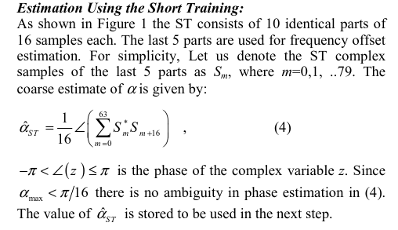
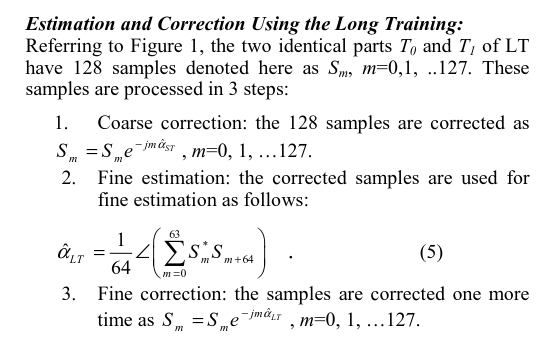
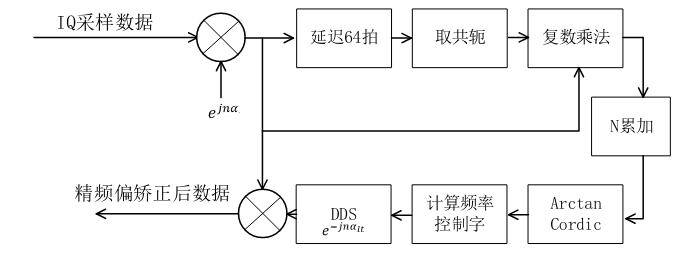

# 1. 前言
在之前的博客当中已经记录了802.11a当中的短训练序列检测，使用短训练序列进行粗频偏校正，检测长训练序列并完成长训练序列的对齐。
在这篇博客当中将会记录使用长训练序列进行精频偏校正，这一部分也是我在学习的时候，在时域当中进行校正的最后一个步骤。在这个步骤之后，就要到频域当中进行操作了。
<!--more-->

# 2. 使用LTS进行精频偏校正原理
回忆前面的使用短训练序列进行校正的原理，相当于使用当前采样点和16个采样点之后的采样点进行互相关操作，并且根据相关的结果来确定弧度。

使用长训练序列进行精频偏校正也是差不多的原理，只不过在这里一个LTS符号的长度是64个采样点，因此在进行相关操作的时候，需要进行64个采样点的累加。


估计出来的弧度，最终和前面的短训练序列所估计出来的弧度进行一个叠加，从而完成长训序列和短训练序列的共同作用。

由上面可以看到，使用长训练序列进行精频偏校正的过程与使用STS进行粗频偏校正的过程十分地相似，因此在有了前面实现的基础上，这个应该比较容易实现。

# LTS精频偏校正实现
使用LTS进行精频偏校正的FPGA实现的结构如下图所示：

对输入的数据进行延迟16个采样点，对延迟之后的数据进行取共轭，当前采样点和延迟之后的共轭进行复数相关，然后求取弧度，根据求取得到的弧度估计出需要补偿的频偏，然后将这个频偏累加到输入信号上，完成精频偏校正。

```verilog
module rx_fine_sync_with_lts (

    input   wire                clk                     ,
    input   wire                rst                     ,
    input   wire                enable                  ,   
    input   wire    [15:0]      sample_in_i             ,
    input   wire    [15:0]      sample_in_q             ,
    input   wire                sample_in_valid         ,
    input   wire                detect_lts_status       ,
    input   wire                detect_lts_status_valid ,    
    input   wire                align_lts1_valid        ,    
    input   wire    [15:0]      align_lts1_i            ,
    input   wire    [15:0]      align_lts1_q            ,
    output  reg                 sample_fine_foc_valid   ,
    output  reg     [15:0]      sample_fine_foc_i       ,
    output  reg     [15:0]      sample_fine_foc_q
        
    );

    // 1 sign bit, 29 fractinal bit
    localparam DIV_2PIx64 = 1335088;


    //====================================================
    // delay path
    //====================================================
    // delay one short traning sequence(16 beates in this case)
    wire            sample_delay_out_valid;
    wire    [31:0]  sample_delay_out;
    wire    [15:0]  sample_delay_out_i, sample_delay_out_q;
    
    // get the Conjugate value of the 16 beats delay
    reg     [15:0]  sample_delay_conj_i, sample_delay_conj_q;
    reg             sample_delay_conj_valid;

    // delay the input data for cross correlation
    reg     [15:0]  sample_in_i_dly1, sample_in_i_dly2;
    reg     [15:0]  sample_in_q_dly1, sample_in_q_dly2;
    reg             sample_in_valid_dly1, sample_in_valid_dly2;

    // calculate the complex multiplication
    wire            s_delay_complex_out_valid;
    wire    [63:0]  s_delay_complex_out;
    wire    [31:0]  s_delay_complex_out_i, s_delay_complex_out_q;

    // calculate the accumulate value for cross correlation
    wire            s_delay_acc_avg_i_valid, s_delay_acc_avg_q_valid;
    wire    [31:0]  s_delay_acc_avg_i, s_delay_acc_avg_q;

    // get the absolute value of i/q for amplitude estimation
    reg             s_delay_est_abs_valid;
    reg     [31:0]  s_delay_est_abs_i, s_delay_est_abs_q;
    
    // get the max and min value of i/q for amplitude estimation
    reg             s_delay_est_max_min_valid;
    reg     [31:0]  s_delay_est_max, s_delay_est_min;

    // calculate the amplitude estimation 
    // mag = alpha*max(|I|, |Q|) + beta*min(|I|, |Q|);
    // alpha=1, beta=1/4
    reg             s_delay_amp_est_valid;
    reg     [31:0]  s_delay_amp_est;


    // delay one short traning sequence(16 beates in this case)
    wire            s_align_delay_out_valid;
    wire    [31:0]  s_align_delay_out;
    wire    [15:0]  s_align_delay_out_i, s_align_delay_out_q;
    reg     [15:0]  s_align_delay_out_i_dly, s_align_delay_out_q_dly;

    //detect lts flag
    reg             detect_lts_flag     ;
    reg     [5:0]   cnt_delay           ;
    reg             cordic_in_valid     ;
    reg     [31:0]  cordic_in_i         ;
    reg     [31:0]  cordic_in_q         ;


    wire  [31:0]    fix_angle         ; // estimate angle data for drive dds fix32_29
    wire            fix_angle_valid   ;
    wire  [63:0]    mult_out            ;
    wire  [31:0]    fix_angle_div2xpix64;
    reg             fix_angle_div2xpix64_valid;

    reg   [31:0]    freq_control_word           ;
    reg   [31:0]    phase_accumulator           ;
    reg             phase_acc_valid             ;
    wire  [15:0]    dds_cfoc_i, dds_cfoc_q      ;
    wire            dds_cfoc_valid              ;

    wire            cmpy_cfoc_out_valid         ;
    wire  [31:0]    cmpy_cfoc_out_i, cmpy_cfoc_out_q;


    //======================================================
    // delay 64 samples for Cross correlation
    // the sample_delay_out has 1 beat delay from sample_in
    //======================================================
    sample_delay#(
        .DATA_WIDTH              ( 32 ),
        .DELAY_DEEPTH            ( 64 )
    )u_sample_delay(
        .clk                     ( clk                     ),
        .rst                     ( rst                     ),
        .enable                  ( enable                  ),
        .sample_in_valid         ( sample_in_valid         ),
        .sample_in               ( {sample_in_q, sample_in_i} ),
        .sample_delay_out_valid  ( sample_delay_out_valid  ),
        .sample_delay_out        ( sample_delay_out        )
    );
    assign sample_delay_out_q = sample_delay_out[31:16];
    assign sample_delay_out_i = sample_delay_out[15:0];

    //====================================================
    // Conjugate the sample
    // 1 beat latency
    //====================================================
    always @(posedge clk ) begin
        if (rst==1'b1) begin
            sample_delay_conj_q <= 'd0;
            sample_delay_conj_i <= 'd0;
            sample_delay_conj_valid <= 1'b0;
        end
        else  begin
            sample_delay_conj_q <= ~sample_delay_out_q + 1;
            sample_delay_conj_i <= sample_delay_out_i;
            sample_delay_conj_valid <= sample_delay_out_valid;
        end
    end

    //====================================================
    // delay 2 beats of the input sample,
    // In order to be able to match the 
    // data with a delay of 16 sampling points 
    //====================================================
    always @(posedge clk) begin
        if(rst == 1'b1)begin
            sample_in_i_dly1 <= 'd0;
            sample_in_i_dly2 <= 'd0;
            sample_in_q_dly1 <= 'd0;
            sample_in_q_dly2 <= 'd0;
            sample_in_valid_dly1 <= 'd0;
            sample_in_valid_dly2 <= 'd0;
        end
        else begin
            sample_in_i_dly1 <= sample_in_i;
            sample_in_i_dly2 <= sample_in_i_dly1;
            sample_in_q_dly1 <= sample_in_q;
            sample_in_q_dly2 <= sample_in_q_dly1;
            sample_in_valid_dly1 <= sample_in_valid;
            sample_in_valid_dly2 <= sample_in_valid_dly1; 
        end
    end

    //====================================================
    // complex multiplication, conj(s[i])*s[i+16]
    // 4 beats latency
    //====================================================
    cmpy_iq16 u_cmpy_iq16_packet_detect_delay (
        .aclk(clk),                              // input wire aclk
        .s_axis_a_tvalid(sample_delay_conj_valid),        // input wire s_axis_a_tvalid
        .s_axis_a_tdata({sample_delay_conj_q, sample_delay_conj_i}),          // input wire [31 : 0] s_axis_a_tdata
        .s_axis_b_tvalid(sample_delay_conj_valid),        // input wire s_axis_b_tvalid
        .s_axis_b_tdata({sample_in_q_dly2, sample_in_i_dly2}),          // input wire [31 : 0] s_axis_b_tdata
        .m_axis_dout_tvalid(s_delay_complex_out_valid),  // output wire m_axis_dout_tvalid
        .m_axis_dout_tdata(s_delay_complex_out)    // output wire [63 : 0] m_axis_dout_tdata
    );

    assign s_delay_complex_out_i = s_delay_complex_out[31:0];
    assign s_delay_complex_out_q = s_delay_complex_out[63:32];

    //====================================================
    // calculate the 16 sample accumulate value
    // 3 beats latency
    //====================================================
    accumulate_avg#(
        .DATA_WIDTH         ( 32 ),
        .DELAY_DEEPTH       ( 64 )
    )u_acc_avg_delay_i(
        .clk                ( clk                       ),
        .rst                ( rst                       ),
        .enable             ( enable                    ),
        .sample_in_valid    ( s_delay_complex_out_valid ),
        .sample_in          ( s_delay_complex_out_i     ),
        .acc_avg_out_valid  ( s_delay_acc_avg_i_valid   ),
        .acc_avg_out        ( s_delay_acc_avg_i         )
    );

    accumulate_avg#(
        .DATA_WIDTH         ( 32 ),
        .DELAY_DEEPTH       ( 64 )
    )u_acc_avg_delay_q(
        .clk                ( clk                       ),
        .rst                ( rst                       ),
        .enable             ( enable                    ),
        .sample_in_valid    ( s_delay_complex_out_valid ),
        .sample_in          ( s_delay_complex_out_q     ),
        .acc_avg_out_valid  ( s_delay_acc_avg_q_valid   ),
        .acc_avg_out        ( s_delay_acc_avg_q         )
    );


    //====================================================
    // Amplitude estimation, step 1:
    // get the absolute value of i/q data
    //====================================================
    always @(posedge clk ) begin
        if (rst==1'b1) begin
            s_delay_est_abs_valid <= 1'b0;
        end
        else if (enable == 1'b1) begin
            s_delay_est_abs_valid <= s_delay_acc_avg_i_valid; 
        end
        else  begin
            s_delay_est_abs_valid <=  1'b0;
        end
    end

    always @(posedge clk ) begin
        if (rst==1'b1) begin
            s_delay_est_abs_i <= 'd0;
            s_delay_est_abs_q <= 'd0;
        end
        else if (enable == 1'b1) begin
            if (s_delay_acc_avg_i_valid == 1'b1) begin
                s_delay_est_abs_i <= s_delay_acc_avg_i[31]? ~(s_delay_acc_avg_i)+1 : s_delay_acc_avg_i;
                s_delay_est_abs_q <= s_delay_acc_avg_q[31]? ~(s_delay_acc_avg_q)+1 : s_delay_acc_avg_q;
            end
        end
        else  begin
            s_delay_est_abs_i <= 'd0;
            s_delay_est_abs_q <= 'd0;
        end
    end

    //====================================================
    // Amplitude estimation, step 2:
    // get the max and min value of |I|, |Q|
    //====================================================
    always @(posedge clk ) begin
        if (rst==1'b1) begin
            s_delay_est_max_min_valid <= 1'b0;
        end
        else if (enable == 1'b1) begin
            s_delay_est_max_min_valid <= s_delay_est_abs_valid; 
        end
        else  begin
            s_delay_est_max_min_valid <=  1'b0;
        end
    end

    always @(posedge clk ) begin
        if (rst==1'b1) begin
            s_delay_est_max <= 'd0;
            s_delay_est_min <= 'd0;
        end
        else if (enable == 1'b1) begin
            if (s_delay_est_abs_valid == 1'b1) begin
                s_delay_est_max <= (s_delay_est_abs_i > s_delay_est_abs_q) ? s_delay_est_abs_i : s_delay_est_abs_q;
                s_delay_est_min <= (s_delay_est_abs_i < s_delay_est_abs_q) ? s_delay_est_abs_i : s_delay_est_abs_q;
            end
        end
        else  begin
            s_delay_est_max <= 'd0;
            s_delay_est_min <= 'd0;
        end
    end   

    //====================================================
    // Amplitude estimation, step 3:
    // calculate the amplitude estimation 
    // mag = alpha*max(|I|, |Q|) + beta*min(|I|, |Q|);
    // alpha=1, beta=1/4
    //====================================================
    always @(posedge clk ) begin
        if (rst==1'b1) begin
            s_delay_amp_est_valid <= 1'b0;
        end
        else if (enable == 1'b1) begin
            s_delay_amp_est_valid <= s_delay_est_max_min_valid; 
        end
        else  begin
            s_delay_amp_est_valid <=  1'b0;
        end
    end

    always @(posedge clk ) begin
        if (rst==1'b1) begin
            s_delay_amp_est <= 'd0;
        end
        else if (enable == 1'b1) begin
            if (s_delay_est_abs_valid == 1'b1) begin
                s_delay_amp_est <= s_delay_est_max + s_delay_est_min[31:2];
            end
        end
        else  begin
            s_delay_amp_est <= 'd0;
        end
    end 


    // delay input samples, after coarse freq offset is calculated out, 
    // correction freq could add to these samples
    sample_delay#(
        .DATA_WIDTH              ( 32 ),
        .DELAY_DEEPTH            ( 128 )
    )u_align_sample_delay(
        .clk                     ( clk                     ),
        .rst                     ( rst                     ),
        .enable                  ( enable                  ),
        .sample_in_valid         ( align_lts1_valid         ),
        .sample_in               ( {align_lts1_q, align_lts1_i} ),
        .sample_delay_out_valid  ( s_align_delay_out_valid  ),
        .sample_delay_out        ( {s_align_delay_out_q, s_align_delay_out_i})
    );

    //----------------detect_lts_flag------------------
    always @(posedge clk ) begin
        if (rst==1'b1) begin
            detect_lts_flag <= 1'b0;
        end
        else if (enable) begin
            if (detect_lts_flag <= 1'b1 && cnt_delay == 'd15) begin
                detect_lts_flag <= 1'b0;
            end
            else if (detect_lts_status_valid == 1'b1 && detect_lts_status == 1'b0) begin
                detect_lts_flag <= 1'b1;
            end
        end
        else  begin
            detect_lts_flag <=  1'b0;
        end
    end

    //----------------cnt_delay------------------
    always @(posedge clk ) begin
        if (rst==1'b1) begin
            cnt_delay <= 'd0;
        end
        else if (detect_lts_flag == 1'b1 && cnt_delay == 'd15) begin
            cnt_delay <= 'd0;
        end
        else if (detect_lts_flag == 1'b1) begin
            cnt_delay <= cnt_delay + 1'b1;
        end
        else  begin
            cnt_delay <=  'd0;
        end
    end

    //----------------------------------
    always @(posedge clk ) begin
        if (rst==1'b1) begin
            cordic_in_valid <= 1'b0;
            cordic_in_i <= 'd0;
            cordic_in_q <= 'd0;
        end
        else if (enable == 1'b1) begin
            if (detect_lts_flag == 1'b1 && cnt_delay == 'd15) begin
                cordic_in_valid <= 1'b1;
                cordic_in_i <= s_delay_acc_avg_i;
                cordic_in_q <= s_delay_acc_avg_q; 
            end
        end
        
        else  begin
            cordic_in_valid <=  1'b0;
            cordic_in_i <= 'd0;
            cordic_in_q <= 'd0;
        end
    end


    cordic_lts_correction u_cordic_lts_correction (
        .aclk(clk),                                        // input wire aclk
        .s_axis_cartesian_tvalid(cordic_in_valid),  // input wire s_axis_cartesian_tvalid
        .s_axis_cartesian_tdata({cordic_in_q, cordic_in_i}),    // input wire [63 : 0] s_axis_cartesian_tdata
        .m_axis_dout_tvalid(fix_angle_valid),            // output wire m_axis_dout_tvalid
        .m_axis_dout_tdata(fix_angle)              // output wire [31 : 0] m_axis_dout_tdata
    );

    mult_lts_ffoc u_mult_lts_ffoc (
        .CLK(clk),  // input wire CLK
        .A(fix_angle),      // input wire [31 : 0] A
        .B(DIV_2PIx64),      // input wire [31 : 0] B
        .P(mult_out)      // output wire [32 : 0] P
    );

    always @(posedge clk ) begin
        fix_angle_div2xpix64_valid <= fix_angle_valid;
    end
    assign fix_angle_div2xpix64 = {mult_out[63], mult_out[59:58], mult_out[57:29]};


    always @(posedge clk ) begin
        if (rst==1'b1) begin
            freq_control_word <= 'd0;
        end
        else if (enable == 1'b1) begin
            freq_control_word <= {fix_angle_div2xpix64, 3'd0};
        end
        else  begin
            freq_control_word <=  'd0;
        end
    end
    

    always @(posedge clk ) begin
        if (rst==1'b1) begin
            phase_accumulator <= 'd0;
        end
        else if (enable == 1'b1) begin
            if (s_align_delay_out_valid == 1'b1) begin
                phase_accumulator <= phase_accumulator - freq_control_word;
            end
        end
        else  begin
            phase_accumulator <=  'd0;
        end
    end

    //----------------phase_acc_valid------------------
    always @(posedge clk) begin
        if (rst==1'b1) begin
            phase_acc_valid <= 1'b0;
        end
        else if (enable == 1'b1 && s_align_delay_out_valid == 1'b1) begin
            phase_acc_valid <= 1'b1;
        end
        else  begin
            phase_acc_valid <=  1'b0;
        end
    end

    always @(posedge clk) begin
        {s_align_delay_out_i_dly, s_align_delay_out_q_dly} <= {s_align_delay_out_i, s_align_delay_out_q};
    end


    // 1 beat latency
    dds_cfoc u_dds_cfoc (
        .aclk(clk),                                // input wire aclk
        .s_axis_phase_tvalid(phase_acc_valid),  // input wire s_axis_phase_tvalid
        .s_axis_phase_tdata({ {4{phase_accumulator[31]}},phase_accumulator[31:20]}),    // input wire [15 : 0] s_axis_phase_tdata
        .m_axis_data_tvalid(dds_cfoc_valid),    // output wire m_axis_data_tvalid
        .m_axis_data_tdata({dds_cfoc_q, dds_cfoc_i})      // output wire [31 : 0] m_axis_data_tdata
    );
    


    cmpy_cfoc u_cmpy_cfoc (
        .aclk(clk),                              // input wire aclk
        .s_axis_a_tvalid(dds_cfoc_valid),        // input wire s_axis_a_tvalid
        .s_axis_a_tdata({dds_cfoc_q, dds_cfoc_i}),          // input wire [31 : 0] s_axis_a_tdata
        .s_axis_b_tvalid(dds_cfoc_valid),        // input wire s_axis_b_tvalid
        .s_axis_b_tdata({s_align_delay_out_q_dly, s_align_delay_out_i_dly}),          // input wire [31 : 0] s_axis_b_tdata
        .m_axis_dout_tvalid(cmpy_cfoc_out_valid),  // output wire m_axis_dout_tvalid
        .m_axis_dout_tdata({cmpy_cfoc_out_q, cmpy_cfoc_out_i})    // output wire [63 : 0] m_axis_dout_tdata
    );

    //----------------sample_fine_foc_valid------------------
    always @(posedge clk ) begin
        if (rst==1'b1) begin
            sample_fine_foc_valid <= 1'b0;
        end
        else if (enable == 1'b1) begin
            sample_fine_foc_valid <= cmpy_cfoc_out_valid;
            // sample_fine_foc_valid <= sample_delay_out_valid;
        end
        else  begin
            sample_fine_foc_valid <=  'd0;
        end
    end

    //----------------sample_fine_foc_i/q------------------
    always @(posedge clk ) begin
        if (rst==1'b1) begin
            sample_fine_foc_i <= 'd0;
            sample_fine_foc_q <= 'd0;
        end
        else if (enable == 1'b1) begin
            sample_fine_foc_i <= {cmpy_cfoc_out_i[31],cmpy_cfoc_out_i[27:13]};
            sample_fine_foc_q <= {cmpy_cfoc_out_q[31],cmpy_cfoc_out_q[27:13]};
            // sample_fine_foc_i <= sample_delay_out_i;
            // sample_fine_foc_q <= sample_delay_out_q;
        end
        else  begin
            sample_fine_foc_i <= 'd0;
            sample_fine_foc_q <= 'd0;
        end
    end
    
endmodule

```