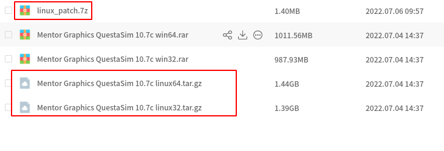
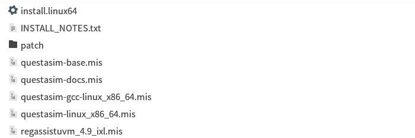
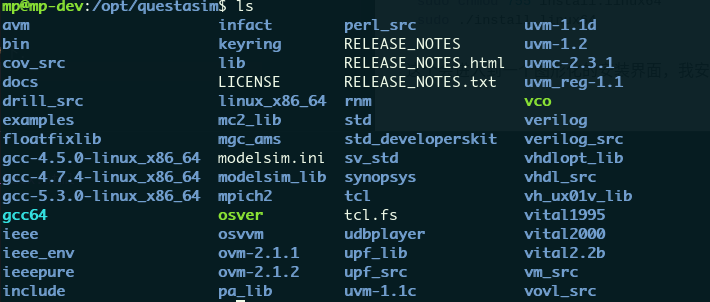
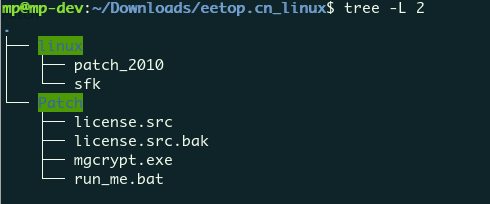
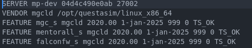
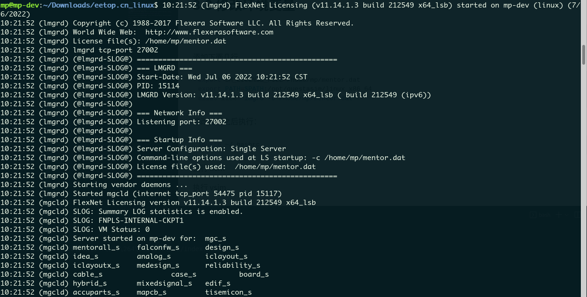
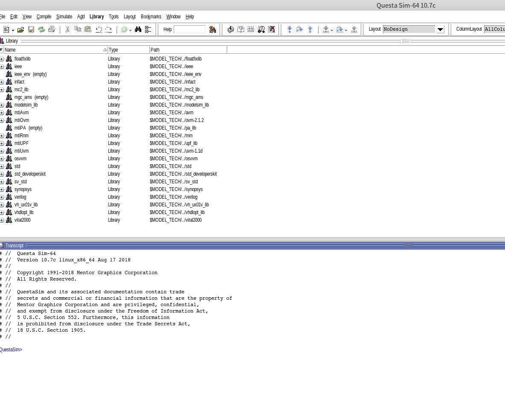

# 1. 前言
因为现在在ubuntu下工作的时间比较多，一直在找一个在ubuntu上比较好用的仿真软件，vivado自带的仿真工具感觉不太好用。
经过一番搜索之后，也算是找到一个还算好用的仿真软件，当然我是用的破解版本。所以准备记录一下安装过程。这篇博客的用途仅仅是为了我自己日后方便查阅。
主要参考下面的博主的博客：
[questasim安装](https://www.cnblogs.com/ArtisticZhao/p/14888399.html)

<!--more-->
# 2. 下载questasim

链接: https://pan.baidu.com/s/1LezUVRgmBOTCJySfXCp6IA  密码: gjkw

根据上面的连接选择需要下载的内容，我选择的是linux64的，然后还需要把linux_patch里面的内容下载下来， linux_patch里面是用于破解使用的。


下载下来并解压之后就可以进行安装了：


安装必要依赖和工具：
```bash
sudo apt-get install default-jre default-jdk lib32z1 lsb dos2unix
```
进行必要的设置：
```bash
sudo mkdir /usr/tmp
sudo touch /usr/tmp/.flexlm
```

安装questasim
```bash
sudo chmod 755 install.linux64
sudo ./install.linux64
```

这个会进入到一个图形化的安装界面，我安装的路径是 **/opt/questasim**下：


# 3. 进行破解
## 3.1 linux下操作
将前面下载的linux_patch文件夹进行解压，可以看到有如下内容，其中sfk是用于在linux下进行操作的。patch文件夹下的内容是在windows下生成license使用的。


将sfk文件拷贝到 /opt/questasim/linux_x86_64/mgls/lib

```bash
sudo chmod 755 sfk   

sudo ./sfk rep -yes -pat -bin /5589E557565381ECD00000008B5508/31C0C357565381ECD00000008B5508/ -bin /5589E557565381ECD8000000E8000000005B81C3/33C0C357565381ECD8000000E8000000005B81C3/ -bin /41574989FF415641554154554889CD534489C3/33C0C389FF415641554154554889CD534489C3/ -dir .
```
如果出现 `./sfk: error while loading shared libraries: libstdc++.so.5: cannot open shared object file: No such file or directory` 则说明少安装了包，这里需要安装32位的包.

```bash
sudo dpkg --add-architecture i386 
sudo apt-get update 
sudo apt-get install libstdc++5:i386
```

## 3.2 生成license
将patch下的内容拷贝到windows下进行patch的生成。
首先需要需要修改SERVER这一行，其中mp-dev是我的ubuntu的机器的名称 后面跟上的是以太网的MAC地址，最后是一个TCP的端口号。
第二行需要修改为questasim的安装路径。
然后需要将license.src里面所有的到期时间修改一下，我这里修改的是2025年，注意在这里所有的到期日期都需要修改。


然后在windows下运行那个.bat文件就会生成一个mentor.dat。 这个就是之后会使用到的license文件。

将mentor.dat拷贝到linux中的home目录下，执行：
```bash
dos2unix ./mentor.dat
```

## 3.3 修改环境变量
```bash
vim ~/.bashrc
```
添加下面几行
```bash
export LM_LICENSE_FILE=/home/mp/mentor.dat
export PATH=$PATH:/opt/questasim/linux_x86_64
alias licm="lmgrd -c /home/mp/mentor.dat"
```
修改完成之后执行：
```bash
source ~/.bashrc
```
在终端当中执行 `licm` 如果出现下面的内容，说明license验证通过。


最后在终端当中执行 vsim， 就可以打开questasim的界面了。

