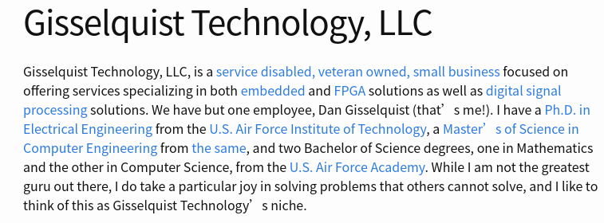

最近挺迷茫的，但是今天稍微深入地了解了一个之前见过的公司，也就是提供ZipCPU的这个公司，这个IP，在ettus usrp的之前的系列当中用过，是一个比较完整的处理器。

这是由一个人完成的公司，在了解了这个公司之后，我发现了他开源了许多和FPGA相关的资源，包括这个ZipCPU，DSP处理相关的资源等等。
看到了他实现的这一些列工作之后，我一时间感觉到了相当震惊。
<!--more-->

对于一个半路出家的FPGA工程师，我现在深深地感受到了基础的不牢固，许多知识都只是浮于表面，背后的原理我并没有太深入去研究，却还为自己的一点小工作而沾沾自喜，当遇到问题的时候，耗费了大量的时间，却不知道如何去处理。
而且最近感觉自己也没了刚毕业的时候的那种想要迫切地学习新知识的饥渴感，每天都是在这种得过且过的状态。
或许是因为现在每天的工作并没有什么压力导致，没有目标是一件很可怕的事情。

希望自己能够从这个人的身上学到一些东西，从他的博客里面我应该能学到不少东西，希望自己也能有长足地进步。

加油吧，少年。
