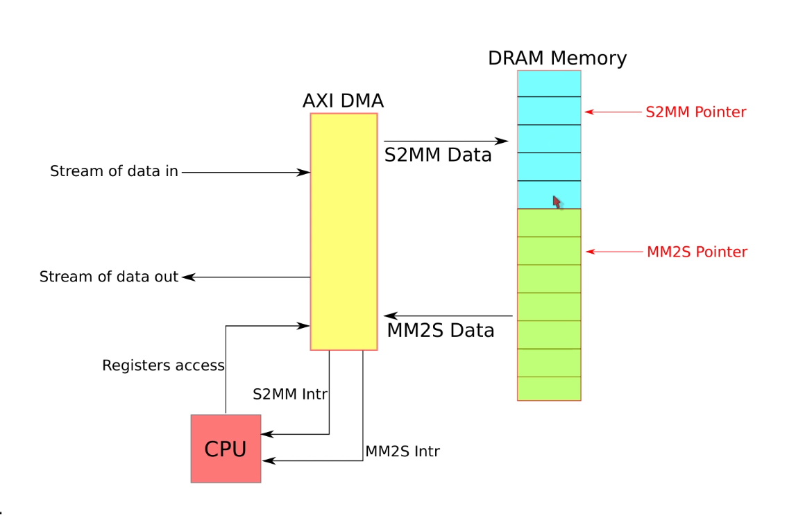

# 1. 基本结构

AXI DMA工作的基本结果如下，AXI DMA负责和内存进行数据交互，一条路径是S2MM也就是将PL侧产生的用户数据写入到内存当中，另外一条路径是MM2S也就是将用户数据从内存当中读取出来给到用户逻辑。

<!--more-->

AXIDMA 在register mode的工作方式如下：

- CPU通过向AXI DMA的寄存器写入要突发传输的起始地址和要传输的长度
- DMA 会开始进行数据传输
- 当一次传输完成的时候，AXI DMA会发起一个中断通知CPU，CPU可以进行后续的处理。对于MM2S或者S2MM都是这样的操作方式。

# 2. 程序设计整体思路

为了能够将AXI DMA用起来，需要设计一个驱动来进行AXI DMA的控制。将分为将数据写入内存和读取内存数据两个部分：

## 2.1 S2MM

CPU首先在内存当中分配一系列内存，用来给之后的AXIDMA S2MM传输使用，如图所示：内存当中的蓝色区域是分配给AXI DMA的S2MM的通道使用的，每个小的蓝色方块是一个block，一共分配有5个block。

使用一个S2MM指针指向对应的block，CPU可以通过这个指针知道当前AXI DMA已经写入了多少数据到内存当中。

CPU配置AXI DMA开始通过S2MM向内存写入数据，每次配置的传输的起始地址就是内存当中当前S2MM指针指向的蓝色block对应的基地址，每次传输的长度是一个block的大小。

当一次传输完成的时候，AXIDMA会产生一个中断，中断产生的时候，CPU会检测当前是S2MM指针是否是指向的分配的最后一个block，如果是最后一个block，那么指针会指向第一个block，如果当前不是最后一个block，那么指针的值会加一并且指向下一个block，并且CPU会配置DMA开始下一次传输。

##  2.2 MM2S

MM2S 的思路基本上和之前的S2MM一样。

CPU首先在内存当中分配一系列内存，用来给之后AXIDMA MM2S传输使用，如图所示，分配了7个block用来进行MM2S传输。

使用一个MM2S指针来指向对应的Block，CPU可以通过这个指针知道当前已经有多少数据从内存当中读出。

CPU配置AXI DMA开始通过MM2S将数据从内存当中读出，每次传输的起始地址就是内存当中当前MM2S指针指向的block对应的基地址，每次传输的长度是1个block。

当一次传输完成的时候，AXIDMA会产生一个MM2S中断，中断产生之后，CPU会检测当前MM2S指针是否指向分配的最后一个block，如果是最后一个block，那么指针会指向第一个block，如果不是最后一个block，那么指针会加一并且指向下一个block，并且CPU会配置DMA开始下一次传输。

