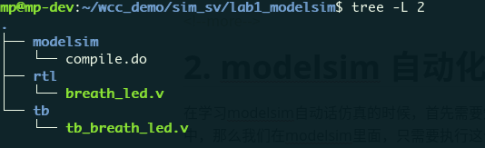
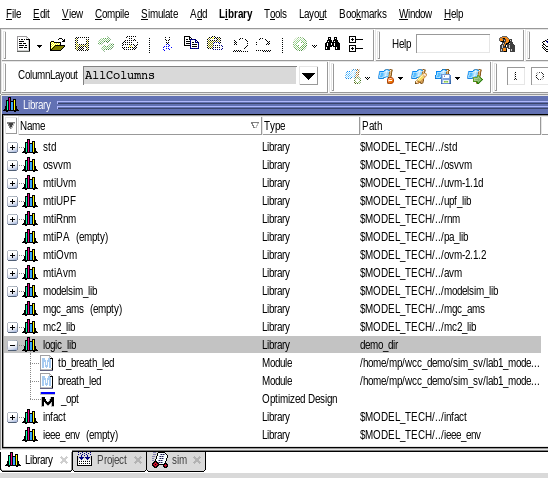
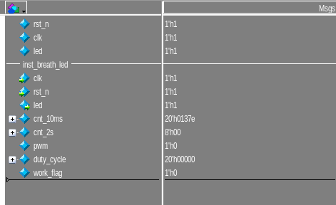

# 1. 前言

最近在做usrp相关的项目的时候，需要涉及到对usrp的源码进行仿真，从usrp的官方资料上来看，usrp提供了许多工具，包括综合的仿真的，确实能够让人受益匪浅。通过学习USRP的工程，我感觉对自己编码能力上的帮助先不说，对于提升自己的工程管理能力，肯定是有巨大的帮助的。为了能够更好地学习仿真与验证的相关知识，有必要把modelsim的自动化仿真学习一下。

<!--more-->

# 2. modelsim 自动化仿真

在学习modelsim自动话仿真的时候，首先需要知道modelsim在工作的时候，其实是通过命令来执行操作，如果把一系列命令写在一个脚本里面也就是.do文件当中，那么我们在modelsim里面，只需要执行这个脚本就可以完成仿真了。因此需要对modelsim仿真的一些简单的语法进行记录。这一部分可以参考：[modelsim仿真](https://www.cnblogs.com/IClearner/p/7273441.html)

首先我们可以按照下面的方式来排列文件：

modelsim文件夹用来存放和modelsim仿真相关的文件，比如仿真的脚本等，modelsim仿真过程当中产生的中间文件等。

rtl文件夹用来存放可综合的源文件

tb文件夹用来存放testbench



## 2.1 modelsim基础语句

一个简单modelsim自动化脚本如下：

```tcl
# quit simulation
quit -sim

# clear the output of console
.main clear

# create a physical directory to store modlsim file
vlib demo_dir

# map logic dir to physical dir
vmap logic_lib demo_dir

# compile the hdl source code
vlog -incr -work logic_lib ../rtl/breath_led.v
vlog -incr -work logic_lib ../tb/tb_breath_led.v

# start simulation
vsim -voptargs=+acc logic_lib.tb_breath_led

# add wave
add wave -position insertpoint sim:/tb_breath_led/*
add wave -divider inst_breath_led
add wave -position insertpoint sim:/tb_breath_led/inst_breath_led/*

run 100us

```

- quit -sim 表示退出之前的， .main clear 是清空控制台

- vlib

  - vlib 表示通过modelsim创建一个文件夹，可以用来存放modelsim的一个文件，其作用就和使用mkdir创建一个文件夹是一样的。
  - `vlib demo_dir` 就是在指定的路径下面创建一个demo_dir文件夹

- vmap

  - vmap实现逻辑库和物理库的映射

  - 在modelsimGUI界面的Library选项卡里面创建子选项，这个子选项就叫做逻辑库，编译工程之后，得到一堆编译文件，这些文件名就放在这个逻辑库选项卡里面。但是编译得到的是实体文件，这些文件必须有一个目录存储，因此就需要把逻辑库映射到物理（文件夹）目录，也就是把那些得到的实体文件放在某一个文件夹目录（路径当中）。

  - `vmap logic_lib demo_dir `的作用就是将逻辑库映射到demo_dir这个路径下，这样逻辑库当中的文件最终会保存在demo_dir下。

    

- vlog/vcom

  - `vlog/vcom`分别是用来编译verilog 和vhdl的，对于systemverilog，使用vlog -sv进行编译对应的systemverilog文件

  - `-incr`参数是为了实现增量编译，对于一个比较大的项目，可能有好几百个verilog文件，如果在debug的时候，只修改了其中的一小部分，那么使用增量编译会将修改的文件进行编译，加快编译速率。

  - `+incdir+`参数是指定后面的源文件是一个头文件，在仿真的时候，需要包含到工程当中,例如：

    ```tcl
    vlog  -incr -work xil_defaultlib  "+incdir+../../../../u220_b205_network.srcs/sources_1/imports/sdr_opensource/uhd/fpga/usrp3/lib/control"
    ```

    就是将xx/usrp3.lib/cotorl下的.vh头文件包含到当前的逻辑库当中。

  - vlog的语法为 `vlog [参数] -work  -<逻辑库名称>  <file1.v> <file2.v>...`,使用vlog将指定的源文件和仿真文件编译到逻辑库当中，也就是上面的`vlog -incr  -work logic_lib ../rtl/breath_led.v`,这句话的含义就是将breath_led.v这个文件编译到逻辑库当中。如果在使用IP的时候，可以使用通配符将IP路径下的所有.v文件编译到逻辑库当中。

- vsim

  - vsim的语法如下，其中-lib是指定链接的逻辑库，也可以使用-L来进行连接

    ```tcl
    vsim –lib <library name>.<top level design>
    ```

  - 编译完成之后，就可以启动仿真了,(-voptargs=+acc 是优化部分参数)，连接到默认的logic_lib逻辑库，启动逻辑库下面的tb_breath_led进行仿真

    ```tcl
    vsim -voptargs=+acc logic_lib.tb_breath_led
    ```

- add wave

  - 添加想要观察的信号,add wave 加上想要观察的信号的名称。

    ```tcl
    add wave -position insertpoint sim:/tb_breath_led/*
    ```

  - 如果想要添加分割线可以添加如下语句

    ```tcl
    add wave -divider inst_breath_led
    ```

    

- restart/run

  - run+时间运行指定时间长度， restart将波形进行置位。

上面就相当于提供了一个基本的仿真的模板，当然这只是一个最简单的情况。实际当中可能还会设计到IP的引入，这个在之后的内容当中再进行学习和记录，除了这些基本的do文件之外，还可以通过makefile的方式，最终能够实现一个makefile来管理工程。