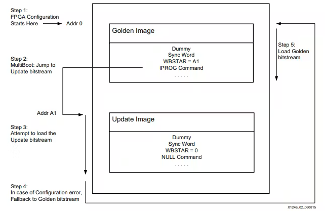
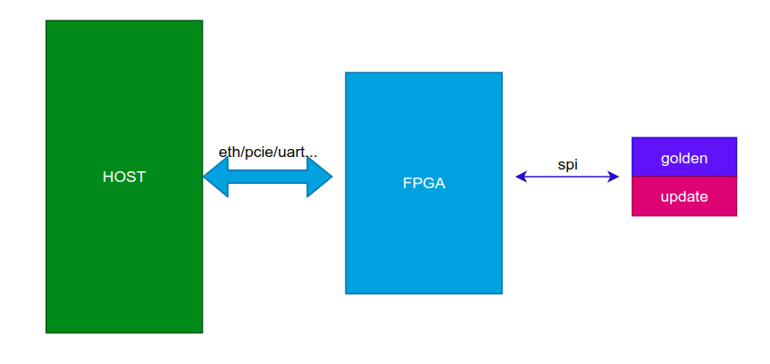
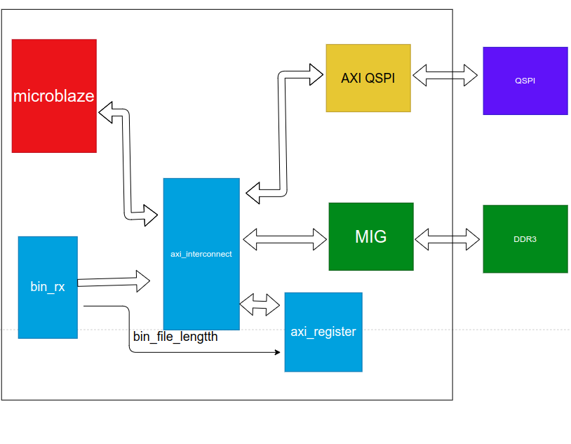

# FPGA multiboot

## 1. 关于multiboot的介绍

关于multiboot网上介绍的很多，直接看xapp1247上面的介绍就可以。

主要来说multiboot的主要优点有：

1. 可以在Flash里面存储多个bit文件，根据用户的需求加载对应的bit文件，这样就可以在一个FPGA上在不同的时刻执行不同的功能。
2. 在远程对FPGA的FLash进行更新的时候，通过使用multiboot的手段，保证FPGA更新后的程序能够正常工作，如果更新的过程当中出错，也能使FPGA完成最基本的工作。

在这里记录一下上面的第二个功能，也就是远程更新Flash的功能。

<!--more-->

FPGA Flash multiboot的主要过程如下：

1. FPGA上电从FLash加载程序，首先会执行到golden image，在golden image当中存储有下一个镜像在Flash当中的地址
2. 当程序在golden image中执行到这里下一镜像所在地址时，会自动跳转到下一个镜像的地址。
3. 跳转到update image所在的地址开始加载FPGA的bit
4. 如果update image出现错误，那么程序会fallback 到golden image 上
5. 程序如果fallback，那么就会加载golden image到FPGA上面。



上面就是FPGA multiboot 的基本过程，因为FPGA具有multiboot的特性，这个为我们实现远程更新提供了依据。


## 2. 远程更新Flash

## 2.1 远程更新的前提

在进行远程更新之前，首先需要保证Flash当中已经有两个镜像，其中golden image 用于保证系统的基础组件能够工作，update image是第二个加载镜像，也是我们远程更新实际会更改的区域。

为了保证更新的可靠和稳定，我们需要先保证FPGA的Flash当中已经有这两个镜像，下面才会开始进行后面的操作。


### 2.2 远程更新的过程



1. 主机向FPGA发送需要更新的镜像，在这一个过程当中，不限使用的传输介质，可以是通过网络，pcie，串口等。
2. FPGA接收到主机发来的待更新镜像
3. FPGA通过SPI将接收到的镜像写入到Flash的update image的区域。

等待FPGA更新完成之后，可以使用ICAP源语使得FPGA开始从Flash加载程序而不断电(我还没尝试过)， 或者对设备进行断电重启，以从Flash加载程序。

上电之后，Flash会按照multiboot的方式进行启动，如果我们写入的update image没有问题，那么现在设备启动之后应该就是按照我们更新之后的程序运行的。

如果update image有问题，那么设备会fallback 到golden image，这样设备还是能处于一个工作的状态，主机能够再次发起更新，对update image的区域进行镜像的写入。

通过使用这种手段，即使我们在对update image区域进行更新的时候出现问题，我们也有手段能够保证设备能够正常工作，而不成为一块砖头。


通过上面的这个简单的流程简介，不难看出，无论golden image 还是update image，在FPGA程序当中，都需要具有能够对Flash的update 区域进行写入的功能。


## 3. 远程更新的具体实现

远程更新的实现还算比较简单，主要包含以下几个部分，这几个部分是比较概括性的描述，具体的实现还要去看具体的内容。

- 上位机发送bin文件到FPGA

- bin_rx接收从上位机传来的用于更新的bin文件， 并将接收到的BIN文件写入到DDR的指定位置。
- 当bin文件接收完毕，并且全部写入到内存当中之后，该模块可以给CPU一个中断，通知CPU该处理Flash更新事件了。
- CPU接收到这个中断之后，会从DDR指定位置读取完成的bin文件的长度，并将这些内容写入到Flash里面。



上面这个是一个大概的流程，下面以一个实际的PCIE更新Flash的例子来说明具体的过程：

- 首先上位机读取一个bin文件，计算这个bin文件的长度。为了方便后续在FPGA通过AXI写入数据到内存的时候方便，我们可以先在这里计算出一个适合的值。在FPGA当中我们是以256进行突发，每个数据的位宽是64bit，也就是说，一次突发的最小字节数是2048字节，因此我们在这里计算出来的长度最好是2048的整数倍。
- 上位机向FPGA发送一个信息，告知FPGA本次传输的bin文件的长度
- FPGA接收到这个BIN文件的长度，并将长度写入到一个寄存器当中，方便告知CPU本次Flash的BIN文件的大小。
- 上位机创建一个长度是2048字节整数被的buffer，这个buffer要能存储BIN文件的所有内容。然后上位机将这个buffer发送到FPGA。
- FPGA接收上位机发送来的BIN文件的数据，接收完毕之后，使用中断通知CPU。
- CPU接收到中断之后，通过读取寄存器获取本次BIN文件的长度，然后从内容的指定位置读取这个bin文件的长度。
- CPU 根据BIN文件的长度，Flash的起始地址，计算出需要擦除的PAGE或者Blcok，然后对指定的区域进行擦除。
- 擦除完毕之后，CPU将内容当中的BIN文件写入到Flash的指定区域当中。从而完成Flash 的更新。

### 3.1 上位机发送bin文件

上位机当中实现的代码如下：

主要功能就如前面所描述的那样，读取文件，计算长度。

在这里我们定义了两个包头0x55555555AAAAAA01， 0x55555555AAAAAA02，这样做的目的是在FPGA上能够很容易区分上位机发过来的是什么类型包。

```c
#include <stdlib.h>
#include <stdio.h>
#include "timer.h"
#include "riffa.h"

#include <stdio.h>
#include <stdlib.h>
#include <string.h>

#define PKT_TYPE_LENGTH 	0x55555555AAAAAA01
#define PKT_TYPE_BIN_FILE 	0x55555555AAAAAA02


long getFileSize(FILE *file) {
	long file_size;
	// Calculate the current file size
    fseek(file, 0, SEEK_END);
    file_size = ftell(file);
	printf("file_size is %ld\r\n", file_size);
    rewind(file);

    return file_size;
}

char* readFileContents(const char* filename) {
    FILE* file = fopen(filename, "rb");
    if (file == NULL) {
        printf("Error opening the file.\n");
        return NULL;
    }
	long new_size;

    long file_size = getFileSize(file);
	// Check if the file size is already a multiple of 2048
    if (file_size % 2048 == 0) {
        printf("File size is already a multiple of 2048 bytes.\r\n");
		new_size = file_size;
    } else {
		// Calculate the new file size to the nearest multiple of 2048
		new_size = ((file_size / 2048) + 1) * 2048;
		printf("File size extended to %ld bytes.\n", new_size);
	}

    char* buffer = (char*)malloc(new_size); // Allocate memory for the file contents (+1 for null terminator)
    if (buffer == NULL) {
        printf("Memory allocation failed.\n");
        fclose(file);
        return NULL;
    }

	printf("Memory allocation \n");

    size_t bytesRead = fread(buffer, 1, file_size, file);
    if (bytesRead != file_size) {
        printf("Error reading the file.\n");
        fclose(file);
        free(buffer);
        return NULL;
    }

	printf("reading the file \n");

    fclose(file);
    return buffer;
}


int main(int argc, char** argv) {
	fpga_t * fpga;
	fpga_info_list info;
	int option;
	int i;
	int id;
	int chnl;
	size_t numWords;
	int sent;
	int recvd;
	size_t * sendBuffer;
	size_t * recvBuffer;

	// printf("sizeof size_t %d\r\n", sizeof(size_t));


	if (argc != 2) {
        printf("Usage: ./program_name filename\n");
        return 1;
    }

	char *filename = argv[1];
    FILE *file;

	char * file_buffer = readFileContents(filename);
	for(int i=0; i<64; i++){
		printf("file_buffer[%d]=%x\r\n", i, file_buffer[i]);
	}

	long new_size;

	file = fopen(filename, "rb");
    long file_size = getFileSize(file);
	fclose(file);

	// Check if the file size is already a multiple of 2048
    if (file_size % 2048 == 0) {
        printf("File size is already a multiple of 2048 bytes.\n");
		new_size = file_size;
    } else {
		// Calculate the new file size to the nearest multiple of 2048
		new_size = ((file_size / 2048) + 1) * 2048;
		printf("File size extended to %ld bytes.\n", new_size);
	}
	numWords = new_size>>3;

	sendBuffer = (size_t *)malloc((numWords<<3 )+ 1);
    

	id = 0;
	chnl = 3;
	// numWords = 512;

	// Get the device with id
	fpga = fpga_open(id);
	if (fpga == NULL) {
		printf("Could not get FPGA %d\n", id);
		return -1;
	}
	fpga_reset(fpga);

	sendBuffer[0] = PKT_TYPE_LENGTH;
	sendBuffer[1] = new_size;


	// Send the length
	sent = fpga_send(fpga, chnl, sendBuffer, 4, 0, 1, 25000);
	printf("words sent: %d\n", sent);

	sendBuffer[0] = PKT_TYPE_BIN_FILE;
	memcpy(&sendBuffer[1], file_buffer, new_size);


	// Send the data
	sent = fpga_send(fpga, chnl, sendBuffer, ((numWords+1)<<1), 0, 1, 25000);
	printf("words sent: %d\n", sent);

	for(int i=0; i<64; i++){
		printf("sendBuffer[%d]=%lx\r\n", i, sendBuffer[i]);
	}


	// Done with device
	fpga_close(fpga);


	return 0;
}
	
```


### 3.2 FPGA接收BIN文件并写入到DDR

通过riffa接收数据就不详细说了，在我当前的实现当中是将riffa的接口转换成一个axis的接口。

然后我们需要对上位机发来的包进行接收并解析，在这里可以通过包头来进行解析。

将解析出来的长度写入到一个寄存器当中，**bin_file_to_cpu**

并且当所有数据接收完毕之后产生一个中断。

```verilog
module firmware_to_dram
#(
	parameter log2_ram_size_addr = 26,
	parameter log2_fifo_words = 9,
	parameter fifo_pre_threshold = 128,	
	parameter fifo_post_threshold = 128,
	parameter FIFO_DATA_WIDTH = 64,

	parameter  C_M_AXI_TARGET_SLAVE_BASE_ADDR	= 32'h00000000,
	parameter integer C_M_AXI_BURST_LEN	= 128,
	parameter integer C_M_AXI_ID_WIDTH	= 1,
	parameter integer C_M_AXI_ADDR_WIDTH	= 32,
	parameter integer C_M_AXI_DATA_WIDTH	= 64,
	parameter integer C_M_AXI_AWUSER_WIDTH	= 1,
	parameter integer C_M_AXI_ARUSER_WIDTH	= 1,
	parameter integer C_M_AXI_WUSER_WIDTH	= 1,
	parameter integer C_M_AXI_RUSER_WIDTH	= 1,
	parameter integer C_M_AXI_BUSER_WIDTH	= 1 
)(

	//----------------sysrest------------------
	input 						sys_rst_n 	,
	//----------------user interface------------------
	input  	wire							fifo_clk			,

	input  wire 							m_axis_tvalid,
	output wire  							m_axis_tready,
	input  wire [FIFO_DATA_WIDTH -1:0]		m_axis_tdata,
	input  wire 							m_axis_tlast,
	output wire [log2_fifo_words-1:0] 		fifo_pre_wr_count	,
	output wire [31:0]						bin_file_to_cpu		,
	output reg  							flash_update_intr	,
	output wire  							update_bin_file_flag	,


	//----------------axi mm interface------------------
	// Global Clock Signal.
	input wire  M_AXI_ACLK,
	input wire  M_AXI_ARESETN,
	output wire [C_M_AXI_ID_WIDTH-1 : 0] M_AXI_AWID,
	output wire [C_M_AXI_ADDR_WIDTH-1 : 0] M_AXI_AWADDR,
	output wire [7 : 0] M_AXI_AWLEN,
	output wire [2 : 0] M_AXI_AWSIZE,
	output wire [1 : 0] M_AXI_AWBURST,
	output wire  M_AXI_AWLOCK,
	output wire [3 : 0] M_AXI_AWCACHE,
	output wire [2 : 0] M_AXI_AWPROT,
	output wire [3 : 0] M_AXI_AWQOS,
	output wire [C_M_AXI_AWUSER_WIDTH-1 : 0] M_AXI_AWUSER,
	output wire  M_AXI_AWVALID,
	input wire  M_AXI_AWREADY,
	output wire [C_M_AXI_DATA_WIDTH-1 : 0] M_AXI_WDATA,
	output wire [C_M_AXI_DATA_WIDTH/8-1 : 0] M_AXI_WSTRB,
	output wire  M_AXI_WLAST,
	output wire [C_M_AXI_WUSER_WIDTH-1 : 0] M_AXI_WUSER,
	output wire  M_AXI_WVALID,
	input wire  M_AXI_WREADY,
	input wire [C_M_AXI_ID_WIDTH-1 : 0] M_AXI_BID,
	input wire [1 : 0] M_AXI_BRESP,
	input wire [C_M_AXI_BUSER_WIDTH-1 : 0] M_AXI_BUSER,
	input wire  M_AXI_BVALID,
	output wire  M_AXI_BREADY,
	output wire [C_M_AXI_ID_WIDTH-1 : 0] M_AXI_ARID,
	output wire [C_M_AXI_ADDR_WIDTH-1 : 0] M_AXI_ARADDR,
	output wire [7 : 0] M_AXI_ARLEN,
	output wire [2 : 0] M_AXI_ARSIZE,
	output wire [1 : 0] M_AXI_ARBURST,
	output wire  M_AXI_ARLOCK,
	output wire [3 : 0] M_AXI_ARCACHE,
	output wire [2 : 0] M_AXI_ARPROT,
	output wire [3 : 0] M_AXI_ARQOS,
	output wire [C_M_AXI_ARUSER_WIDTH-1 : 0] M_AXI_ARUSER,
	output wire  M_AXI_ARVALID,
	input wire  M_AXI_ARREADY,
	input wire [C_M_AXI_ID_WIDTH-1 : 0] M_AXI_RID,
	input wire [C_M_AXI_DATA_WIDTH-1 : 0] M_AXI_RDATA,
	input wire [1 : 0] M_AXI_RRESP,
	input wire  M_AXI_RLAST,
	input wire [C_M_AXI_RUSER_WIDTH-1 : 0] M_AXI_RUSER,
	input wire  M_AXI_RVALID,
	output wire  M_AXI_RREADY
);	

	localparam FIFO_PRE_WR_DEPTH = 1 << log2_fifo_words;
	localparam FIFO_PRE_RD_DEPTH = FIFO_PRE_WR_DEPTH*FIFO_DATA_WIDTH/C_M_AXI_DATA_WIDTH;
	localparam FIFO_PRE_RD_DATA_COUNT_WIDTH = $clog2(FIFO_PRE_WR_DEPTH*FIFO_DATA_WIDTH/C_M_AXI_DATA_WIDTH)+1;


	localparam FIFO_POST_WR_DEPTH = FIFO_PRE_RD_DEPTH;
	localparam FIFO_POST_WR_DATA_COUNT_WIDTH = FIFO_PRE_RD_DATA_COUNT_WIDTH;
	
	
	localparam PKT_TYPE_LENGTH = 64'h55555555_aaaaaa01;
	localparam PKT_TYPE_BIN = 64'h55555555_aaaaaa02;

	localparam IDLE = 3'd0;
	localparam RC_HEAD = 3'd1;
	localparam RC_LENGTH = 3'd2;
	localparam RC_BIN_FILE = 3'd3; 

	wire 	    					fifo_pre_wr_en			;
	wire 	    					fifo_pre_full			;
	wire [FIFO_DATA_WIDTH -1:0] 	fifo_pre_din			;
	
	wire  			        		fifo_pre_rd_en			;
	wire 			            	fifo_pre_empty			;
	wire [C_M_AXI_DATA_WIDTH-1:0] 	fifo_pre_dout			;
	wire [FIFO_PRE_RD_DATA_COUNT_WIDTH-1:0] 		fifo_pre_rd_count		;
	
	wire 			fifo_pre_wr_rst_busy;
	wire 			fifo_pre_rd_rst_busy;
	wire 			fifo_post_wr_rst_busy;
	wire 			fifo_post_rd_rst_busy;

	reg 	[63:0] 	bin_file_length;
	reg 			bin_file_length_indicate;
	reg 	[9:0]	intr_timer	;

	assign bin_file_to_cpu = bin_file_length[31:0];
	assign update_bin_file_flag = flash_update_intr;


	reg [3:0]	c_state;

	always @(posedge fifo_clk ) begin
		if (sys_rst_n==1'b0) begin
			c_state <= IDLE;
		end  else begin
			case (c_state)
				IDLE : begin
					c_state <= RC_HEAD;
				end

				RC_HEAD : begin
					if (m_axis_tvalid & m_axis_tready) begin
						if (m_axis_tdata == PKT_TYPE_LENGTH) begin
							c_state <= RC_LENGTH;
						end else if (m_axis_tdata == PKT_TYPE_BIN) begin
							c_state <= RC_BIN_FILE;
						end
					end
				end
				//TODO: add the state machine for receive the bin file

				RC_LENGTH:begin
					if (m_axis_tvalid & m_axis_tready & m_axis_tlast) begin
						c_state <= RC_HEAD;
					end
				end

				RC_BIN_FILE:begin
					if (m_axis_tvalid & m_axis_tready & m_axis_tlast) begin
						c_state <= RC_HEAD;
					end
				end

				default : begin
					c_state <= IDLE;
				end
				
			endcase
		end
	end

	//----------------bin_file_indicate------------------
	always @(posedge fifo_clk ) begin
		if (sys_rst_n==1'b0)  begin
			bin_file_length_indicate <= 1'b0;
		end else if (c_state == RC_HEAD && m_axis_tvalid ==1'b1 && m_axis_tready==1'b1 &&m_axis_tdata==PKT_TYPE_LENGTH) begin
			bin_file_length_indicate <= 1'b1;
		end else begin
			bin_file_length_indicate <=  1'b0;
		end
	end

	//----------------bin_file_length------------------
	always @(posedge fifo_clk ) begin
		if (sys_rst_n==1'b0)  begin
			bin_file_length <= 'd0;
		end else if (bin_file_length_indicate == 1'b1) begin
			bin_file_length <= m_axis_tdata;
		end
	end


    assign m_axis_tready = (~fifo_pre_full);
    assign fifo_pre_wr_en = m_axis_tready & m_axis_tvalid & (c_state==RC_BIN_FILE);
    assign fifo_pre_din = m_axis_tdata;

	always @(posedge fifo_clk ) begin
		if (sys_rst_n==1'b0)  begin
			flash_update_intr <= 1'b0;
		end else if (flash_update_intr == 1'b1 && intr_timer == 'd49) begin
			flash_update_intr <= 1'b0;
		end else if((c_state == RC_BIN_FILE) && (m_axis_tvalid & m_axis_tready & m_axis_tlast)) begin
			flash_update_intr <=  1'b1;
		end
	end


	always @(posedge fifo_clk ) begin
		if (sys_rst_n==1'b0)  begin
			intr_timer <= 'd0;
		end else if (flash_update_intr == 1'b1 && intr_timer == 'd49) begin
			intr_timer <= 'd0;
		end else if(flash_update_intr == 1'b1) begin
			intr_timer <=  intr_timer + 1'b1;
		end
	end

	


	xpm_fifo_async #(
		.CDC_SYNC_STAGES	(2),       
		.DOUT_RESET_VALUE	("0"),    
		.ECC_MODE			("no_ecc"),       
		.FIFO_MEMORY_TYPE	("auto"), 
		.FIFO_READ_LATENCY	(0),     
		.FIFO_WRITE_DEPTH	(FIFO_PRE_WR_DEPTH),   
		.FULL_RESET_VALUE	(0),      
		.PROG_FULL_THRESH	(FIFO_PRE_WR_DEPTH-(FIFO_PRE_WR_DEPTH>>2)),     
		.RD_DATA_COUNT_WIDTH(FIFO_PRE_RD_DATA_COUNT_WIDTH),   
		.READ_DATA_WIDTH	(C_M_AXI_DATA_WIDTH), // AXI_STREAM_MASTER_WIDTH*8),      
		.READ_MODE			("fwft"),         
		.RELATED_CLOCKS		(0),        
		.SIM_ASSERT_CHK		(0),        
		.USE_ADV_FEATURES	("0707"), 
		.WAKEUP_TIME		(0),           
		.WRITE_DATA_WIDTH	(FIFO_DATA_WIDTH),     
		.WR_DATA_COUNT_WIDTH	(log2_fifo_words)    
	)
	xpm_fifo_async_inst_pre (
		.almost_empty		(),
		.almost_full		(),
		.data_valid			(),
		.dbiterr			(),
		.dout				(fifo_pre_dout),
		.empty				(fifo_pre_empty),
		.full				(fifo_pre_full),
		.overflow			(),
		.rd_data_count		(fifo_pre_rd_count),
		.rd_rst_busy		(fifo_pre_rd_rst_busy),
		.sbiterr			(),
		.underflow			(),
		.wr_ack				(),
		.wr_data_count		(fifo_pre_wr_count),
		.wr_rst_busy		(fifo_pre_wr_rst_busy),
		.din				(fifo_pre_din),
		.injectdbiterr		(0),
		.injectsbiterr		(0),
		.rd_clk				(M_AXI_ACLK),
		.rd_en				(fifo_pre_rd_en),
		.rst				(~sys_rst_n),
		.sleep				(0),
		.wr_clk				(fifo_clk),
		.wr_en				(fifo_pre_wr_en)
	);


	firmware_core #(
		.log2_ram_size_addr(log2_ram_size_addr),
		.FIFO_POST_WR_DATA_COUNT_WIDTH(FIFO_POST_WR_DATA_COUNT_WIDTH),
		.fifo_pre_threshold(fifo_pre_threshold),	

		.C_M_AXI_TARGET_SLAVE_BASE_ADDR(C_M_AXI_TARGET_SLAVE_BASE_ADDR),
		.C_M_AXI_BURST_LEN(C_M_AXI_BURST_LEN),
		.C_M_AXI_ID_WIDTH(C_M_AXI_ID_WIDTH),
		.C_M_AXI_ADDR_WIDTH(C_M_AXI_ADDR_WIDTH),
		.C_M_AXI_DATA_WIDTH(C_M_AXI_DATA_WIDTH),
		.C_M_AXI_AWUSER_WIDTH(C_M_AXI_AWUSER_WIDTH),
		.C_M_AXI_ARUSER_WIDTH(C_M_AXI_ARUSER_WIDTH),
		.C_M_AXI_WUSER_WIDTH(C_M_AXI_WUSER_WIDTH),
		.C_M_AXI_RUSER_WIDTH(C_M_AXI_RUSER_WIDTH),
		.C_M_AXI_BUSER_WIDTH(C_M_AXI_BUSER_WIDTH)	
		)u_firmware_core(
		.fifo_pre_rd_en         ( fifo_pre_rd_en      ),
		.fifo_pre_empty         ( fifo_pre_empty      ),
		.fifo_pre_dout          ( fifo_pre_dout       ),
		.fifo_pre_rd_count      ( fifo_pre_rd_count   ),
		.bin_file_length 		( bin_file_length 	  ),

		.M_AXI_ACLK             ( M_AXI_ACLK          ),
		.M_AXI_ARESETN          ( M_AXI_ARESETN       ),
		.M_AXI_AWID             ( M_AXI_AWID          ),
		.M_AXI_AWADDR           ( M_AXI_AWADDR        ),
		.M_AXI_AWLEN            ( M_AXI_AWLEN         ),
		.M_AXI_AWSIZE           ( M_AXI_AWSIZE        ),
		.M_AXI_AWBURST          ( M_AXI_AWBURST       ),
		.M_AXI_AWLOCK           ( M_AXI_AWLOCK        ),
		.M_AXI_AWCACHE          ( M_AXI_AWCACHE       ),
		.M_AXI_AWPROT           ( M_AXI_AWPROT        ),
		.M_AXI_AWQOS            ( M_AXI_AWQOS         ),
		.M_AXI_AWUSER           ( M_AXI_AWUSER        ),
		.M_AXI_AWVALID          ( M_AXI_AWVALID       ),
		.M_AXI_AWREADY          ( M_AXI_AWREADY       ),
		.M_AXI_WDATA            ( M_AXI_WDATA         ),
		.M_AXI_WSTRB            ( M_AXI_WSTRB         ),
		.M_AXI_WLAST            ( M_AXI_WLAST         ),
		.M_AXI_WUSER            ( M_AXI_WUSER         ),
		.M_AXI_WVALID           ( M_AXI_WVALID        ),
		.M_AXI_WREADY           ( M_AXI_WREADY        ),
		.M_AXI_BID              ( M_AXI_BID           ),
		.M_AXI_BRESP            ( M_AXI_BRESP         ),
		.M_AXI_BUSER            ( M_AXI_BUSER         ),
		.M_AXI_BVALID           ( M_AXI_BVALID        ),
		.M_AXI_BREADY           ( M_AXI_BREADY        ),
		.M_AXI_ARID             ( M_AXI_ARID          ),
		.M_AXI_ARADDR           ( M_AXI_ARADDR        ),
		.M_AXI_ARLEN            ( M_AXI_ARLEN         ),
		.M_AXI_ARSIZE           ( M_AXI_ARSIZE        ),
		.M_AXI_ARBURST          ( M_AXI_ARBURST       ),
		.M_AXI_ARLOCK           ( M_AXI_ARLOCK        ),
		.M_AXI_ARCACHE          ( M_AXI_ARCACHE       ),
		.M_AXI_ARPROT           ( M_AXI_ARPROT        ),
		.M_AXI_ARQOS            ( M_AXI_ARQOS         ),
		.M_AXI_ARUSER           ( M_AXI_ARUSER        ),
		.M_AXI_ARVALID          ( M_AXI_ARVALID       ),
		.M_AXI_ARREADY          ( M_AXI_ARREADY       ),
		.M_AXI_RID              ( M_AXI_RID           ),
		.M_AXI_RDATA            ( M_AXI_RDATA         ),
		.M_AXI_RRESP            ( M_AXI_RRESP         ),
		.M_AXI_RLAST            ( M_AXI_RLAST         ),
		.M_AXI_RUSER            ( M_AXI_RUSER         ),
		.M_AXI_RVALID           ( M_AXI_RVALID        ),
		.M_AXI_RREADY           ( M_AXI_RREADY        )
	);
endmodule
```


至于写入数据 到内存，通过AXI接口还是比价容易实现的。

```verilog
	module firmware_core #
	(
		// Users to add parameters here
		parameter log2_ram_size_addr = 26,
		parameter FIFO_POST_WR_DATA_COUNT_WIDTH = 9,
		parameter fifo_pre_threshold = 128,	
		// User parameters ends
		// Do not modify the parameters beyond this line

		// Base address of targeted slave
		parameter  C_M_AXI_TARGET_SLAVE_BASE_ADDR	= 32'h40000000,
		// Burst Length. Supports 1, 2, 4, 8, 16, 32, 64, 128, 256 burst lengths
		parameter integer C_M_AXI_BURST_LEN	= 16,
		// Thread ID Width
		parameter integer C_M_AXI_ID_WIDTH	= 1,
		// Width of Address Bus
		parameter integer C_M_AXI_ADDR_WIDTH	= 32,
		// Width of Data Bus
		parameter integer C_M_AXI_DATA_WIDTH	= 32,
		// Width of User Write Address Bus
		parameter integer C_M_AXI_AWUSER_WIDTH	= 0,
		// Width of User Read Address Bus
		parameter integer C_M_AXI_ARUSER_WIDTH	= 0,
		// Width of User Write Data Bus
		parameter integer C_M_AXI_WUSER_WIDTH	= 0,
		// Width of User Read Data Bus
		parameter integer C_M_AXI_RUSER_WIDTH	= 0,
		// Width of User Response Bus
		parameter integer C_M_AXI_BUSER_WIDTH	= 0
	)
	(
		// Users to add ports here
		output 	 			        		fifo_pre_rd_en,
		input 			            		fifo_pre_empty,
		input [C_M_AXI_DATA_WIDTH-1:0] 	    fifo_pre_dout,
		input [FIFO_POST_WR_DATA_COUNT_WIDTH-1:0] 		fifo_pre_rd_count,
		input [63:0]						bin_file_length,

		// User ports ends
		// Do not modify the ports beyond this line

		// Global Clock Signal.
		input wire  M_AXI_ACLK,
		// Global Reset Singal. This Signal is Active Low
		input wire  M_AXI_ARESETN,
		// Master Interface Write Address ID
		output wire [C_M_AXI_ID_WIDTH-1 : 0] M_AXI_AWID,
		// Master Interface Write Address
		output wire [C_M_AXI_ADDR_WIDTH-1 : 0] M_AXI_AWADDR,
		// Burst length. The burst length gives the exact number of transfers in a burst
		output wire [7 : 0] M_AXI_AWLEN,
		// Burst size. This signal indicates the size of each transfer in the burst
		output wire [2 : 0] M_AXI_AWSIZE,
		// Burst type. The burst type and the size information, 
    	// determine how the address for each transfer within the burst is calculated.
		output wire [1 : 0] M_AXI_AWBURST,
		// Lock type. Provides additional information about the
    	// atomic characteristics of the transfer.
		output wire  M_AXI_AWLOCK,
		// Memory type. This signal indicates how transactions
    	// are required to progress through a system.
		output wire [3 : 0] M_AXI_AWCACHE,
		// Protection type. This signal indicates the privilege
    	// and security level of the transaction, and whether
    	// the transaction is a data access or an instruction access.
		output wire [2 : 0] M_AXI_AWPROT,
		// Quality of Service, QoS identifier sent for each write transaction.
		output wire [3 : 0] M_AXI_AWQOS,
		// Optional User-defined signal in the write address channel.
		output wire [C_M_AXI_AWUSER_WIDTH-1 : 0] M_AXI_AWUSER,
		// Write address valid. This signal indicates that
    	// the channel is signaling valid write address and control information.
		output wire  M_AXI_AWVALID,
		// Write address ready. This signal indicates that
    	// the slave is ready to accept an address and associated control signals
		input wire  M_AXI_AWREADY,
		// Master Interface Write Data.
		output wire [C_M_AXI_DATA_WIDTH-1 : 0] M_AXI_WDATA,
		// Write strobes. This signal indicates which byte
    	// lanes hold valid data. There is one write strobe
    	// bit for each eight bits of the write data bus.
		output wire [C_M_AXI_DATA_WIDTH/8-1 : 0] M_AXI_WSTRB,
		// Write last. This signal indicates the last transfer in a write burst.
		output wire  M_AXI_WLAST,
		// Optional User-defined signal in the write data channel.
		output wire [C_M_AXI_WUSER_WIDTH-1 : 0] M_AXI_WUSER,
		// Write valid. This signal indicates that valid write
    	// data and strobes are available
		output wire  M_AXI_WVALID,
		// Write ready. This signal indicates that the slave
   	 	// can accept the write data.
		input wire  M_AXI_WREADY,
		// Master Interface Write Response.
		input wire [C_M_AXI_ID_WIDTH-1 : 0] M_AXI_BID,
		// Write response. This signal indicates the status of the write transaction.
		input wire [1 : 0] M_AXI_BRESP,
		// Optional User-defined signal in the write response channel
		input wire [C_M_AXI_BUSER_WIDTH-1 : 0] M_AXI_BUSER,
		// Write response valid. This signal indicates that the
    	// channel is signaling a valid write response.
		input wire  M_AXI_BVALID,
		// Response ready. This signal indicates that the master
    	// can accept a write response.
		output wire  M_AXI_BREADY,
		// Master Interface Read Address.
		output wire [C_M_AXI_ID_WIDTH-1 : 0] M_AXI_ARID,
		// Read address. This signal indicates the initial
    	// address of a read burst transaction.
		output wire [C_M_AXI_ADDR_WIDTH-1 : 0] M_AXI_ARADDR,
		// Burst length. The burst length gives the exact number of transfers in a burst
		output wire [7 : 0] M_AXI_ARLEN,
		// Burst size. This signal indicates the size of each transfer in the burst
		output wire [2 : 0] M_AXI_ARSIZE,
		// Burst type. The burst type and the size information, 
    	// determine how the address for each transfer within the burst is calculated.
		output wire [1 : 0] M_AXI_ARBURST,
		// Lock type. Provides additional information about the
    	// atomic characteristics of the transfer.
		output wire  M_AXI_ARLOCK,
		// Memory type. This signal indicates how transactions
    	// are required to progress through a system.
		output wire [3 : 0] M_AXI_ARCACHE,
		// Protection type. This signal indicates the privilege
    	// and security level of the transaction, and whether
    	// the transaction is a data access or an instruction access.
		output wire [2 : 0] M_AXI_ARPROT,
		// Quality of Service, QoS identifier sent for each read transaction
		output wire [3 : 0] M_AXI_ARQOS,
		// Optional User-defined signal in the read address channel.
		output wire [C_M_AXI_ARUSER_WIDTH-1 : 0] M_AXI_ARUSER,
		// Write address valid. This signal indicates that
    	// the channel is signaling valid read address and control information
		output wire  M_AXI_ARVALID,
		// Read address ready. This signal indicates that
    	// the slave is ready to accept an address and associated control signals
		input wire  M_AXI_ARREADY,
		// Read ID tag. This signal is the identification tag
    	// for the read data group of signals generated by the slave.
		input wire [C_M_AXI_ID_WIDTH-1 : 0] M_AXI_RID,
		// Master Read Data
		input wire [C_M_AXI_DATA_WIDTH-1 : 0] M_AXI_RDATA,
		// Read response. This signal indicates the status of the read transfer
		input wire [1 : 0] M_AXI_RRESP,
		// Read last. This signal indicates the last transfer in a read burst
		input wire  M_AXI_RLAST,
		// Optional User-defined signal in the read address channel.
		input wire [C_M_AXI_RUSER_WIDTH-1 : 0] M_AXI_RUSER,
		// Read valid. This signal indicates that the channel
    	// is signaling the required read data.
		input wire  M_AXI_RVALID,
		// Read ready. This signal indicates that the master can
    	// accept the read data and response information.
		output wire  M_AXI_RREADY
	);


	// function called clogb2 that returns an integer which has the
	//value of the ceiling of the log base 2

	  // function called clogb2 that returns an integer which has the 
	  // value of the ceiling of the log base 2.                      
	  function integer clogb2 (input integer bit_depth);              
	  begin                                                           
	    for(clogb2=0; bit_depth>0; clogb2=clogb2+1)                   
	      bit_depth = bit_depth >> 1;                                 
	    end                                                           
	  endfunction        

	//====================================================
	//parameter define
	//====================================================
	localparam addr_width = log2_ram_size_addr;		// maximum fifo addr width
	localparam ptr_width = log2_ram_size_addr + 1;	// maximum fifo ptr width
	localparam burst_in_bytes = C_M_AXI_BURST_LEN * C_M_AXI_DATA_WIDTH/8; //axi burst in bytes

	// C_TRANSACTIONS_NUM is the width of the index counter for 
	// number of write or read transaction.
	 localparam integer C_TRANSACTIONS_NUM = clogb2(C_M_AXI_BURST_LEN-1);

	// Burst length for transactions, in C_M_AXI_DATA_WIDTHs.
	// Non-2^n lengths will eventually cause bursts across 4K address boundaries.
	 localparam integer C_MASTER_LENGTH	= 12;
	// total number of burst transfers is master length divided by burst length and burst size
	 localparam integer C_NO_BURSTS_REQ = C_MASTER_LENGTH-clogb2((C_M_AXI_BURST_LEN*C_M_AXI_DATA_WIDTH/8)-1);


	// AXI4LITE signals
	//AXI4 internal temp signals
	reg [C_M_AXI_ADDR_WIDTH-1 : 0] 	axi_awaddr;
	reg  	axi_awvalid;
	wire [C_M_AXI_DATA_WIDTH-1 : 0] 	axi_wdata;
	wire  	axi_wlast;
	reg  	axi_wvalid;
	reg  	axi_bready;
	reg [C_M_AXI_ADDR_WIDTH-1 : 0] 	axi_araddr;
	reg  	axi_arvalid;
	reg  	axi_rready;

	reg [addr_width-1: 0]		wr_ram_addr 		;


	reg  						wr_burst_start 		;// axi write busrt start flag
	reg  						axi_wr_work_on 		;// axi write bus working flag
	reg [7: 0] 					cnt_wr_burst		;// axi write burst index
	wire  						add_cnt_wr_burst 	;
	wire  						end_cnt_wr_burst 	;

	reg  						rd_burst_start 		;// axi read burst start flag
	reg  						axi_rd_work_on 		;// axi read bus working flag
	reg [7: 0] 					cnt_rd_burst		;// axi read burst index  
	wire  						add_cnt_rd_burst 	;
	wire  						end_cnt_rd_burst 	;

	reg  						axi_rlast_dly 		;
	wire  						axi_rlast_pos_pls 	;
	wire  						axi_rlast_neg_pls 	;
	// I/O Connections assignments

	//I/O Connections. Write Address (AW)
	assign M_AXI_AWID	= 'b0;
	//The AXI address is a concatenation of the target base address + active offset range
	assign M_AXI_AWADDR	= C_M_AXI_TARGET_SLAVE_BASE_ADDR  + wr_ram_addr;
	//Burst LENgth is number of transaction beats, minus 1
	assign M_AXI_AWLEN	= C_M_AXI_BURST_LEN - 1;
	//Size should be C_M_AXI_DATA_WIDTH, in 2^SIZE bytes, otherwise narrow bursts are used
	assign M_AXI_AWSIZE	= clogb2((C_M_AXI_DATA_WIDTH/8)-1);
	//INCR burst type is usually used, except for keyhole bursts
	assign M_AXI_AWBURST	= 2'b01;
	assign M_AXI_AWLOCK	= 1'b0;
	//Update value to 4'b0011 if coherent accesses to be used via the Zynq ACP port. Not Allocated, Modifiable, not Bufferable. Not Bufferable since this example is meant to test memory, not intermediate cache. 
	assign M_AXI_AWCACHE	= 4'b0010;
	assign M_AXI_AWPROT	= 3'h0;
	assign M_AXI_AWQOS	= 4'h0;
	assign M_AXI_AWUSER	= 'b1;
	assign M_AXI_AWVALID	= axi_awvalid;
	//Write Data(W)
	assign M_AXI_WDATA	= axi_wdata;
	//All bursts are complete and aligned in this example
	assign M_AXI_WSTRB	= {(C_M_AXI_DATA_WIDTH/8){1'b1}};
	assign M_AXI_WLAST	= axi_wlast;
	assign M_AXI_WUSER	= 'b0;
	assign M_AXI_WVALID	= axi_wvalid;
	//Write Response (B)
	assign M_AXI_BREADY	= axi_bready;
	//Read Address (AR)
	assign M_AXI_ARID	= 'b0;
	assign M_AXI_ARADDR	= C_M_AXI_TARGET_SLAVE_BASE_ADDR;
	//Burst LENgth is number of transaction beats, minus 1
	assign M_AXI_ARLEN	= C_M_AXI_BURST_LEN - 1;
	//Size should be C_M_AXI_DATA_WIDTH, in 2^n bytes, otherwise narrow bursts are used
	assign M_AXI_ARSIZE	= clogb2((C_M_AXI_DATA_WIDTH/8)-1);
	//INCR burst type is usually used, except for keyhole bursts
	assign M_AXI_ARBURST	= 2'b01;
	assign M_AXI_ARLOCK	= 1'b0;
	//Update value to 4'b0011 if coherent accesses to be used via the Zynq ACP port. Not Allocated, Modifiable, not Bufferable. Not Bufferable since this example is meant to test memory, not intermediate cache. 
	assign M_AXI_ARCACHE	= 4'b0010;
	assign M_AXI_ARPROT	= 3'h0;
	assign M_AXI_ARQOS	= 4'h0;
	assign M_AXI_ARUSER	= 'b1;
	assign M_AXI_ARVALID	= axi_arvalid;
	//Read and Read Response (R)
	assign M_AXI_RREADY	= axi_rready;
	//Burst size in bytes
	// assign burst_size_bytes	= C_M_AXI_BURST_LEN * C_M_AXI_DATA_WIDTH/8;


	//====================================================
	// none-bypass mode
	//====================================================
	
	//----------------wr_burst_start------------------
	always @(posedge M_AXI_ACLK ) begin
		if (M_AXI_ARESETN==1'b0) begin
			wr_burst_start <= 1'b0;
		end
		else if ((fifo_pre_rd_count >= fifo_pre_threshold) && (axi_wr_work_on == 1'b0)) begin
		//  the axi bus is not working and  the pre fifo has enough data for bust
			wr_burst_start <= 1'b1;
		end
		else begin
			wr_burst_start <= 1'b0;
		end
	end

	//----------------axi_wr_worn_on------------------
	always @(posedge M_AXI_ACLK ) begin
		if (M_AXI_ARESETN==1'b0) begin
			axi_wr_work_on <= 1'b0;
		end
		else if ((axi_wr_work_on == 1'b1) && (end_cnt_wr_burst == 1'b1)) begin
			// when one axi burst is finished
			axi_wr_work_on <= 1'b0;
		end
		else if(wr_burst_start == 1'b1)begin
			axi_wr_work_on <= 1'b1;
		end
	end

	//----------------axi_awvalid------------------
	always @(posedge M_AXI_ACLK)begin                                                                          
		if (M_AXI_ARESETN==1'b0) begin
			axi_awvalid <= 1'b0;
		end                 
		else if ((axi_awvalid == 1'b1) && (M_AXI_AWREADY == 1'b1)) begin
			axi_awvalid <= 1'b0;
		end
		else if ((wr_burst_start==1'b1) && (axi_awvalid == 1'b0) && (axi_wvalid == 1'b0)) begin
			axi_awvalid <= 1'b1;
		end                                                                                                                               
	end

	//----------------axi_wvalid------------------
	always @(posedge M_AXI_ACLK ) begin
		if (M_AXI_ARESETN==1'b0) begin
			axi_wvalid <= 1'b0;
		end
		else if(end_cnt_wr_burst == 1'b1)begin
			axi_wvalid <= 1'b0;
		end
		else if ((axi_awvalid == 1'b1) && (M_AXI_AWREADY == 1'b1)) begin
			axi_wvalid <= 1'b1;
		end
	end

	// read data from pre fifo in bypass mode
	assign fifo_pre_rd_en = axi_wvalid & M_AXI_WREADY;
	assign axi_wdata = fifo_pre_dout;
	assign axi_wlast = end_cnt_wr_burst;

	//----------------cnt_wr_burst------------------
	always @(posedge M_AXI_ACLK) begin
		if (M_AXI_ARESETN==1'b0) begin
			cnt_wr_burst <= 'd0;
		end
		else if (add_cnt_wr_burst) begin
			if(end_cnt_wr_burst)
				cnt_wr_burst <= 'd0;
			else
				
	// wire [255:0] probe0;

	// assign probe0 = {
	// 	M_AXI_ARESETN 	,
	// 	M_AXI_AWADDR	,	
	// 	M_AXI_AWVALID	,
	// 	M_AXI_AWREADY	,
	// 	M_AXI_WLAST		,
	// 	M_AXI_WVALID	,
	// 	M_AXI_WREADY	,
	// 	M_AXI_ARADDR	,
	// 	M_AXI_ARVALID	,
	// 	M_AXI_ARREADY	,
	// 	M_AXI_RLAST		,
	// 	M_AXI_RVALID	,
	// 	M_AXI_RREADY	,
	// 	wr_ram_ptr		,
	// 	rd_ram_ptr		,
	// 	deep_fifo_empty		,
	// 	deep_fifo_full		,
	// 	fifo_pre_dout		,	
	// 	fifo_pre_rd_count	,
	// 	fifo_pre_empty		,
	// 	fifo_post_full 		
	// };

	// ila_deep_fifo u_ila_deep_fifo (
	// 	.clk(M_AXI_ACLK), // input wire clk


	// 	.probe0(probe0) // input wire [255:0] probe0
	// );
 cnt_wr_burst <= cnt_wr_burst + 1'b1;
		end
	end
	
	assign add_cnt_wr_burst = axi_wvalid & M_AXI_WREADY;
	assign end_cnt_wr_burst = add_cnt_wr_burst && (cnt_wr_burst == (C_M_AXI_BURST_LEN - 1'b1));


	//----------------wr_ram_ptr------------------
	always @(posedge M_AXI_ACLK ) begin
		if (M_AXI_ARESETN==1'b0) begin
			wr_ram_addr <= 'd0;
		end
		else if (wr_ram_addr == bin_file_length - burst_in_bytes && end_cnt_wr_burst == 1'b1) begin
			wr_ram_addr <= 'd0;
		end
		else if (end_cnt_wr_burst == 1'b1) begin
			wr_ram_addr <= wr_ram_addr + burst_in_bytes;
		end
	end


	always @(posedge M_AXI_ACLK)begin                                                                 
		if (M_AXI_ARESETN == 0 ) begin                                                             
			axi_bready <= 1'b0;                                             
		end                                                                                         
		else if (M_AXI_BVALID && ~axi_bready)begin                                                             
			axi_bready <= 1'b1;                                             
		end                                                                                                
		else if (axi_bready) begin                                                             
			axi_bready <= 1'b0;                                             
		end                                                                                                     
		else                                                                
			axi_bready <= axi_bready;                                         
	end  

endmodule

```

### 3.3 CPU处理

CPU 当中其实主要就是实现一个对QSPI的读写操作，当然，在当期前的例子当中还有一些其他模块。

```c
#include <stdio.h>
//#include "platform.h"
#include "xil_printf.h"
#include <xiic.h>				/* I2C driver*/
#include "LP8758.h"
#include "xparameters.h"
#include "axi_power_manager.h"
#include "xspi.h"		/* SPI device driver */
#include "xil_exception.h"
#include "xintc.h"

#define AXI_POWER_MANAGEMENT_BASE_ADDR 		XPAR_AXI_POWER_MANAGER_0_S00_AXI_BASEADDR
#define I2C_LP8758_ADDRESS 0x60
#define SPI_DEVICE_ID				XPAR_SPI_0_DEVICE_ID
#define INTC_DEVICE_ID				XPAR_INTC_0_DEVICE_ID
#define SPI_INTR_ID					XPAR_INTC_0_SPI_0_VEC_ID
#define FIRMWARE_UPDATE_INTR_ID		XPAR_MICROBLAZE_0_AXI_INTC_FIRMWARE_TO_DRAM_0_FLASH_UPDATE_INTR_INTR
#define INTC_BASEADDR 				XPAR_INTC_0_BASEADDR


#define SPI_SELECT 									0x01
#define COMMAND_WRITE_STATUS_REGISTER  				0x01 /* WRITE STATUS REGISTER 01h  */
#define COMMAND_STATUSREG_READ						0x05 /* Status read command */
#define	COMMAND_WRITE_ENABLE						0x06 /* Write Enable command */
#define COMMAND_ENTER_QUAD_MODE						0x35 /* ENTER QUAD mode */
#define COMMAND_EXIT_QUAD_MODE						0xF5 /* EXIT QUAD = QUAD F5h  */
#define COMMAND_ENTER_4BYTE_ADDRESS_MODE			0xB7 /* ENTER 4-BYTE ADDRESS MODE B7 */
#define COMMAND_EXIT_4BYTE_ADDRESS_MODE				0xE9 /* EXIT 4-BYTE ADDRESS MODE E9h */
#define COMMAND_READ_FLAG_STATUS 					0x70
#define	COMMAND_CLEAR_FLAG_STATUS					0x50
#define	COMMAND_WRITE_DISABLE						0x04 /* Write Enable command */
#define COMMAND_READ_EXTENDED_ADDRESS				0xC8
#define COMMAND_WRITE_EXTENDED_ADDRESS				0xC5
/*************************************************************************************************/
#define COMMAND_PAGE_PROGRAM						0x02 /* Page Program command */
#define COMMAND_QUAD_WRITE							0x32 /* Quad Input Fast Program */
#define COMMAND_4BYTE_PAGE_PROGRAM 					0x12
#define COMMAND_EXTENDED_QUAD_INPUT_FAST_PROGRAM	0x32	//32, 12h 38h note SUPPORTED

/*************************************************************************************************/
#define COMMAND_READ_ID								0x9F /* READ ID 9E/9Fh  */
#define COMMAND_READ_DISCOVERY						0x5A /* READ SERIAL FLASH DISCOVERY PARAMETER 5Ah */
#define COMMAND_RANDOM_READ							0x03 /* Random read command */
#define COMMAND_DUAL_READ							0x3B /* Dual Output Fast Read */
#define COMMAND_DUAL_IO_READ						0xBB /* Dual IO Fast Read */
#define COMMAND_QUAD_READ							0x6B /* Quad Output Fast Read */
#define COMMAND_QUAD_IO_READ						0xEB /* Quad IO Fast Read */
#define COMMAND_4BYTE_READ							0x13 /* 4-BYTE READ */
#define COMMAND_4BYTE_FAST_READ 					0x0C /* 4-BYTE FAST READ */
#define COMMAND_4BYTE_DUAL_OUTPUT_FAST_READ			0x3C /* 4-BYTE DUAL OUTPUT FAST READ */
#define COMMAND_4BYTE_DUAL_INPUTOUTPUT_FAST_READ	0XBC /* 4-BYTE DUAL INPUT/OUTPUT FAST READ*/
#define COMMAND_4BYTE_QUAD_OUTPUT_FAST_READ			0x6C /* 4-BYTE QUAD OUTPUT FAST READ */
#define COMMAND_4BYTE_QUAD_INPUTOUTPUT_FASTREAD		0xEC /* 4-BYTE QUAD INPUT/OUTPUT FASTREAD*/
/*************************************************************************************************/
#define COMMAND_BLOCK64_ERASE						0xD8 /* Sector Erase command */
#define COMMAND_CHIP_ERASE							0xC7 /* Bulk Erase command */
#define COMMAND_SE 									0x20 /* SECTOR ERASE 20h */
#define COMMAND_4BYTE_SUBSECTOR_ERASE 				0x21 /* 4-BYTE SUBSECTOR ERASE 21h */
/*************************************************************************************************/
/**
 * This definitions specify the EXTRA bytes in each of the command
 * transactions. This count includes Command byte, address bytes and any don't care bytes needed.
 */
#define READ_WRITE_EXTRA_BYTES		4 /* Read/Write extra bytes */
#define	WRITE_ENABLE_BYTES			1 /* Write Enable bytes */
#define SECTOR_ERASE_BYTES			4 /* Sector erase extra bytes */
#define BULK_ERASE_BYTES			1 /* Bulk erase extra bytes */
#define STATUS_READ_BYTES			2 /* Status read bytes count */
#define STATUS_WRITE_BYTES			2 /* Status write bytes count */
#define FLASH_SR_IS_READY_MASK		0x01 /* Ready mask */
/*
 * Number of bytes per page in the flash device.
 */
#define PAGE_SIZE					256
#define NUMB_SECTORS				512
#define	BYTE_PER_BLOCK			65536
#define	NUMB_SUBSECTORS				8192
#define	BYTE_PER_SUBSECTOR			4096
#define NOB_PAGES					131072
/*
 * Address of the page to perform Erase, Write and Read operations.
 */

#define FLASH_UPDATE_ADDRESS			0x00800000


/*
 * Byte Positions.
 */
#define BYTE1						0 /* Byte 1 position */
#define BYTE2						1 /* Byte 2 position */
#define BYTE3						2 /* Byte 3 position */
#define BYTE4						3 /* Byte 4 position */
#define BYTE5						4 /* Byte 5 position */
#define BYTE6						5 /* Byte 6 position */
#define BYTE7						6 /* Byte 7 position */
#define BYTE8						7 /* Byte 8 position */
#define DUAL_READ_DUMMY_BYTES		2
#define QUAD_READ_DUMMY_BYTES		4
#define DUAL_IO_READ_DUMMY_BYTES	2
#define QUAD_IO_READ_DUMMY_BYTES	5
#define DDR_ADDR0 					0x8C000000
#define DDR_ADDR1 					0x86000000


#define INTC		    	static XIntc
#define INTC_HANDLER		XIntc_InterruptHandler
static XSpi Spi;
INTC InterruptController;

static int COMMAND_ON_THE_FLY_PAGE_PROGRAM=0x02;
volatile static int TransferInProgress;
static int ErrorCount;
static int qspi_init_flag=0;
static int update_flash_flag =0;

static u8 ReadBuffer[PAGE_SIZE + READ_WRITE_EXTRA_BYTES + 5];
static u8 WriteBuffer[PAGE_SIZE + READ_WRITE_EXTRA_BYTES + 5];


void init_platform(void);
void cleanup_platform(void);
int SpiFlashWriteEnable(XSpi *SpiPtr);
int SpiFlashWrite(XSpi *SpiPtr, u32 Addr, u32 ByteCount, u8 WriteCmd);
int SpiFlashWrite_File(XSpi *SpiPtr, u32 Addr, u32 ByteCount, u8 WriteCmd, u32 ddrvector);
int SpiFlashRead(XSpi *SpiPtr, u32 Addr, u32 ByteCount, u8 ReadCmd);
int SpiFlashBulkErase(XSpi *SpiPtr);
int SpiFlashSectorErase(XSpi *SpiPtr, u32 Addr);
int SpiFlashGetStatus(XSpi *SpiPtr);
int SpiFlashQuadEnable(XSpi *SpiPtr);
int SpiFlashEnableHPM(XSpi *SpiPtr);
static int SpiFlashWaitForFlashReady(void);
void SpiHandler(void *CallBackRef, u32 StatusEvent, unsigned int ByteCount);
static int SetupInterruptSystem(XSpi *SpiPtr);
void firmware_update_handler(void * CallBackRef);
int qspi_flash_geo(void);
int qspi_read_flash(u32 StartAddr, u32 NoByteToRead);
int System_init_startup (void);
int qspi_flash_erase (void);
int pgm_flash_file (void);
int qspi_ease_entire_flash (void);
int qspi_erase_sector_flash (u32 OfsetAddr, u32 SectCount);
int qspi_flash_erase_main (u32 OfsetAddr, u32 SectCount );
int SpiFlashReadID(XSpi *SpiPtr);
int SpiFlashReadIDINT(XSpi *SpiPtr);
int Spi_Blank_Check(u32 StartAddr, u32 NoByteToRead);
int qspi_program_flash (u32 StartAddr, u32 NoOfPage);
int flash_erase_for_file (u32 StartAddr, u32 NoOfPage);
int qspi_readback_flash(u32 StartAddr,  u32 NoByteToRead);
unsigned int convertToDecimal(char const* hexstring);
static int  DownloadSerialDataToQSPIFlash(u32 StartAddr, u32 NoByteToRead);
static int TeraTermFile_Receive ( u32 StartAddr,u32 NoByteToRead);
int read_rs232 (char* buf, int nbytes);
void TimerCounterHandler(void *CallBackRef, u8 TmrCtrNumber);
void TimerCntOutHandler(void *CallBackRef, u8 TmrCtrNumber);
void TmrCtrDisableIntr(XIntc* IntcInstancePtr, u16 IntrId);
void TmrCtr_FastHandler(void) __attribute__ ((fast_interrupt));
int SpiFlash4byteexit(XSpi *SpiPtr);


/*****************************************************************************/
/**
*
* quad flash initialization.
*
* @param	None
*
* @return	XST_SUCCESS if successful else XST_FAILURE.
*
* @note		None
*
******************************************************************************/
int System_init_startup (void)
{
	int Status;
	XSpi_Config *ConfigPtr;
	ConfigPtr = XSpi_LookupConfig(SPI_DEVICE_ID);
	if (ConfigPtr == NULL) {
		return XST_DEVICE_NOT_FOUND;
	}

	Status = XSpi_CfgInitialize(&Spi, ConfigPtr,
				  ConfigPtr->BaseAddress);
	if (Status != XST_SUCCESS) {
		return XST_FAILURE;
	}
	Status = SetupInterruptSystem(&Spi);
	if(Status != XST_SUCCESS) {
		return XST_FAILURE;
	}
	XSpi_SetStatusHandler(&Spi, &Spi, (XSpi_StatusHandler)SpiHandler);
	Status = XSpi_SetOptions(&Spi, XSP_MASTER_OPTION |
				 XSP_MANUAL_SSELECT_OPTION);
	if(Status != XST_SUCCESS) {
		return XST_FAILURE;
	}
	Status = XSpi_SetSlaveSelect(&Spi, SPI_SELECT);
	if(Status != XST_SUCCESS) {
		return XST_FAILURE;
	}
	XSpi_Start(&Spi);
	Status = SpiFlashWriteEnable(&Spi);
	if(Status != XST_SUCCESS) {
		return XST_FAILURE;
	}
	return XST_SUCCESS;
}

void SpiHandler(void *CallBackRef, u32 StatusEvent, unsigned int ByteCount)
{
	TransferInProgress = FALSE;
	if (StatusEvent != XST_SPI_TRANSFER_DONE) {
		ErrorCount++;
	}
}

int SpiFlashWaitForFlashReady(void)
{
	int Status;
	u8 StatusReg;

	while(1) {

		Status = SpiFlashGetStatus(&Spi);
		if(Status != XST_SUCCESS) {
			return XST_FAILURE;
		}
		StatusReg = ReadBuffer[1];
		if((StatusReg & FLASH_SR_IS_READY_MASK) == 0) {
			break;
		} else xil_printf("%c%c%c%c%c%c",95,8,92,8,47,8);

	}
 return XST_SUCCESS;
}

int SpiFlashGetStatus(XSpi *SpiPtr)
{
	int Status;

	WriteBuffer[BYTE1] = COMMAND_STATUSREG_READ;

	TransferInProgress = TRUE;
	Status = XSpi_Transfer(SpiPtr, WriteBuffer, ReadBuffer,
						STATUS_READ_BYTES);
	if(Status != XST_SUCCESS) {
		return XST_FAILURE;
	}

	while(TransferInProgress);
	if(ErrorCount != 0) {
		ErrorCount = 0;
		return XST_FAILURE;
	}

	return XST_SUCCESS;
}


int SpiFlashWriteEnable(XSpi *SpiPtr)
{
	int Status;
	Status = SpiFlashWaitForFlashReady();
	if(Status != XST_SUCCESS) {
		return XST_FAILURE;
	}
	WriteBuffer[BYTE1] = COMMAND_WRITE_ENABLE;
	TransferInProgress = TRUE;
	Status = XSpi_Transfer(SpiPtr, WriteBuffer, NULL,
				WRITE_ENABLE_BYTES);
	if(Status != XST_SUCCESS) {
		return XST_FAILURE;
	}
	while(TransferInProgress);
	if(ErrorCount != 0) {
		ErrorCount = 0;
		return XST_FAILURE;
	}
	return XST_SUCCESS;
}


void firmware_update_handler(void * CallBackRef)
{
	update_flash_flag = 1;
	print("Update Flash interrupt occur\r\n");
}


static int SetupInterruptSystem(XSpi *SpiPtr)
{

	int Status;

	Status = XIntc_Initialize(&InterruptController, INTC_DEVICE_ID);
	if(Status != XST_SUCCESS) {
		return XST_FAILURE;
	}
	Status = XIntc_Connect(&InterruptController,
				SPI_INTR_ID,
				(XInterruptHandler)XSpi_InterruptHandler,
				(void *)SpiPtr);
	if(Status != XST_SUCCESS) {
		return XST_FAILURE;
	}
	Status = XIntc_Connect(&InterruptController,
				FIRMWARE_UPDATE_INTR_ID,
				(XInterruptHandler)firmware_update_handler,
				(void *)SpiPtr);
	if(Status != XST_SUCCESS) {
		return XST_FAILURE;
	}
	Status = XIntc_Start(&InterruptController, XIN_REAL_MODE);
	if(Status != XST_SUCCESS) {
		return XST_FAILURE;
	}
	XIntc_Enable(&InterruptController, SPI_INTR_ID);
	XIntc_Enable(&InterruptController, FIRMWARE_UPDATE_INTR_ID);

	Xil_ExceptionInit();

	Xil_ExceptionRegisterHandler(XIL_EXCEPTION_ID_INT,
				(Xil_ExceptionHandler)INTC_HANDLER,
				&InterruptController);
	Xil_ExceptionEnable();

	return XST_SUCCESS;
}

int qspi_flash_geo(void)
{
	int Status;

	Status = SpiFlashReadID(&Spi);
	if(Status != XST_SUCCESS) {
		return XST_FAILURE;
	  }
	return XST_SUCCESS;
}

int SpiFlashReadID(XSpi *SpiPtr)
{
	int 	Status;
	Status = SpiFlashWaitForFlashReady();
	if(Status != XST_SUCCESS) {
		return XST_FAILURE;
	}

	WriteBuffer[BYTE1] = COMMAND_READ_ID;
	TransferInProgress = TRUE;
	Status = XSpi_Transfer(SpiPtr, WriteBuffer, ReadBuffer,
			READ_WRITE_EXTRA_BYTES + 20);
	if(Status != XST_SUCCESS) {
		return XST_FAILURE;
	}
	while(TransferInProgress);
	if(ErrorCount != 0) {
		ErrorCount = 0;
		return XST_FAILURE;
	}
		if ( (ReadBuffer[1] == 0x20))
		 {
			 xil_printf("\n\rManufacturer ID:\t0x%x\t:= MICRON\n\r", ReadBuffer[1]);
			 if ( (ReadBuffer[2] == 0xBA)){
				 xil_printf("Memory Type:\t\t0x%x\t:= 3V0\n\r", ReadBuffer[2]);
				}
			 else{
				 if ((ReadBuffer[2] == 0xBB))
					 {
						 xil_printf("Memory Type:\t\t0x%x\t:= 1V8\n\r", ReadBuffer[2]);
					 }
					 else xil_printf("Memory Type:\t\t0x%x\t:= QSPI Data\n\r", ReadBuffer[2]);
			 }
			if ((ReadBuffer[3] == 0x17))
				 {
					 xil_printf("Memory Capacity:\t0x%x\t:=\t64Mbit\n\r", ReadBuffer[3]);
				 }
			 else if ((ReadBuffer[3] == 0x18))
				 {
					 xil_printf("Memory Capacity:\t0x%x\t:=\t128Mbit\n\r", ReadBuffer[3]);
				 }
			 else if ( (ReadBuffer[3] == 0x19))
				 {
					 xil_printf("Memory Capacity:\t0x%x\t:= 256Mbit\n\r", ReadBuffer[3]);
				}
			 else if ((ReadBuffer[3] == 0x20))
				  {
					 xil_printf("Memory Capacity:\t0x%x\t:= 512Mbit\n\r", ReadBuffer[3]);
				 }
			 else if ((ReadBuffer[3] == 0x21))
				 {
					 xil_printf("Memory Capacity:\t0x%x\t:= 1Gbit\n\r", ReadBuffer[3]);
				 }
			 else if ((ReadBuffer[3] == 0x22))
				 {
					 xil_printf("Memory Capacity:\t0x%x\t:= 2Gbit\n\r", ReadBuffer[3]);
				 }
			if ((ReadBuffer[5]== 0x00)&&(ReadBuffer[6]==0x00))
				{
					 xil_printf("Memory Part:\t\t0x%02x\t:= N25Q\n\r", ReadBuffer[5]);
					 COMMAND_ON_THE_FLY_PAGE_PROGRAM = COMMAND_PAGE_PROGRAM;
				 }
			else
				{
					 xil_printf("Memory Part:\t\t0x%02x\t:= MT25QU\n\r", ReadBuffer[5]);
					 COMMAND_ON_THE_FLY_PAGE_PROGRAM = COMMAND_4BYTE_PAGE_PROGRAM;
				 }

			 }

		 else if ((ReadBuffer[1] == 0x01))
		 {
			 xil_printf("\n\rManufacturer ID: \tSPANSION\n\r");
			 if ((ReadBuffer[3] == 0x18))
			  	 {
			 	 	 xil_printf("Memory Capacity\t=\t256Mbit\n\r");
			  	 }
			  	 else if ((ReadBuffer[3] == 0x19))
			  	 	 {
			  	 	 	 xil_printf("Memory Capacity\t=\t512Mbit\n\r");
			 		 }
			  	 	 else if ((ReadBuffer[3] == 0x20))
				 		{
			  	 	 	 	 xil_printf("Memory Capacity\t=\t1024Mbit\n\r");

				 			 	 }
		 }
		 else if ((ReadBuffer[1] == 0xEF))
		 		 {
		 			 xil_printf("\n\rManufacturer ID\t=\tWINBOND\n\r");
		 			 if ((ReadBuffer[3] == 0x18))
		 			  	 {
		 			 	 	 xil_printf("Memory Capacity\t=\t128Mbit\n\r");
		 			  	 }
		 }
		 else if((ReadBuffer[1] == 0xC2)){
			 xil_printf("\n\rManufacturer ID\t=\tMacronix\n\r");
			 if ((ReadBuffer[3] == 0x19))
				 {
					 xil_printf("Memory Capacity\t=\t256Mbit\n\r");
				 }
		 }
	return XST_SUCCESS;
}


static int  DownloadSerialDataToQSPIFlash(u32 StartAddr, u32 FileByteCount)
{
	int quq_int, remaind_int, NoOfSector, NoOfPage;

	print("\r\nTotalByteRecived =\t"); putnum(FileByteCount);
	print ("\r\nFlashAddress Offset = \t"); putnum(StartAddr);

	NoOfSector = (FileByteCount/BYTE_PER_BLOCK);
	NoOfPage = (FileByteCount/PAGE_SIZE);

	quq_int = (FileByteCount / BYTE_PER_BLOCK);
	remaind_int = (FileByteCount - (quq_int * BYTE_PER_BLOCK));

	if (remaind_int != 0) {
		  NoOfSector = (NoOfSector +1);
		  }
	quq_int = (FileByteCount / PAGE_SIZE);
	remaind_int = (FileByteCount - ( quq_int * PAGE_SIZE));

	if (remaind_int != 0) {
		   NoOfPage = (NoOfPage+1);
		}

	print ("\r\nNoOfSector= "); putnum(NoOfSector);
	print ("\r\nNoOfPage= "); putnum(NoOfPage);
	print ("\r\nProgramming QSPI flash Start");
	qspi_program_flash(StartAddr,NoOfPage);
	print ("\r\nProgramming QSPI flash end");
	return XST_SUCCESS;
}


int qspi_program_flash(u32 StartAddr,u32 NoOfPage)
{
	u32 ddrvector=0;
	int Status;

	Status = XSpi_SetSlaveSelect(&Spi, SPI_SELECT);
	if(Status != XST_SUCCESS) {
		return XST_FAILURE;
	}

	XSpi_Start(&Spi);
	Status = SpiFlashWriteEnable(&Spi);
	if(Status != XST_SUCCESS) {
		return XST_FAILURE;
	}

	while (NoOfPage !=0)
	{
		Status = SpiFlashWriteEnable(&Spi);
		if(Status != XST_SUCCESS) {
			return XST_FAILURE;
		}
		xil_printf("write file page left:%d\r\n", NoOfPage);
		Status = SpiFlashWrite_File(&Spi, StartAddr, PAGE_SIZE, COMMAND_ON_THE_FLY_PAGE_PROGRAM, ddrvector);
		if(Status != XST_SUCCESS) {
			return XST_FAILURE;
		} else
		{
			NoOfPage--;
			StartAddr = (StartAddr + PAGE_SIZE);
			ddrvector = (ddrvector + PAGE_SIZE);
		}
	}
	return XST_SUCCESS;
}

int SpiFlash4bytemodeEnable(XSpi *SpiPtr)
{
	int Status;

	Status = SpiFlashWriteEnable(&Spi);
		if(Status != XST_SUCCESS) {
			return XST_FAILURE;
		}
	/*
	 * Wait while the Flash is busy.
	 */
	Status = SpiFlashWaitForFlashReady();
	if(Status != XST_SUCCESS) {
		return XST_FAILURE;
	}

	/*
	 * Prepare the COMMNAD_ENTER_4BYTE_ADDRESS_MODE.
	 */
	WriteBuffer[BYTE1] = COMMAND_ENTER_4BYTE_ADDRESS_MODE;

	/*
	 * Initiate the Transfer.
	 */
	TransferInProgress = TRUE;
	Status = XSpi_Transfer(SpiPtr, WriteBuffer, NULL,
				WRITE_ENABLE_BYTES);
	if(Status != XST_SUCCESS) {
		return XST_FAILURE;
	}

	/*
	 * Wait till the Transfer is complete and check if there are any errors
	 * in the transaction..
	 */
	while(TransferInProgress);
	if(ErrorCount != 0) {
		ErrorCount = 0;
		return XST_FAILURE;
	}

	return XST_SUCCESS;
}


int SpiFlashWrite_File(XSpi *SpiPtr, u32 Addr, u32 ByteCount, u8 WriteCmd, u32 ddrvector)
{
	u32 Index;
	int Status;
	unsigned char *DDR_MEMB1 = (unsigned char *)DDR_ADDR0;
	Status = SpiFlash4bytemodeEnable(&Spi);
	if (Status != XST_SUCCESS) {
		return XST_FAILURE;
	}
	Status = SpiFlashWriteEnable(&Spi);
		if(Status != XST_SUCCESS) {
			return XST_FAILURE;
	}

	Status = SpiFlashWaitForFlashReady();
	if(Status != XST_SUCCESS) {
		return XST_FAILURE;
	}
	WriteBuffer[BYTE1] = WriteCmd;
	WriteBuffer[BYTE2] = (u8) (Addr >> 24);
	WriteBuffer[BYTE3] = (u8) (Addr >> 16);
	WriteBuffer[BYTE4] = (u8) (Addr >> 8);
	WriteBuffer[BYTE5] = (u8) Addr;

	for(Index = 5; Index < (ByteCount + READ_WRITE_EXTRA_BYTES +1); Index++, ddrvector++) {
		WriteBuffer[Index] = DDR_MEMB1[ddrvector];
	}

	TransferInProgress = TRUE;
	Status = XSpi_Transfer(SpiPtr, WriteBuffer, NULL,
				(ByteCount + READ_WRITE_EXTRA_BYTES +1));
	if(Status != XST_SUCCESS) {
		return XST_FAILURE;
	}
	while(TransferInProgress);
	if(ErrorCount != 0) {
		ErrorCount = 0;
		return XST_FAILURE;
	}
	Status = SpiFlash4byteexit(&Spi);
		if (Status != XST_SUCCESS) {
				return XST_FAILURE;
		}
	return XST_SUCCESS;
}


int SpiFlashSectorErase(XSpi *SpiPtr, u32 Addr)
{
	u32 Index;
	int Status;
	Status = SpiFlash4bytemodeEnable(&Spi);
	if (Status != XST_SUCCESS) {
		return XST_FAILURE;
	}
	Status = SpiFlashWriteEnable(&Spi);
	if(Status != XST_SUCCESS) {
		return XST_FAILURE;
	}

	Status = SpiFlashWaitForFlashReady();
	if(Status != XST_SUCCESS) {
		return XST_FAILURE;
	}
	WriteBuffer[BYTE1] = COMMAND_SE;
	WriteBuffer[BYTE2] = (u8) (Addr >> 24);
	WriteBuffer[BYTE3] = (u8) (Addr >> 16);
	WriteBuffer[BYTE4] = (u8) (Addr >> 8);
	WriteBuffer[BYTE5] = (u8) Addr;
	TransferInProgress = TRUE;
	Status = XSpi_Transfer(SpiPtr, WriteBuffer, NULL,
				(SECTOR_ERASE_BYTES +1));
	if(Status != XST_SUCCESS) {
		return XST_FAILURE;
	}
	while(TransferInProgress);
	if(ErrorCount != 0) {
		ErrorCount = 0;
		return XST_FAILURE;
	}
	Status = SpiFlash4byteexit(&Spi);
		if (Status != XST_SUCCESS) {
				return XST_FAILURE;
		}
	return XST_SUCCESS;
}


int SpiFlashBlockErase(XSpi *SpiPtr, u32 Addr)
{
	u32 Index;
	int Status;
	Status = SpiFlash4bytemodeEnable(&Spi);
	if (Status != XST_SUCCESS) {
		return XST_FAILURE;
	}
	Status = SpiFlashWriteEnable(&Spi);
	if(Status != XST_SUCCESS) {
		return XST_FAILURE;
	}

	Status = SpiFlashWaitForFlashReady();
	if(Status != XST_SUCCESS) {
		return XST_FAILURE;
	}
	WriteBuffer[BYTE1] = COMMAND_BLOCK64_ERASE;
	WriteBuffer[BYTE2] = (u8) (Addr >> 24);
	WriteBuffer[BYTE3] = (u8) (Addr >> 16);
	WriteBuffer[BYTE4] = (u8) (Addr >> 8);
	WriteBuffer[BYTE5] = (u8) Addr;
	TransferInProgress = TRUE;
	Status = XSpi_Transfer(SpiPtr, WriteBuffer, NULL,
				(SECTOR_ERASE_BYTES +1));
	if(Status != XST_SUCCESS) {
		return XST_FAILURE;
	}
	while(TransferInProgress);
	if(ErrorCount != 0) {
		ErrorCount = 0;
		return XST_FAILURE;
	}
	Status = SpiFlash4byteexit(&Spi);
		if (Status != XST_SUCCESS) {
				return XST_FAILURE;
		}
	return XST_SUCCESS;
}

int flash_erase_for_file(u32 StartAddr, u32 FileByteCount){

	int quq_int, remaind_int, NoOfSector, NoOfPage;
	xil_printf("\r\nTotalByteRecived =\t%d",FileByteCount);
	xil_printf("\r\nFlashAddress Offset = \t"); putnum(StartAddr);

	NoOfSector = (FileByteCount/BYTE_PER_BLOCK);
	NoOfPage = (FileByteCount/PAGE_SIZE);

	quq_int = (FileByteCount / BYTE_PER_BLOCK);
	remaind_int = (FileByteCount - (quq_int * BYTE_PER_BLOCK));

	if (remaind_int != 0) {
		NoOfSector = (NoOfSector +1);
	}
	quq_int = (FileByteCount / PAGE_SIZE);
	remaind_int = (FileByteCount - ( quq_int * PAGE_SIZE));

	if (remaind_int != 0) {
		NoOfPage = (NoOfPage+1);
	}

	xil_printf ("\r\nNoOfSector=%d",NoOfSector);
	xil_printf ("\r\nNoOfPage=%d", NoOfPage);
	xil_printf ("\r\nEraseing QSPI flash Start");

	int Status;
	while (NoOfSector !=0)
	{
		Status = SpiFlashBlockErase(&Spi, StartAddr);
		xil_printf("Blcok left: %d\r\n", NoOfSector);
//		Status = SpiFlashWrite_File(&Spi, StartAddr, PAGE_SIZE, COMMAND_ON_THE_FLY_PAGE_PROGRAM, ddrvector);
		if(Status != XST_SUCCESS) {
			return XST_FAILURE;
		} else
		{
			NoOfSector--;
			StartAddr = (StartAddr + BYTE_PER_BLOCK);
		}
	}
	return XST_SUCCESS;
}


int SpiFlash4byteexit(XSpi *SpiPtr)
{
	int Status;

	Status = SpiFlashWriteEnable(&Spi);
	if(Status != XST_SUCCESS) {
			return XST_FAILURE;
	}
		/*
		 * Wait while the Flash is busy.
		 */
		Status = SpiFlashWaitForFlashReady();
		if(Status != XST_SUCCESS) {
			return XST_FAILURE;
		}

		/*
		 * Prepare the WriteBuffer.
		 */
		WriteBuffer[BYTE1] = COMMAND_EXIT_4BYTE_ADDRESS_MODE;

		/*
		 * Initiate the Transfer.
		 */
		TransferInProgress = TRUE;
		Status = XSpi_Transfer(SpiPtr, WriteBuffer, NULL,
					WRITE_ENABLE_BYTES);
		if(Status != XST_SUCCESS) {
			return XST_FAILURE;
		}

		/*
		 * Wait till the Transfer is complete and check if there are any errors
		 * in the transaction..
		 */
		while(TransferInProgress);
		if(ErrorCount != 0) {
			ErrorCount = 0;
			return XST_FAILURE;
		}
		return XST_SUCCESS;
}


int qspi_read_flash(u32 StartAddr, u32 NoByteToRead)
{
	int Status, CntLine =0;
	u32 Index;
	int remaind_int, NoOfPage=0, NoOfPage_strt=0, NoOfPage_tot=0;
	if (qspi_init_flag ==0)
	{
		Status = System_init_startup ();
		if (Status != XST_SUCCESS) {
			return XST_FAILURE;
		} else qspi_init_flag=1;

	}
	print ("\n\r\n\rPerforming Flash Read Operation...\r\n");
	print ("\n\rFlash Start Address:\t0x");putnum(StartAddr);
	print ("\n\rFlash End Address:\t0x");putnum((NoByteToRead +StartAddr));

	NoOfPage = (NoByteToRead/PAGE_SIZE);
	remaind_int = (NoByteToRead - ( NoOfPage * PAGE_SIZE));
	if (remaind_int != 0) {
		NoOfPage = (NoOfPage+1);
	}
	if ( StartAddr !=0x00000)
	{
		NoOfPage_strt = (StartAddr/PAGE_SIZE);
		remaind_int = (StartAddr -(NoOfPage_strt * PAGE_SIZE));
		if (remaind_int != 0)
			{
				NoOfPage_strt = (NoOfPage_strt+1);
			}
		NoOfPage_tot = NoOfPage_strt + NoOfPage;
	}
	if ( (StartAddr==0x000000) || (NoOfPage_tot<=NOB_PAGES))
	{
		xil_printf("\n\rOffset(h):\t0x00\t0x01\t0x02\t0x03\t0x04\t0x05\t0x06\t0x07\n\r");
		CntLine =0;
		Index =0;
		xil_printf("\n\r0x%08x:\t", (StartAddr));

		while  (NoOfPage !=0 )
		{
			Status = SpiFlashWriteEnable(&Spi);
			if(Status != XST_SUCCESS) {
			}
			for(Index = 0; Index < (PAGE_SIZE + READ_WRITE_EXTRA_BYTES+1); Index++)
			{
				ReadBuffer[Index] = 0x0;
			}
			Status = SpiFlashRead(&Spi, StartAddr, PAGE_SIZE, COMMAND_RANDOM_READ);
			if(Status != XST_SUCCESS) {
				return XST_FAILURE;
			}
			for(Index = 5; Index <= ((PAGE_SIZE + READ_WRITE_EXTRA_BYTES)); Index++)
			{
				xil_printf("0x%02x\t", (ReadBuffer[Index ]));
				if (CntLine > 6)
				{
					CntLine =0;
					xil_printf("\n\r0x%08x:\t", (StartAddr + (Index-4)) );
				} else CntLine++;
			}
			NoOfPage--;
			StartAddr = (StartAddr + PAGE_SIZE);
		}
	}
	else
	{
		print ("\n\rNumber of Pages Excced the device settings!");
	}

	return XST_SUCCESS;
}


int SpiFlashRead(XSpi *SpiPtr, u32 Addr, u32 ByteCount, u8 ReadCmd)
{
	int Status;
	Status = SpiFlash4bytemodeEnable(&Spi);
			if (Status != XST_SUCCESS) {
			return XST_FAILURE;
		}
		Status = SpiFlashWriteEnable(&Spi);
				if(Status != XST_SUCCESS) {
					return XST_FAILURE;
			}

	Status = SpiFlashWaitForFlashReady();
	if(Status != XST_SUCCESS) {
		return XST_FAILURE;
	}
		WriteBuffer[BYTE1] = ReadCmd;
		WriteBuffer[BYTE2] = (u8) (Addr >> 24);
		WriteBuffer[BYTE3] = (u8) (Addr >> 16);
		WriteBuffer[BYTE4] = (u8) (Addr >> 8);
		WriteBuffer[BYTE5] = (u8) Addr;

	if (ReadCmd == COMMAND_DUAL_READ) {
		ByteCount += DUAL_READ_DUMMY_BYTES;
	} else if (ReadCmd == COMMAND_DUAL_IO_READ) {
		ByteCount += DUAL_READ_DUMMY_BYTES;
	} else if (ReadCmd == COMMAND_QUAD_IO_READ) {
		ByteCount += QUAD_IO_READ_DUMMY_BYTES;
	} else if (ReadCmd==COMMAND_QUAD_READ) {
		ByteCount += QUAD_READ_DUMMY_BYTES;
	}else if (ReadCmd==COMMAND_4BYTE_QUAD_OUTPUT_FAST_READ) {
		ByteCount += QUAD_IO_READ_DUMMY_BYTES;
	}else if (ReadCmd==COMMAND_RANDOM_READ) {
		ByteCount += 1;
	}


	TransferInProgress = TRUE;
	Status = XSpi_Transfer( SpiPtr, WriteBuffer, ReadBuffer,
				(ByteCount + READ_WRITE_EXTRA_BYTES));
	if(Status != XST_SUCCESS) {
		return XST_FAILURE;
	}
	while(TransferInProgress);
	if(ErrorCount != 0) {
		ErrorCount = 0;
		return XST_FAILURE;
	}
	Status = SpiFlash4byteexit(&Spi);
			if (Status != XST_SUCCESS) {
					return XST_FAILURE;
				}
	return XST_SUCCESS;
}


int main()
{
	int Status;
	int i=0;

    for(i=0; i<10; i++){
		usleep(1000000);
		print(".....\n\r");
	}
    AXI_POWER_MANAGER_mWriteReg(AXI_POWER_MANAGEMENT_BASE_ADDR, 0, 0);

    print("start config lp8758 \n\r");
	LP8758_WR_REG(XPAR_IIC_0_BASEADDR, 0x02, 0x88);
	LP8758_WR_REG(XPAR_IIC_0_BASEADDR, 0x03, 0xD2);
	LP8758_WR_REG(XPAR_IIC_0_BASEADDR, 0x04, 0x88);
	LP8758_WR_REG(XPAR_IIC_0_BASEADDR, 0x05, 0xD2);
	LP8758_WR_REG(XPAR_IIC_0_BASEADDR, 0x06, 0x88);
	LP8758_WR_REG(XPAR_IIC_0_BASEADDR, 0x07, 0xD2);
	LP8758_WR_REG(XPAR_IIC_0_BASEADDR, 0x08, 0x88);
	LP8758_WR_REG(XPAR_IIC_0_BASEADDR, 0x09, 0xD2);

	LP8758_WR_REG(XPAR_IIC_0_BASEADDR, 0x0A, 0xA2);
	LP8758_WR_REG(XPAR_IIC_0_BASEADDR, 0x0C, 0xD4);
	LP8758_WR_REG(XPAR_IIC_0_BASEADDR, 0x0E, 0x75);
	LP8758_WR_REG(XPAR_IIC_0_BASEADDR, 0x10, 0xB1);
	print("Configure LP8758 done \n\r");
    for(i=0; i<2; i++){
		usleep(1000000);
		print(".....\n\r");
	}
	AXI_POWER_MANAGER_mWriteReg(AXI_POWER_MANAGEMENT_BASE_ADDR, 0, 1);

	print("\n\r\t Read Quad SPI flash\t\r\n");
	Status = System_init_startup ();
	if (Status != XST_SUCCESS) {
		return XST_FAILURE;
	} else{
		qspi_init_flag=1;
	}

	while(1){
		if(update_flash_flag == 0x01){
			update_flash_flag=0;
			u32 bytes_count = AXI_POWER_MANAGER_mReadReg(AXI_POWER_MANAGEMENT_BASE_ADDR, AXI_POWER_MANAGER_S00_AXI_SLV_REG1_OFFSET);
			xil_printf("firmware contain %d bytes\r\n", bytes_count);
			print("\n\r\t Start Erase a page\t\r\n");
			Status = flash_erase_for_file(FLASH_UPDATE_ADDRESS, bytes_count);
			if (Status != XST_SUCCESS) {
				return XST_FAILURE;
			}
			unsigned char *DDR_MEMB1 = (unsigned char *)DDR_ADDR0;
			for(int i =0; i<64; i++){
				xil_printf("DDR_MEMB1[%d]=%x\r\n",i,DDR_MEMB1[i]);
			}

			print("\n\r\t write file to flash \t\r\n");
			Status = DownloadSerialDataToQSPIFlash(FLASH_UPDATE_ADDRESS, bytes_count);
			if (Status != XST_SUCCESS) {
				return XST_FAILURE;
			}
		}
		print("hello microphase, microphase, microphase, updated image\r\n");
		print("####, updated image\r\n");
		print("xxxx####, updated image\r\n");
		usleep(1000000);
	}


//    cleanup_platform();
    return 0;
}

```


## 4. 将空白的Flash变成multiboot Flash

在上面的介绍更新Flash的操作当中，我们能够执行的原因是我们已经有了一个烧录过的Flash，FPGA上电已经具有multiboot的功能了。那么如何来使得一块空白的Flash具有上述multiboot的功能呢？

将我们前面介绍的那个项目，复制两份，一份用于创建golden image，一份用于创建update image。

在golden image当中，我们的microblaze程序串口输出的是hello world， golden image。

在update image当中，我们的microblaze串口输出的是

hello microphase, microphase, microphase, updated image

####, updated image


### 4.1 构建golden image工程

golden image的约束文件当中要设置下一镜像在Flash当中的位置

```tcl
set_property BITSTREAM.GENERAL.COMPRESS TRUE [current_design]
set_property BITSTREAM.CONFIG.SPI_BUSWIDTH 4 [current_design]
set_property CONFIG_MODE   SPIx4             [current_design]
set_property BITSTREAM.CONFIG.CONFIGRATE 50  [current_design]
set_property BITSTREAM.CONFIG.CONFIGFALLBACK ENABLE [current_design]
set_property BITSTREAM.CONFIG.NEXT_CONFIG_REBOOT ENABLE [current_design]
set_property BITSTREAM.CONFIG.NEXT_CONFIG_ADDR 32'h00800000 [current_design]
```


### 4.2 构建update image

update image的约束文件要设置启动失败fallback使能。

```tcl
set_property BITSTREAM.GENERAL.COMPRESS TRUE [current_design]
set_property BITSTREAM.CONFIG.SPI_BUSWIDTH 4 [current_design]
set_property CONFIG_MODE   SPIx4             [current_design]
set_property BITSTREAM.CONFIG.CONFIGRATE 50  [current_design]
set_property BITSTREAM.CONFIG.CONFIGFALLBACK ENABLE [current_design]
set_property BITSTREAM.CONFIG.NEXT_CONFIG_REBOOT ENABLE [current_design]		
```


### 4.3 烧录 Flash

在这里我们不去直接生成一个带有两个bit文件的bin。而是先将golden image 烧录到Flash，烧录完成之后，再将一个bit文件下载到FPGA，然后再使用软件更新update image到Flash的update image区域。

