# XFFT

## 1. 概述

FFT IP计算N点正向DFT或逆向DFT（IDFT），其中N可以是2的m次方，m的取值范围是3-16。

计算 FFT 时可使用三种算术选项：

• Full-precision unscaled arithmetic
• Scaled fixed-point, where you provide the scaling schedule
• Block floating-point (run time adjusted scaling)

点数N、正向或逆向变换的选择、缩放计划和循环前缀长度可以在运行时进行配置。变换类型（正向或逆向）、缩放计划和循环前缀长度可以在逐帧的基础上进行更改。更改点数将重置核心。   

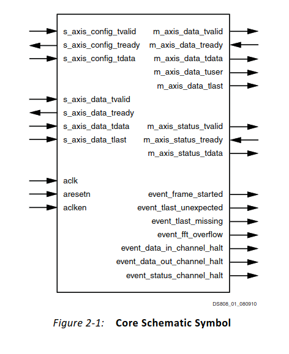

<!--more-->
## 2. IP核的设计
### 2.1 配置通道

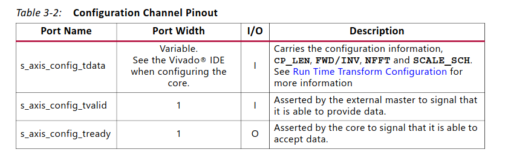

关于配置通道的TDATA有如下内容：

|           | width                                                        | padded                                                 | description                                                  |
| --------- | ------------------------------------------------------------ | ------------------------------------------------------ | ------------------------------------------------------------ |
| NFFT      | 5                                                            | yes                                                    | 变换的点数大小：NFFT可以是最大变换的大小，也可以是任何较小的点数大小。例如，1024点FFT可以计算1024、512、256等点数大小。NFFT的值为log2（点数大小）。此字段仅在运行时可配置的变换点数大小时存在。 |
| CP_LEN    | log 2 (maximum point size)                               | Yes                                                    | 循环前缀长度：循环前缀长度是指从变换末尾开始输出的样本数，该样本在整个变换输出之前作为循环前缀输出。CP_LEN可以是从零到点数减一的任意数字。此字段仅在启用循环前缀插入时存在。 |
| FWD_INV   | 1 bit per FFT data channel                                   | No                                                     | 执行正向FFT变换还是逆向FFT变换的指示。当FWD_INV = 1时，执行正向变换。如果FWD_INV = 0，则执行逆向变换。   该字段每个FFT数据通道包含1位，其中位0（最低位）表示通道0，位1表示通道1，依此类推。   有关更多信息，请参阅正向/逆向和缩放计划文档。 |
| SCALE_SCH | 2xceil(NFFT/2) 对于流水线式流式I/O和Radix-4突发式I/O架构，或者对于Radix-2突发式I/O和Radix-2 Lite突发式I/O架构，点数大小为2 x NFFT，其中NFFT是log2（最大点数大小）或阶段数。 | No padding per channel, butt he whole field is padded. | 缩放计划：对于突发式I/O架构，缩放计划使用每个阶段两bit来指定，其中第一个阶段的缩放由最低的两位来表示。缩放可以指定为3、2、1或0，表示要进行的位移数。例如，对于N = 1024，Radix-4突发式I/O，一个示例的缩放计划是[1 0 2 3 2]（从最后一个阶段到第一个阶段顺序排列）。对于N = 128，Radix-2突发式I/O或Radix-2 Lite突发式I/O，一个可能的缩放计划是[1 1 1 1 0 1 2]（从最后一个阶段到第一个阶段顺序排列）。   对于流水线式流式I/O架构，缩放计划使用每对Radix-2阶段的两bit来指定，从最低的两位开始。例如，对于N = 256，一个缩放计划可以是[2 2 2 3]。当N不是4的幂次时，最后一个阶段的最大bit growth为1位。例如，[0 2 2 2 2]或[1 2 2 2 2]是N = 512的有效缩放计划，但[2 2 2 2 2]是无效的。对于这个变换长度，SCALE_SCH的两个最高位只能是00或01。该字段仅在scaled arithmetic （而不是无缩放、块浮点或单精度浮点）中可用。   有关更多信息，请参阅变换大小（Transform Size）文档。 |

所有具有填充的字段，如果它们不已经以8位边界结束，应该扩展到下一个8位边界。IP忽略填充位的值，因此可以将它们设置为任何值。将它们连接到常数值可能有助于减少设备资源的使用。

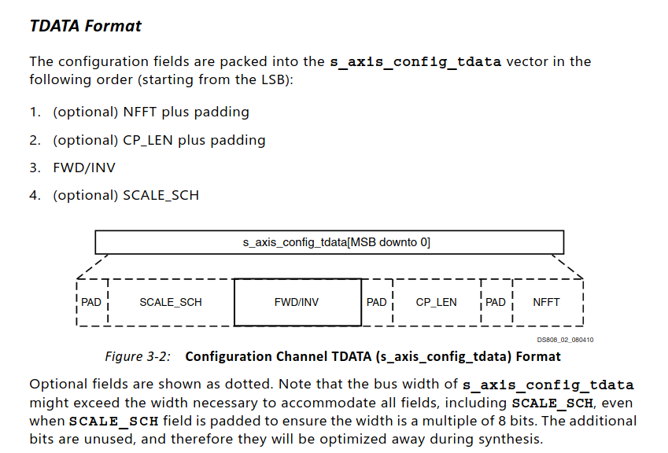

### 2.2 数据输入通道

如果数据输入不是字节对齐的，那么将会对IQ分别进行填充。

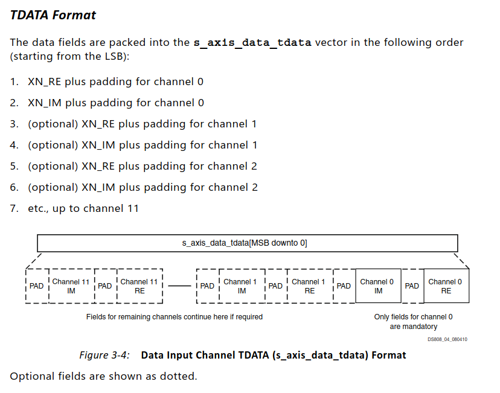

### 2.3 数据输出通道

数据输出通道包含变换的实部和虚部结果，这些结果通过TDATA传输。此外，TUSER携带与TDATA上的样本数据相关的每个样本的状态信息。此状态信息用于下游从设备，直接处理数据样本。它不会与数据不同步，因为它是通过相同的通道传输的。以下信息被归类为每个样本的状态信息：

- XK_INDEX
- Block Exponent (BLK_EXP) for each FFT channel
- Overflow (OVFLO) for each FFT channel

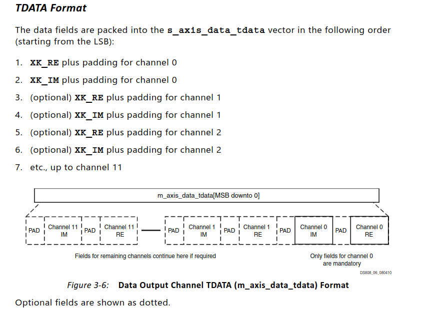

其中关于输出结果的状态的字段为tuser，它具体有如下字段;

|          | width                | Padded | description                                                  |
| -------- | -------------------- | ------ | ------------------------------------------------------------ |
| XK_INDEX | log2(max point size) | yes    | 输出数据的索引                                               |
| BLK_EXP  | 8                    | yes    | 块指数（无符号二进制补码）：应用的缩放量（即，以其它情况下未缩放的输出值向下移位的位数）。对于核心拥有的每个FFT通道，都包含一个单独的BLK_EXP字段。   仅在使用块浮点数时可用。   有关BLK_EXP的更多信息，请参阅块指数（Block Exponent）。 |
| OVFLO    | 1                    |        | 算术溢出指示器（单个比特，高电平有效）：如果数据帧中的任何值溢出，则在结果卸载过程中OVFLO为高电平。在新的数据帧开始时，OVFLO信号会被复位。   对于核心拥有的每个FFT通道，都包含一个单独的OVFLO字段。   该端口是可选的，仅在使用缩放算术或单精度浮点数I/O时可用。   有关OVFLO的更多信息，请参阅溢出（Overflow）。 |

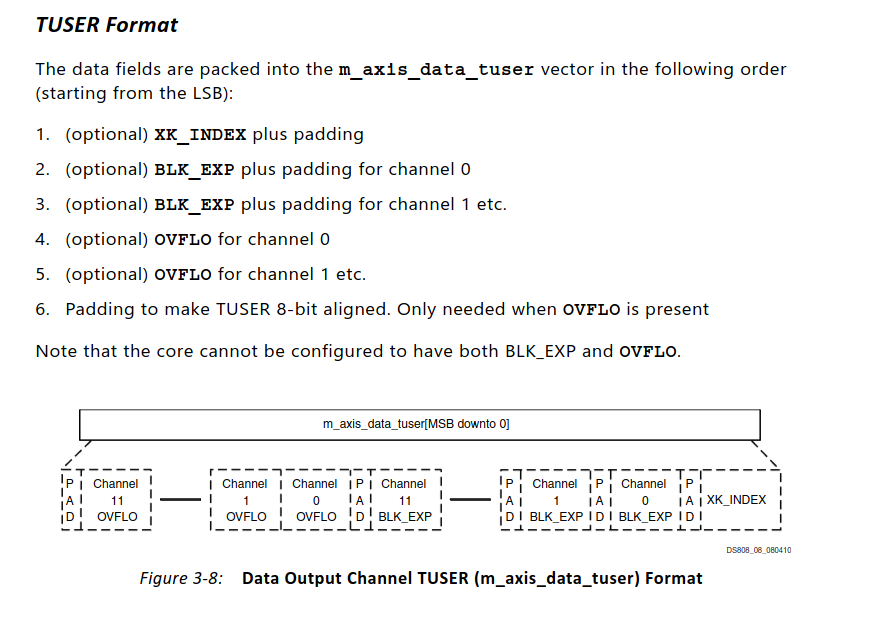

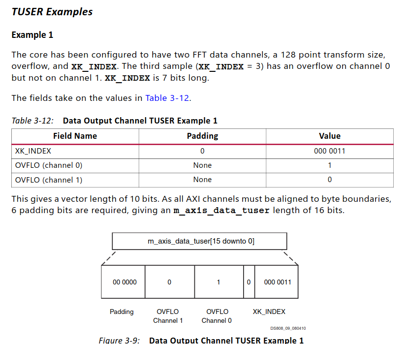

### 2.4 状态通道

状态通道包含每帧的状态信息，即与整个数据帧相关的信息。这是为下游从设备设计的，它们不直接操作数据，但可能需要了解这些信息来控制系统的其他部分。发送状态信息的确切位置取决于状态信息的性质。以下信息被归类为每帧的状态信息。

1. BLK_EXP for each channel
2. OVFLO for each channel

请注意，核心无法同时配置为具有BLK_EXP和OVFLO。BLK_EXP状态信息在帧开始时发送，而OVFLO状态信息在帧结束时发送。

### 2.5 Run Time Transform Configuration

#### 2.5.1 Transform Size

变换点数大小可以通过配置通道中的NFFT字段进行设置，如果选择了运行时可配置的变换长度选项。表3-18提供了有效的设置和相应的变换大小。如果输入的NFFT值过大，核心将自动设置为最大可用的点数（在IDE中选择）。如果值过小，核心将自动设置为最小可用的点数：Radix-4 Burst I/O架构为64，其他架构为8。

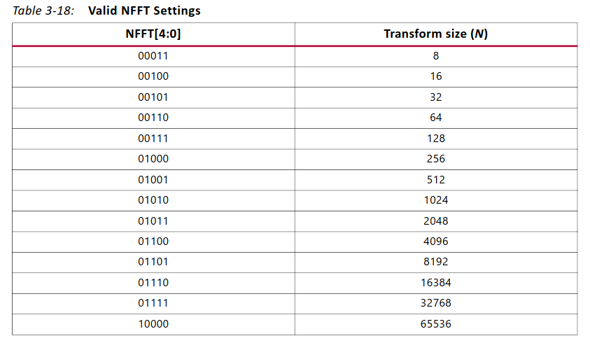

#### 2.5.2 Forward/Inverse and Scaling Schedule

变换类型（正向或逆向）和缩放计划可以逐帧设置，而不中断帧处理。在多通道核心中，可以为每个FFT通道独立设置变换类型和缩放计划。每个FFT数据通道在配置通道中都有一个分配的FWD_INV字段和SCALE_SCH字段。将FWD_INV字段设置为0会产生逆向FFT，将FWD_INV字段设置为1会创建正向变换。  

**当FFT核心配置为处理浮点数据时，不需要缩放计划（SCALE_SCH被忽略）**。浮点数据的归一化和缩放在内部处理。

### 2.6 Transform Status

#### 2.6.1 overflow

**固定点数据**
**仅当使用缩放算术时，数据输出和状态通道中的溢出（OVFLO）字段才可用**。如果数据帧中的任何点溢出，则在卸载期间OVFLO被置为高电平。对于多通道核心，每个通道都有单独的OVFLO字段。当核心发生溢出时，数据会被包装而不是饱和，导致变换后的数据对大多数应用程序无法使用。

**浮点数据**
在FFT处理浮点数据时，溢出字段用于指示指数溢出。溢出的输出样本根据内部结果的符号设置为±。当输出上存在NaN值时，不会断言溢出字段。NaN值只能在输入数据帧包含NaN或±样本时出现在FFT输出中。

#### 2.6.2 块指数

数据输出和状态通道中的块指数（BLK_EXP）字段（仅与块浮点选项一起使用）包含块指数。对于多通道核心，每个通道都有单独的BLK_EXP字段。字段中的值表示在变换过程中数据进行了多少位的缩放。例如，如果BLK_EXP的值为00101 = 5，则表示相关的输出数据（XK_RE，XK_IM）被缩放了5位（向右移动了5位），换句话说，被32整除，以充分利用输出数据路径的可用动态范围而不溢出。由于块缩放是基于处理的每个阶段的最大值进行的，因此BLK_EXP值可能因不同的架构而不同，即使输入数据相同，这是由于每个架构中每个处理阶段执行的不同固有缩放所导致的。

#### 2.6.3 XK Index

XK_INDEX字段（如果在数据输出通道中存在）给出了同时呈现的XK_RE / XK_IM数据的样本编号。对于自然顺序输出，XK_INDEX从0递增到（点数）-1。当使用位反转输出时，XK_INDEX涵盖相同的数字范围，但以位（或数字）反转的方式进行。例如，当进行8点FFT时，XK_INDEX采用表3-19中的值。

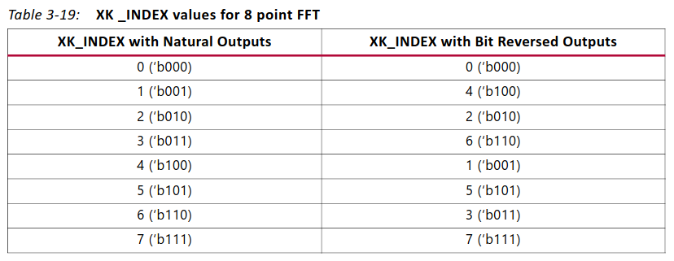

如果使用循环前缀插入，首先卸载循环前缀，XK_INDEX从（点数）-（循环前缀长度）计数到（点数）-1。在循环前缀被卸载后，或者如果循环前缀长度为零，则卸载整个输出数据帧。XK_INDEX从0计数到（点数）-1，与之前相同。**只有在自然顺序输出时才能进行循环前缀插入**。

### 2.7 Controlling the FFT Core

符号数据要通过Data Input通道加载到核心中进行处理。处理后的符号数据要通过Data Output通道卸载。这两个通道都使用AXI4-Stream协议。图3-40显示了该协议的基本原理。  TVALID由主组件驱动，表示它有要传输的数据，而TREADY由从组件驱动，表示它准备好接收数据。当TVALID和TREADY都为高电平时，数据传输会发生。图中的A点表示在这些时钟周期中没有数据传输，因为主组件和从组件都没有准备好。B点表示了两个时钟周期，其中没有数据传输，因为主组件没有要传输的数据。这被称为主等待状态。C点表示了一个时钟周期，在这个周期中没有数据传输，因为从组件没有准备好接收数据。这被称为从等待状态。主等待状态和从等待状态可以持续任意数量的时钟周期。

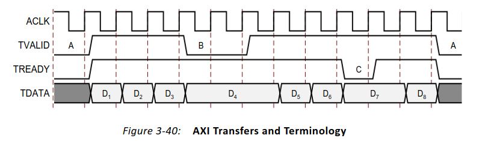

#### 2.7.1 Configuring the FFT

FFT变换是通过配置通道进行配置的。在该通道中携带的配置信息以及它们的打包方式在“配置通道”中进行了更详细的讨论。当核心准备加载新的帧进行处理时，它会检查配置通道上是否提供了新的配置。如果有的话，在加载帧之前，FFT处理核心将使用该信息进行配置。如果没有提供新的配置信息，则核心将使用其上一次的配置来处理帧。如果从未提供过配置，则使用重置中描述的核心默认值。  

将配置数据应用于特定帧的过程取决于核心的当前状态：  

- 将配置应用于开机后或空闲期后的第一帧  

- 配置应用于帧序列中的下一帧

**应用新配置时处于空闲状态**
如果核心处于空闲状态（即不加载、处理或卸载任何帧），它会等待帧数据或配置数据，以决定下一步采取的操作。如果核心控制模块看到了新的帧数据，但没有看到新的配置信息，则核心开始使用现有配置处理帧。如果在帧数据之前或与帧数据同时看到配置信息，则将该配置应用于该帧。
为确保在处理帧之前应用配置数据，配置信息应写入配置通道。在写入第一个数据输入通道的数据之前，配置数据的写入到配置通道必须至少提前1个时钟周期完成。如果未能这样做，可能会导致帧使用先前的配置选项进行处理。
在系统上下文中，满足这一要求可能最简单的方法是在启用上游数据主机之前配置核心。

**Applying a New Configuration While Streaming Frames**  
当上游主机处于活动状态并向核心发送帧数据时，使用先前的技术来将配置与特定帧同步变得困难，因为新帧的数据可能已经加载到数据输入通道中。将配置与帧同步的推荐方法是使用**event_frame_started**信号。  当核心开始将数据加载到FFT处理核心中的帧时，此信号被断言为高电平。这是一个已知的安全点，用于发送下一帧的配置信息。在此之后发送的配置数据可能会或可能不会应用于后续的帧，这取决于帧大小和event_frame_started断言以及配置写入之间的延迟。

在FFT IP当中还有几个状态指示信号，这些状态指示信号在设计FFT IP的使用的时候很有帮助。
- event_frame_started
  该信号标志着FFT开始处理这一帧数据

- event_tlast_missing
  该信号指示输入的一帧axis数据当中缺少tlast信号。

- event_tlast_unexpected
  该信号指示输入的axis数据流当有异常的tlast信号，表示信号提前结束了。

- event_data_in_channel_halt
  该信号表示输入的信号的数据没能按照预期提供给该IP。

在我最开始尝试进行动态FFT配置的时候，总是出现一些问题，也是经过一番调整，最终让上面的这几个信号都正常工作才最终解决了FFT的控制问题。

# 3. 基于FFT IP动态配置
在这里需要特别注意FFT IP的动态配置问题。关于FFT IP动态配置转换长度，IP认为该长度有一个最大值，这个最大值是根据配置的GUI界面当中的所设置的。

在这里也是自己踩过的几个坑：
## 3.1 最大转换长度问题
当我在IP当中把FFT的转换长度设置为4096，然后我尝试动态地去改变FFT的长度，我发现，当我将长度更改为8192的时候，FFT IP的输出，给出那些状态信号还是按照4096给出的。
然后我又尝试将FFT IP的动态配置为2048，这时候FFT IP就是按照预期进行工作的。
有了上面的经验，我大胆的推断该IP的执行的最大的FFT的长度就是IP配置界面当中写的那一个。因此，我去将该IP的配置界面当中最大转换长度，填写为了16384。然后我去动态地配置该IP，就能够将转换长度配置成8192的了。

## 3.2 FFT IP配置时机问题
在前面IP手册当中也有介绍如何去配置IP，其中需要关注一个IP配置的时机问题。
**应用新配置时处于空闲状态**
如果核心处于空闲状态（即不加载、处理或卸载任何帧），它会等待帧数据或配置数据，以决定下一步采取的操作。如果核心控制模块看到了新的帧数据，但没有看到新的配置信息，则核心开始使用现有配置处理帧。如果在帧数据之前或与帧数据同时看到配置信息，则将该配置应用于该帧。
为确保在处理帧之前应用配置数据，配置信息应写入配置通道。在写入第一个数据输入通道的数据之前，配置数据的写入到配置通道必须至少提前1个时钟周期完成。如果未能这样做，可能会导致帧使用先前的配置选项进行处理。
在系统上下文中，满足这一要求可能最简单的方法是在启用上游数据主机之前配置核心。

**Applying a New Configuration While Streaming Frames**  
当上游主机处于活动状态并向核心发送帧数据时，使用先前的技术来将配置与特定帧同步变得困难，因为新帧的数据可能已经加载到数据输入通道中。将配置与帧同步的推荐方法是使用**event_frame_started**信号。  当核心开始将数据加载到FFT处理核心中的帧时，此信号被断言为高电平。这是一个已知的安全点，用于发送下一帧的配置信息。在此之后发送的配置数据可能会或可能不会应用于后续的帧，这取决于帧大小和event_frame_started断言以及配置写入之间的延迟。

在应用新的配置的时候，需要考虑这两种情况。
在实际使用的过程当中event_frame_started这个信号可以作为一个参考，因为这个信号拉高，表明一帧FFT数据已经开始进行处理，那么在这一帧数据数据就会以当前的配置进行工作。所以这是一个我们可以应用新的配置的时机。

# 4. 实际的设计
在实际的设计当中，遵循了一个简单的模型：
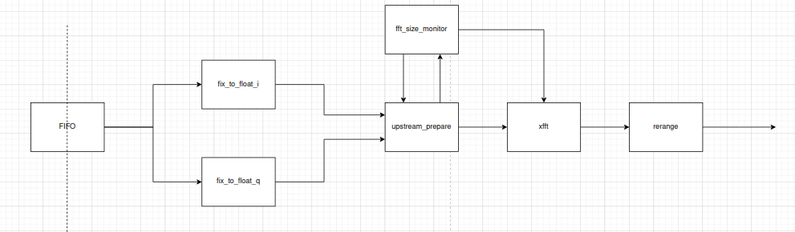
数据经过FIFO进行时钟域的转换，然后将IQ路信号分别转换为浮点数。
之后进入一个上游数据处理模块，在该模块当中，负责根据FFT的相关配置，为FFT IP提供对应的数据。主要是按照一帧一帧的数据方式来进行处理，因此需要保证帧与帧之间的完整性。
在这个系统当中有一个负责监视FFT 转换长度的模块，该模块的作用就是当FFT的转换长度发生变化的时候，给IP提供新的配置。
从后面的实际使用过程当中来看，这个配置的有效时机就是一个周期。

## 4.1 上游处理模块
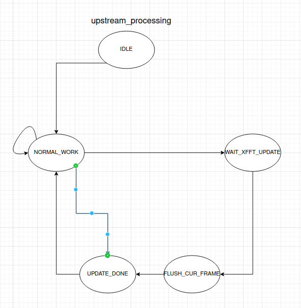
上游处理模块主要是按照下面的方式进行工作。
起始就是在正常工作的状态下面，突然发生了FFT IP的重新配置，那么需要我们按照新的配置的方式去准备给到下游的数据。
主要关注的是一个数据帧的结束时刻。

## 4.2 FFT size monitor
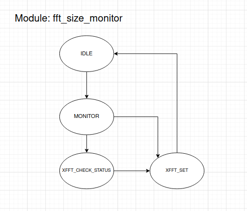
该模块主要就是根据前面介绍的FFT IP配置的两种时机，当IP的配置发生变化的时候，完成对应的配置。

## 工作的效果
在根据上面的动态配置IP的原理之后，可以看看FFT IP动态配置的效果：
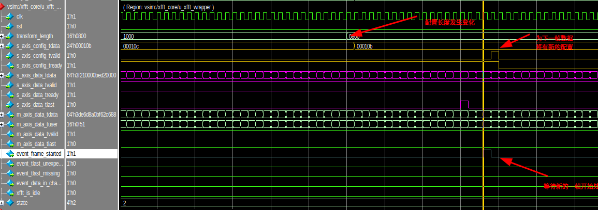
可以看到，当转换长度发生变化，我们需要考虑新的配置数据。按照FFT IP所需要的格式准备好数据。
等到event_frame_started开始的时候，将新的配置应用到下一帧。
可以看到，FFT IP给出来的config通道的配置信号的tready和tvalid的共同有效只保持了一个周期。两者共同有效的时候，配置数据已经写入到FFT IP当中。

XFFT IP 的整体工作状态如上虞所展示的，当新的配置应用到FFT IP之后，两次不同配置之间给出数据结果是有一个反应时间的。在此之间XFFT 的输入数据通道上的tready信号也会拉低一段时间。