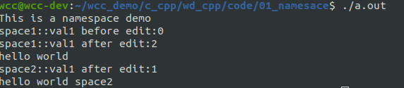

# 什么是命名空间
名字冲突就是在同一个作用域中有两个或多个同名的实体，为了解决命名冲突 ，C++中引入了命名空间，所谓命名空间就是一个可以由用户自己定义的作用域，在不同的作用域中可以定义相同名字的变量，互不干扰，系统能够区分它们。
通俗的说，每个命名空间都是一个名字空间域，存放在命名空间域中的全局实体只在本空间域内有效。命名空间对全局实体加以域的限制，从而合理的解决命名冲突。
<!--more-->
namespace 的定义如下：
```cpp
namespace space1
{
int val1 = 0;
char val2;
}// end of namespace wd
```
命名空间可存放以下类型的数据：
- 变量
- 常量
- 函数，可以是定义或声明
- 结构体
- 类
- 模板
- 子命名空间(命名空间可以嵌套)

```cpp

#include <iostream>

using std::cout;
using std::endl;

namespace space1 {
    int val1=0;
    void print(){
        cout << "hello world" << endl;
    }

    namespace space2 {
        int val1 = 1;
        void print(){
            cout << "hello world space2" << endl;
        }
    }
}


int main (int argc, char *argv[]){

    cout << "This is a namespace demo"<<endl;
    cout << "space1::val1 before edit:" << space1::val1 << endl;
    space1::val1 = 2;
    cout << "space1::val1 after edit:" << space1::val1 << endl;
    space1::print();

    cout << "space2::val1 after edit:" << space1::space2::val1 << endl;
    space1::space2::print();

}

```


# 命名空间的使用方式
命名空间一共有三种使用方式，分别是using编译指令、作用域限定符、using声明机制。
## using 编译指令
如果一个名称空间中有多个实体，使用using编译指令，就会把该空间中的所有实体一次性引入到程序之中；直接使用这种方式，有可能还是会造成名字冲突的问题，而且出现错误之后，还不好查找错误的原因，比如下面的程序就会报错，当然该错误是人为造成的。
```cpp
#include <iostream>
using namespace std;
double cout()
{
    return 1.1;
}

int main(void)
{
    cout();
    return 0;
}
```
这时候，由于std空间当中有cout函数，而在上面的这个函数当中我们自己定义的cout函数与std::cout重名，从而导致冲突。C++当中函数重载是允许的，函数重名是不允许的。

## 作用域限定符
作用域限定符就是通过，命名空间+::作用域限定符来访问命名空间当中的实体。
如同前面的第一个例子所示。

## using 声明机制

using声明机制的作用域是从using语句开始，到using所在的作用域结束。要注意，在同一作用域内用
using声明的不同的命名空间的成员不能有同名的成员，否则会发生重定义。

# 匿名命名空间
命名空间还可以不定义名字，不定义名字的命名空间称为匿名命名空间。由于没有名字，该空间中的实体，其它文件无法引用，它只能在本文件的作用域内有效，它的作用域是从匿名命名空间声明开始到本文件结束。在本文件使用无名命名空间成员时不必用命名空间限定。其实匿名命名空间和static是同样的道理，都是只在本文件内有效，无法被其它文件引用。

在匿名空间中创建的全局变量，具有全局生存期，却只能被本空间内的函数等访问，是static变量的有效
替代手段。

考虑如下两个模块：
其中一个模块包含有匿名的命名空间。
```cpp
#include <iostream>

using std::cout;
using std::endl;

int g_number2 = 10;

static int a_number = 10;

namespace  {
    int val1=0;
    void print(){
        cout << "hello world" << endl;
    }
}

```
在这个模块当中我们定义了两个全局变量和一个匿名的命名空间。其中，有一个全局变量的使用了static修饰，这表明该变量只能在本模块当中使用。匿名空间的用户和static类似，在匿名的命名空间当中的变量也相当于使用static来修饰内部的实体。

如果我们还有另外一个模块：

```cpp

#include <iostream>

using std::cout;
using std::endl;

int g_number = 1;
static int s_number = 2;

extern int g_number2;
extern int val1;
extern int a_number;
 
void test0() 
{
	cout << "val1:" << ::val1 << endl;
	cout << "g_number2:" << g_number2 << endl;
	
	printf("hello,printf\n");
} 
 
int main(void)
{
	test0();
	return 0;
}

```
这时候，由于val1,是另外一个模块当中的匿名命名空间当中的实体，a_number是另一个模块当中的饿static变量，因此我们都无法访问，在编译的时候会报错。


```cpp

#include <iostream>

using std::cout;
using std::endl;

int g_number = 1;
static int s_number = 2;

extern int g_number2;
extern int val1;
extern int a_number;
 
void test0() 
{
	cout << "s_number:" << s_number << endl;
	cout << "g_number2:" << g_number2 << endl;
	
	printf("hello,printf\n");
} 
 
int main(void)
{
	test0();
	return 0;
}

```

# 命名空间的覆盖
命名空间相当于一个容器，使用命名空间可以将一些实体都放到这个容器里面，因此命名空间覆盖的时候，就相当于像该命名空间当中追加内容。
考虑下面这段代码。
```cpp
#include <iostream>
using std::cout;
using std::endl;

// define a namespace
namespace wd
{
void print(){
    cout << "wd::print()" << endl;
}
}

// redefine the namespace
namespace wd
{
// just define， not implement yet
void show();
void display()
{
	cout << "wd::display()" << endl;
	show();
}
}//end of namespace wd

void test0() 
{
	wd::display();
	wd::print();
} 
 
int main(void)
{
	test0();
	return 0;
}

// implement the defined function in the namespace
namespace wd
{
void show() 
{
	cout << "wd::show()" << endl;
}
}//end of namespace wd

```

首先我们定义了一个命名空间wd，然后我们又定义了一个同名的命名空间，但是此时，这个命名空间当中的实体和之前定义的不同。
在第二个命令空间当中，我们并没有完成show函数的实现，这个show函数的实现是在末尾的namespace当中实现的。
最终我们在test函数分别调用了这个wd命名空间下的几个函数，可以看到在main函数当中使用wd命名空间的实体。命名空间的覆盖，将新的实体放置到了命名空间当中。