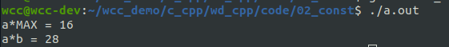
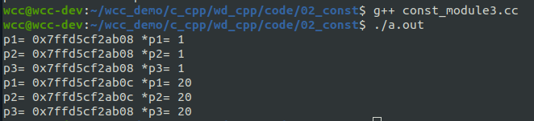

# const修饰类型
const 可以用来修饰char/short/int/long类型的数据，使用const修饰的变量，他的值不能再被修改，是一个常量。
下面是一个简单的例子
```cpp
#include <iostream>
using std::cout;
using std::endl;

int main(int argc, char *argv[]){

    int a= 1;
    const int  b= 2;

    a = 2;
    b = 2; // error, const is not editable

    return 0;
}
```
<!--more-->

在main函数当中，定义了连个变量，其中一个使用了const关键字，这表明这个变量是一个常量，不可修改。因此在后面，再对变量b进行赋值的时候，会提示报错。

# 宏定义和const常量的区别
1）发生的时机：
宏定义是在预处理时
const常量是在编译时
2）类型检查
宏定义没有类型检查的，只是简单做了**字符串的替换**,虽然也有编译阶段，但在编译阶段没有报错，将出错的时机延迟到了运行时。运行时的错误更难发现const是有类型检查的，更安全一些。
下面是一个简单的例子：
```cpp
#include <iostream>
using std::cout;
using std::endl;

#define MAX 3+4
int main(int argc, char *argv[]){

    int a= 4;
    const int  b= 3+4;

    cout << "a*MAX = " << a*MAX << endl;
    cout << "a*b = " << a*b << endl;

    return 0;
}
```

可以看到宏定义只是做了简单的字符串的替换，导致最终输出的计算结果与我们的预期出现问题。

# const 修饰指针
const来修饰指针，有两种情况：
- point to a const(指针指向一个常量)
- const pointer(指针本身是一个常量)

对于第一种，表示指针所指向的空间的内容不可修改
可以使用如下方式来定义常量指针。
```cpp
int a=10;
const int *p = &a;
int const *p = &a; 
```
上面这两种写法是一样的，表示*p所指向的内容不可以修改。

对于指针常量，其定义方法如下：
```cpp
int a=10;
int * const p = &a;
```
其表示指针p的值是固定的，也就是说，指针指向的位置是不变的，但是指针的内容是可以改变的。
下面这段代码能够更加直观地展示出这几种指针的用法。

```cpp
#include <iostream>
using std::cout;
using std::endl;

int main(int argc, char *argv[]){

    int a= 1;
    int b=20;

    int const *p1 = &a;
    const int *p2 = &a;
    int * const p3 = &a;

    cout << "p1= " << p1 << " *p1= "<<*p1<<endl;
    cout << "p2= " << p2 << " *p2= "<<*p2<<endl;
    cout << "p3= " << p3 << " *p3= "<<*p3<<endl;
    
    // *p1 = 20; // error,
    // *p2 = 30; // errpr
    // p3 = &b;  // error

    p1 = &b;  // allowed
    p2 = &b;  // allowed
    *p3 = 20; // allowed

    cout << "p1= " << p1 << " *p1= "<<*p1<<endl;
    cout << "p2= " << p2 << " *p2= "<<*p2<<endl;
    cout << "p3= " << p3 << " *p3= "<<*p3<<endl;

    return 0;
}
```


对于p1和p2,他们是常量指针，他们所指向的内容是不可修改的，但是本身他们作为指针是可以改变指向空间的，也就是指向的地址是可以改变的，但是他们指向地址的内容是不可以改变的。如上面注释的3中方法都是不允许的。
对于指针常量，指针所执行的地址是固定的，但是指针所指向地址的内容是可以改变的。
