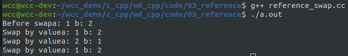
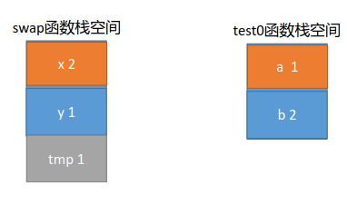
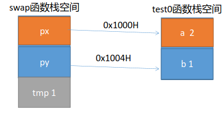
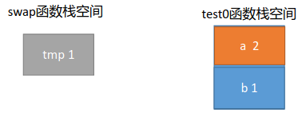
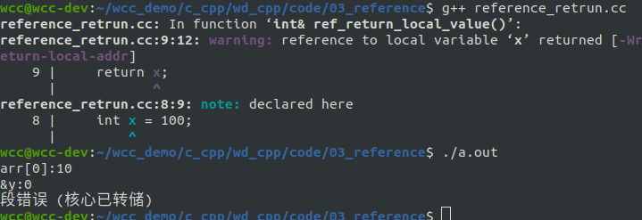

# 什么是引用？
在理解引用概念前，先回顾一下变量名。 变量名实质就是一段连续内存空间的别名。那一段连续的内存空间只能取一个别名吗？ 显然不是，引用的概念油然而生。在C++中，引用是一个已定义变量的别名。
其语法是：
```cpp
类型 &引用名 = 目标变量名；
void test0()
{
    int a = 1;
    int &ref1 = a;
    // int &ref2; // error, 定义引用的时候，必须初始化
}
```
<!--more-->
在使用引用的过程中，要注意以下几点：
- &在这里不再是取地址符号，而是引用符号，相当于&有了第二种用法
- 引用的类型必须和其绑定的变量的类型相同
- 声明引用的同时，必须对引用进行初始化；否则编译时报错
- 一旦绑定到某个变量之后，就不会再改变其指向

下面这个简单的例子演示了引用的用法。
```cpp
#include <iostream>
using std::cout;
using std::endl;

int main(int argc, char * argv[]){
    int a = 1;
    cout << "a:" << a << endl;

    int &ref1 = a;
    
    ref1 = 10;

    cout << "ref1:"<< ref1 << endl;
    cout << "a:" << a << endl;

    int b = 2;
    int c= a & b;
    cout <<"c:" << c << endl;

    return 0;
}
```
在定义引用ref1的时候我们同时给他赋值。这个时候，引用就相当于给变量取了一个别名。如果在这之后我们操作引用ref1，就相当于操作原始的变量a。
所以在后面，我们给ref赋值的时候，我们再查看a的值，也发生变化。


# 引用作为函数的参数
在没有引用之前，如果我们想通过形参改变实参的值，只有使用指针才能到达目的。但使用指针的过程中，不好操作，很容易犯错。
使用引用作为函数的参数进行传递的好处是：**没有复制的开销，可以提高程序的执行效率**。
比较简单的例子交换两个变量的值。

```cpp
#include <iostream>
using std::cout;
using std::endl;

void swap_by_value(int x, int y){
    int tmp = x;
    x = y;
    y = tmp;
}

void swap_by_pointer(int *x, int *y){
    int tmp = *x;
    *x = *y;
    *y = tmp;
}

void swap_by_reference(int &x, int &y){
    int tmp = x;
    x = y;
    y = tmp;
}

void test(){
    int a = 1;
    int b = 2;

    cout << "Before swap" << "a: " << a << " b: " << b << endl;
    swap_by_value(a, b); 
    cout << "Swap by value" << "a: " << a << " b: " << b << endl;
    swap_by_pointer(&a, &b); 
    cout << "Swap by value" << "a: " << a << " b: " << b << endl;
    swap_by_reference(a, b); 
    cout << "Swap by value" << "a: " << a << " b: " << b << endl;
}

int main(int argc, char * argv[]){
    test();


    return 0;
}
```

在上面的这个简单的例子当中，我们使用不同的方法，来尝试改变两个变量的值。从一开始直接使用变量的值来进行传递，我们发现并没有能够完成我们预期的操作。
通过值传递的时候，在内存堆栈上会进行如下操作：swap函数上的栈空间上的局部变量只是获取了test内部的传递过来的值。

两则之间并没有产生直观的联系。

当使用指针进行传递的时候，传递给swap函数的是地址，这样swap函数内部就能够访问到test内部的变量。


当使用引用的时候。我们在调用swap_by_reference函数的时候，起始先做了这个操作。
```cpp
//swap_by_reference(int &x, int &y) 
swap_by_reference(a, b); 
// 进行引用
int &x = a; //将引用x绑定到a
int &y = b; //将引用y绑定到b
```

一旦引用绑定完成之后，操作sawp内部的x和y就相当于操作a和b。

# 引用作为函数的返回值
引用作为函数的返回值的语法如下：

```cpp
//语法：
类型 &函数名(形参列表)
{
//函数体
}
```
当以引用作为函数的返回值时，返回的变量其生命周期一定是要大于函数的生命周期的，即当函数执行完毕时，返回的变量还存在。

下面这个简单的例子来说明这个问题：
```cpp
#include <iostream>
using std::cout;
using std::endl;

int g_arr[5] = {0,1,2,3,4};

int & ref_return_local_value(){
    int x = 100;
    return x;
}

int & ref_return_global_value(int idx){
    return g_arr[idx];
}

void test0(){
    ref_return_global_value(0) = 10;
	cout << "arr[0]:" << g_arr[0] << endl;

    int & y = ref_return_local_value();
	cout << "&y:" << &y << endl;
	cout << "y:" << y << endl; //error, 返回的引用的值生命周期在函数调用的时候已经结束

}

int main(int argc, char * argv[]){
    test0();


    return 0;
}
```

我们定义了两个返回值为引用的函数。其中ref_return_local_value返回的是一个函数当中局部变量的引用。ref_return_global_value返回的是全局变量的引用。
从cpp程序的编译和运行结果来看，返回局部变量的引用导致了段错误。因为这个局部变量在函数返回的时候生命周期已经结束，我们可以看到该函数的返回值的地址已经变为0。
而如果返回的是一个全局变量的引用则没有这个问题，在后续的使用当中我们可以直接对g_arr[0]的值进行改变。

**不能返回局部变量的引用。主要原因是局部变量会在函数返回后被销毁，因此被返回的引用就成为了"无所指"的引用，程序会进入未知状态**

除了上面这种情况之外，返回引用类型的变量，还需要注意另外一种情况。那就是返回的引用是函数内部使用new方法分配的堆空间的引用。这样会引起内存泄露。

```cpp
#include <iostream>
using std::cout;
using std::endl;

int g_arr[5] = {0,1,2,3,4};


int & ref_return_undelet_memory(){
    int *p = new int(1);
    return *p;
}

void test0(){
    int a = 1;
    int b = 2;
    int c = a + b + ref_return_undelet_memory();
	
    // Thre is now memory recycling

}

int main(int argc, char * argv[]){
    test0();


    return 0;
}

```
在上面，返回了对使用new方法创建的内容的引用，但是在后续的代码当中并没有完成对该分配的内存的进行回收，这回导致内存泄露。

**不能在函数内部返回new分配的堆空间变量的引用。如果返回的引用只是作为一个临时变量出现，而没有被赋予一个实际的变量，那么该引用所在的空间就无法释放，会造成内存泄漏**


# 引用总结：
1. 在引用的使用中，单纯给某个变量取个别名是毫无意义的，引用的目的主要用于在函数参数传递中，解决大块数据或对象的传递效率和空间不如意的问题。
2. 用引用传递函数的参数，能保证参数传递中不产生副本，提高传递的效率，且通过const的使用，保证了引用传递的安全性。
3. 引用与指针的区别是，指针通过某个指针变量指向一个变量后，对它所指向的变量间接操作。程序中使用指针，程序的可读性差；而引用本身就是目标变量的别名，对引用的操作就是对目标变量的操作。