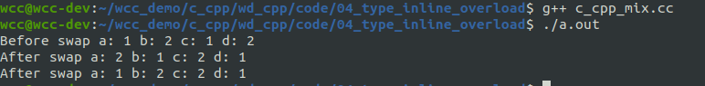

# cpp的类型转换
在C当中，类型转换的风格很简单：
```cpp
TYPE a = （TYPE）EXPRESSION;
```
直接将要转换的变量前面加上需要的目标类型。
C风格的类型转换可以在任意类型之间转换。比如可以把一个指向const对象的指针转换成指向非const对象的指针，把一个指向基类对象的指针转换成指向一个派生类对象的指针。这在某些时候是比较危险的。

<!--more-->
CPP引进了4个新的类型转换操作符，他们是static_cast，const_cast，dynamic_cast，reinterpret_cast。
在这几种类型转换当中使用得最多的应该是static_cast。
下面举个简单的例子来说明cpp当中的类型转换。
```cpp
#include <iostream>
using std::cout;
using std::endl;


void test0() 
{
    int i_data = 10;
    float f_data = 0.0;
    f_data = static_cast<float>(i_data);

    cout << "f_data:" << f_data << endl;

    int *intp = static_cast<int*>(malloc(sizeof(int)));
    *intp = 1;
    cout << "*intp:" << *intp << endl;
} 
 
int main(void)
{
	test0();
	return 0;
}

```


const_cast的作用是去除常量属性。可以将常量在进行传递给其他函数的时候进行常量属性的去除，这个在某些时候会导致一些问题。下面是一个简单的例子来说明这个问题。
```cpp
#include <iostream>
using std::cout;
using std::endl;

void display_info(int *p){
    *p = 10;
    cout <<"*p:" << *p << endl;
    cout <<"p:" << p << endl;
}

void test0() 
{
    const int a =1;

    display_info(const_cast<int *>(&a));
    cout <<"a:" << a << endl;
    cout <<"&a:" << &a << endl;
} 
 
int main(void)
{
	test0();
	return 0;
}

```

可以看到，在去除常量属性之后，我们可以在display_info这个函数当中修改传入指针所指向的值。但是比较逆天的一点就来了，我们可以看到两个地址一样的地方，得到的地址里面的值竟然不一样。。。还没有深入去研究这里有什么问题。

# 函数重载
## 函数重载的形式
在实际开发中，有时候需要实现几个功能类似的函数，只是细节有所不同。如交换两个变量的值，但这两种变量可以有多种类型，short, int, float等。
在C语言中，必须要设计出不同名的函数，其原型类似于：
```cpp
void swap1(short *, short *);
void swap2(int *, int *);
void swap3(float *, float *);
```
但在C++中，这完全没有必要。C++ 允许多个函数拥有相同的名字，只要它们的参数列表不同就可以，这就是函数重载（Function Overloading）。借助重载，一个函数名可以有多种用途。

函数重载是指在同一作用域内，可以有一组具有相同函数名，不同参数列表的函数，这组函数被称为重载函数。重载函数通常用来命名一组功能相似的函数，这样做减少了函数名的数量，避免了名字空间的污染，对于程序的可读性有很大的好处。

C++进行函数重载的实现原理叫名字改编（name mangling），具体的规则是：
- 函数名称必须相同。
- 参数列表必须不同（参数的类型不同、个数不同、顺序不同）。
- 函数的返回类型可以相同也可以不相同。
- 仅仅返回类型不同不足以成为函数的重载。

```cpp
#include <iostream>
using std::endl;
using std::cout;

void swap(int *a, int *b){
    int tmp = *a;
    *a = *b;
    *b=tmp;
}

void swap(int &a, int &b){
    int tmp = a;
    a = b;
    b=tmp;
}

void swap(float &a, float &b){
    int tmp = a;
    a = b;
    b=tmp;
}


void test(){
    int a = 1;
    int b = 2;
    float c = 1.0;
    float d = 2.0;
    cout << "Before swap " << "a: " << a << " b: "<<b
         << " c: " << c << " d: "<< d <<endl;

    swap(c, d);
    swap(a, b);

    cout << "After swap " << "a: " << a << " b: "<<b
         << " c: " << c << " d: "<< d << endl;

}

int main(int argc, char * argv[]){
    test();

    return 0;
}
```
可以看到上面的程序在可以编译通过，并且可以成功运行。

在这里，我们完成了函数的重载，上面的这些函数拥有相同的名字，但是其的参数列表不同。这样就完成了函数的重载。
函数的重载是经过名字改编完成的。

可以看到，生成的可执行程序当中，含有我们定义重载的函数的名字。可以看到其根据参数列表的不同对函数进行了重命名。

从这里我们可以看到C++当中支持函数重载，但是C语言当中不支持函数的重载。由于C++出现时间晚于C，在C++之前已经有许多成熟的C库，为了能够使用C++去兼容C库，需要使用一种手段能够完成对C库当中的函数的调用，完成C和Cpp混合编程的目的。
## C、C++混合编程
为了解决C和CPP的混合编程的问题，其中一种解决方法是使用`extern "c"{}`来标记定义的函数以C语言的方式进行编译，从而不进行重命名。下面是一个简单的例子。

```cpp
#include <iostream>
using std::endl;
using std::cout;

extern "C"{
    // 在这个区域当中的函数都会按照C的方式进行调用
    // 不会进行名字的改编
    void swap(int *a, int *b){
        int tmp = *a;
        *a = *b;
        *b=tmp;
    }

}

void swap(int &a, int &b){
    int tmp = a;
    a = b;
    b=tmp;
}

void swap(float &a, float &b){
    int tmp = a;
    a = b;
    b=tmp;
}


void test(){
    int a = 1;
    int b = 2;
    float c = 1.0;
    float d = 2.0;
    cout << "Before swap " << "a: " << a << " b: "<<b
         << " c: " << c << " d: "<< d <<endl;

    swap(c, d);
    swap(a, b);

    cout << "After swap " << "a: " << a << " b: "<<b
         << " c: " << c << " d: "<< d << endl;

    swap(&a, &b);
    cout << "After swap " << "a: " << a << " b: "<<b
         << " c: " << c << " d: "<< d << endl;

}

int main(int argc, char * argv[]){
    test();

    return 0;
}
```

可以看到，使用上面的方式之后，依然能够编译通过。通过查看生成的可执行程序，我们可以看到使用C方式调用的函数没有进行重命名。


在进行C++、C的混合编程的时候，程序有可能被GCC编译，也有可能被G++编译。当使用GCC的时候，`external "C" {}`是不需要的。为了解决这个问题，可以通过一个宏来判断当前使用的是G++的编译器还是GCC的编译器。
可以通过判断cpp当中的 __cplusplus来判断当前使用的是gcc编译器还是g++编译器。
```cpp
#include <iostream>
using std::endl;
using std::cout;
#ifdef __cplusplus
extern "C"{
#endif
    // 在这个区域当中的函数都会按照C的方式进行调用
    // 不会进行名字的改编
    void swap(int *a, int *b){
        int tmp = *a;
        *a = *b;
        *b=tmp;
    }
#ifdef __cplusplus
}
#endif

void swap(int &a, int &b){
    int tmp = a;
    a = b;
    b=tmp;
}

void swap(float &a, float &b){
    int tmp = a;
    a = b;
    b=tmp;
}


void test(){
    int a = 1;
    int b = 2;
    float c = 1.0;
    float d = 2.0;
    cout << "Before swap " << "a: " << a << " b: "<<b
         << " c: " << c << " d: "<< d <<endl;

    swap(c, d);
    swap(a, b);

    cout << "After swap " << "a: " << a << " b: "<<b
         << " c: " << c << " d: "<< d << endl;

    swap(&a, &b);
    cout << "After swap " << "a: " << a << " b: "<<b
         << " c: " << c << " d: "<< d << endl;

}

int main(int argc, char * argv[]){
    test();

    return 0;
}

```

# 函数的默认参数
默认参数和python差不多，就是可以给形参一个默认值。默认形参的参数是从右到左。
```cpp
#include <iostream>
using std::endl;
using std::cout;

int add(int a, int b, int c=0){
    int d = a+b+c;

    return d;
}


void test(){
    int a = 1;
    int b = 2;
    int c = 3;


    int d = add(a,b);
    cout << "using default param:" << d << endl;
    d = add(a, b, c);
    cout << "using 3 param: " << d << endl;

}

int main(int argc, char * argv[]){
    test();

    return 0;
}
```


# inline函数
内联函数是C++的增强特性之一，用来降低程序的运行时间。当内联函数收到编译器的指示时，即可发生内联：编译器将使用函数的定义体来替代函数调用语句，**这种替代行为发生在编译阶段而非程序运行阶段**。
定义函数时，在函数的最前面以关键字“inline”声明函数，即可使函数称为内联声明函数。
```cpp
inline int max(int x, y)
{
return x > y ? x : y;
}
```
为这么一个小的操作定义一个函数的好处有：
- 阅读和理解函数 max 的调用，要比读一条等价的条件表达式并解释它的含义要容易得多;
- 如果需要做任何修改，修改函数要比找出并修改每一处等价表达式容易得多;
- 使用函数可以确保统一的行为，每个测试都保证以相同的方式实现;
- 函数可以重用，不必为其他应用程序重写代码

在C当中，我们使用带参数的宏定义这种借助编译器的优化技术来减少程序的执行时间。
使用宏的最大的缺点是容易出错。宏函数的发生时机是预处理时，只是进行简单的字符串替换，在前面我们也介绍过使用宏的时候可能会出现的问题。

**inline函数的定义只能放在头文件中**， 不能够将inline函数的定义和实现分开。比如将inline函数声明在.h文件当中，将inline函数的实现放在*.cpp当中，这将会导致错误。
比如下面的这三个文件，其中一个是头文件，一个是头文件当中函数的实现，一个是对头文件当中函数的调用：
- 头文件
```cpp
#ifndef __ADD_H__
#define __ADD_H__

inline int add(int a, int b);

#endif
```

- 函数实现
```cpp
#include "inline_test.h"

inline int add(int a, int b){
    int d = a+b;

    return d;
}

```

- 函数调用
```cpp
#include "inline_test.h"
#include <iostream>
using std::endl;
using std::cout;


void test(){
    int a = 1;
    int b = 2;


    int d = add(a,b);
    cout << "using default param:" << d << endl;

}

int main(int argc, char * argv[]){
    test();

    return 0;
}
```

可以看到，在编译上面的程序的时候，出现了错误。
如果我们把其中的inline去掉，那么我就可以看到，可以编译成功。